{width="6.6917322834645665in"
height="2.5708661417322833in"}

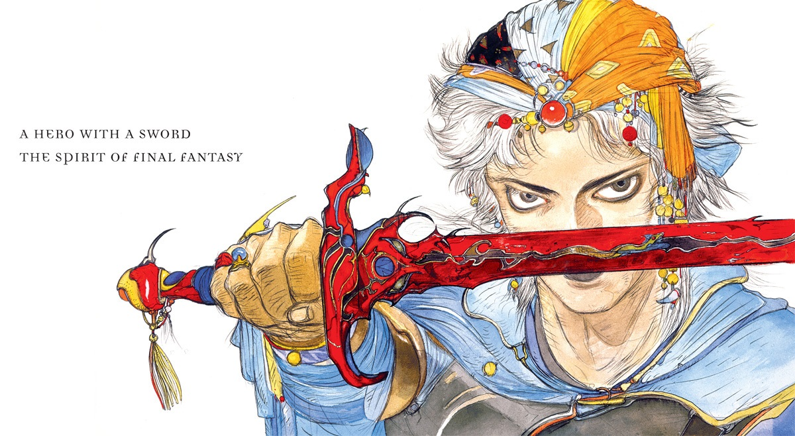{width="6.6917322834645665in"
height="3.6688976377952756in"}REVISED EDITION - CORE RULEBOOK

Summary
=======

Summary 2

Introduction 3

Acknowledgments 4

What is Final Fantasy, anyway? 4

Play Basics 4

Design Principles and Decisions 5

Glossary 6

Game Setup 7

Group Creation 7

Character Creation 10

Game Engine 12

Challenges 12

Destiny 13

Combat 15

Character Options 21

Quirks 21

Stats and Skills 24

Jobs 26

Main Jobs 26

Secondary Jobs 53

Spells 65

Summoned Monsters 76

Geomancy 81

Performances 85

Wealth and Items 88

Equipment 90

Game Master\'s Strategy Guide 115

Creating Adventures 115

Character Development and Rewards 117

Antagonists 119

Experience Table 125

Status Effects 128

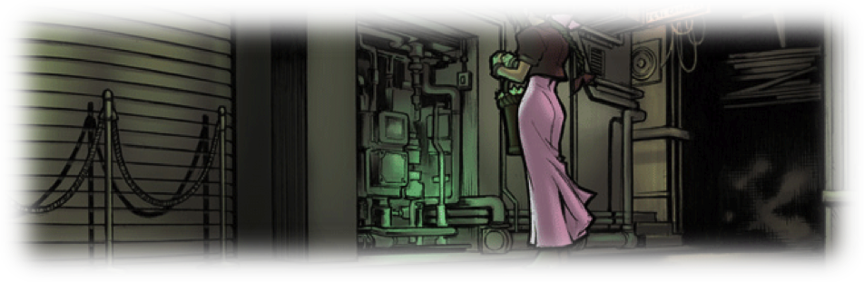{width="6.538976377952756in"
height="2.136220472440945in"}

Introduction
============

Before presenting this product, I would like to introduce myself. I am
an RPG player and Game Master since 1994, and one of the people who were
part of the Returners group of since the creation of FFRPG's first
edition. I followed and helped to carry out the playtest of all
\"official\" editions of the game, through the internet relay chat (IRC)
campaigns or playing offline. The group stayed together until the end of
second edition's development, around July 2001.

When the development of the famous third edition started, there began to
be disagreements among the team, leading to the creation of the first
FFRPG \"spin-off\", called ZODIAC, created by S Ferguson, which, from
2001 until today (the last version is dated 2013), has gone through
three editions. The FFRPG (or Returners\' FFRPG, as it became known to
differentiate the ZODIAC FFRPG) took 8 years to complete the development
of its 3rd edition, being officially launched in 2009. But even after
such a long development time, it was released with various problems that
generated other versions.

There were the works of Fernanda Parker in Brazil, who translated the
game to Portuguese; the SeeD group, formed by many of the original
members of the Returners, but already without the leadership of Samuel
Banner, who was project leader at the time of the 3rd edition, created
another version, the FFRPG SeeD, more focused on online gaming via IRC:
according to the authors, the game is \"impossible\" to be played on a
real table without computer assistance; Alan Wiling and his team created
the FFRPG d20, based on Pathfinder; Scott Tengelin and his team also
started another version, which was finalized by Dust, who published, in
2010, the third edition of FFd6 system. Another game published was
Chikago's Academia Bahamut, a Brazilian cross between ZODIAC and the
original 3rd edition.

Thus, when creating this game, I try to stand on the shoulders of
giants. All creators and games mentioned above were sources of
inspiration when I build this version. Still, I do not consider myself
writing the final or definitive version of FFRPG; as well as electronic
games, pen and paper RPG continues to evolve and incorporate different
concepts and reach different audiences. I hope that this work is just
the kickoff to the fifth edition, sixth edition, and many others,
created by fans of this ageless masterpiece: Final Fantasy.

This game is not affiliated, owned or subject to Square Enix or any of
their companies in any way. Much of the material described here is owned
by Square Enix and its various contributors as Yoshitaka Amano. This
work is licensed under the Creative Commons Attribution-NonCommercial
4.0 International License. To view a copy of this license, visit
<http://creativecommons.org/licenses/by-nc/4.0/> or send a letter to
Creative Commons, PO Box 1866, Mountain View, CA 94042, USA.

-   **Bruno Carvalho**

Acknowledgments
---------------

I would like to say thank you to the play testers who helped shape this
game: Felipe \"Hitoshura\" Furtado, Gabriel \"Paladin\" Sasso, Anderson
\"Zada\" Tavares, Wyohara, Lucas Hoffman, Leandro \"Maromba\" Valente,
Pedro Rodrigues, Rafael Sobreira, Thiago Sobreira, Pedro Rodstein,
Lyaran, Gregory \"Gatts\", David Renaud and everyone else. A huge thanks
also to Dust, who graciously gifted her own FFd6 images and lots of
fluffy bits, and Novacat for the grammar help.

For this revised edition, I would really like to thank the guys at the
/r/ffrpg subreddit, including, but not limited to /u/Box\_of\_Hats,
/u/kaiten619, /u/\_FunnelCakeSoda, /u/GM\_3826, /u/YouCanTrustAnything,
/u/omegafantasy, and /u/StorytellerZeke. Also, thanks to Sven and Mark
for your very constructive criticism.

*What is Final Fantasy, anyway?*
--------------------------------

Final Fantasy is a series of more than thirty console RPGs and two
MMORPGs. Though each story in the series is independent, there are
numerous recurring themes and elements such as airships and bright
yellow avians, well-known monsters and heroic save-the-world storylines.

Originally inspired by Dungeons and Dragons, the Final Fantasy series
has grown to take on a flavor all its own. It has become a setting in
which the fundamental well-known limits of human capability are casually
ignored, where a villain's strength can be measured by their androgyny
and size of their hair, and where only a ragtag team of heroes usually
under the age of thirty are competent (or incompetent) enough to make a
difference. These are stories about good versus evil, twisted technology
and heroic perseverance, duality, self-sacrifice, camaraderie and love,
and taking on truly legendary enemies with your eight-foot sword and
magical umbrella.

Play Basics
-----------

This PDF contains the entirely of the rules you\'ll need to know. Like
most pen-and-paper RPGs, you\'ll also need dice -- in this case,
ten-sided dice. Most rolls in this system are referred as a "d100" roll.
To do that, roll two ten-sided dice, usually in two different colors or
by rolling one after another. One die will represent the unit digit, and
the other die will represent ten\'s digit. Name what die will be each
digit before you roll! A result of "00" is read as 100. You'll usually
want two per player but having extras is a good idea.

### Setting

The Final Fantasy series has spanned dozens of worlds -- from Ivalice,
the multiracial land of mercenaries and adventure, to Cocoon, the
artificial planet nurtured by psychopathic ancient constructs -- and
rarely do any two of these worlds operate under the same laws. Some
feature magic that slowly chips away at the minds of those who use it,
and in others death is little more than a minor inconvenience.

As you can imagine, this means that creating an universal set of rules,
one that covers everything from the entire Final Fantasy series, is
simply impossible -- and ignoring this fact would be irresponsible and
downright chaotic at best. Details about each specific game setting may
be found on the *Worldbooks* series, each describing one specific world.
At the time of this book, the *Worldbooks* for Final Fantasy IV, VI and
Tactics are already published, and many more are coming.

That said, this book was designed to give you and your friends a chance
to explore your own stories, with your own heroes, and very often, in
your own unique Final Fantasy world. Whether your campaign will be set a
familiar place or whether it will be set in a post-apocalyptic city
where the last memories of the deceased are immortalized as whispering
magical crystals... well, that's all up to you. Are the heroes tied
together by ancient prophecy or are they childhood friends? Are they a
crew of gentlemen airship thieves or forced into an uneasy alliance by
the outbreak of war? This is a chance to let your creativity shine.

### The Game Master

In the video games, Final Fantasy may be accessed with a cartridge,
CD-ROM or DVD. In FFRPG, however, it is the Game Master (GM) who
unspools the epic saga, acting as both referee and storyteller. As a
storyteller it is their responsibility to create the quests and
storylines the players become embroiled in, take on the roles of
Non-Player Characters (NPCs), the people and monsters the heroes
encounter in their travels, and act as the players\' eyes and ears
within the game, describing the scenery and situations. As a referee,
the GM enforces the rules, set outs the challenges, and keeps the
players on task to ensure each session runs as smoothly as possible. It
might seem daunting to tackle these challenges with the patience and
dedication they deserve, but it is very rewarding.

### The Players

Players in the FFRPG step into the shoes of a character with a unique
background, personality, skills and powers. These protagonists are known
as the Player Characters (PCs), and ultimately shape the story by
virtues of their actions and decisions. There are some crucial
differences between videogame and tabletop play, however; each player
generally only control one character, rather than an entire party. As
result, most adventures will see several players cooperating with each
other under the GM\'s guidance, working along to create the story. This
game is not a competitive exercise: the players work together to
overcome the challenges they create and/or the GM presents, but the
collective goal is to have fun together, not to "win". As much as the PC
and some NPC may be enemies, players and the GM have the same purpose:
to collectively have fun while creating a memorable story.

{width="0.4937007874015748in"
height="0.4964555993000875in"}

{width="0.4937007874015748in"
height="0.43818897637795273in"} Kupo! I\'m Mog, the moogle, and I\'ll be
your guide through this book. I\'ll be presenting you some examples,
hints, and other assorted help so you can understand more easily the
terms and how the game works. I hope you have fun playing this edition
of the FFRPG!

Quark! I\'m Boco, the chocobo. During the book, I\'ll bring mechanical
advice and optional rules. There are plenty of ways to use this system,
and you can change it to better suit your playstyle and your playgroup.
So, count with me to bring alternate ways to use this ruleset to your
liking!

Design Principles and Decisions
-------------------------------

### Recreate the \"feeling\" of the old JRPGs

The game\'s core concept is \"nostalgia\". As such, the game must be
flexible and customizable enough, so each group can emphasize the
aspects they find most relevant to the gaming experience. Final Fantasy
have over 25 years of history and different gamers had lots of different
experiences.

### Group Focus

The gaming unit is the group. Use mechanical rules for the group of
adventurers as design decision. This \"group\" should consider not only
the players 'opinion, but also the Game Master\'s.

### Avoid downtime

Downtime is the time that the player spends \"not-playing\" during the
game. It is basically caused by the fact that not all players can
effectively act at the same time, due to the Game Master's inability to
hear everyone at the same time. During the gaming experience, all
players must be involved in the action as much as possible.

### Quick Production

Translating Final Fantasy to tabletop is a huge endeavor. It is best to
deliver a small product that can be played with few options than try to
describe all the possible options before publishing the game. The game
should be modular, with space for \"expansions\", to allow quicker
production. The specific rules for specific game settings should be
published into each game module, and the game should be easily
"moddable". Also, this means this game can and will be subject to
errata, supplements, and needs to be able to evolve with time.

### Create 2 games

Yes. The idea is to two games. If you stop to coldly analyze what were
the JRPGs of the golden era (8, 16 and 32 bit), you will see that
basically the \"RPG\" is a strategy game and an exploration game (I\'m
talking of pure RPGs, not Action RPGs or Tactical RPGs). The moment of
transition between the two games is the moment of combat. Thus, to
emulate this spirit, I am divorcing the combat system from the
\"non-combat\" system to clearly characterize the two moments. Actions
out of combat will have another mechanics and will function differently
from actions in combat.

### Tabletop, but not only tabletop

This is a tabletop game and should be written as such. The rules should
be as tabletop-friendly as possible and should be able to play with only
pencils, paper and dice. However, RPG evolved with its medium over the
time. The rules must be able to work in other environments, like
computer assisted, chat-based games and the slower Play-by-Post games.

Glossary
--------

**Challenge**: An obstacle in the story the characters must try to
overcome. They can be introduced by player action, but most Challenges
will be crafted by the GM.

**Destiny Points:** What separates common men from heroes. A metagame
currency to give the players limited narrative control.

**Dice Engine:** How to use dice rolls. FFRPG 4^th^ Edition is a d100
based, roll over system. This means you\'ll be rolling a d100 and must
get a number over a Difficulty to have success.

**Difficulty:** The target number you should beat to be successful at a
Challenge. For example, if the Difficulty is 60, you must roll 61 or
greater in a d100 to overcome it.

**Experience:** The main currency for character advancement. Measured in
Experience Points (XP). May be spent to increase a character\'s Stats.

**Level:** A general measure of a character\'s power level. A
character\'s Level is the sum of all his Stat Levels.

**Skills:** How a character is skilled at a particular field of
knowledge. Having skills will help that character to accomplish tasks in
that area.

**Stats**: A measure of the influence of the four Crystals in each
character -- Earth, Air, Fire and Water. Stat values are linked to the
character\'s Level, his Experience, Skills, and combat abilities.

Game Setup
==========

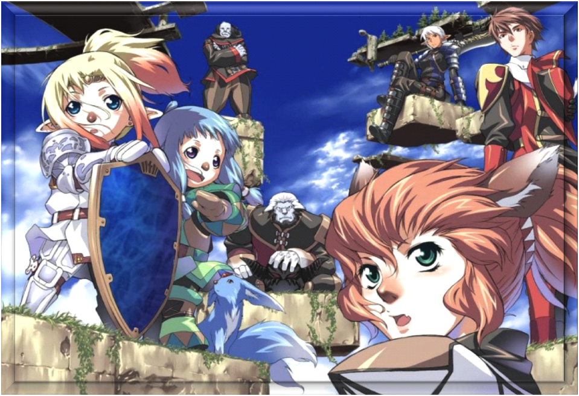{width="5.655511811023622in"
height="3.8744083552055995in"}

Group Creation
--------------

An FFRPG 4e Adventure or Campaign is centered around the Group: the
organization or party which the player characters are a part of, whose
ideals or structure brings the players much of their general goals or
objectives. Group creation is a joint activity between the players and
GM and will serve to guide subsequent creation of individual player
characters. This activity is very important because it defines what kind
of stories will be played. To create the group, follow the 5 steps
below.

1.  **Choose Traits**

These special features are the mechanical elements that will influence
the way the game is played. Each group has three Traits, chosen from the
list below. Traits strongly influence how the game will unfold and
should be chosen very well by the GM and the players.

2.  **Choose a Name**

Self-explanatory. The Group may have a name like Returners, Knights of
Ivalice, Heroes of Light, Shin-Ra Inc., SOLDIER, or any other name.

3.  **Create the Roots**

What links the group? Why was it founded? What is its reason for
existence? Are they the underground resistance to an oppressive empire?
Are they members of a kingdom or a corporation? Are they young people
from a village in the countryside?

4.  **Create the Evil**

Who is the main antagonist? Who threatens the Group's existence?
Remember that this antagonist may (and probably will) change during the
course of a campaign.

5.  **Write the starting Destiny Points**

Destiny Points is a Group feature that can be used by players to
influence the story. Starting Groups begin with 4 Destiny Points.

### Traits

**Monster Hunter**

This group was founded to kill monsters. You gain experience points (XP)
by winning battles against beasts and other creatures.

**The Good:** You may spend Destiny Points to discover things about
monsters.

**The Bad:** Monsters are always hostile to you. You need to spend
Destiny Points to prevent a monster from being automatically hostile.

**Sense of Duty**

This group was founded to follow an organization. Define what is the
specific organization, which may be a church, a kingdom, the army, a
corporation, or something else. This Trait can be selected more than
once, each time representing an affiliation to a different organization.
You gain experience points (XP) by performing missions for the
organization.

**The Good:** You may spend Destiny Points to receive help from the
organization. This special aid will depend on the chosen organization.

**The Bad:** You can't refuse missions from that organization, even if
it goes against your character's beliefs, unless you spend Destiny
Points.

**People's Hero**

This group was founded to liberate people from tyranny. You gain
experience points (XP) by removing corrupt officials, protecting the
public and doing good deeds.

**The Good:** You may spend Destiny Points to call for assistance of the
population. This help may involve shelter, food, hiding, and other
support within the reach of the common man. **The Bad:** You can't
refuse a request for help from a humble man, unless you spend Destiny
Points.

**Relics from the Past**

This group was founded to investigate the secrets of the past, either
arcane or technological (depending on the campaign). You gain experience
points (XP) by investigating ruins, discovering elder tomes or other
ancient artifacts.

**The Good:** You may spend Destiny Points to find out stories about
artifacts and other ancient legends.

**The Bad:** Many of the ancient things have profound and dire stories,
carrying curses. You may suffer the curse that was upon something found,
unless you spend Destiny Points.

**M**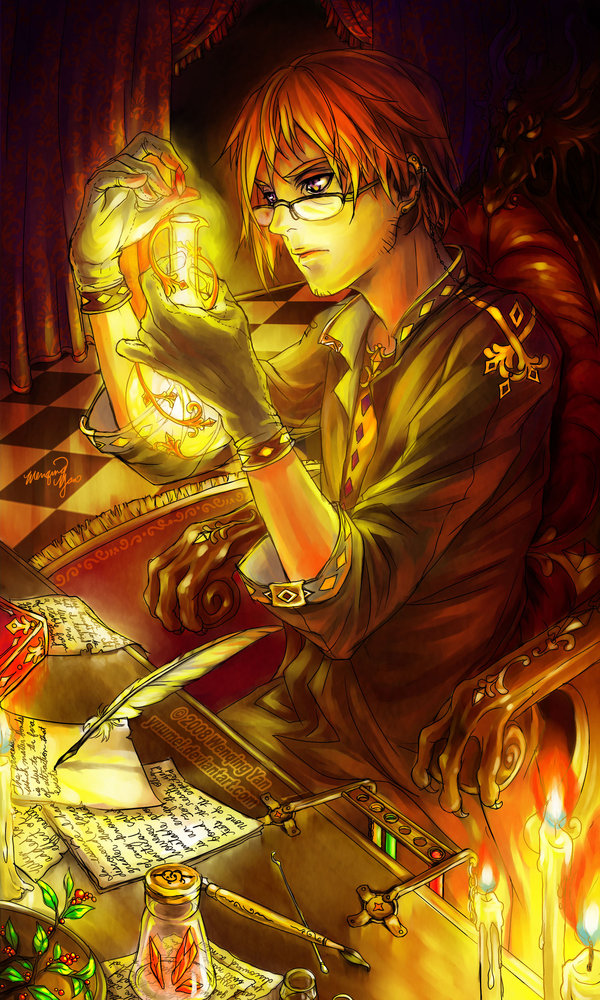{width="3.076376859142607in"
height="5.419291338582677in"}**ercenary**

This group was founded to acquire wealth and power. You gain experience
points (XP) by earning Gil or other material possessions.

**The Good:** You have contacts that appear in the most improbable
moments. By spending Destiny Points in any situation, you can find
someone interested in buying or selling you things, except if this imply
risk of life. However, they may not always charge fair prices, even if
this merchant is a cat-man in the middle of an inhospitable mountain.

**The Bad:** People tend not to rely on mercenaries and will doubt your
intentions when they know your motivations, unless you spend Destiny
Points.

**Nemesis**

This group was founded to fight something or someone of great power.
This enemy can be a person or organization. This Trait can be selected
more than once, each time representing a different enemy. You gain
experience (XP) preventing the plans of your Nemesis or defeating him or
his lackeys.

**The Good:** As much as your Nemesis hate you, it always seems to leave
a hole in his plans. Whenever you are in a situation of imminent defeat
to your Nemesis, you may spend Destiny Points to figure out a way to
escape, in order to face it again later. This does not count as
defeating or preventing the nemesis's plan in any way: you only save
yourself.

**The Bad:** Your Nemesis know your plans better than anyone. Whenever
you try to spend Destiny Points to get any advantage over your Nemesis,
you will need to spend twice as many Destiny Points.

**Protégé**

This group was founded to protect something or someone from harm.
Although it is very important for several reasons, this protégé is
unable to defend itself from harm, which can be physical or not. This
Trait can be selected more than once, each time representing a different
entity to be protected. You gain experience points (XP) by avoiding harm
for the entity or by restoring it.

**The Good:** If your protégé is in danger, you may spend Destiny Points
to gain a second chance on any Challenge that can save it.

**The Bad:** If the protégé is destroyed or killed, even if is possible
to reconstruct, resurrect or any other way restore it, you lose Destiny
Points.

**Reputation**

This group was founded to earn fame and success. You gain experience
points (XP) when you can spread your reputation and become better known
and loved. Alternatively, you may decide that your desired reputation is
bad reputation and your goal is to become feared and hated.

**The Good:** Your reputation precedes you. You may spend Destiny Points
to impress or even influence people based on your reputation.

**The Bad:** It\'s hard to go incognito. When you really need to be
undercover, you need to spend Destiny Points, or else you will be
recognized or otherwise affected by your reputation.

{width="0.4937007874015748in"
height="0.4964555993000875in"} Group creation is really a huge part of
campaign creation. When planning the campaign, you may create the Group
(and its Traits) ahead of time and simply present it to the players.
However, if you can, just present the setting and try to create the
Group along with your players. Below I\'ll present two different Group
examples, all within the same setting.

**Setting:** Wars of Mana. Taken straight from Seiken Densetsu III (or
Secret of Mana 2) storyline, Wars of Mana takes place on a high fantasy
medieval world, where six great nations fight over control for the Mana,
the magical energy that permeates the world.

**1^st^** **Group\'s Traits**: Relics from the Past, Nemesis (Ganelon) &
Monster Hunter. This group was created to find a way to stop Ganelon, an
evil shapeshifter who is using political connections, doppelganger
minions and his cunning to force the world into widespread chaos and
war. They believe the key to stop them is solving the enigma of the
finite Mana, discovering a way to please all the kingdoms. This campaign
went with a political undertone, with the PCs struggling to uncover
Ganelon\'s emissaries and stop his machinations.

**2^nd^** **Group\'s Traits:** Relics from the Past, Reputation &
Nemesis (The One without a Name). The players decided they would face a
timeless being from another dimension. A creature so terrible and alien
that no mortal could even speak his name without delving into the pits
of madness. This was even stronger due to one of the PCs being half-mad
due to an encounter with it. And what's worse, it seems that no one
believed them. This campaign had a very dark horror tone, as the PCs
struggled to earn a Reputation and prove to the world that an unseen
threat exists. The only ones who listened were the already-corrupted
cultists of this Evil God.

Character Creation
------------------

Each player character has its own characteristics. They are individually
assigned by the player to his character, based on the concept the player
wants to roleplay. To create a player character, do the following steps:

1.  **Choose a Name**

Again self-explanatory. Choose a name that suits the character you want
to play.

6.  **Choose your Traits and Quirks**

Each character has a total of 3 Traits and 3 Quirks. 2 of his Traits
must be chosen from his Group's Traits, and the last one is chosen from
the Trait list, and don't need to be one of the Group\'s Traits. The 3
Quirks must be chosen from the list in the Character Options chapter,
pages 21 to 24. Traits define how the character will earn experience
points (XP) and evolve during the game, while the Quirks indicate how it
can earn Destiny Points. Remember that the Destiny Points are shared by
the Group, hence all Destiny Points income and expenses will come from
the Group\'s total Destiny, rather than being individual characters'
values. In addition, all Traits grant ways in which the characters may
spend Destiny points.

7.  **Choose your Jobs**

Each player character has two Jobs, chosen from two different lists. The
combination of Main and Secondary jobs can allow for a great variety of
characters, each with several unique ways of contributing in battle, by
wielding unique Abilities against their foes. The jobs are the
following:

**Main Jobs:** Adept, Archer, Artist, Black Mage, Druid, Freelancer,
Monk, Time Mage, Rogue, Warrior, White Mage

**Secondary Jobs:** Alchemist, Berserker, Defender, Dervish, Fencer,
Rune Knight, Phalanx, Squire, Wizard**.**

More details on Jobs and its Abilities are in the Character Options
chapter, starting at page 26.

8.  **Spend XP to increase your Stats**

In FFRPG 4e, each character has four Stats, each related to a crystal:
Earth, Air, Fire and Water. More details on these Stats are in the
fourth chapter, in page 24. A starting character has a total of 200 (two
hundred) experience points (XP) to spend on their Stats.

9.  **Assign your Skills**

A character earns 1 Skill point for each 3 Levels he earns. Remember
that the total Character Level is the sum of his Stat Levels. These
skill points may be spent as the player wish between the skills, but the
Stat Level is the maximum amount of skill points that may be spent in
all skills linked to that Stat. The skills are:

**Earth Skills:** Strength, Climbing, Swimming, Intimidation, Tolerance,
Jumping.

**Air Skills:** Running, Stealth, Piloting, Riding, Thievery,
Acrobatics.

**Fire Skills**: Infiltration, Perception, Medicine, Survival,
Technology, Wisdom.

**Water Skills**: Willpower, Bluff, Handle Animal, Charisma,
Performance, Magic.

The Skill details are in pages 24 and 25.

10. **Acquire your Abilities**

Each Job offers Core Abilities and Specialties. A character acquires all
Core Abilities he qualifies for and may select one Specialty for each of
his Core Abilities, if he met the required Stat levels. For more details
on Abilities, check the fourth chapter, starting at page 26.

11. **Buy your Starting Equipment**

During character creation, each player can spend 200 Gil in equipment
and items. It is recommended that you buy at least one weapon for your
starting character. More details on wealth and equipment may be found on
the Wealth and Items section, starting at page 88.

12. **Finishing Touches**

Calculate your HP by adding your Earth value to your Job HP bonus and
your MP by adding your Water value to your Job MP bonus using your
Job\'s guidelines. Don\'t forget to flesh out the character concept
using all the cues you\'ve been collecting thus far (Traits, Quirks,
Jobs, Skills, etc.). Take notes on your character backstory,
motivations, personality and appearance, as that may help you roleplay
your character to its fullest potential.

{width="0.4937007874015748in"
height="0.4964555993000875in"}

JB wants to create a cute-but-dangerous Geodancer moogle. He begins with
his name, of course JBMog, and looks at his Group\'s Traits. The
Returners, as his group calls itself, have the Nemesis (Empire),
People\'s Hero and Sense of Duty (Banon) traits. JBMog doesn\'t like
that Banon guy, so he decides to have the Nemesis (The Empire) and
People\'s Hero Traits. To round it up, he fetches one last trait:
Protégé (Narshe Mines): He\'ll fight to protect his people at the Narshe
mines.

Looking at the Quirks, he quickly comes with a good idea of his
character: The Moogle is mandatory for him, but the Feral and Fast
Quirks also round up his character. All in all, he\'s a quick moogle who
loves animal company, but he\'s a tad shy in human lands.

Then, he notes his jobs. Druid is a quick choice, for a Geomancer
character, but he takes a minute to ponder about Secondary Jobs. After
some debate, he ends up choosing Fencer to focus on the defense.

Next, the Stats. With his 200 XP, and looking at the stats, he decides
to make Fire his primary stat, spending 90 XP on that one. This nets him
Fire 30, as shown in the experience table. Then, he proceeds to put 10
XP in Water and 40 XP in Earth - bringing these Stats to 10 and 20,
respectively. The last 60 XP he proceeds to put in Air, granting him Air
24. His levels are Earth 2, Air 2, Fire 3 and Water 1. With these
scores, his character level is 8 (2+2+3+1). For Skills, he decides to
grab Perception and Performance.

As for Abilities, he notes down the first level Core Abilities:
*Nature\'s Path* and *Awakened (Geomancer)* from the Druid, and *Block
Projectiles* from the Fencer. Due to his Stats, he also chooses a
Specialty: *Nature Warrior (Polearms & Bows)*, because what's better
than a Polearm-wielder Moogle? He hasn\'t leveled up enough to get other
Specialties, so he goes to Equipment.

Being a Nature Warrior, he proceeds to get the heaviest armor around - a
Leather Plate (99 Gil) -- and an Iron Spear (63 Gil). With the remaining
Gil he buys a Tonic (25 Gil) and pockets the remaining money (13 Gil).
Finally, he does his HP (level x4 = 8x4 = 32 + earth (20) totals 52 HP)
and MP (level x1 = 8x1 = 8 + water (10) totals 18) calculations.

So, his character sheet is done! Let\'s see how it is:

JBMog, 8th level Druid/Fencer

  ----------- ----------- ----------- --------------
  **Stat**    **Level**   **Value**   **XP Spent**
  **Earth**   2           20          40
  **Air**     2           24          60
  **Fire**    3           30          90
  **Water**   1           10          10
  ----------- ----------- ----------- --------------

**Skills**: Perception 1 and Performance 1.

**Traits & Quirks**: Nemesis (The Empire), People\'s Hero, Protégé
(Narshe Mines); Moogle, Feral and Fast.

**HP** 52/52; **MP** 18/18; **ARM** 3; **MARM** 0

**Equipment**: Iron Spear (Air vs Earth, 6 damage), Leather Plate

**Abilities**: Nature\'s Path \[Nature Warrior\]; Awakened (Geomancer);
Block Projectiles

**Actions**: !Geomancy, !Arrow Guard

Game Engine
===========

Challenges
----------

During a FFRPG 4^th^ Edition adventure, the characters will face
challenges created by the GM to succeed in their goals. A Challenge is a
situation within the game, which has, necessarily, the following three
characteristics:

a\) *Failure and success chance.* A Challenge must have a chance to fail
and a chance to succeed. Walking on the flat and solid ground is not a
Challenge, as it does not have chance of failure; walking in the air is
also not a Challenge, because it has no chance of success. Walking on a
rope in a cliff may be a challenge because it has chance of failure and
success.

b\) *Punishment for failure.* A Challenge must have a punishment for the
failure, although it may be retried. This punishment for the failure may
simply deny the characters the success' reward. An attempt to open a
locked door, using picks and thief's tools is not a challenge if the
character can keep trying again any number of times to get the door
open, but may be a challenge if the room is filling with acid or if the
lock breaks after the first attempt.

c\) *Storytelling impact.* A Challenge must have a significant impact on
the story. Riding a chocobo has chance of failure and success and has a
punishment for failing (the fall). But in a 10-day trip riding a chocobo
to journey between two cities, the way the character will ride does not
have a significant enough impact on the story to become a Challenge.
However, if the character runs away from a desert castle on fire being
chased by bad guys in giant robots, the way he
ri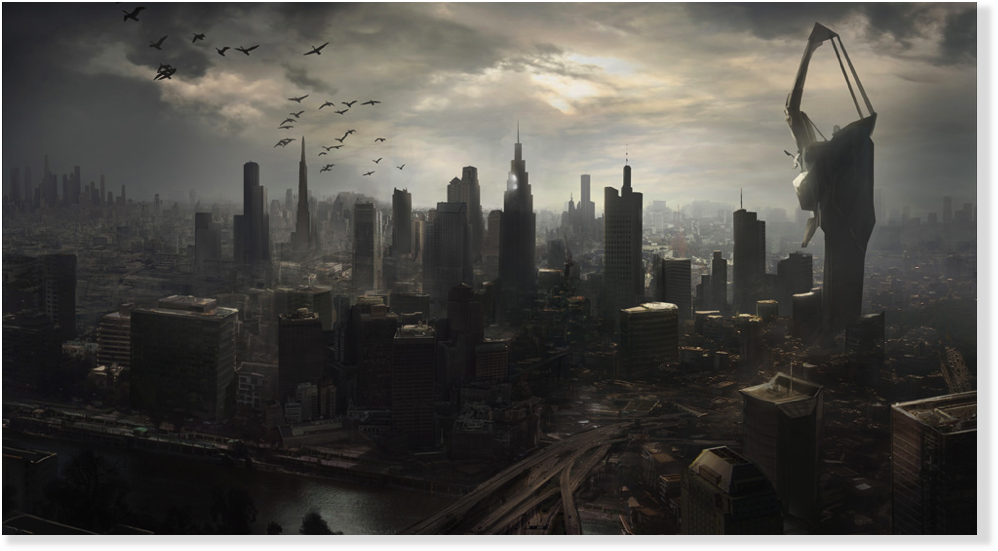{width="2.930708661417323in"
height="1.618109142607174in"}des can indeed be a Challenge.

To create a Challenge, the Game Master should indicate what is the
Challenge's Skill and what is its difficulty. The Challenge's difficulty
is its failure chance. Thus, the GM decides what is the Challenge's
failure chance, indicated by a number between 1 (one) and 99
(ninety-nine). For a character succeed in this Challenge, his player
must roll 1d100 (a 100-sided dice or two 10-sided die, one representing
the tens and the other the singles) and the die roll should be greater
than the established difficulty. For example, if the GM establishes as
30 the difficulty of a challenge, the player must understand that he has
30% chance of failing, and consequently 70% chance of success.

When you fail in a Challenge, if you have the appropriate Skill, you may
re-roll it. For each level in that Skill, you may re-roll the d100 once.
Use the best result as your challenge roll.

A player may always forfeit a Challenge. If he does, his character
automatically fails. Notice that this does NOT means the *character
wants to fail*. A character may still try very hard to achieve a
forfeited Challenge but will fail nonetheless. When a player chooses to
forfeit a Challenge, he may describe how his character fails.

{width="0.4937007874015748in"
height="0.43818897637795273in"}

Optional Rule: **General Acumen**

The game assumes that Stats have no direct relation with the
character\'s capabilities, so a character with high Earth and no
Strength Skill is not strong. Some groups prefer Stats with a greater
impact on challenge. If you use this optional rule, add the Stat Level
to the result of all Challenge rolls linked to that Stat\'s Skills.

Destiny
-------

Destiny is what distinguishes true heroes and villains from ordinary
people. They are a representation of heroism and a tool for sharing the
game\'s narrative. The Destiny Points are a Group shared currency; so,
when a player earns Destiny Points, they add it to the Group's Destiny
Points; when he spends Destiny Points, these points are deducted from
the Group\'s total.

### Earning Destiny Points

There are many ways a character may earn Destiny Points. The main one is
through the character\'s Quirks. In all Quirks, there are ways in which
they create problems and force Challenges, hindering the character's
ability to achieve its goals.

The GM should provide one Destiny Point for the Group when problems
arising from the Quirk create a Challenge that the characters have to
overcome in order to avoid serious consequences; two Destiny Points if
the problems causing is three or more concurrent or sequential
Challenges that have to be overcome to prevent serious problems; or
three Destiny Points if the characters cannot avoid the disastrous
consequences of the problem caused by Quirk.

In addition, the Game Master may grant Destiny Points whenever the Group
achieves a significant goal or according to the story. Also, the Game
Master may give a Destiny Point to force a player to re-roll a
Challenge, even against his will.

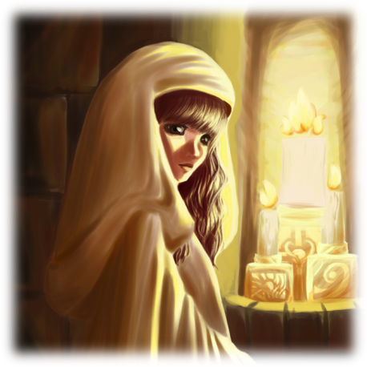{width="1.6666666666666667in"
height="1.6666666666666667in"} Lastly, whenever a player chooses to
forfeit a Challenge related to one of his Quirks and the forfeited
Challenge creates significant problems for the group, give him a Destiny
Point. Do not give a Destiny Point if the forfeited Challenge has none
or little significative story impact.

### Spending Destiny Points

Destiny Points can be spent in various ways. The list below summarizes
these forms.

#### With Quirks

There are two ways of spending Destiny Points with Quirks. By spending
one point, the player can add 20 to a Challenge\'s d100 result if it is
related to the Quirk, or the player may add 40 by spending two points.

The player may also wish to spend three points. If he does, the player
can declare automatic success on any Challenge related with its Quirk.

Thus, a character with the Brute Quirk can use Destiny Points to add 20
or 40 to the d100 result, or even to automatically succeed in most
Strength Challenges, but is unlikely to do the same in a Running
Challenge. These points must be spent after rolling the die.

This rule only affects Challenges and may not be used in attack or
reaction rolls during combat.

#### Feat of Heroism

A character may spend four Destiny points to perform feats of heroism
that exceed the normal limits of human capacity. The key word here is
heroism: Holding a house that would collapse on helpless children with
the power of your muscles, disarming a bomb that would explode the city
in the last minute, jumping from a height of twenty meters to hold on to
a rope and climb to the villain's helicopter, and so on.

A feat of heroism is always successful, even if the character does not
have any applicable Quirk. After a feat of heroism, the master can't
continue the narrative with a \"no\", but at most with a \"yes, but
\...\". \"Yes, you hold the house and prevent it from falling on the
orphans, but you can't hold it more than five minutes and someone will
have to get them out of there!\" is a good answer to a feat of heroism.

#### Getting Clues

For one Destiny Point, the players can get a clue or a hint from the GM
on a problem. The easiest way to do this is to have a nondescript
citizen say a one-liner like \"Don Tonberry hate smoke!\" or \"You can't
cross the Lethe river swimming\" and then immediately disappear to where
it came from. Characters with relevant Traits may also spend a Destiny
Point to acquire relevant clues about their field of expertise.

#### Divine Intervention

By spending 7 Destiny Points, a character can dictate the outcome of an
event or include things in the world. This divine intervention can only
be invoked to save character(s) from an extremely dangerous situation or
to increase the scene's drama, but never to generate an anticlimax.

Dictating that \"The Shadow Lord is overcome with grief and decides to
kill himself\" is not an acceptable intervention but saying that \"When
the group is surrounded, and everyone is about to fall into the abyss, a
group of giant eagles comes and grabs the characters, flying them away\"
is a possible intervention.

If you use divine intervention when your character is dying, in a way
that the character does not avoid his death, costs 4 Destiny Points
instead of 7. Remember that using divine intervention by 4 points means
the character will surely die at the end of intervention, and nothing
that the characters can do will avoid this (except Cheat Death, below).

#### Cheat Death

For 10 Destiny Points, a player can restore a dead character to life or
otherwise escape from something that surely would kill him. This
\"resurrection\" is never immediate; the character will always come back
only after everyone has already given up. Remember also that Cheat Death
does not mean that the character will not have consequences; he may have
broken bones, health problems and mental disorders that can leave him at
least temporarily incapacitated. The player must decide how, exactly,
the character survived (or even came back from hell itself).

#### With Traits

Each trait has a particular way to benefit from Destiny Point
expenditure. They may be activated by spending one Destiny Point. Check
the Trait list, on page 8, for its description. For example, a character
may spend a Destiny Point to activate his Protégé Trait and re-roll a
Challenge related to saving his *Protégé.*

#### Avoiding Disadvantages

Traits mention ways in which the character can receive penalties. If
this happens, he must spend Destiny Points to avoid them. One point
expenditure avoid the creation of a Challenge that the characters have
to overcome in order to avoid serious consequences; two Destiny Points
avoid problems causing three or more concurrent or sequential Challenges
that the characters have to overcome to prevent serious problems; three
Destiny Points must be spent to avoid it if the consequences of the
problem caused by Trait does not need a Challenge to happen.

{width="0.4937007874015748in"
height="0.43818897637795273in"} Optional Rule: **Solving Controversy**

When two players cannot agree on something, just have the two spend any
number of Destiny Points. Whoever spends more points is right, and the
other player is forced to accept his argument.

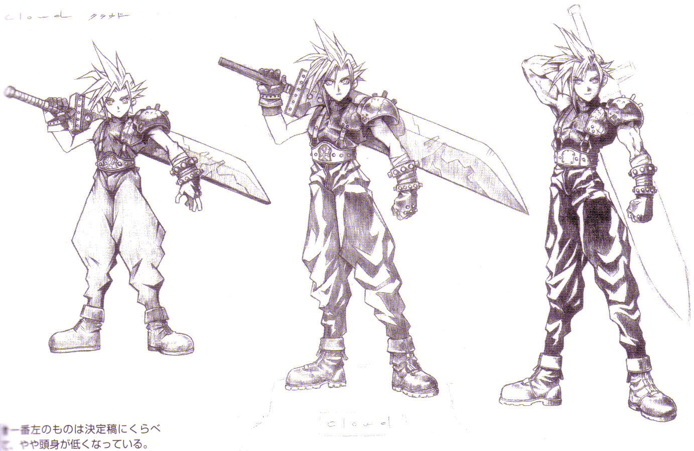{width="2.783464566929134in"
height="1.811023622047244in"}

Combat
------

Combat is the *raison d'etre* of many rules through this book. All rules
regarding Jobs, Spells and Equipment are only tools to be used during
tactical combat. The rules described below turn combative moments in a
simulation that uses all the concepts discussed so far to present
tactical challenges to the group. Each fight consists of rounds that
follow until one side has fled, surrendered or been defeated.

### Initiative

At the beginning of each round, each character involved in the fight
will roll 3d10 and record the values. The die roll total is his
initiative and the result of each dice means the character\'s actions.
After the initiative roll, the round will continue for 10 phases,
starting from phase 1 and ending in phase 10. The phases happen
sequentially, in ascending order. In phase 1, all characters who had at
least one result \"1\" in one of the initiative dice may take an action.

If more than one character acts the same phase, the one with the highest
total initiative acts first. If the characters have the same total
initiative, the one with the greater Air Stat will act first. After
acting, the character discards the current phase initiative die,
reducing his initiative total. When there are no more characters able to
act in phase 1, the round will move to phase 2 and so on. After phase 10
ends, the round ends and a new round begins.

### Action Types

#### Standard Action

A standard action takes place along the lines described above. The
player uses an initiative die with value equal to the current phase to
act.

#### Interrupt Action

This action occurs when the character does not have any initiative dice
representing the current phase. The player may discard any TWO
initiative die to act.

#### Delayed Action

In this case, the character chooses not to act at this phase even having
an initiative die with the correct value. He may then postpone the
action to a later phase. The delayed die's result is counted for the
initiative total at its original value. A character may not delay more
than one action at the same time.

#### Free Action

The free action occurs without the character spending an initiative
dice. It occurs at specific times determined by the rule that creates
it. An example of free action is talking.

### Action Speeds

#### Quick Action

A Quick action occurs when the character acts. The character discards
the initiative dice and its effects are immediate.

#### Slow Action

A Slow (X) action implies that the character must prepare it before
performing. He declares the action as usual, and then spends (X) phases
preparing their action. Only after this time has elapsed, the action's
effects will happen. During this preparation time, he may not react or
do any other actions, but may delay their actions. If he needs to delay
more than one action, as he may not delay more than one action, the
extra actions are lost.

In addition, if the Slow action require you to prepare your action
beyond phase 10, you lose all initiative die this round and, in the next
round, roll one fewer initiative dice. At the phase when you finish the
preparation, the action's effects happen as usual. For example, a
character initiates a Slow (7) action in phase 6. In the next round, he
rolls one fewer initiative dice and in Phase 3, the action's effects
happen.

#### Reaction

Reactions occur when the character uses specific abilities. They
interrupt other actions and must be resolved before the first action's
effects are applied. In response, the character can spend an initiative
dice with the current phase's value, use a delayed action or even
perform an interruption. Some reactions are free actions. A character
may wait to see if an action is successful or not before declaring his
reaction.

### Attacks and Rolls in Combat

All rolls in combat (attack rolls, reactions, Spells, etc.) have the
following characteristics: One Offensive Stat, one Defensive Stat and a
difficulty. For example, the **!Attack** action using a Bow is an
Air(Offensive stat) vs Air (Defensive stat) attack, difficulty 40. The
roll is as follows: The player will roll 1d100 and add his Offensive
Stat's value. He will be successful if the result is higher than
difficulty + the target's Defensive Stat's value. If target choose to
not resist the action, it is always successful, unless the action says
otherwise.

If the attack is against a group (be it ally's or enemy's), the player
must perform only one roll. After adding the d100 roll to Offensive
Stat's value, it should compare it separately with the sum of difficulty
+ Defensive Stat's value of each target and may be successful against
only part of the opponents.

If the attack deals damage or recover HP or MP, the d100's unit digit
will be added to the damage dealt or value healed, unless the attack
says otherwise. Finally, if a character re-rolls an attack, either
because he can re-roll one of his attacks, or because the target can
force his opponent to re-roll his attacks, this character can wait until
knowing whether the attack would be successful or not before choosing to
re-roll or not. If a character re-rolls an attack, always use the second
roll, even if worse than the first.

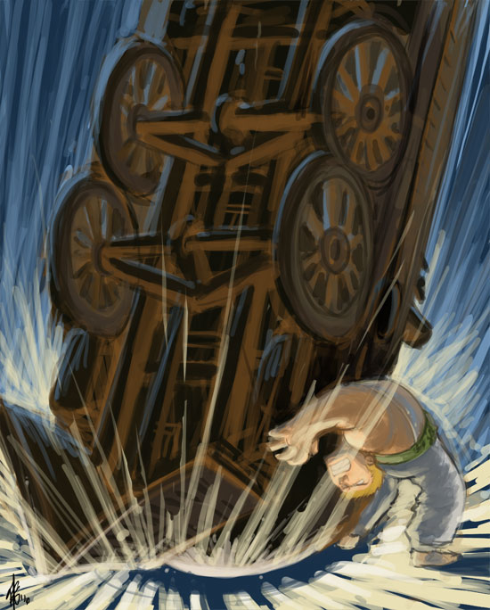{width="2.0826771653543306in"
height="3.0511811023622046in"} Each attack, except Spells, may be
*Ranged* or Melee. All Ranged attacks are noted as such; every
non-Ranged attack is Melee. Flying enemies may not be hit by Melee
attacks, unless the attacker is also Flying. Spells and Reactions
aren\'t neither *Ranged* nor Melee and may target Flying enemies
normally.

### Basic Actions and Reactions 

All characters can perform the following actions, regardless of
equipment, Job or Abilities.

**!Attack**

Quick action. If the character is unarmed, perform an Earth vs Earth
attack, difficulty 70. The damage is physical, Crush-elemental, equal to
Earth level. If it is equipped with a weapon, use the weapon's Offensive
and Defensive Stats, difficulty 40, and deal weapon damage. The Wealth
and Items section, below, has more details about the weapons between
pages 94 to 107. This action may score critical hits, dealing twice
damage.

**!Dodge**

Reaction. Use when suffering a physical attack. Roll Air vs Earth,
difficulty 70. If successful, you don't suffer the attack's effects.

**!Draw**

Quick action. No roll needed. You draw and ready a weapon or inventory
item to use it.

**!Item**

Quick action. No roll needed. You use a drawn item or replace the
equipped weapon with a drawn weapon. In this case, the exchanged weapon
is stored in your inventory as a free action.

**!Flee**

Quick action. Roll Air vs Air, difficulty 40. If successful, you run
away from combat. Use the opponent with the highest Air Stat as the
target of this action.

### Critical Hits

Various actions can score critical hits. Unless the equipped weapon or
the Ability says otherwise, critical hits double the damage. To score a
critical hit, the roll result should be two identical numbers (100, 99,
88, 77, 66, 55, etc.) and the attack must be successful. If an action
does not state that it might achieve critical hits, rolling identical
numbers does no extra effect.

### Elements and Damage

All damage has one element. However, by itself, the element does not
influence the damage, unless the character who receives the damage
absorbs, or is resistant, immune or vulnerable to elemental damage. The
element list is: CRUSH, PUNCTURE, CUT, FIRE, ICE, LIGHTNING, AIR, EARTH,
WATER, BIO, LIGHT and SHADOW.

Regardless of the damage dealt, the attack roll's d100's singles digit
adds to damage, assuming 0 as 10. If, for example, a character uses an
attack that deals 20 damage and rolls 63 on the attack, hitting its
target, it will deal 23 damage.

Unless the attack says otherwise, all damage is reduced by the target\'s
Armor, if the attack is physical, or the target's Magic Armor, if the
attack is magical. The damage suffered after reducing by Armor or Magic
Armor, if any, is deducted from the target's current HP. There is no
penalty for having current HP lower than max HP, unless current HP is 0.
In this case, the character falls unconscious and may not perform
actions while his HP is lower than 1. Lastly, remember to always round
down.

Various effects may change the damage dealt. When in doubt, follow the
sequence below:

1.  **Calculate Base Damage**

Base damage is calculated by multiplying the damage factor by the
relevant Stat Level.

13. **Apply Action Modifiers**

Some actions do 150%, 200%, 75% or any other modifier to the Base
damage. Multiply this modifier to the Base Damage.

14. **Account for Strengthen and Weaken**

Strengthen (Physical or Magic) may increase the damage by 25%. Weaken
(Physical or Magic) may decrease the damage by 25%.

15. **Add the roll\'s singles digit**

Add the roll\'s singles digit to the damage, assuming 0 as 10.

16. **Reduce by target\'s ARM or MARM**

Reduce the damage dealt by the enemy\'s Armor, if physical, or Magic
Armor, if magical.

17. **Apply target\'s Modifiers**

Critical Hits and modifiers like the Shell and Protect status, any
elemental weakness or resistance, or even some Action modifiers must be
applied after accounting the enemy\'s defense.

{width="0.4937007874015748in"
height="0.43818897637795273in"} Dealing damage is the most
time-consuming part of combat. If a group does not address this problem,
it may turn combat into a tedious math exercise. Some tips to speed it:

First, do steps 1 to 3 before you even land a blow. Having your damage
pre-calculated works wonders to speed up combat. Instead of writing your
damage as **!Jump**, (200%) 5x Earth, note it as **!Jump**, 80 damage.
Also, account for Strengthen and Weaken as soon as you receive the
status, not when you decide to attack. Try to do your math while the
other players are describing their actions.

Second, remember that 50% is one half, and 25% is half of a half. 10% is
the number, ignoring the unit digit. Round down your calculations to
speed them. To find a quarter of 138, for example, halve it first (69)
then halve it again (34). 150% is one plus half; 125% is one plus a
quarter; and 75% is one minus a quarter.

Lastly, try to cancel opposite modifiers, even if the numbers aren\'t
exactly equal. A **!Mighty** **Blow** or Critical Hit against an enemy
with **Protect** deals normal weapon damage; If you use **!Kick** on a
**Vulnerable** enemy, it also deals normal weapon damage; and so on.
Keep in mind that speed trumps math accuracy.

### Healing

After an undisturbed night\'s sleep, restore your current HP and MP
values to max value. This happens even to unconscious characters. In
other moments, healing provided by any effects doesn't affect
unconscious characters, unless its description specifically says that
the effect affects targets with zero HP. Similarly, an effect that
specifically targets zero HP characters doesn't have any effects on a
character with current HP equal to 1 or more.

{width="0.4937007874015748in"
height="0.43818897637795273in"} Optional Rule: **Quick Combat Variant**

Tactical Combat, as presented in this chapter, is a deep strategical
endeavor that tries to mimic the video game\'s combat systems. However,
there are lots of examples where the group does not want to spend so
much time and effort to use these rules. Maybe the game is not focused
on combat, or maybe there will be so much combat that using the full
rules will grind things to a halt. Maybe the game will be played on a
slower medium, like Play-by-Post, where even the simplest tactical
combats might take weeks to happen.

In this case, you might want to use this variant rule. If you wish to
use it, ignore most of the Character Options chapter: you\'ll have no
need for Jobs, Abilities, Spells, Equipment or Status Effects. Your
characters might have a Job or two, but only for flavor.

First, add the following Skills to the Skill list:

**Fencing (Earth)**: Melee fighting ability. Including both attacking
with melee weapons and defending against them. May be used in situations
where you must attack with a melee weapon or defend yourself from
enemies attacking in close range.

**Marksmanship (Air)**: Ranged fighting ability. Including both
attacking with ranged weapons and defending against them. May be used in
situations where you must attack with a ranged weapon or defend yourself
from enemies attacking with missiles.

**Spellcraft (Fire)**: Magical prowess. Ability to use magic to enforce
your will. May be used in situations where you want to cast spells and
use your magical power to harm or heal.

**Spell Resistance (Water):** Magical defense. Ability to overcome enemy
magic. May be used in situations where you want to dispel enemy magic or
simply resist its effects. Also used to counterspell.

Second, instead of gaining one Skill point per three character levels,
you earn one Skill point for each character level. You still may not
spend more Skill points in all Skills related to a Stat than levels you
have in that Stat.

Third, each time you re-roll a Challenge due to using a Skill, you
"spend" that Skill level. This represent physical, mental and emotional
fatigue. Your "spent" Skill levels return once you have the time to rest
8 hours.

Lastly, there is no specific Combat rules. To resolve combats, use
Challenges appropriate to the action at hand, using these new Skills or
the core Skills, as situation demands. Unlike the tactical combat rules,
Destiny Points and Quirks may be used during combat in this variant, as
it is handled by normal Challenge rules.

{width="0.4937007874015748in"
height="0.4964555993000875in"}

Later in his adventures, JBMog, now a 30^th^ level character, was in a
dungeon with his friends Rob, a 28^th^ level Warrior/Rune Knight and
Nyarly, a 31^th^ level Adept/Wizard. After an unfortunate failed
Challenge roll, they fell into a trap, activating an iron Golem
guardian.

GM: "Start of Round 1. The creature rolls 1, 3 and 6 as initiative. Roll
your initiative!"

JB: "5, 7 and 9. I use my *Preemptive Strike* to change the 9 to 1. My
initiatives are 1, 5 and 7"!

Rob: "3, 3, and 8. And Nyarly rolled 4, 5, and 10"

GM: "Phase 1. You\'re first JB, then Golem acts."

JB: "I\'ll strike the golem with my lance. I rolled a 61, plus my Air is
148 total. It hits?"

GM: "You try to attack him with your polearm, but the heavy armor of the
golem deflects it (The attack targets Earth plus dif 40. His value is
112, so he needed to overcome 152 to hit). He ignores your attacks while
he prepares his own. He starts charging a Slow axe attack against
Nyarly. We begin Phase 2, and his attack is finished. I roll a 34 (plus
his 112 Earth totals 145) for a total 114 damage (110 damage plus 34\'s
singles digit)."

Nyarly: "Yikes! I will use an interrupt action and react to use **!Will
Shield**. I spend the 4 and 10 dice. I rolled a 69, for a total of 149.
I made it? (The GM nods, as **!Will Shield** have a 10 difficulty and
the Golem\'s Earth value is only 112.) Nyarly creates a magical shield
that blocks the blow and spends 35 MP (114 minus her 44 Armor is 70
damage. She spends half that MP)."

Rob: "Seems no one got actions in Phase 2, so I\'m acting at phase 3.
Seems that his weak spot is Air, so my first action is to draw my Meteo
Knuckle. My second action (Rob can act before the golem since his
initiative total is 11 and the Golem\'s is 9) is to use !Item to stash
my Old Axe and equip the gloves."

GM: "The Golem starts to leak out a strange gas. It attacks all
characters, rusting your equipment! Who got Water lower than 43 is hit
with the Weaken (Armor) status until the end of the next round." (The GM
rolled a 31. 31 plus the Golem\'s Fire value is 113, and the attack
targeted the group and had dif 70)

JB: "I think the only one hit was Rob (Rob nods). My turn now, right?
(Nyarly\'s initiative total is 5, while JB\'s is 12) I\'ll use
**!Advice** on Rob. I want him to crit with that knuckle!"

Nyarly: " So, now it is my turn. I\'ll spend 61 HP to unleash a **!Fury
Brand**. Rolled 90 for a total of 181 vs Water+40. If it hits, that\'s
131 Fire damage and Berserk."

GM: "Yeah, that hits. Your staff burns with your magical fire when you
sacrifice your lifeforce to summon a cleansing flame. Your strike hits
true, dealing 101 damage (that\'s 121 minus the 30 MARM), but the
creature seems to be immune to your mental effect. In the golem\'s turn
at phase 6, he delays his action."

JB "I\'ll keep attacking at phase 7. Let me roll for Geomancy! Hm\...
75? What's the Major effect for Underground? Ah, Cave In. I\'ll spend
the 35 MP to increase the damage. (JB rolls a 51 and hits) That\'s 101
damage (100 damage plus 51\'s singles digit)! Take that!"

GM: "Rocks falls, and the Golem receives 71 damage from the cave in, but
he\'s still rocking!"

Rob: "Phase 8? At last! I\'ll attack him\... Oh, only 11\... I miss\...
No, wait, I crit due to JB! Thanks! I\'ll do-"

GM: "Actually the Golem reacts with his delayed action. He rolls a 17 to
block and\... (checks Rob\'s Earth value of 111) fails. Your critical
does only 19 damage due to the golem\'s heavy armor but roll for
Meteorite!"

Rob: "08 and 66. That\'s two hits? Nice! The meteors fall dealing 48 and
46 damage, ignoring his MARM. That was a nice crit! I did what, 130
damage?"

GM: "113. (The Golem still have 115 HP) So the round ends. Roll your
initiative for the second round!"

{width="0.4921259842519685in"
height="0.43700787401574803in"} Optional Rule: **Scaling down the
Numbers**

The FFRPG 4th edition kept the d100 mechanic from earlier iterations of
the Returner's games. However, the dice used increases the burden of an
already-crunchy game. This optional rule revamps the whole game engine
with lower numbers, and generally speeds up play, easing the math
burden.

To use it, remove all references to Stat Values, keeping only Stat
Levels. Anything in the book that references Stat Values uses Stat
Levels instead. At creation you have 20 XP. A Stat level of 1 costs 1, 2
costs 4, 3 costs 9, 4 costs 16, 5 costs 25, and so on. You just keep any
XP you don\'t spend (so a 3 2 2 1 character starts with 2 XP leftover).

Character's HP and MP are calculated by adding the Job bonuses to either
10 times your Earth Level (HP) or 10 times your Water Level (MP).

Challenges use a d10 instead of a d100, with difficulties ranging from 1
to 9. Skills works as usual, and Destiny Points adds 2 or 4 to a dice,
instead of 20 or 40. When rolling Challenges, you can just roll all die
at once and pick the best result.

Combat also uses a d10 instead of d100. Divide all difficulties by ten,
rounding down if necessary. !Attack Actions, for example are Stat vs.
Stat, difficulty 4. When calculating damage, instead of adding the 1\'s
digit die, you just add 5 damage.

When you roll a natural 10, on an attack able to critical hit, roll
again. If the second roll is a hit, the attack is a crit.

Abilities like Time Mage's Wild Magic also just roll a d10. Dervish\'s
Deadly Accuracy is essentially tripling your critical hit rate, so they
can threaten a critical on an 8, 9, or 10, and then resolve the
confirmation roll as other classes would. The Rogue's Dice deals damage
equal to 10 times the d10 results. The Berserker's *Unwavering Fury*
Ability can increase or decrease by 1 the confirmation roll's value.

This option swaps granularity for speed, reducing the mental load on the
GM and the players. It is recommended to use it if you don't mind losing
the granularity of the d100 and/or the nostalgic experience of using
d100, especially if you do not have access or do not want to use
computer aid during the game.

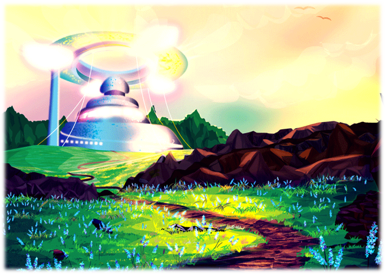{width="3.37007874015748in"
height="2.3976377952755907in"}

Character Options
=================

Quirks
------

Quirks are characteristics that define your character\'s personality
and/or backstory. They give the player some tips on how to roleplay
their character and are a tool both to earn Destiny Points and to use
them. Some Quirk also got a keyword. You may not have more than one
quirk with the same keyword, so you can\'t be Caustic and Empathic at
the same time. And absolutely no Half-Viera/Half-Elvaan, please!

Destiny Points are a shared group resource that may be used to give the
players some control in the narrative. They may be used to turn a failed
Challenge into a successful one, to give tips and directions, to perform
heroic actions that surpass human capacity and even to cheat death,
among various other uses. Details on how to earn and how to spend
Destiny Points are on the Game Engine Chapter, starting at page 13.

### Quirk List

**Arrogant:** You don't back off from challenges and don't submit to the
will of others. You may spend Destiny Points to resist intimidation.
However, you do not take insults lightly and don't refuse challenges.
Earn Destiny Points when this attitude causes you problems.

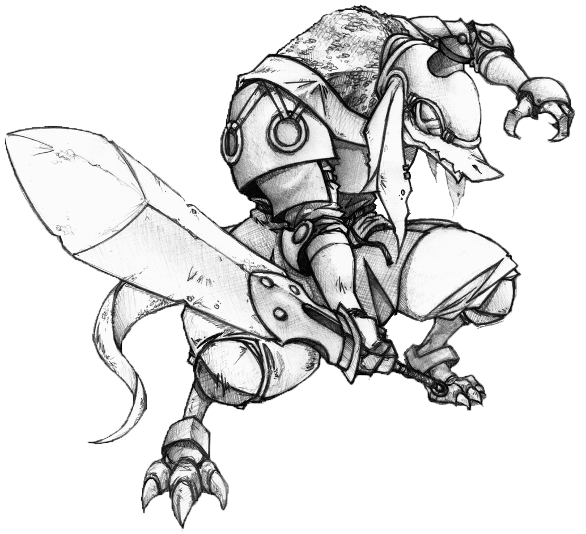{width="1.7598425196850394in"
height="1.6043307086614174in"} **Bangaa (racial)**: A people of biped
lizard men. They are as tall as humans, but significantly stronger and
covered with hard scales. You may use Destiny Points due to your great
strength, leathery skin and high strength to overcome physical
Challenges. However, your race has a terrible vision and it is not
uncommon for Bangaa to cover their eyes to focus only on hearing and
smell. Although you can still see, but the lack of an accurate vision
may cause you problems, and if that happens, earn Destiny Points.

**Bottomless Pockets:** You usually have everything always at hand.
Spend Destiny Points to find things you did not expect, as that wrench
you were just looking for! However, sometimes you simply won't find
something you were sure that were with you. When this causes you
problems, earn Destiny Points.

**Brute (body):** You are very strong and heavy. Spend Destiny Points to
overcome challenges whenever your muscle power really makes a
difference. However, your weight and lack of reflexes can cause you
problems, granting you Destiny Points.

**Caustic (charisma):** You attract dislike and people feel
uncomfortable by your side. You may use Destiny Points to intimidate or
otherwise impose your will on others. You receive Destiny Points when
this lack of sympathy causes you problems.

**Contacts:** You have contacts to obtain information or favors. Decide
at character creation what kind of contacts you have and what kind of
favors they would be willing to do. To use these favors, spend Destiny
Points. However, your contacts may ask dangerous favors or cause you
problems, granting you Destiny points.

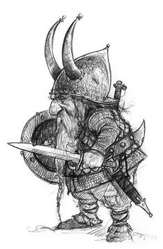{width="1.160236220472441in"
height="1.7751968503937008in"} **Compulsive Liar (honesty):** For some
reason, telling the truth is very hard for you. Worse, others believe!
Use Destiny Points to make people believe your lies, especially the most
ridiculous, and earn Destiny Points whenever your lack of honesty causes
you problems.

**Dwarf (racial)**: Creatures that live underground in caves and mines,
building great kingdoms and castles under the rock. They are generally
smaller and more muscular than humans, possessing an innate aptitude for
metallurgy and technology. You may use Destiny Points in situations
involving explosives, machinery and mining, activities for which dwarves
are renowned. However, the time spent in the darkness turns sunlight
into an ongoing discomfort, making you feel bad in bright light.
Whenever this causes you problems, earn Destiny Points.

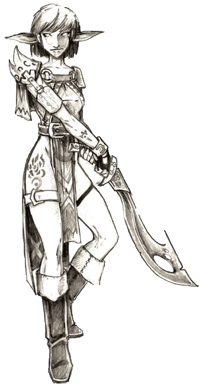{width="1.227952755905512in"
height="2.351574803149606in"} **Elvaan (racial)**: Proud, athletic,
slender and towering, Elvaan are known for their prominent pointed ears,
often stretching ten to fifteen centimeters to the sides of their heads.
Some call them the Elves or Elezen. You may use Destiny Points in
situations that require courage, confidence and willpower. However,
Elvaan are famous for their arrogance and inability to forgive offenses,
whether real or imagined. Whenever this causes you problems, earn
Destiny Points.

**Empathic (charisma):** You attract sympathy and people feel
comfortable at your side. You may use Destiny Points to attract sympathy
and good impressions. However, people tend to not take you seriously. If
this causes you problems, earn Destiny Points.

**Fast (body):** You are fast and light. Spend Destiny Points to use
your speed to your advantage but earn Destiny Points when your lack of
strength or resistance causes you problems.

**Feral (animal):** You were raised by beasts, monsters or a savage
tribe. You relate well with animals. Use Destiny Points to attract
animal sympathy and calm them. However, you are unable to get along with
other humans and earn Destiny Points whenever that causes you problems.

**Focused:** You are focused on some issues (decide which).
Unfortunately, this leaves you with little regard for other subjects.
You may use Destiny Points to remember specific knowledge of your
studies. Earn Destiny Points when your lack of attention to other
matters causes you problems.

**Intuitive Magic -- Elemental:** You can spend Destiny Points to
manipulate fire, lightning and ice, creating small magical effects. Your
magical skills, however, can't be used in combat. Sometimes, magic does
not work the way or when you want, and if this causes you problems, earn
Destiny Points.

**Intuitive Magic -- Forces :** You can spend Destiny Points to
telekinetically manipulate objects, as well as air, earth and water,
performing small magical effects. Your magical skills, however, can't be
used in combat. Sometimes, magic does not work the way or when you want,
and if this causes you problems, earn Destiny Points.

**Intuitive Magic -- Illusion:** You can spend Destiny Points to
manipulate lights, shadows and illusions, performing small magical
effects. Your magical skills, however, can't be used in combat.
Sometimes, magic does not work the way or when you want, and if this
causes you problems, earn Destiny Points.

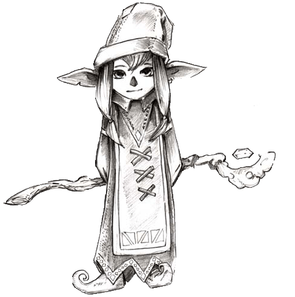{width="1.7520833333333334in"
height="1.7652777777777777in"} **Lalafell (racial)**: These little
creatures are among the smallest known races, hardly reaching more than
a meter tall. In their own language, they call themselves Tarutaru. You
may spend Destiny Points to make small magical effects by manipulating
telekinetically objects as well as to control light and shadows. Their
magical skills, however, can't be used in combat. Their small stature
and lack of physical strength can cause problems when they try to
overcome situations that require strength and endurance. Whenever this
happens, earn Destiny Points.

**Lycanthrope:** Your senses are much more acute than usual. You can use
Destiny Points to track by scent or discover things that only your keen
senses would find. But his bestial blood tries to take control of you,
and you have a constant internal struggle to not act like an animal.
Whenever this cause problems, earn Destiny Points.

{width="1.0666666666666667in"
height="1.5395833333333333in"} **Moogle (racial)**: Their appearance is
similar to a humanoid cat, usually white in color, with small wings of
red or purple color and an antenna on his head ending in a red ball
(pompom). Their ears are like those of a cat or a dog. Despite having
wings, they can\'t fly, but their pompoms give almost telepathic
abilities with other moogle, building what some scholars call Mognet.
You may spend Destiny Points to gather information or send messages
through Mognet to other moogle. However, their spoken language heavily
depends on the kupo word, which can have several meanings depending on
the intonation and body movements. Because of this, communication with
other races is full of misunderstandings. Whenever this causes you
problems, earn Destiny Points.

**Naive Idealist**: You see life through the lens of a personal code of
conduct, or some religious fanaticism, or an ideological utopia. Either
way, you\'re very attached to that ideals, and you can draw strength
from them. The details of your ideal code must be fleshed out with the
GM, but you can spend Destiny points to face incredible odds when
adhering to it. However, you\'re gullible and easily manipulable, as
your ideals may be used to cause you problems, earning you Destiny
Points.

**Natural Hunter (animal):** You feel more comfortable away from
civilization. Forests are your second home. You can use Destiny Points
to hunt, seek shelter and track in natural environments. However, you
are already so used to kill animals that they avoid you and feel
uncomfortable around you. If this causes you problems, earn Destiny
points.

**Nu Mou (racial)**: They have similarities with dogs, with elongated
snouts, furry tails and
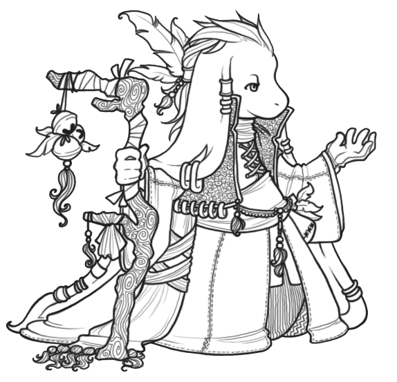{width="1.44251968503937in"
height="1.3818897637795275in"}big, floppy, ears. Their short stature,
around a meter and a half tall, and their tendency to a stooped posture,
cause them to be very small. They have a fragile constitution, but they
are very intelligent and tend to live three times more than normal
humans. You may use Destiny Points in situations involving patience,
common sense and obscure knowledge, especially magical knowledge. They
are also slow and not very athletic. Whenever this causes you problems,
earn Destiny Points.

**Paranoid:** You\'re always aware of the dangers that can arise at any
time. Spend Destiny Points to perceive things that only your keen senses
may notice. However, you suspect everyone and everything, and if this
causes you problems, earn Destiny Points.

**Roegadyn**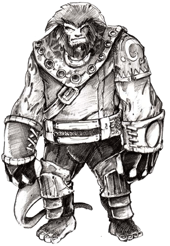{width="1.4007874015748032in"
height="2.029132764654418in"} **(racial)**: Also known as Galka, this
race with slightly ursine appearance has huge bodies, often over two
meters tall. Despite their great strength and power, they are renowned
for self-knowledge and phlegm. You may use Destiny Points in situations
involving self-control and great physical strength. But often their
overly calm attitude may look like apathy or simply laziness. Whenever
this causes you problems, earn Destiny Points.

**Straight Arrow (honesty)**: You\'re a straight arrow, rarely lie and
got a reputation for honesty. You may spend Destiny Points to make
people believe and trust you. Earn Destiny points whenever your honesty
causes you problems.

**Uncommon Beauty:** You are very beautiful and can use your beauty to
attract attention and get good impressions. You may use Destiny Points
to influence other characters who would feel attracted to you. Whenever
your beauty causes you problems, earn Destiny Points.

**Viera (racial)**: The
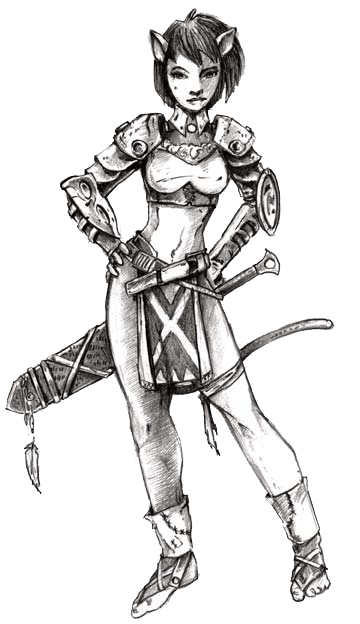{width="1.3625984251968504in"
height="2.3633858267716534in"}Viera have two sub-races. The most common
live in temperate forests and has long rabbit ears, but there is a
sub-race that lives in tropical jungles and has feline characteristics
rather than rabbit's. This sub-breed is commonly called Mithra or
Miqo\'te. Regardless of the sub-race, they are mostly female, with males
being only about twenty percent of the population. Moreover, they are
closely linked to the forests and jungles where they live. You may use
Destiny Points to communicate with trees, although their cognitive
ability is very limited. On the other hand, you feel extremely
uncomfortable in urban environments, and can even become ill if you stay
away from the natural environment for a long time. Whenever this causes
you problems, earn Destiny Points.

{width="0.4937007874015748in"
height="0.43818897637795273in"} **Visions:** For some reason, you have
visions that can give you tips of the future or just torture you. Spend
Destiny Points for good visions and earn Destiny Points when flashbacks
cause you trouble.

You may also want to create your own Quirks. Choose a trait that defines
your character and talk with your GM to turn into a Quirk. However,
there are three guidelines that should be followed. First, a Quirk must
be able to provide the player ways to spend Destiny Points to overcome
Challenges; second, a quirk must be able to provide the GM ways to
create problems for the group; and lastly, a quirk may not influence
tactical combat rolls.

Stats and Skills
----------------

### Stats

Characters have four Stats, each connected to a crystal - Earth, Air,
Fire and Water. Each Stat has a value and levels. For every 10 points in
its value, the Stat earns another level. Stat\'s value varies from 0 to
255 and, consequently, between 0 and 25 levels. The sum of a character's
Stat levels is his Character level.

For example, a 30^th^ level character may have Earth 52 (5^th^ level),
Air 108 (10^th^ level), Fire 80 (8^th^ level) and Water 75 (7^th^
level). Each Stat has 6 skills associated to it. The sum of all Skill
levels a character has in all skills linked to a particular Stat may not
be higher than its Stat level. Thus, the above character has 10 points
to spend in all skills but may not spend more than 5 points in Earth
skills, no more than 8 points in Fire skills and no more than 7 points
in Water Skills.

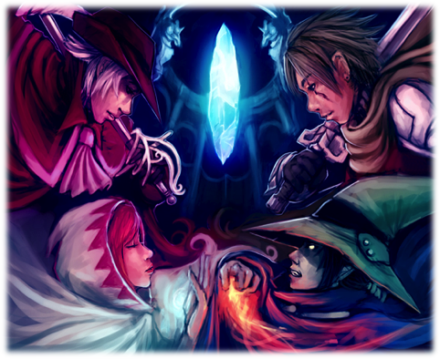{width="3.35in" height="2.7368055555555557in"}
Stats are also used in the tactical combat system. Each roll in combat
uses one Offensive and one Defensive Stat. Earth is usually the
Offensive Stat for attacks that depends on the user\'s brute force and
physicality and is the Defensive Stat to attacks that may be prevented
by the defender\'s physical strength, health and muscle power.

Attacks that rely on the user\'s speed, finesse and skill use Air as its
Offensive Stat. It is the Defensive Stat against attacks that may be
evaded by the defender\'s reflexes and agility. A primarily Offensive
Stat, Fire is used in attacks that rely on the user\'s intelligence and
magical ability. If an attack may be avoided by the defender\'s insight,
it uses Fire as it Defensive Stat.

Lastly, attacks that depends on the user\'s charisma and willpower to
hit uses Water as its Offensive Stat. However, it is a mainly Defensive
Stat, as attacks that may be resisted by the user\'s mental strength and
magical defenses should use it. Besides its offense and defense
implications, players should note that your Earth Value is added to your
hit points (HP) and your Water Value is added to your magic points (MP)
value.

Stats are increased using experience points. The cost to increase a
Stat\'s value by a single point is one plus twice the Stat level. Thus,
a Stat costs 1 experience point per Stat point while at level 0 (value
from 0 to 9); 3 experience points per Stat point while at level 1 (value
10 to 19); 5 XP per Stat point while at level 2 (value 20 to 29); and so
on. Starting on page 125, there is a table with the total XP cost for
each Stat value.

### Skills

Skills are tools that the characters have to overcome Challenges. Each
Challenge must relate to a Skill. Each Skill level means the player may
re-roll once a Challenge related to that Skill. For example, a character
with 3 levels in Strength Skill can re-roll the d100 3 times to overcome
Strength Challenges.

{width="0.2799212598425197in"
height="0.4216535433070866in"} Earth Skills involve brute strength,
toughness, physical prowess and bulk. A character\'s Earth level is his
limit to spend points in Strength, Climbing, Swimming, Intimidation,
Tolerance or Jumping.

{width="0.2637795275590551in"
height="0.41338582677165353in"} Air Skills involve movement, finesse and
body coordination. A character\'s Air level is his limit to spend points
in Running, Stealth, Piloting, Riding, Thievery or Acrobatics.

{width="0.2637795275590551in"
height="0.41338582677165353in"} Fire Skills involve intelligence,
knowledge and wisdom. A character\'s Fire level is his limit to spend
points in Infiltration, Perception, Medicine, Survival, Technology or
Wisdom.

{width="0.2637795275590551in"
height="0.41338582677165353in"} Water Skills involve willpower and
charisma. A character\'s Water level is his limit to spend points in
Willpower, Bluff, Handle Animal, Charisma, Performance or Magic.

Below is a description of each Skill and examples of Challenges
associated with them.

**Acrobatics (Air):** Ability to perform acrobatic maneuvers and
maintain balance in difficult situations. Can be used in situations
where the character may lose balance, must walk on cliffs or wires, or
in situations where it hangs on masts, chandeliers or ropes.

**Bluff (Water):** Ability to lie, cheat, conceal and seduce. It can be
used in situations to deceive, pretend, or otherwise attempt to conceive
your true intentions.

**Charisma (Water):** Personal magnetism and ability to impress. It can
be used in situations involving the reactions of non-player characters,
sometimes even without any specific action by the character.

**Climbing (Earth):** Climbing speed and technique. It can be used in
situations that involve climbing walls, mountains, trees and other
obstacles.

**Handle Animal (Water):** Ability to soothe and train animals and
monsters. It can be used in situations requiring empathy with animals,
to calm wildlife, train animals or prevent them from attacking someone.

**Infiltration (Fire):** Ability to open locks and gain access to locked
locations. It can include both the ability to unlock locks with lock
picks as the ability to fake access cards in more modern environments.

**Intimidation (Earth):** Ability to impose your will through coercion,
threats and power displays. It can be used in situations where the
character wants to impose its will in the most direct way possible.

**Jumping (Earth):** Jumping capacity, involving both the distance as
the height. It can be used in situations involving the ability to
overcome pits or to reach high platforms.

**Magic (Water):** Knowledge of arcane magic. It can be used in
situations involving knowledge of the magical forces of the world and
its mysteries.

**Medicine (Fire):** Knowledge of anatomy, healing, herbal medicines and
medical techniques. It can be used in various situations involving
diseases, poisonings and remedies.

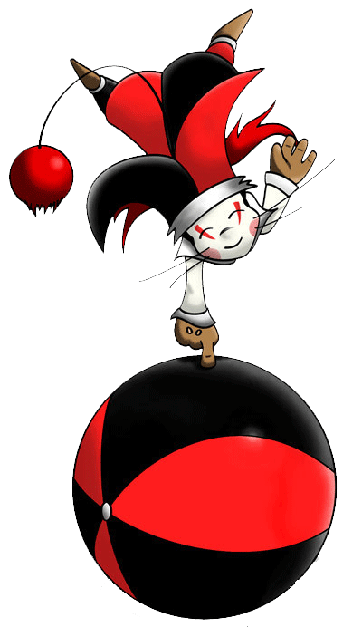{width="1.2159722222222222in"
height="2.1013888888888888in"} **Perception (Fire):** Ability to
distinguish detail with the five senses. It can be used in situations
involving sight, hearing, smell, touch or taste.

**Performance (Water):** Ability to act, sing, dance or perform other
forms of art. It can be carried out in situations involving artistic
performances, such as an opera.

**Piloting (Air):** Ability to drive inanimate machines, ranging from
chariots and carriages to giant robots and aircraft, depending on the
setting's technology.

**Riding (Air):** Ability to ride animals such as chocobos. It can be
used in situations involving the ability to ride animals, in pursuits or
to do mounted maneuvers.

**Running (Air):** Ability to walk and run fast and for long distances.
It can be used in situations involving the running speed and endurance
in long distance runs.

**Stealth (Air):** Ability to hide and move silently. It can be used in
situations when the character doesn't want to be noticed.

**Strength (Earth):** Strength and physical ability. It can be used in
situations involving the character\'s ability to lift, pull, push and
knock down things.

**Survival (Fire):** Ability to relate to the natural world and get
food, water and shelter outdoors. It can be used in situations where the
character needs to hunt and gather food and water in wild environments.

**Swimming (Earth):** Ability to cross distances by swimming. It can be
used in situations involving the need to cross rivers, lakes, seas or
simply to avoid drowning.

**Technology (Fire):** Ability to relate to existing technology on the
world, varying according to the setting's technology level. It can vary
from gear-operated primitive machines to the operation and maintenance
of sophisticated computers.

**Thievery (Air):** Ability to perform hands tricks, as making small
objects exchange owner without anyone noticing. It can be used in
situations involving theft, traps or sleight of hand.

**Tolerance (Earth):** Ability to resist hot and cold environments,
hunger, thirst, drowning and suffocation. It can be used in situations
where the character must overcome physical hardships.

**Willpower (Water):** Ability to resist intimidation, pain, suffering
and torture. It can be used to withstand suffering and to endure the
physical and emotional hardships.

**Wisdom (Fire):** Common sense and the ability to distinguish
illusions, tricks and deceptions. It can be used in situations that
require the character's judgment to avoid being fooled.

Jobs
----

Each player character must choose a Main Job and Secondary Job. Your
Main Job determines your HP and MP bonuses, and the type of gear you can
equip. Also, Main Jobs contain most active Abilities, giving you
different tools to contribute in your Group, be it offensively,
defensively or by supporting the team. Secondary Jobs provide reactions,
increase your gear selection and can provide several other abilities to
cover up for your weaknesses or to exploit your strong points.

Each job has several Core and Specialty Abilities. Core Abilities are
gained by all characters with that Job, as soon as they have the
necessary character levels. Specialty Abilities are optional choices;
each character can choose one and only one specialty for each of your
abilities and can do it at any time after getting the prerequisite
levels. However, after choosing a Specialty, the character can no longer
\"forget it\" or exchange it for another.

Regardless of its Job, the HP of a player character is equal to its
Earth Stat value, plus the job bonus, and the MP of a player characters
is equal its Water Stat value, plus the job bonus.

### Jobs Summary

The next pages present a summary of all Jobs. Its capabilities are
ranked from "E", the lowest rank, to "S", the highest. The Freelancer is
unranked, as its versatility depends on its Job Changes.

Offense Rank is how good the Job is at neutralizing enemies. It is the
greater between the Job\'s Single-Target Damage rank, or how good the
job is at dealing damage to a single target; Group Damage rank, or how
good the job is at dealing damage to all enemies; and Disabling rank, or
how good the job is at using status effects to neutralize enemies.

Defense Rank is how good the Job is at keeping himself alive. It is the
greater between the Job\'s Passive Defense rank, or how much it can
survive without using reactions; Active Defense rank or how much it can
avoid hits due to its reactions; and Healing rank, or how good the job
is at healing himself or its allies.

Support Rank is how good the Job is at helping its allies. It is the
greater between the Job\'s Offensive Support rank, a measure of how the
Job can help its allies deal damage; Defensive Support rank, or how good
the job is at protecting its allies; and Misc. Support rank, or how good
the job is at other kinds of support.

#### Main Jobs

+-----------------+-----------------+-----------------+-----------------+
| Adept           | **Offense: B\   | **Defense: B\   | **Support: C\   |
|                 | **Single-Target | **Passive       | **Offensive     |
|                 | Damage: B       | Defense: B      | Support: E      |
|                 |                 |                 |                 |
|                 | Group Damage: B | Active Defense: | Defensive       |
|                 |                 | C               | Support: C      |
|                 | Disabling: B    |                 |                 |
|                 |                 | Healing: D      | Misc. Support:  |
|                 |                 |                 | D               |
+=================+=================+=================+=================+
| Archer          | **Offense: S\   | **Defense: E\   | **Support: C\   |
|                 | **Single-Target | **Passive       | **Offensive     |
|                 | Damage: S       | Defense: E      | Support: D      |
|                 |                 |                 |                 |
|                 | Group Damage: E | Active Defense: | Defensive       |
|                 |                 | E               | Support: D      |
|                 | Disabling: C    |                 |                 |
|                 |                 | Healing: E      | Misc. Support:  |
|                 |                 |                 | C               |
+-----------------+-----------------+-----------------+-----------------+
| Artist          | **Offense: C\   | **Defense: C\   | **Support: A\   |
|                 | **Single-Target | **Passive       | **Offensive     |
|                 | Damage: D       | Defense: E      | Support: B      |
|                 |                 |                 |                 |
|                 | Group Damage: D | Active Defense: | Defensive       |
|                 |                 | C               | Support: B      |
|                 | Disabling: C    |                 |                 |
|                 |                 | Healing: C      | Misc. Support:  |
|                 |                 |                 | A               |
+-----------------+-----------------+-----------------+-----------------+
| Black Mage      | **Offense: S\   | **Defense: D\   | **Support: D\   |
|                 | **Single-Target | **Passive       | **Offensive     |
|                 | Damage: A       | Defense: D      | Support: D      |
|                 |                 |                 |                 |
|                 | Group Damage: S | Active Defense: | Defensive       |
|                 |                 | E               | Support: D      |
|                 | Disabling: A    |                 |                 |
|                 |                 | Healing: D      | Misc. Support:  |
|                 |                 |                 | E               |
+-----------------+-----------------+-----------------+-----------------+
| Druid           | **Offense: B\   | **Defense: C\   | **Support: B\   |
|                 | **Single-Target | **Passive       | **Offensive     |
|                 | Damage: C       | Defense: D      | Support: B      |
|                 |                 |                 |                 |
|                 | Group Damage: B | Active Defense: | Defensive       |
|                 |                 | C               | Support: B      |
|                 | Disabling: B    |                 |                 |
|                 |                 | Healing: C      | Misc. Support:  |
|                 |                 |                 | C               |
+-----------------+-----------------+-----------------+-----------------+
| Freelancer      | **Offense: ?\   | **Defense: ?\   | **Support: ?\   |
|                 | **Single-Target | **Passive       | **Offensive     |
|                 | Damage: ?       | Defense: ?      | Support: ?      |
|                 |                 |                 |                 |
|                 | Group Damage: ? | Active Defense: | Defensive       |
|                 |                 | ?               | Support: ?      |
|                 | Disabling: ?    |                 |                 |
|                 |                 | Healing: ?      | Misc. Support:  |
|                 |                 |                 | ?               |
+-----------------+-----------------+-----------------+-----------------+
| Monk            | **Offense: C\   | **Defense: S\   | **Support: E\   |
|                 | **Single-Target | **Passive       | **Offensive     |
|                 | Damage: C       | Defense: S      | Support: E      |
|                 |                 |                 |                 |
|                 | Group Damage: C | Active Defense: | Defensive       |
|                 |                 | A               | Support: E      |
|                 | Disabling: D    |                 |                 |
|                 |                 | Healing: C      | Misc. Support:  |
|                 |                 |                 | E               |
+-----------------+-----------------+-----------------+-----------------+
| Rogue           | **Offense: C\   | **Defense: D\   | **Support: S\   |
|                 | **Single-Target | **Passive       | **Offensive     |
|                 | Damage: C       | Defense: E      | Support: A      |
|                 |                 |                 |                 |
|                 | Group Damage: D | Active Defense: | Defensive       |
|                 |                 | D               | Support: C      |
|                 | Disabling: C    |                 |                 |
|                 |                 | Healing: E      | Misc. Support:  |
|                 |                 |                 | S               |
+-----------------+-----------------+-----------------+-----------------+
| Time Mage       | **Offense: C\   | **Defense: C\   | **Support: A\   |
|                 | **Single-Target | **Passive       | **Offensive     |
|                 | Damage: C       | Defense: D      | Support: A      |
|                 |                 |                 |                 |
|                 | Group Damage: C | Active Defense: | Defensive       |
|                 |                 | C               | Support: B      |
|                 | Disabling: C    |                 |                 |
|                 |                 | Healing: D      | Misc. Support:  |
|                 |                 |                 | B               |
+-----------------+-----------------+-----------------+-----------------+
| Warrior         | **Offense: B\   | **Defense: A\   | **Support: D\   |
|                 | **Single-Target | **Passive       | **Offensive     |
|                 | Damage: B       | Defense: A      | Support: D      |
|                 |                 |                 |                 |
|                 | Group Damage: B | Active Defense: | Defensive       |
|                 |                 | D               | Support: D      |
|                 | Disabling: D    |                 |                 |
|                 |                 | Healing: E      | Misc. Support:  |
|                 |                 |                 | E               |
+-----------------+-----------------+-----------------+-----------------+
| White Mage      | **Offense: D\   | **Defense: S\   | **Support: C\   |
|                 | **Single-Target | **Passive       | **Offensive     |
|                 | Damage: E       | Defense: C      | Support: D      |
|                 |                 |                 |                 |
|                 | Group Damage: D | Active Defense: | Defensive       |
|                 |                 | D               | Support: C      |
|                 | Disabling: E    |                 |                 |
|                 |                 | Healing: S      | Misc. Support:  |
|                 |                 |                 | D               |
+-----------------+-----------------+-----------------+-----------------+

**\
**

#### Secondary Jobs

+-----------------+-----------------+-----------------+-----------------+
| Alchemist       | **Offense: C\   | **Defense: A\   | **Support: C\   |
|                 | **Single-Target | **Passive       | **Offensive     |
|                 | Damage: C       | Defense: B      | Support: E      |
|                 |                 |                 |                 |
|                 | Group Damage: C | Active Defense: | Defensive       |
|                 |                 | C               | Support: D      |
|                 | Disabling: D    |                 |                 |
|                 |                 | Healing: A      | Misc. Support:  |
|                 |                 |                 | C               |
+=================+=================+=================+=================+
| Berserker       | **Offense: A\   | **Defense: C\   | **Support: C\   |
|                 | **Single-Target | **Passive       | **Offensive     |
|                 | Damage: A       | Defense: C      | Support: C      |
|                 |                 |                 |                 |
|                 | Group Damage: C | Active Defense: | Defensive       |
|                 |                 | D               | Support: D      |
|                 | Disabling: E    |                 |                 |
|                 |                 | Healing: E      | Misc. Support:  |
|                 |                 |                 | D               |
+-----------------+-----------------+-----------------+-----------------+
| Defender        | **Offense: E\   | **Defense: B\   | **Support: A\   |
|                 | **Single-Target | **Passive       | **Offensive     |
|                 | Damage: E       | Defense: C      | Support: E      |
|                 |                 |                 |                 |
|                 | Group Damage: E | Active Defense: | Defensive       |
|                 |                 | C               | Support: A      |
|                 | Disabling: E    |                 |                 |
|                 |                 | Healing: B      | Misc. Support:  |
|                 |                 |                 | D               |
+-----------------+-----------------+-----------------+-----------------+
| Dervish         | **Offense: S\   | **Defense: C\   | **Support: E\   |
|                 | **Single-Target | **Passive       | **Offensive     |
|                 | Damage: S       | Defense: C      | Support: E      |
|                 |                 |                 |                 |
|                 | Group Damage: E | Active Defense: | Defensive       |
|                 |                 | D               | Support: E      |
|                 | Disabling: E    |                 |                 |
|                 |                 | Healing: E      | Misc. Support:  |
|                 |                 |                 | E               |
+-----------------+-----------------+-----------------+-----------------+
| Fencer          | **Offense: D\   | **Defense: S\   | **Support: D\   |
|                 | **Single-Target | **Passive       | **Offensive     |
|                 | Damage: D       | Defense: A      | Support: E      |
|                 |                 |                 |                 |
|                 | Group Damage: E | Active Defense: | Defensive       |
|                 |                 | S               | Support: E      |
|                 | Disabling: D    |                 |                 |
|                 |                 | Healing: E      | Misc. Support:  |
|                 |                 |                 | D               |
+-----------------+-----------------+-----------------+-----------------+
| Phalanx         | **Offense: D\   | **Defense: A\   | **Support: B\   |
|                 | **Single-Target | **Passive       | **Offensive     |
|                 | Damage: D       | Defense: A      | Support: E      |
|                 |                 |                 |                 |
|                 | Group Damage: E | Active Defense: | Defensive       |
|                 |                 | A               | Support: B      |
|                 | Disabling: E    |                 |                 |
|                 |                 | Healing: E      | Misc. Support:  |
|                 |                 |                 | D               |
+-----------------+-----------------+-----------------+-----------------+
| Rune Knight     | **Offense: D\   | **Defense: A\   | **Support: B\   |
|                 | **Single-Target | **Passive       | **Offensive     |
|                 | Damage: D       | Defense: D      | Support: D      |
|                 |                 |                 |                 |
|                 | Group Damage: D | Active Defense: | Defensive       |
|                 |                 | A               | Support: B      |
|                 | Disabling: E    |                 |                 |
|                 |                 | Healing: E      | Misc. Support:  |
|                 |                 |                 | C               |
+-----------------+-----------------+-----------------+-----------------+
| Squire          | **Offense: B\   | **Defense: C\   | **Support: B\   |
|                 | **Single-Target | **Passive       | **Offensive     |
|                 | Damage: B       | Defense: E      | Support: B      |
|                 |                 |                 |                 |
|                 | Group Damage: C | Active Defense: | Defensive       |
|                 |                 | C               | Support: D      |
|                 | Disabling: E    |                 |                 |
|                 |                 | Healing: E      | Misc. Support:  |
|                 |                 |                 | B               |
+-----------------+-----------------+-----------------+-----------------+
| Wizard          | **Offense: B\   | **Defense: C\   | **Support: B\   |
|                 | **Single-Target | **Passive       | **Offensive     |
|                 | Damage: B       | Defense: E      | Support: B      |
|                 |                 |                 |                 |
|                 | Group Damage: B | Active Defense: | Defensive       |
|                 |                 | E               | Support: B      |
|                 | Disabling: D    |                 |                 |
|                 |                 | Healing: C      | Misc. Support:  |
|                 |                 |                 | E               |
+-----------------+-----------------+-----------------+-----------------+

{width="0.4921259842519685in"
height="0.49606299212598426in"}

These ranks, are, however, just an approximation of each Job\'s
Abilities. If you want to build your White Mage as an offensive
character, go ahead! Also, they do not cover each possible interaction
between all Main and Secondary Jobs. An Archer/Rune Knight plays and
feels different in battle than an Archer/Phalanx, for example. So,
don\'t worry about choosing the "right classes" -- just pick up the ones
you\'d like to play, and you\'ll surely will find good Abilities to use.
Also, keep in mind that the only thing your Job influences is your
combat ability -- you have no roleplaying or character concept
limitation due to your Job.

### 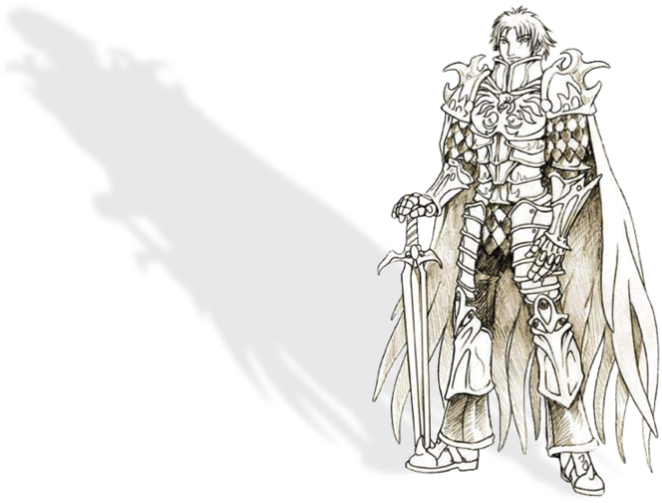{width="4.876377952755906in" height="3.704724409448819in"}Main Jobs

#### Adept

A mystic who uses his own vital energy to trigger magical effects.
Several Adept actions require you to spend HP based on your maximum or
current HP. In these cases, you lose current hit points equal to the
value listed in ability, but it does not diminish your maximum HP. Its
main Stats are Fire and Earth. All Adept's abilities deal damage based
on weapon damage, so equipping a strong weapon is a must.

**Representatives**: General Beatrix (FFIX), Agrias Oaks (FFT), Goffard
Gafgarion (FFT), Dark Knight Job (FFX-2, FFXI), Fell Knight Job (FFT),
Mystic Knight Job (FFV), Adelbert Steiner (FFIX), Warrior Dressphere
(FFX-2)

**Abilities**

*Martial Discipline*: Core Ability acquired at level 1. You can equip
heavy armor, and the following weapons: Claws / Gloves; Heavy Weapon &
Shield; Heavy Weapon; Katana; Wands and Staves. Your HP bonus is 4 times
your level, the multiplier increasing by 1 at levels 15, 30 and 60. Your
MP bonus is 1 times your level, the multiplier increasing by 1 at level
30. Specialties:

> {width="0.17283464566929133in"
> height="0.2755905511811024in"}*Arcane Connection:* Requires Fire level
> 3. You gain one of the following Spell groups: **Fire, Ice, Lightning,
> Light or Cosmic.**
>
> {width="0.17283464566929133in"
> height="0.2755905511811024in"}*Spirit Strength*: Requires Water level
> 3. Whenever you need to spend HP to use an action, you may spend an
> equal amount of MP to prevent the HP loss.
>
> {width="0.18464566929133858in"
> height="0.28346456692913385in"}*Arcane Fury*: Requires Earth level 3.
> While your current MP is greater than zero and you have the
> **Berserk** status, your **!Attack** action deal 150% weapon damage.

*Arcane Discipline*: Core Ability acquired at level 1. You earn one of
the three following actions:

**!Elemental Strike** is a Slow (1) magical action. To use it, choose
Fire, Lightning or Ice. You concentrate the chosen element and strike a
weapon attack causing normal damage, using the chosen element.

**!Holy Strike** is a Quick magical action. Using your own vital energy
as sacred power, you attack with the force of Light. Spend 10% of your
max HP to attack with your weapon. Your attack deals 150% weapon damage,
Light-elemental.

**!Shadow Strike** is a Quick magic action. Sacrificing your own life
force to profane powers, you use the forces of Shadow to attack. Spend
10% of your max HP to attack with your weapon. Your attack deals 150%
weapon damage, Shadow-elemental.

Regardless of the chosen action, the Specialties are:

> {width="0.17222222222222222in"
> height="0.275in"}{width="0.17222222222222222in"
> height="0.275in"}*Dualism*: Requires Air and Water level 5. You gain
> one of the following actions: **!Elemental Strike**, **!Holy Strike**
> or **!Shadow Strike**.
>
> {width="0.17222222222222222in"
> height="0.275in"}{width="0.1840277777777778in"
> height="0.2833333333333333in"}*Will Shield*: Requires Earth level 6
> and Air level 4. You gain the reaction **!Will Shield**. You can use
> this reaction whenever you suffer damage. Conjuring up a protective
> magical shield, you avoid injuries. Perform a Water vs (the greater of
> Earth or Fire) attack, difficulty 10. If successful, you don't suffer
> damage and lose MP equal to half prevented damage. If you do not have
> enough MP to lose, this ability fails.
>
> {width="0.17222222222222222in"
> height="0.275in"}*Last Resort*: Requires Fire level 7. Whenever an
> action spends your HP, you may spend it at the end of the phase,
> instead of before making the attack.

*Blade Magic*: Core Ability acquired at level 15. You gain one of the
three following actions:

**!Snake Fang** is a *Ranged* Slow (1) magical action. Spend 10% of your
max HP to create a snake-shaped wave of energy. The snake then attacks a
target of your choice, a Fire vs Earth attack, difficulty 40. If
successful, the target suffers Bio-elemental weapon damage, and the
**Poison** status until the end of next round.

**!Hallowed Bolt** is a *Ranged* Slow (1) magical action. Spend 10% of
your max HP to create a luminous energy sphere. You send that ball
spiraling against a target of your choice, a Fire vs Fire attack,
difficulty 40. If successful, the target suffers Lightning-elemental
weapon damage, and the **Mute** status until the end the next round.

**!Black Sky** is a *Ranged* Slow (1) magical action. Spend 10% of your
max HP to invoke a black energy beam from the sky. The lightning strikes
a target of your choice, a Fire vs Air attack, difficulty 40. If
successful, the target suffers Shadow-elemental weapon damage, and the
**Blind** status until the end of next round.

Regardless of the chosen action, the Specialties are:

> {width="0.1840277777777778in"
> height="0.2833333333333333in"}{width="0.17222222222222222in"
> height="0.275in"}{width="0.17222222222222222in"
> height="0.275in"}{width="0.17222222222222222in"
> height="0.275in"}*Shadow Blade*: Requires Air level 6 and Fire level
> 9. You earn the Quick magical action **!Shadow Blade**. Conjuring a
> tornado of souls, perform a weapon attack against all other
> combatants, enemies and allies. You deal 150% weapon damage,
> Shadow-elemental, to all characters hit.
>
> *Stasis Strike*: Requires Earth level 9 and Air level 6. You gain the
> *Ranged* Quick magical action **!Stasis Strike**. Spend 25% of your
> current HP to summon a lightning bolt from heavens. If you are
> successful in a weapon attack, deal 150% weapon damage,
> Light-elemental, and inflict the **Immobilize** status until the end
> of your next round on a target.
>
> {width="0.17222222222222222in"
> height="0.275in"}{width="0.17222222222222222in"
> height="0.275in"}*Fury Brand*: Requires Air level 6 and Water level 9.
> You gain the Quick magical action **!Fury Brand**. Spend 25% of your
> current HP to create a rune of fury in your weapon and strike. If you
> are successful in a weapon attack, deal 150% weapon damage,
> Fire-elemental, and inflict the **Berserk** status until the end of
> your next round on a target.

*Elemental Soul*: Core Ability acquired at level 24. Select Fire, Ice,
Lightning, Light or Shadow. You become **Immune** to all damage of the
chosen element. Specialties:

> {width="0.17283464566929133in"
> height="0.2755905511811024in"}*Night Sword*: Requires Fire level 13.
> You gain the Slow (3) magical action **!Night Sword**. Using dark
> energies in your favor, you drain the life energy of your target.
> Spend 10% of your current HP to attack with your weapon. If
> successful, deal weapon damage, Shadow-elemental, and you heal HP
> equal to the damage dealt, after reducing by MARM.
>
> {width="0.17283464566929133in"
> height="0.2755905511811024in"}*Light's Judgement*: Requires Water
> level 13. You gain the Slow (3) magical action **!Cleansing Strike**.
> This action creates an arcane seal in the air, at the cost of 25% of
> your current HP. You then attack a target with your weapon, destroying
> the seal and dealing 150% weapon damage, Ice-elemental, and the
> **Disable** status to a until the end of next round.
>
> {width="0.18464566929133858in"
> height="0.28346456692913385in"}*Reckless Sacrifice:* Requires Earth
> level 13. When using an Adept action that inflicts a negative status
> on a single target, you can choose to automatically hit without
> performing an attack roll. If you do, you suffer the same status for
> the same duration.

*Arcane Shock*: Core Ability acquired at level 42. You gain the *Ranged*
Slow (3) magical action **!Demi Shock** . Concentrating the arcane
forces, you try to break the enemy. Do a Fire vs Earth attack,
difficulty 70. If successful, the target loses 50% of their current HP.
This counts as a **Gravity-**type status effect. The Specialties are:

> {width="0.17222222222222222in"
> height="0.275in"}{width="0.1840277777777778in"
> height="0.2833333333333333in"}*Mana Safe*: Requires Earth level 8 and
> Water level 10. You can spend any amount of MP and an action to heal
> the same amount of MP to an ally. Any ally can spend any amount of MP
> and an action to heal on you half that amount of MP.
>
> {width="0.1840277777777778in"
> height="0.2833333333333333in"}{width="0.17222222222222222in"
> height="0.275in"}*Dark Pact*: Requires Earth and Fire level 11.
> Whenever you spend HP to use an Adept action that deals
> Shadow-elemental damage, you may spend extra 10% of your max HP to
> deal extra 50% weapon damage. You must declare this Ability before
> rolling the attack, spending the extra HP regardless of hitting or
> missing.
>
> {width="0.17222222222222222in"
> height="0.275in"}{width="0.17222222222222222in"
> height="0.275in"}*Elemental Overload*: Requires Air level 7 and Fire
> level 12. Whenever you spend HP to use an Adept action that deals
> Fire-, Ice- or Lightning-elemental, you may double the HP spent to
> attack all opponents, rather than just one target.

*Staggering Blow*: Core Ability acquired at level 60. Whenever you
damage a target preparing a Slow action with an action, you can reduce
the damage dealt by half to make the target lose the prepared action.
Specialties:

> {width="0.1840277777777778in"
> height="0.2833333333333333in"}*Shellburst Stab*: Requires Earth level
> 20. You gain the *Ranged* Quick magical action **!Shellburst Stab**.
> You overload the target with magical energy. Spend 10% of your max HP
> to perform an Earth vs Water attack, difficulty 40. If successful, the
> target takes Puncture-elemental damage equal to the lesser between its
> current MP or 999.
>
> {width="0.17222222222222222in"
> height="0.275in"}*Soul Eater:* Requires Air level 20. You gain the
> *Ranged* Quick magical action **!Soul Eater**. Opening a portal to the
> underworld, you try to drag their opponents into eternal sleep. Spend
> 25% of your max HP and do a weapon attack against all enemies,
> difficulty 40. All opponents hit are reduced to 0 HP. Treat this as a
> **Fatal** type status. If any of the targets is immune to this effect,
> you deal 150% weapon damage to it, Shadow-elemental.
>
> 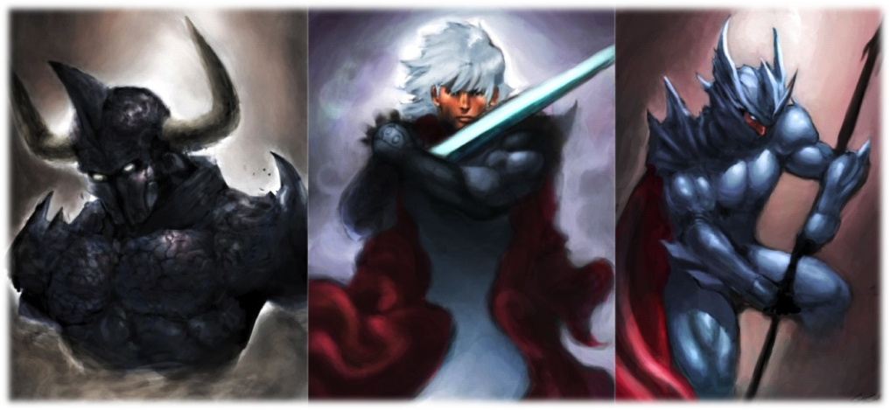{width="3.2401574803149606in"
> height="1.4960629921259843in"}{width="0.17222222222222222in"
> height="0.275in"}*Divine Ruination:* Requires Water level 20. You gain
> the *Ranged* Quick magical action **!Divine Ruination**. You show the
> light of glory to your opponents, who are tempted to follow you. Spend
> 25% of your max HP and do a weapon attack against all enemies,
> difficulty 40. All opponents hit receive the **Charm** status. If any
> of the targets is immune to this effect, you deal 150% weapon damage
> to it, Light-elemental.

#### Archer 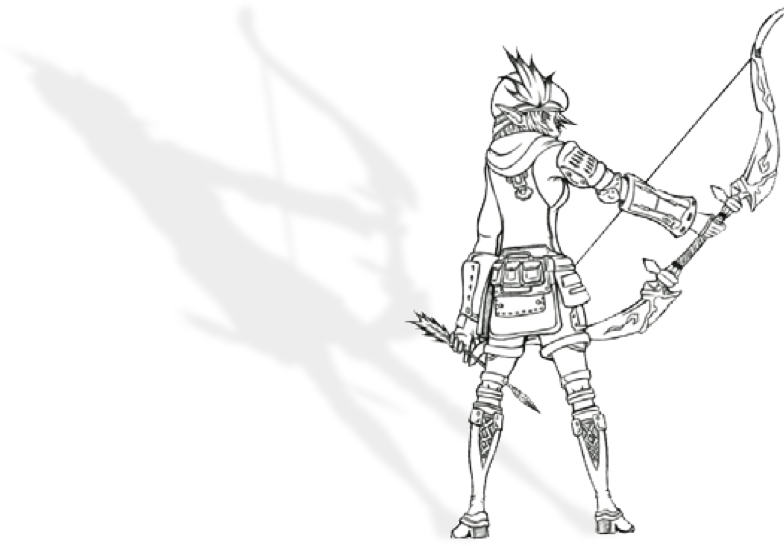{width="5.262598425196851in" height="3.6980314960629923in"}

A fighter who controls the battlefield from afar using an assortment of
weapon attacks. They aren't very tough but have the advantage of
fighting at a distance. They are true masters of battlefield control,
able to direct the flow of battle and inflict devastating status
effects. Its main stats are dependent on the weapon that chose to
specialize: Earth for throwing weapons, Air for archery and Fire for
rifles and crossbows.

**Representatives**: Archer Job (FFIII, FFT, FFTA), Ranger Job (FFXI),
Hunter Job (FFV, FFXI, FFTA), Sniper Job (FFTA), Mustadio Bunanza (FFT),
Barret Wallace (FFVII)

**Abilities**

*Sharpshooter:* Core Ability acquired at level 1. You can equip medium
armor and the following weapons: Claws / Gloves; Bows; Rifle / Crossbow;
and Throwing Weapons. Your HP bonus is 4 times your level, the
multiplier increasing by 1 at levels 15, 30 and 60. Your MP bonus is
zero, and increases by 1 times your level at level 30. Specialties:

> *Precise Shot:* Requires Fire level 3. Whenever you attack with a
> rifle or crossbow, all
> {width="0.17222222222222222in"
> height="0.275in"}reactions to your attack use Fire as a Defensive Stat
> instead of the original Defensive Stat. For example, if someone tries
> to **!Dodge** your attack, instead of rolling Air vs Earth as normal,
> the enemy will roll Air vs Fire.
>
> {width="0.1840277777777778in"
> height="0.2833333333333333in"}*Quick Throw:* Requires Earth level 5.
> Whenever you attack with a Throwing Weapon, you may re-roll the attack
> once.
>
> {width="0.17222222222222222in"
> height="0.275in"}*Point Blank:* Requires Water level 3. Whenever you
> attack with your weapon, you may declare a point-blank shot. If you
> do, your weapon is not *Ranged* during this attack.

*Charge:* Core Ability acquired at level 1. You gain the Slow (3) action
**!Charge**. You aim for an accurate shot. Attack with your weapon,
dealing 150% weapon damage if successful. The Specialties are:

> {width="0.17222222222222222in"
> height="0.275in"}*Ambush:* Requires Water level 7. Until the end of
> the first round of each combat, your Stats count as two levels higher
> for damage calculation.
>
> {width="0.17222222222222222in"
> height="0.275in"}{width="0.17222222222222222in"
> height="0.275in"}*Ungarmax:* Requires Air and Fire level 8. You gain
> the Slow (7) action **!Great Charge**. Elite hunters learn to wait for
> the perfect moment to shoot. Attack with your weapon, dealing 250%
> weapon damage if successful.
>
> {width="0.17222222222222222in"
> height="0.275in"}{width="0.1840277777777778in"
> height="0.2833333333333333in"}*Reflex Shot:* Requires Earth level 7
> and Water level 9. You gain the reaction **!Reflex Shot.** It may be
> used when you are targeted by an attack while preparing a Slow action.
> Attack with your weapon, causing normal damage and applying all
> equipment effects. This ability may achieve critical hits, causing
> double damage. Instead of using a current phase initiative dice, you
> may spend any initiative dice to use this reaction.

*Nutcracker:* Core Ability acquired at level 15. You gain the Slow (3)
action **!Vitals Aim.** Aiming at your opponent's weak points, attack
with your weapon, dealing normal damage but ignoring the target\'s Armor
and Magical Armor. Specialties:

> {width="0.17222222222222222in"
> height="0.275in"}{width="0.1840277777777778in"
> height="0.2833333333333333in"}*Arm Aim:* Requires Earth level 8 and
> Water level 6. You gain the Slow (2) action **!Arm Aim.** You may use
> it to disable the target's upper body. Attack with your weapon,
> difficulty 70. If successful, inflict the **Disable** status on the
> target until the end of the next round.
>
> {width="0.1840277777777778in"
> height="0.2833333333333333in"}{width="0.17222222222222222in"
> height="0.275in"}*Leg Aim:* Requires Earth level 5 and Air level 9.
> You gain the Slow (2) action **!Leg Aim.** It disables the target's
> lower members. Attack with your weapon, difficulty 70. If successful,
> inflict the **Immobilize** status on the target until the end of the
> next round.
>
> {width="0.17222222222222222in"
> height="0.275in"}{width="0.17222222222222222in"
> height="0.275in"}*Head Aim:* Requires Air level 7 and Fire level 9.
> You gain the Slow (2) action **!Head Aim.** With it, you do a glancing
> shot on the head that causes disorientation and dizziness on target.
> Attack with your weapon, difficulty 70. If successful, inflict the
> **Slow** status on the target over the next two rounds.
>
> {width="0.1840277777777778in"
> height="0.2833333333333333in"}{width="0.17222222222222222in"
> height="0.275in"}*Eye Aim:* Requires Earth level 8 and Fire level 5.
> You gain the Slow (2) action **!Eye Aim.** You may use it to attack
> the target's eyes. Attack with your weapon, difficulty 70. If
> successful, inflict the **Blind** status on the target until the end
> of the next round.

*Mind Strike:* Core Ability acquired at level 24. You gain the Quick
action **!Mindblow,** a mystic shot that drains the target's energy.
Attack with your weapon, causing normal damage, but decreasing the
target's MP instead of HP. The Specialties are:

> {width="0.17222222222222222in"
> height="0.275in"}{width="0.17222222222222222in"
> height="0.275in"}{width="0.17222222222222222in"
> height="0.275in"}*Patience Shot:* Requires Air and Fire level 10. When
> using a damage-dealing action neither a Spell neither the **!Barrage**
> action, you can make it Slow (4)**,** rather than Quick, or increase
> your charge time by 4, if it is already Slow, to increase the damage
> dealt by 50% weapon damage.
>
> *Marked Quarry:* Requires Water level 13. Once per round, when you hit
> a single target attack, reduce the difficulty of the next attack
> targeting the same character by 30, to a minimum of 0.
>
> {width="0.17222222222222222in"
> height="0.275in"}{width="0.1840277777777778in"
> height="0.2833333333333333in"}*Wing Aim:* Requires Earth level 6 and
> Air level 10. You gain the Slow (1) action **!Wing Aim.** Using it,
> you shoot the target's wings. Attack with your weapon, difficulty 70.
> If successful, the target loses the **Float** and **Flight** statuses,
> if any, and cannot gain them until the end of the next round.

*Danger Sense:* Core Ability acquired at level 42. You\'re always under
the effects of **Strengthen (Speed)** status**.** Specialties:

> {width="0.17222222222222222in"
> height="0.275in"}{width="0.17222222222222222in"
> height="0.275in"}{width="0.1840277777777778in"
> height="0.2833333333333333in"}*Deadly Precision:* Requires Earth, Air
> and Fire level 10. Your **!Arm Aim, !Leg Aim, !Head Aim, !Eye Aim**,
> **!Wing Aim** and **!Triple Foul** actions deal damage equal to 75%
> weapon damage in addition to its effects.
>
> {width="0.17222222222222222in"
> height="0.275in"}*Toolbox:* Requires Water level 8. You gain one of
> the following Specialties: *Arm Aim, Leg Aim, Head Aim, Eye Aim* or
> *Aim Wing*, even if you haven't met the requirements and even if you
> already chose a Specialty for *Nutcracker* and/or *Mind Strike*.
>
> {width="0.1840277777777778in"
> height="0.2833333333333333in"}*Colossus Slayer:* Requires Earth level
> 15. When you use the action **!Vitals Aim,** rather than ignore the
> target\'s Armor, you add the target\'s Armor to the damage dealt
> instead of subtracting it.

*Always Prepared:* Core Ability acquired at level 60. Choose any
Specialty from any other Archer Ability. You gain this Specialty, even
if you have chosen another Specialty for this Ability, and even if you
haven't met the requirements. This ability's Specialties are:

> {width="0.17222222222222222in"
> height="0.275in"}*Barrage:* Requires Air level 20. You gain the
> physical Slow (5) action **!Barrage.** Using it, attack with your
> weapon, difficulty 10, against a random enemy. This attack doesn\'t
> consider neither yours neither the target's Stats. If you hit, inflict
> weapon damage and you may repeat the attack against a random enemy,
> this time with difficulty 20. As long as you keep hitting, you can
> repeat the attack, always adding 10, cumulatively, to the difficulty,
> until the difficulty becomes 100 or you miss an attack. This action
> can't be used to start *Marked Quarry* or benefit from it*.*
>
> 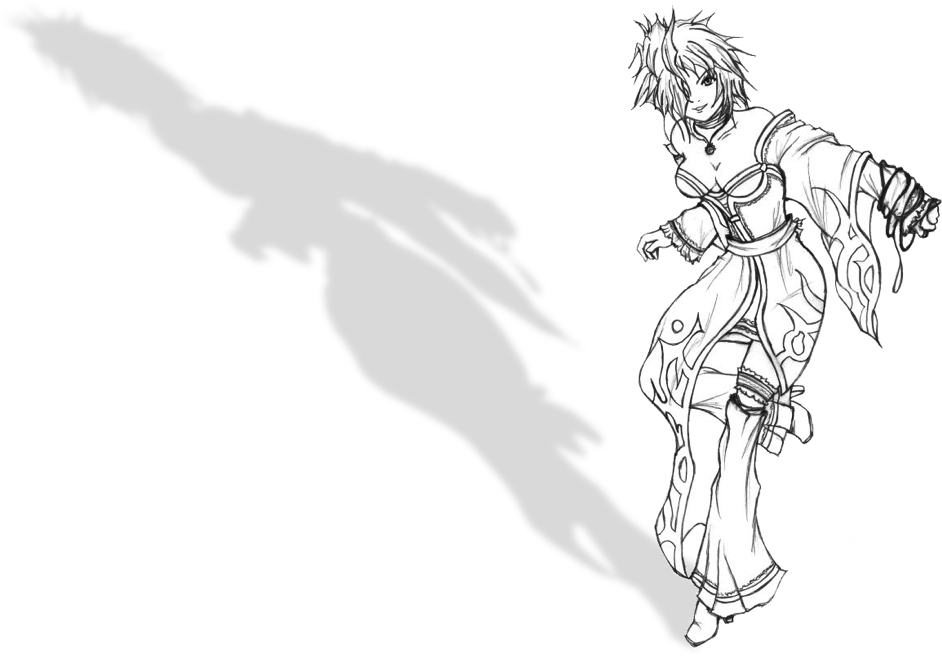{width="6.409027777777778in"
> height="4.373611111111111in"}{width="0.17222222222222222in"
> height="0.275in"}*Crippling Shot:* Requires Fire level 20. You gain
> the Slow (3) action **!Triple Foul.** This action is a weapon attack,
> with difficulty 70. If successful, you inflict all the statuses you
> could inflict the following actions: **!Arm Aim, !Leg Aim, !Head Aim,
> !Eye Aim, !Wing Aim,** as if you had used them. You only inflict the
> statuses based on the Abilities you have.
>
> {width="0.1840277777777778in"
> height="0.2833333333333333in"}*Projectile Rain:* Requires Earth level
> 20. Whenever your action or reaction reduce a target to 0 HP, you gain
> an extra initiative dice with a value equal to the current phase plus
> one. You can't gain initiative die with value 11 or greater.

#### Artist

For these free souls, life is a stage, and their art can wield
supernatural effects. Its main Stat is Water, but an Artist can find all
four Stats useful. Their skills vary greatly depending on the type of
performances he can use: Dance, Song or Mimicry. The performance list
and its descriptions are below, starting at page 85.

**Representatives**: Edward Chris van Muir (FFIV), Bard Job (FFIII, FFV,
FFXI, FFT), Penelo (FFTA2), Dancer Job (FFV, FFT, FFXI), Songstress
Dressphere (FFX-2) , Gogo (FFVI), Mime Job (FFV, FFT)

**Abilities**

*Strength of Character*: Core Ability acquired at level 1. You can equip
medium armor, and the following weapons: Claws / Gloves; Light Swords /
Knives; Instruments and Throwing Weapons. Your HP bonus is 4 times your
level, the multiplier increasing by 1 at levels 15, 30 and 60. Your MP
bonus is zero, and increases by 1 times your level at level 30.
Specialties:

> {width="0.17222222222222222in"
> height="0.275in"}*Singular Courage*: Requires Air level 3. You gain
> the Quick action **!Hide**. Using it, you courageously search for the
> nearest hiding place and inflict the **Vanish** status to yourself
> until the end of the round. If you do any other action before the end
> of the round, you lose the **Vanish** status.
>
> {width="0.1840277777777778in"
> height="0.2833333333333333in"}{width="0.17222222222222222in"
> height="0.275in"}*Seduction*: Requires Water level 4. You gain the
> reaction **!Flirt**. It may be used when you are the sole target of an
> attack. You perform a Water vs Fire attack, difficulty 0. If
> successful, you must designate a new valid target for the attack,
> chosen among your allies. In case of a critical hit, the new target
> does not need to be chosen among your allies. If there is no other
> valid target, this reaction automatically fails.
>
> *Roll with the Blow*: Requires Earth level 5. You resist
> Crush-elemental damage.

*Artistic Niche*: Core Ability acquired at level 1. You learn first
level performances and gain one of the following actions: **!Dance**,
**!Sing** or **!Mimic**. This choice will decisively influence your
skills.

**!Dance** gives you access to physical performances focused on your
opponents, causing injury, reducing their ability to fight and helping
you to get rid of your enemies. By declaring this action, you can use a
**Dance-**type known performance.

**!Sing** gives you access to magical performances focused on your
allies, increasing their fighting skills, protecting them and turning
you into a powerful support to your teammates. By declaring this action,
you can use a **Song-**type known performance.

**!Mimic** have performances that allow you to emulate your allies and
opponents, being the most unpredictable of the three actions. The power
of a mime is the power of his opponents and teammates, and he becomes
stronger according to the challenges it faces. By declaring this action,
you can use a **Mimicry-**type known performance.

Regardless of the chosen action, the Specialties are:

> {width="0.17222222222222222in"
> height="0.275in"}*Juggler*: Requires Air level 3. Choose one of the
> following weapon types: Staves, Heavy Weapon, Katana, Polearm, or
> Wands. You may equip it. Also, you gain the *Ranged* Quick action
> **!Throw**. You throw your weapon, even if it seems impossible!
> Perform a weapon attack with a weapon equipped or in your inventory.
> During this attack, the weapon uses your Air as its Offensive Stat,
> instead of the weapon\'s Offensive Stat, and deal 150% damage. After
> the attack, the weapon is lost and can only be recovered at the end of
> combat. In case of a critical hit, this Ability deals double weapon
> damage, rather than 150%.
>
> {width="0.17222222222222222in"
> height="0.275in"}{width="0.1840277777777778in"
> height="0.2833333333333333in"}{width="0.17222222222222222in"
> height="0.275in"}*Illusionist:* Requires Fire level 5. Your MP bonus
> becomes equal to your level (if not greater). In addition, you gain
> access to one of the following Spell groups: **Images, Transform,
> Strengthen, Flight, Weaken** or **Purify.**
>
> *Legendary Tale:* Requires Earth and Air level 3. You gain the free
> reaction **!Legend**. Once per round, when an ally is successful in an
> action, you can roll 1d10. If you roll a 1, the ally's action fails.
> If you roll a 9 or 10, the ally's action becomes a critical hit. You
> don\'t need to spend initiative dice to use this reaction.

*Supporting Role*: Core Ability acquired at level 15. You learn second
level performances. Specialties:

> {width="0.17222222222222222in"
> height="0.275in"}{width="0.17222222222222222in"
> height="0.275in"}*Eclectic Artist*: Requires Fire level 8 and Water
> level 10. Choose **Dance**, **Song** or **Mimicry**. You may use first
> level performances of the chosen type even without the required
> action.
>
> {width="0.1840277777777778in"
> height="0.2833333333333333in"}*Phlegm*: Requires Earth level 12.
> Whenever you are hit by an action which inflicts negative status, its
> effects only take place in the start of the next round. The status'
> duration is also accordingly increased. This Specialty does not affect
> damage taken.
>
> {width="0.17222222222222222in"
> height="0.275in"}{width="0.17222222222222222in"
> height="0.275in"}*Inspiration*: Requires Air level 10 in and Water
> level 7. Once per round, when you deal a critical hit, gain an extra
> initiative dice with the value 10.

*Fame*: Core Ability acquired at level 24. You learn third level
performances. Specialties:

> {width="0.17283464566929133in"
> height="0.2755905511811024in"}{width="0.17283464566929133in"
> height="0.2755905511811024in"}*Narcissism*: Requires Fire and Water
> level 10. You become immune to the **Charm, Confuse** and **Sleep**
> statuses.
>
> {width="0.17222222222222222in"
> height="0.275in"}{width="0.17222222222222222in"
> height="0.275in"}{width="0.1840277777777778in"
> height="0.2833333333333333in"}*Perfectionism*: Requires Earth, Air and
> Water level 9. Choose **Dance**, **Song** or **Mimicry**. You may use
> second level performances of the chosen type even without the required
> action.
>
> {width="0.1840277777777778in"
> height="0.2833333333333333in"}{width="0.17222222222222222in"
> height="0.275in"}*Undue Criticism:* Requires Earth and Air level 7.
> You gain the magical Quick action **!Hater**. When used, it allows you
> to show all conceivable defects of your target. Perform a Water vs
> Fire attack, difficulty 40**.** If you are successful, inflict the
> **Berserk** status until the end of the next round.

*Protagonist*: Core Ability acquired at level 42. You learn fourth level
performances. Specialties:

> {width="0.17222222222222222in"
> height="0.275in"}{width="0.17222222222222222in"
> height="0.275in"}*Multitalented*: Requires Fire level 10 and Water
> level 13. Choose **Dance**, **Song** or **Mimicry**. You may use third
> level performances of the chosen type even without the required
> action.
>
> {width="0.1840277777777778in"
> height="0.2833333333333333in"}{width="0.17222222222222222in"
> height="0.275in"}{width="0.17222222222222222in"
> height="0.275in"}*Encouragement:* Requires Earth and Air level 10 and
> Water level 12. You gain the reaction **!Do Over**. Use this action
> after an ally roll an attack. Your ally re-roll the attack.
>
> {width="0.17222222222222222in"
> height="0.275in"}*Arcane Heart*: Requires Fire level 14. Your MP bonus
> becomes twice your level (if not greater). In addition, you gain
> access to one of the following Spell groups: **Shield, Armor,
> Regeneration** or **Divination.**

*Stardom*: Core Ability acquired at level 60. You learn fifth level
performances. Specialties:

> {width="0.17222222222222222in"
> height="0.275in"}*Artistic Mastery*: Requires Water level 20. Choose
> **Dance**, **Song** or **Mimicry**. You may use fourth level
> performances of the chosen type even without the required action.
>
> {width="0.1840277777777778in"
> height="0.2833333333333333in"}*Powerful Chord*: Requires Earth level
> 20. Whenever you perform the **!Attack** action, you can choose
> whether it will be physical or magical, regardless of the equipped
> weapon. In addition, add twice your Earth level to your weapon\'s
> damage.
>
> {width="0.17222222222222222in"
> height="0.275in"}*Dedicated Fans:* Requires Air level 20. When you
> suffer damage or an attack, you may, as reaction, force an ally to use
> a reaction he could use if he had suffered damage or the attack. That
> ally needs not to spend an initiative dice to use his reaction. Also,
> your allies may use their reactions when you suffer damage or an
> attack, as if the damage or the attack had affected that ally. In both
> cases, if the ally's reaction fails, you suffer the attack's effects
> normally.

#### Black Mage

A magician skilled in elemental magic, master of destructive energies.
Its main Stats are Fire and Water. Its Spells are extremely offensive,
which makes it extremely handy in eliminating the opposition, but at the
same time aren\'t very versatile. The list of spells and their
description are below, starting at page 64.

**Representatives**: Black Mage Job (FFI, FFII, FFV, FFX-2, FFXI, FFT,
FFTA), Lulu (FFX), Palom of Mysidia (FFIV), Vivi Ornitier (FFIX)

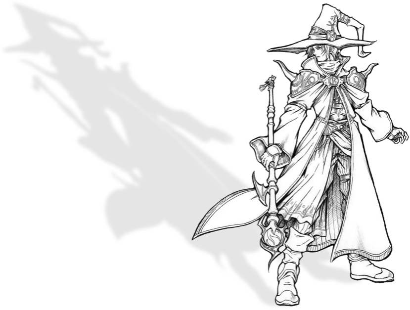{width="5.601388888888889in"
height="4.270833333333333in"}**Abilities**

*Arcane Power*: Core Ability acquired at level 1. You can equip light
armor and the following weapons: Claws / Gloves; Staves; Wands. Your HP
bonus is 3 times your level, the multiplier increasing by 1 at levels
15, 30 and 60. Your MP bonus is 3 times your level, the multiplier
increasing by 1 at level 30. Specialties:

> {width="0.17222222222222222in"
> height="0.275in"}*Arcane*{width="0.17222222222222222in"
> height="0.275in"} *Mystery: Flare:* Requires Fire level 20 and
> character level 64. You gain the Flare Spell.
>
> {width="0.17222222222222222in"
> height="0.275in"}*Arcane
> M*{width="0.17222222222222222in"
> height="0.275in"}*ystery: Ultima:* Requires Fire level 20 and
> character level 64. You gain the Ultima Spell.
>
> {width="0.17222222222222222in"
> height="0.275in"}*Arcane*
> {width="0.17222222222222222in"
> height="0.275in"}*Mystery: Doomsday* : Requires Fire level 20 and
> character level 64. You gain the Doomsday Spell.

*Elemental Magic*: Core Ability acquired at level 1. You gain one
Elemental Spell group: **Lightning, Ice** or **Fire**. Specialties:

> {width="0.17222222222222222in"
> height="0.275in"}*Elemental Mastery*: Requires Water level 3. You gain
> one Elemental Spell group. After reaching level 15, gain another
> Elemental Spell group.
>
> {width="0.1840277777777778in"
> height="0.2833333333333333in"}*Elemental Burst*: Requires Earth level
> 4. Whenever you use a Spell against a single target, you may deal 25%
> of the Spell's damage to another opponent, chosen randomly, ignoring
> their Magic Armor.
>
> {width="0.17222222222222222in"
> height="0.275in"}*Elemental Shock*: Requires Fire level 5. Whenever
> you deal damage with an Elemental Spell, increase all targets'
> initiative dice's values by 1, up to a maximum of 10.

*Transmutation:* Core Ability acquired at level 1. You gain one
Transmutation Spell group: **Death, Transform** or **Poison**.
Specialties:

> {width="0.17283464566929133in"
> height="0.2755905511811024in"}*Transmutation Mastery*: Requires Fire
> level 6. You gain one Transmutation Spell group.
>
> {width="0.17222222222222222in"
> height="0.275in"}{width="0.17222222222222222in"
> height="0.275in"}*Piercing Arcana*: Requires Air and Water level 5.
> Your Spells ignore the targets' status resistance. This has no effect
> on status immunities.
>
> {width="0.17222222222222222in"
> height="0.275in"}{width="0.1840277777777778in"
> height="0.2833333333333333in"}*Magic Resistance*: Requires Earth and
> Fire level 4. You resist all status effects you are able to inflict
> with a Transmutation Spell.

{width="0.1840277777777778in"
height="0.2833333333333333in"} *Worldly Magic*: Core Ability acquired at
level 15. You gain one Worldly Spell group: **Water, Earth** or
**Shadow.** Specialties:

> *Worldly Mastery*: Requires Earth level 8. You gain one Worldly Spell
> group.
>
> {width="0.17222222222222222in"
> height="0.275in"}*Worldly Shock*: Requires Fire level 10 and Water
> level 7. Your Spells ignore half of targets' Magic Armor.
>
> {width="0.17222222222222222in"
> height="0.275in"}{width="0.17222222222222222in"
> height="0.275in"}*Careful Casting*: Requires Air level 5 and Water
> level 8. You may, as you cast a Spell, make it a Slow (3) action.
> Doing so will reduce by 30 its difficulty, to a minimum of zero. All
> difficulties listed in the Spell are reduced by this effect.

*Magical Expert:* Core Skill acquired at level 30. You gain one Expert
Spell group: **Drain, Hex** or **Mage Bane**. Specialties:

> {width="0.17222222222222222in"
> height="0.275in"}{width="0.17222222222222222in"
> height="0.275in"}{width="0.1840277777777778in"
> height="0.2833333333333333in"}*Multi-Expert*: Requires Earth, Air and
> Water level 7. You gain one Expert Spell group.
>
> {width="0.17222222222222222in"
> height="0.275in"}*Obliterate*: Requires Fire level 12. When you use an
> Expert Spell, before applying the Spell's effects, if target have the
> **Protect, Shell** and/or **Reflect** statuses, they cease to affect
> him until the end of the round.
>
> {width="0.17222222222222222in"
> height="0.275in"}{width="0.17222222222222222in"
> height="0.275in"}*Favored Element*: Requires Air level 9 and Fire
> level 10. Choose an element. Your attacks of the chosen element ignore
> the target's elemental resistance and deal 50% damage to immune
> targets.

#### 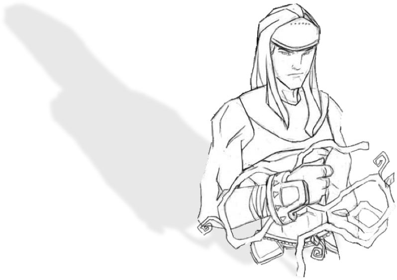{width="5.319444444444445in" height="3.7534722222222223in"}Druid

Unlike the other arcane jobs, these mages fuel their powers from their
connection with nature. They are often overlooked or misunderstood by
other magicians. Their power derives primarily from experimentation with
nature and contact with the monsters and the environment around them.
They are quite different, but typically have high values on Earth and
Water.

**Representatives**: Yuna (FFX), Summoner Job (FFIII, FFV, FFT, FFTA) ,
Rydia of Mist (FFIV) , Strago Magus (FFVI), Quistis Trepe (FFVIII),
Quina Quen (FFIX), Kimahri Ronso (FFX), Blue Mage Job (FFV, FFXI, FFTA),
Gun Mage Dressphere (FFX-2), Geomancer Job (FFIII, FFV, FFT, FFTA2), Mog
(FFVI), Elementalist Job (FFTA, FFTA2), Orator Job (FFT), Beastmaster
Job (FFV, FFXI, FFTA), Reis Duelar (FFT)

**Abilities**

*Nature's Path:* Core Ability acquired at level 1. You may equip medium
armor and the following weapons: Claws / Gloves; Wands; Throwing
Weapons. Your HP bonus is 3 times your level, the multiplier increasing
by 1 at levels 15, 30 and 60. Your MP bonus is 1 times your level, the
multiplier increasing by 1 at level 30. Specialties:

> *Prim*{width="0.17283464566929133in"
> height="0.2755905511811024in"}*al Arcana:* Requires level 1. Increase
> your MP bonus multiplier by 1. You may equip light armor. Also, you
> gain one of the following Spell groups: **Healing**, **Fire**,
> **Ice**, **Lightning**, **Poison** or **Slow**.
>
> *Nature Warrior:* Requires level 1. Increase your HP bonus multiplier
> by 1. You may equip heavy armor and two of the
> follow{width="0.17283464566929133in"
> height="0.2755905511811024in"}ing weapons: Heavy Weapons, Bows, Light
> Swords / Knives, Heavy Weapons & Shield, Katana, Polearms or Staves.
>
> {width="0.17283464566929133in"
> height="0.2755905511811024in"}*Primal Music:* Requires level 1.
> Increase your HP bonus to 4x your level. Also, you may equip the
> Instruments weapon type.

*Awakened:* Core Ability acquired at level 1. Select an option: *Blue
Mage*, *Summoner* or *Geomancer*. This choice determines what defines
your abilities and powers.

*Blue Mage:* You may learn Blue Magic Spells, but you can only cast
Initiate Spells. Learn two Blue Magic Initiate Spells at character
creation. Also, whenever you suffer the effects of a Blue Magic Spell
and are not reduced to 0 HP, you permanently learn the Spell. The list
and description of the Blue Magic Spells starts at page 73.

*Geomancer:* You earn the Ranged Slow (2) magical action **!Geomancy**.
The geomancer has the power to use the terrain to his advantage,
invoking magical effects. Their powers vary accordingly to the terrain
where the battle takes place, be it Plains, Forest, Mountain, Snow, Sea,
Swamp, Urban, Underground, Lava, Desert or Cosmic. The rules for these
effects and their descriptions are in the Geomancy section, starting at
page 81.

*Summoner:* You gain the Quick magical action **!Tame**. To use it, make
a Water vs Fire attack, difficulty 40. If successful, you deal
non-elemental damage equal to your character level. If the opponent is
reduced to 0 HP by this attack, you capture the enemy's soul, and can
release it later with an action to have the captured enemy perform his
most powerful attack against targets of your choice. **!Tame** may also
be used as a reaction when an enemy drops to 0 HP. In this case, the
enemy\'s soul is captured if it hits, regardless of damage. Use the
Stats of captured enemy to determine the effects of this action. While
you own a captured soul, you may not use the **!Tame** action.

Whatever the choice is, the Specialties are:

> {width="0.18464566929133858in"
> height="0.28346456692913385in"}{width="0.17222222222222222in"
> height="0.275in"}{width="0.17222222222222222in"
> height="0.275in"}*Martial Channeling:* Requires Earth and Air level 4.
> Whenever you use a magical action (but not Spells), you may substitute
> the attack roll for a weapon attack, maintaining the same difficulty.
> You are successful in your action if you succeed with the weapon
> attack. If you do succeed, and the action deals damage, you deal
> weapon damage instead of the action's damage. Other than attack roll
> and damage, this Specialty don\'t change anything else in the action.
>
> *Light Steps:* Requires Fire level 6. You gain the **Flight** Spell
> group.
>
> {width="0.17222222222222222in"
> height="0.275in"}*Intimidation:* Requires Water level 4. You gain the
> *Ranged* Quick magical action **!Intimidation**. You attack your
> enemy's self-confidence with your presence of spirit. Perform a Water
> vs Fire attack, difficulty 40. If successful, until the end of the
> next round, when the target roll doubles in an attack roll, instead of
> having a critical hit, its attack fails. Treat this as a
> **Mental**-type status effect.

*Nature's Blessings:* Core Ability acquired at level 10. You gain an
extra ability dependent on your Awakened ability type:

*Blue Mages* may cast Acolyte Spells.

*Geomancers* may now spend MP to increase the power of their
**!Geomancy** action, as indicated under each terrain section below,
starting at page 81.

*Summoners* gain **!Call**, allowing them to obtain the help of Summoned
Monsters they\'ve obtained in their adventures. The complete rules for
these are in the Summoned Monsters section, starting at page 76.
Specialties:

> {width="0.17222222222222222in"
> height="0.275in"}*Air Gust:* Requires Air level 7. You gain the
> *Ranged* Slow (2) magical action **!Air Wave**. Using it, you perform
> an (Air or Fire) vs Water attack against a target, difficulty 40. If
> successful, choose one: You deal 10x Air level Air-elemental damage or
> grant the **Float** status to your group until the end of the round.
> At 30th level or greater, you may spend 30 MP when using this action
> to increase the damage to 15 x Air level or force the target to lose
> their highest initiative dice this round. No more than one initiative
> die can be lost this way by a target each round. Treat this as a
> **Seal**-type status effect.
>
> {width="0.17222222222222222in"
> height="0.275in"}{width="0.17222222222222222in"
> height="0.275in"}*Weak Point:* Requires Water and Air level 5. You
> gain the action **!Advice**. It allows you to choose an ally and point
> out the weaknesses of the enemy. Until the end of the next round,
> whenever the chosen ally performs an attack that can score critical
> hit, critical hits happen even if the attack didn't overcome the
> difficulty.
>
> {width="0.1840277777777778in"
> height="0.2833333333333333in"}{width="0.17222222222222222in"
> height="0.275in"}*Magical Camouflage:* Requires Earth and Water level
> 7. Whenever you or an ally uses an action or spell that targets your
> own group, you may choose up to two targets to avoid the effects of
> the spell or action.

*Natural Domain***:** Core Ability acquired at level 20. You gain one of
the following three extra abilities:

*Blue Mages* may roll 1d100 whenever a combatant uses a Blue Magic spell
on any ally or foe, automatically learning the spell if the roll is
equal to or lower than the Blue Mage\'s level.

*Geomancers* gain the Ranged Slow (X) magical action **!Geotrance**
action and can use it to cast geomancy effects even if not in the right
terrain, according to the rules in page 85.

*Summoners* may now have up to two monster's souls under the effect of
!**Tame** at the same time.
{width="0.17222222222222222in"
height="0.275in"}{width="0.17222222222222222in"
height="0.275in"}Specialties:

> *Monster's Language:* Requires Air level 10 and Fire level 8. You gain
> the Ranged Quick magical action **!Parley**. Speaking the monsters'
> language, you can try to convince them to abandon the fight. Perform a
> Fire vs Fire attack, difficulty 70. If successful, the target will use
> on its next action to **!Flee**, obtaining automatic success if you
> wish. Treat this as a **Fatal**-type status effect.
>
> {width="0.17222222222222222in"
> height="0.275in"}*Adaptative Tolerance:* Requires Water level 9.
> Whenever you suffer the effects of a Status effect, you gain (Status)
> Resistance to that status effect until the end of combat.
>
> {width="0.1840277777777778in"
> height="0.2833333333333333in"}*Earth Slash:* Requires Earth level 10.
> You gain the Slow (2) magical action **!Earth Slash**. Using it, you
> perform an (Earth or Fire) vs Water attack against all other
> combatants (allies and foes), difficulty 40. This attack automatically
> fails against targets that are under the Float or Flight status
> effect. If successful, choose for each target: either deal damage
> equal to 7x Earth level, Earth-elemental, or inflict the Immobilize
> status until the end of the round. At 40th level or greater, you may
> spend 60 MP when using this action to double the duration of the
> status effect and increase the damage to 14x Earth level.

*Natural Mastery:* Core Ability acquired at level 30. You gain an extra
ability, depending on the choice made in the *Awakened* ability.

*Blue Mages* learn Blue Magic Spells after suffering them even if they
are reduced to 0 HP because of its effect and increase their MP bonus by
1 times their level. Also, they can now cast Master and Ancient Spells.

*Geomancers* gains one status effect permanently applied to himself.
Which status is gained is based on the Geomancer\'s lowest Stat value
when he reaches level 30. The Geomancer may choose between status in
case of a tie: **Earth** - Puncture Resist; **Air** - Float; **Fire** -
Premonition; **Water** - Blink.

*Summoners* gain the Quick magical action **!Summon**. It may be used
only once per combat. Using it, you choose a *Summoned Monster* to
materialize. Until the end of the round, you can't use any *Call* beyond
the summoned. On the other hand, the *Summoned Monster,* in addition to
its normal *Call* effects, will also protect you from harm, effectively
granting you the **Wall** status until the end of the round, and other
effects, depending on the *Summoned Monster*. The complete rules for
this and the description of the *Summoned Monsters* are below, starting
at page 76. Specialties:

> {width="0.17283464566929133in"
> height="0.2755905511811024in"}{width="0.17222222222222222in"
> height="0.275in"}*Quagmire:* Requires Fire level 8 and Water level 10.
> You gain the Slow (4) magical action **!Quagmire**. Using it, you
> realize a (Water or Fire) vs Water attack against a target, difficulty
> 40. This attack automatically fails against targets under the effect
> of **Float** or **Flight** status effects. If successful, you deal 17x
> Water level Water-elemental damage and inflict the **Slow** status
> over the next two rounds. At 40th level or greater, you may spend 60
> MP to use this action against a group, rather than a single target.
>
> {width="0.17222222222222222in"
> height="0.275in"}{width="0.17222222222222222in"
> height="0.275in"}*Truce:* Requires Water level 12 and Air level 8. You
> gain the Ranged Quick magical action **!Truce**. Speaking the
> monsters' language, you try to make them pause for a moment. Do a
> Water vs Fire, difficulty 40, attack against all enemies. The enemies
> hit cannot target your party with actions for the next 3 phases.
> Remove this effect if the target suffers damage. This has no effect on
> phase 10. Treat this as a **Mental**-type status effect.
>
> {width="0.1840277777777778in"
> height="0.2833333333333333in"}{width="0.17222222222222222in"
> height="0.275in"}*Natural Resilience:* Requires Earth level 10 and
> Fire level 8. Choose **Toxic**, **Seal** or **Transform**. You become
> immune to all the negative statuses of the chosen type.

#### 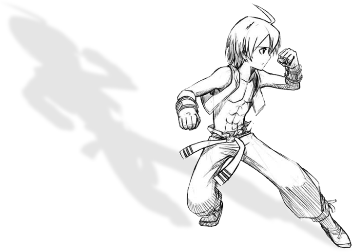{width="4.826377952755905in" height="3.453543307086614in"}Monk

A mystic who battle with the power of their fists and spirit. They have
many hit points and can evoke elemental powers. Its main stats are Earth
and Fire. Most monks either devote themselves to the martial arts or to
spiritual and magical pursues, however some masters try to balance these
two paths.

**Representatives**: Amarant Coral (FFIX), Monk Job (FFI, FFIII, FFV,
FFT), Sabin Rene Figaro (FFVI), Tifa Lockheart (FFVII), Yang Fang Leiden
(FFIV), Zell Dincht (FFVIII)

**Abilities**

*Martial Artist:* Core Ability acquired at level 1. You can equip medium
armor and the following weapons: Claws / Gloves; Wands and Throwing
Weapons. Your HP bonus is 6 times your level, the multiplier increasing
by 1 at levels 15, 30 and 60. Your MP bonus is zero, and increases by 1
times your level at level 30. Specialties:

> {width="0.1840277777777778in"
> height="0.2833333333333333in"}*Brawler:* Requires Earth level 3.
> Whenever you use the **!Attack** action while equipped with Claws or
> Gloves, you may re-roll the attack once.
>
> {width="0.17222222222222222in"
> height="0.275in"}*Drunken Dodge:* Requires Air level 3. Whenever an
> enemy attack or Spell against you fails (because it missed or because
> you successfully avoided it), you may lower the value of one of your
> initiative dice by 1, to a minimum of the current phase.
>
> {width="0.17222222222222222in"
> height="0.275in"}*Elemental Arts:* Requires Water level 3. Your MP
> bonus becomes equal to your level (if not already higher). In
> addition, you gain access to one of the following Spell groups:
> **Gravity, Healing, Poison or Purify**

*Jutsu:* Core Ability acquired at level 1. You earn one of the four
types of Jutsu below:

**!Katon** is a *Ranged* Slow (3) magical action*.* Using it, you invoke
elemental spirits. Do a Fire vs Fire attack, difficulty 40. If
successful, deal 4x Fire level Fire-elemental damage on a target. This
ability can achieve critical hits; in this case, besides the damage, the
target receives the **Sleep** status until the end of the next round.

**!Suiton** is a *Ranged* Slow (3) magical action*.* Using it, you
invoke elemental spirits. Do a Fire vs Water attack, difficulty 40. If
successful, deal 4x Fire level Water-elemental damage on a target. This
ability can achieve critical hits; in this case, besides the damage, the
target receives the **Weaken (Mental)** status until the end of the next
round.

**!Doton** is a *Ranged* Slow (3) magical action*.* Using it, you invoke
elemental spirits. Do a Fire vs Earth attack, difficulty 40. If
successful, deal 4x Fire level Earth-elemental damage on a target. This
ability can achieve critical hits; in this case, besides the damage, the
target receives the **Poison** status until the end of the next round.

**!Fuuton** is a *Ranged* Slow (3) magical action*.* Using it, you
invoke elemental spirits. Do a Fire vs Air attack, difficulty 40. If
successful, deal 4x Fire level Air-elemental damage on a target. This
ability can achieve critical hits; in this case, besides the damage, the
target receives the **Blind** status until the end of the next round.

Regardless of the chosen Jutsu, at level 20 the damage becomes 8x Fire
level, and at level 40 the damage becomes 12x Fire level. The
Specialties are:

> {width="0.17222222222222222in"
> height="0.275in"}{width="0.17222222222222222in"
> height="0.275in"}*Elan:* Requires Air level 4 and Fire level 7. Your
> Jutsu targets a group instead of just one target.
>
> {width="0.1840277777777778in"
> height="0.2833333333333333in"}{width="0.17222222222222222in"
> height="0.275in"}{width="0.17222222222222222in"
> height="0.275in"}{width="0.17222222222222222in"
> height="0.275in"}*Vengeful Spirits:* Requires Fire level 7 and Water
> level 4. Whenever your Jutsu are successful, consider that they had a
> critical hit.
>
> *Lightning Jutsu:* Requires Earth level 4 and Fire level 7. You gain
> the reaction **!Raiton.** Use it you are hit by a damaging action. You
> conjure the spirits defensively to interfere with it. Perform a Fire
> vs Fire attack, difficulty 20. The action causes no effect if either
> you have the **!Katon** Jutsu and the action\'s damage is Water or
> Ice**-**elemental**;** or you have the **!Suiton** Jutsu and the
> action\'s damage is Fire or Light**-**elemental**;** or you have the
> **!Doton** Jutsu and the action\'s damage is Air or
> Lightning**-**elemental**;** or you have the **!Fuuton** Jutsu and the
> action\'s damage is Earth or Shadow**-**elemental.

*Serenity:* Core Ability acquired at level 15. You gain resistance to
**Mental** type statuses. Specialties:

> {width="0.17222222222222222in"
> height="0.275in"}*Jutsu Acolyte:* Requires Fire level 6. You gain one
> of the following Jutsu: **!Katon, !Suiton, !Doton** or **!Fuuton.**
>
> {width="0.17222222222222222in"
> height="0.275in"}*Flurry of Blows:* Requires Air level 8. You gain the
> Quick physical action **!Punch Rush.** It can be used only if you're
> equipped with Claws or Gloves and can perform two actions in the same
> phase. Attacking your opponent with superhuman speed, you spend all
> initiative dice needed to perform two actions and strike an Earth vs
> Air attack, difficulty 40. This attack deals 300% weapon damage in one
> target.
>
> {width="0.1840277777777778in"
> height="0.2833333333333333in"}*Swivel Kick:* Requires Earth level 8.
> You gain the Quick action **!Kick.** When using it, attack all
> opponents with your weapon. After reducing your weapon damage by
> targets' Armor or Magic Armor as usual, reduce the damage by half.
> This action ignores the **Protect** and **Elemental Resist** status
> effects on the targets.

*Soul Volley:* Core Ability acquired at level 24. You gain one of the
following actions:

**!Aura Bolt** is a *Ranged* Slow (4) magical action*.* You release a
wave of light against an opponent, performing a Fire vs Water attack,
difficulty 50. If successful, the target takes 13x Fire level
Light-elemental damage. At level 50, the damage becomes 20 x Fire level.

**!Dark Bolt** is a *Ranged* Slow (4) magical action*.* You release a
wave of darkness against an opponent, performing a Fire vs Water attack,
difficulty 50. If successful, the target takes 13x Fire level
Shadow-elemental damage. At level 50, the damage becomes 20 x Fire
level.

Regardless of the chosen action, the Specialties are:

> {width="0.1840277777777778in"
> height="0.2833333333333333in"}{width="0.17222222222222222in"
> height="0.275in"}*Awaken Chakra:* Requires Earth and Water level 10.
> You gain the Slow (5) magical action **!Chakra.** When using it, you
> release the healing power of your Chakra to end any negative statuses
> affecting you. However, you can't use this Ability while under the
> effect of any **Mental** type status.
>
> {width="0.17222222222222222in"
> height="0.275in"}{width="0.17222222222222222in"
> height="0.275in"}*Pressure Points:* Requires Air level 6 and Water
> level 12. You gain the Slow (2) physical action **!Atemi.** This
> action allows you to deliver blows to the correct points to close the
> chakra of the target. Do an Earth vs Earth attack, difficulty 70. If
> successful, inflict the **Immobilize** status until the end of the
> next round.
>
> {width="0.1840277777777778in"
> height="0.2833333333333333in"}*Suplex:* Requires Earth level 13. If
> you hit the same opponent with the **!Attack** action twice in a phase
> with a Claw or Glove equipped, you inflict the **Confuse** status
> until the end of the round. If you have the *Flurry of Blows* ability,
> your **!Punch Rush** action inflicts the **Confuse** status until the
> end of the round, in addition to damage.

*Release Chakra:* Core Ability acquired at level 42. Choose one of the
four advantages below:

**1)** When using the **!Chakra** action**,** you may spend any amount
of MP to recover HP equal to double of that amount, in addition to its
effects;

**2)** When you hit the **!Atemi** action**,** you may spend 40 MP to
inflict the **Disable** status to the target until the end of the next
round, in addition to its effects;

**3)** When using a Jutsu, you may spend 40 MP to increase the damage to
16x Fire level.

**4)** Whenever you use a Slow (X) action without MP costs, you may
spend MP equal to 15 times the X number to make it a Quick action
instead. For example, it costs 60 MP to cast **!Aura Bolt** as Quick
Action.

Regardless of the choice, the Specialties are:

> {width="0.1840277777777778in"
> height="0.2833333333333333in"}{width="0.17222222222222222in"
> height="0.275in"}*Soul Explosion:* Requires Earth and Fire level 12.
> After using the **!Aura Bolt** or **!Dark Bolt** actions**,** you may
> discard any number of initiative dice, regardless of their value, to
> immediately repeat the attack, once per discarded die, against a
> different target.
>
> {width="0.17222222222222222in"
> height="0.275in"}*Zen Awareness:* Requires Air level 13. You may use
> reactions while preparing Slow actions.
>
> {width="0.17222222222222222in"
> height="0.275in"}{width="0.17222222222222222in"
> height="0.275in"}{width="0.17222222222222222in"
> height="0.275in"}{width="0.1840277777777778in"
> height="0.2833333333333333in"}*Elemental Field:* Requires Earth, Air,
> Fire and Water level 8. After using a Jutsu, you and the target gain
> the **Resist** status to until the end of the round. The element
> depends on the Jutsu used**: !Katon** confers resistance to Water;
> **!Suiton** confers resistance to Fire; **!Doton** gives Air
> resistance; and **!Fuuton** gives resistance to Earth. If you have the
> *Elan* Ability*,* all combatants, allies and enemies, gain the
> **Resist** status.

*Timeless Body:* Core Ability acquired Base at level 60. You resist
**Time** type statuses. Specialties:

> {width="0.17222222222222222in"
> height="0.275in"}*Jutsu Master:* Requires Fire level 20. You gain two
> of the following actions**: !Katon, !Suiton, !Doton** or !**Fuuton.**
> You also gain the *Ranged* Slow (5) magical action **!Kuuton.** Using
> your mastery of the four elements, roll 1d100 and add your Fire value,
> comparing this result to all opponents' stats. If the result is
> greater than Earth plus 20, the opponent takes 6x Fire level
> Earth-elemental damage. If the result is greater than Air plus 20, the
> opponent takes 6x Fire level Air-elemental damage. If the result is
> greater than Fire plus 20, the opponent takes 6x Fire level
> Fire-elemental damage. If the result is greater than Water plus 20,
> the opponent takes 6x Fire level Water-elemental damage. This attack
> always ignores targets' Magic Armor.
>
> {width="0.17222222222222222in"
> height="0.275in"}{width="0.17222222222222222in"
> height="0.275in"}*Elemental Union:* Requires Air and Water level 10.
> Increase your MP bonus by 1 times your level. You gain one of the
> following Spell groups: **Mage Bane, Regeneration, Enchantment** or
> **Divination.**
>
> {width="0.1840277777777778in"
> height="0.2833333333333333in"}*Phantom Rush:* Requires Earth level 20.
> You gain the Slow (6) physical action **!Phantom Rush**, a martial
> arts secret known as the supreme blow. Using it, do an Earth vs Air
> attack, difficulty 30. If successful, deal 33x Earth level
> Crush-elemental damage on a target, ignoring its Armor.

#### Freelancer

The Freelancer is a dilettante, forgoing all tried and true paths to
forge their own road. It embodies versatility, being able to dabble into
all other Main Jobs, building unique battle strategies and tactics. With
it, you'll be able to pick and choose your skills, mixing and matching
strategies and changing your Job almost at-will.

**Representatives**: Onion Kid (FF III), Bare Job (FF V)

**Abilities**

*Versatility:* Core Ability acquired at level 1. Your HP bonus is 3x
your level, and increases by 1x your level at levels 15, 30 and 60. Your
MP bonus is 1x your level, and increases by 1x your level at level 30.

*Job Change:* Core Ability acquired at level 1. Choose a Main Job. You
undergo a Job Change to the chosen Job. You can equip the weapons and
armor as if you had the first Ability of this Job. Each time you spend
Job Points, you must undergo a Job Change to a Job which Abilities you
just acquired. Whenever you make a Job Change, treat as you had the new
Job to determine which weapons and armor you may equip, instead of the
previous. You may only keep the option to equip a piece of gear if you
have an Ability that permanently grants access to a weapon or armor
type. Your Main Job's abilities other than *JP UP* may not change your
HP and MP bonuses. Lastly, you may not acquire any Main Job's
Specialties unless by spending Job Points.

*JP UP:* Core Ability acquired at level 8. Gain 3 Job Points (JP). You
may spend them accordingly to the table below. You may spend less than
your total Job points but cannot spend them again until you gain more
Job Points. To gain any Core Ability or Specialty this way, you must
respect all the Ability\'s required levels.

  **Ability Gained**                                                 **JP Cost**   **Special**
  ------------------------------------------------------------------ ------------- --------------------------------------
  Increase your HP bonus multiplier by 1                             **1**         May be chosen once
  Increase your HP bonus multiplier by 1                             **2**         May be chosen twice
  Increase your MP bonus multiplier by 1                             **2**         May be chosen twice
  *Awakened, Natural Domain* or *Arcane Devotion* Core Abilities     **2**         \-\--
  First Ability which grants Spell Groups                            **2**         Other than Arcane Devotion
  Second or later Ability granting Spell Groups                      **1**         Ignore Arcane Devotion on this count
  Specialty from a Core Ability which you already have a Specialty   **2**         \-\--
  Any other Core Ability or Specialty                                **1**         \-\--

*JP UP*: Core Ability acquired at level 16. Gain 1 Job Point. You may
spend any Job Points you have stored immediately.

*JP UP:* Core Ability acquired at level 23. Gain 1 Job Point. You may
spend any Job Points you have stored immediately.

*JP UP:* Core Ability acquired at level 30. Gain 1 Job Point. You may
spend any Job Points you have stored immediately.

*JP UP:* Core Ability acquired at level 37. Gain 1 Job Point. You may
spend any Job Points you have stored immediately.

*JP UP:* Core Ability acquired at level 44. Gain 1 Job Point. You may
spend any Job Points you have stored immediately.

*JP UP:* Core Ability acquired at level 51. Gain 1 Job Point. You may
spend any Job Points you have stored immediately.

*JP UP*: Core Ability acquired at level 58. Gain 1 Job Point. You may
spend any Job Points you have stored immediately.

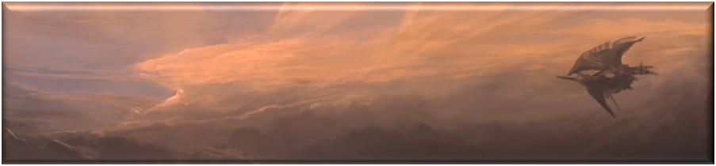{width="4.48125in"
height="1.0798611111111112in"}*JP UP:* Core Ability acquired at level
65. Gain 1 Job Point. You may spend any Job Points you have stored
immediately.

This version of the Freelancer supersedes the version presented in the
Final Fantasy Tactics Worldbook and contains all errata up to September
2018.

#### Rogue 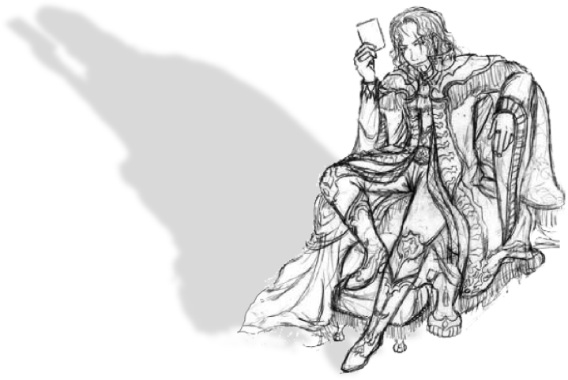{width="4.792913385826772in" height="3.2133858267716535in"}

An expert in surviving with what life throws at him. The Rogue makes its
own destiny, obtaining resources from where nobody expects. His main
Stats are Air and Water. His skills strengthen the group, making their
allies better prepared to face their challenges. Many of their skills
are related to luck and may have unpredictable results.

**Representatives**: Cid Pollendina (FFIV), Edgar Roni Figaro (FFVI),
Setzer Gabbiani (FFVI), Cait Sith (FFVII), Selphie Tilmitt (FFVIII),
Wakka (FFX), Lady Luck Dressphere (FFX-2), Corsair Job (FFXI), Rikku
(FFX), Gadgeteer Job (FFTA), Mustadio Bunanza (FFT), Locke Cole (FFVI),
Yuffie Kisaragi (FFVII), Rikku (FFX), Thief Job (FFI, FFIII, FFV, FFXI,
FFT, FFTA, FFX-2), Zidane Tribal (FFIX)

**Abilities**

*Survivalist*: Core Ability acquired at level 1. You can equip medium
armor, and the following weapons: Polearms; Light Swords / Knives;
Katana; Rifles / Crossbows and Throwing Weapons. Your HP bonus is 4
times your level, the multiplier increasing by 1 at levels 15, 30 and
60. Your bonus MP is zero, and increases by 1 times your level at level
30. Specialties:

> {width="0.17222222222222222in"
> height="0.275in"}{width="0.17222222222222222in"
> height="0.275in"}*Steal*: Requires Air level 3. You gain the Quick
> physical action **!Steal**. This action allows you to gain items
> stealing them of your opponents. Perform an Air vs Air attack,
> difficulty 40. If successful, you gain the target's Common item. In
> case of a critical hit, you acquire the Rare item instead. Check the
> Wealth and Items section, starting at page 88, for more details.
>
> *Gilionaire:* Requires Water level 3. Whenever you gain a Gil reward,
> you earn 25% extra Gil.
>
> {width="0.17222222222222222in"
> height="0.275in"}*Treasure Hunter*: Requires level 3 in Fire. Whenever
> you win a combat, you may roll an additional time for spoils. This
> gives you more chances of earning items at the end of combats. See the
> Wealth and Items section, starting at page 88, for more details.

*Clinical Eye*: Core Ability acquired at level 1. This ability
represents the Rogue\'s ability to find weak points and details about
their opponents. However, each Rogue develops a peculiar point of view,
able to perceive different aspects. You gain one of the following:

**!Detect** is a *Ranged* Quick magical action. Using it, perform a
Water vs Water attack, difficulty 0. If successful, you discover the
target's maximum and current HP and MP, its Stat levels, and its status
Vulnerabilities, Resistances and Immunities.

**!Peep** is a *Ranged* Quick magical action. Using it, perform a Water
vs Water attack, difficulty 0. If successful, you discover the target's
maximum and current HP and MP, and its elemental Vulnerabilities,
Resistances, Immunities and Absorptions.

**!Lucky Odds** is also a *Ranged* Quick magical action. Using it,
perform a Water vs Water attack, difficulty 0. If successful, you
discover the target's maximum and current HP and MP target, and what
their Common and Rare items. You may swap the target's Common and Rare
items, so the Common becomes Rare and vice-versa.

Regardless of the chosen action, the Specialties are:

> {width="0.17222222222222222in"
> height="0.275in"}{width="0.17222222222222222in"
> height="0.275in"}*Feint*: Requires Air and Fire level 5. Whenever an
> opponent reacts to your action, you can force him to re-roll the
> reaction.
>
> {width="0.17222222222222222in"
> height="0.275in"}*Fight Another Day*: Requires Air level 3. The
> difficulty of your **!Flee** action is reduced to zero.
>
> {width="0.1840277777777778in"
> height="0.2833333333333333in"}*Karma*: Requires Earth level 7. You
> gain the reaction **!Karma**. It may be used when you suffer the
> effects of a critical hit. By using, you cast a revenge curse muttered
> under your breath against the opponent who struck you. Choose an
> element: **Fire, Ice, Lightning, Water, Air, Poison, Earth, Light** or
> **Shadow.** The opponent who attacked you lose any Absorptions,
> Immunities and Resistances of the chosen element and gains
> Vulnerability to the element. This effect lasts 3 rounds.

*Dice:* Core Ability acquired at level 15. You gain the *Ranged* Quick
magical action **!Dice**. This action casts ghostly die to haunt the
target. Choose a number between 1 and 5. Perform that number Water vs
Earth attacks, difficulty 0. The opponent suffers Crush-elemental damage
equal to the sum of d100\'s result that hit, ignoring their Magic Armor.
If any dice is a critical hit, consider the opponent had a critical hit
against you and you suffer Crush-elemental damage component equal to the
sum of all d100 results, considering your Magic Armor as usual.
Specialties:

> {width="0.17222222222222222in"
> height="0.275in"}*Arcane Trickster:* Requires Water level 10. Increase
> your MP bonus by 1x your level. In addition, you gain one of the
> following Spell groups: **Transform**, **Poison**, **Images**,
> **Teleport**, **Weaken** or **Slow**.
>
> {width="0.17222222222222222in"
> height="0.275in"}*Dismantle*: Requires Fire level 10. You gain the
> Quick magic action **!Dismantle**. You use your mastery over machines
> and technology to disarm threats. Perform a Fire vs Earth attack,
> difficulty 70, against a target. If the target is a Construct (such as
> a golem, machine or robot), it is instantly reduced to 0 HP. Treat
> this effect as a **Fatal** type status.
>
> {width="0.17222222222222222in"
> height="0.275in"}*Gambler*: Requires Air level 10. You gain the
> *Ranged* Quick action **!Moogle Reels**. Do 3 Water vs Fire (the
> greater between opponents') attacks, difficulty 40. If all fail, you
> suffer the **Confuse** status until the end of the next round**.** If
> successful in just one, perform the **!Attack** action against a
> random opponent. If successful in exactly two, you deal magical damage
> of a random element in all opponents equal to 10 x Water level. If
> successful in all three, you inflict the **Confuse, Slow and Poison**
> statuses on all opponents until the end of the next round.

*Invention*: Core Ability acquired at level 24. When purchasing weapons
and armor, you can change their properties to equivalent ones.
*Elemental Damage* can be exchanged for any other element. *(Monster)
Destroyer* and *(Monster) Killer* may change the type of monster to any
other type. *Critical Spell, Spell Weave* and *Arcane Focus* can change
its Spell to any other Spell of the same level or lower.

Auto -- **Resistance, Vulnerability, Immunity or Absorption** of Crush,
Puncture or Cut can be exchanged for another of these three elements.
Auto -- **Resistance, Vulnerability, Immunity or Absorption** of other
elements can be exchanged for another element, except Crush, Puncture or
Cut. The weapons who give extra damage based on a Stat can change it to
another Stat, except the weapon's Offensive Stat. Finally,
Auto-*Status,* SOS-*Status, Status Resistance, Status Immunity, Status
Touch* and *Status Strike* can swap the Status within the following
power levels, changing a positive status to another positive status and
a negative status effect to another negative status effect:

I: ***Sleep***, ***Blind***, ***Strengthen (Speed), Weaken (Speed),
Poison, Float***.

II: ***Weaken (Armor), Weaken (Mental)***, ***Weaken (Physical), Weaken
(Magic), Strengthen (Armor) Strengthen (Mental), Strengthen (Magic),
Strengthen (Physical), Immobilize, Slow.***

III: ***Haste***, ***Condemn***, ***Confuse***, ***Disable***, ***Shell,
Protect***, ***Berserk, Image, Reraise, Mute, Premonition, Virus,
Flight***.

IV: ***Charm, Meltdown, Vanish, Death, Wall***, ***Stop***, ***Stone,
Reflect, Toad***, ***Zombie.***

In addition, at any time out of combat, you can pay half weapon's or
armor's Gil cost to change its properties, as if you just had bought
that equipment. Specialties:

> {width="0.17222222222222222in"
> height="0.275in"}{width="0.1840277777777778in"
> height="0.2833333333333333in"}*Steal the Spotlight*: Requires Earth
> level 6 and Water level 11. You can spend allies' initiative dice to
> act if that ally allows it.
>
> {width="0.17222222222222222in"
> height="0.275in"}{width="0.17222222222222222in"
> height="0.275in"}*Lucky Number*: Requires Air and Fire level 10.
> Whenever you roll a result 77 or 07 in a d100, you are successful,
> regardless of the difficulty. In addition, you gain the free reaction
> **!Lucky Seven**. Use after your character suffers damage from an
> attack and if the last digit of your HP is 7. Attack the opponent who
> attacked you with a Water vs Water attack, difficulty 77. If you fail,
> deal 7 damage. If successful, deal 77 damage. In case of a critical
> hit, deal 777 damage. This attack ignores Magic Armor. You don\'t need
> to spend initiative dice to use this reaction. The damage is magical
> and Cut-elemental.
>
> {width="0.17222222222222222in"
> height="0.275in"}*Abandon Subtlety*: Requires Air level 13. Whenever
> you use the **!Steal** action, you may increase the difficulty to 50
> to perform, regardless of success in the **!Steal** attempt, the
> **!Attack** action as a free action against the same target.

*Charity's Lesson*: Core Ability acquired at level 42. You gain the
*Ranged* Quick physical action **!Gil Toss**. If money is power, the
Rogue shows it in the most direct way possible! With this action, you
can throw any number of Gil against your targets. You perform an Air vs
Air attack, difficulty 0, against all opponents. For every 100 Gil
spent, deal 1x Air level Puncture-elemental damage, split evenly among
all targets hit. Gil spent this way is irretrievably lost. **!Gil Toss**
can't deal more than 999 damage to each target. Specialties:

> {width="0.17222222222222222in"
> height="0.275in"}{width="0.17222222222222222in"
> height="0.275in"}*Jackpot*: Requires Air and Fire level 12. Acquire
> the *Ranged* Quick action **!Chocobo Reels**. Do 3 Water vs Earth (the
> greater between opponents') attacks, difficulty 40. If all fail, you
> suffer the **Condemned** status until the end of the next round**.**
> If successful in just one, you cast the Cura Spell, even if you don't
> know it. If successful in exactly two, you deal physical damage of a
> random element in all opponents equal to 20 x Water level. If
> successful in all 3, you inflict the **Shell, Protect and Haste**
> statuses in all allies until the end of the next round.
>
> {width="0.1840277777777778in"
> height="0.2833333333333333in"}{width="0.17222222222222222in"
> height="0.275in"}*Counter Theft*: Requires Air and Earth level 12. You
> may use the **!Steal** action as a reaction when suffering a melee
> physical attack, even if you don't have the *Steal* Specialty. You may
> not perform any other attack during this reaction, even if you have
> the *Abandon Subtlety* Specialty*.*
>
> {width="0.17222222222222222in"
> height="0.275in"}{width="0.17222222222222222in"
> height="0.275in"}*Steal Heart*: Requires Air and Water level 12. You
> gain the *Ranged* Quick magical action **!Steal Heart**. With your
> charm, your opponent become infatuated. Make a Water vs Fire attack,
> difficulty 70, inflicting the **Charm** status on a target until the
> end of round, if successful.

*Measured Risks*: Core Ability acquired at level 60. Once per round, if
your current HP is 25% or less of your max HP, you may perform a
reaction as a free action. If, for any reason, your current HP become
greater than 25% of your max HP, and then drop below that limit again,
you may use this Ability again in the same round. Specialties:

> {width="0.17222222222222222in"
> height="0.275in"}*Footwork*: Requires Air level 20. At the beginning
> of each round, you gain an extra initiative dice with value 10.
>
> {width="0.17222222222222222in"
> height="0.275in"}*Distract*: Requires Fire level 20. You gain the
> *Ranged* Quick physical action **!Distract.** Distracting the target,
> you expose its weaknesses. Make a Fire vs Fire attack, difficulty 40.
> If successful, inflict the **Meltdown** status until the end of the
> round.
>
> 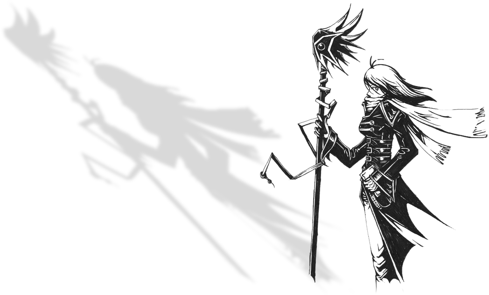{width="6.933464566929134in"
> height="5.010236220472441in"}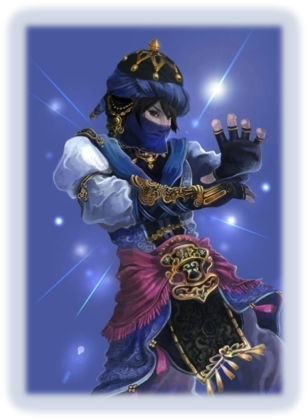{width="2.053472222222222in"
> height="2.7993055555555557in"}{width="0.17222222222222222in"
> height="0.275in"}*Magic Reels*: Requires Water level 20. You gain the
> Quick action **!Magic Reels**. Do 3 Water vs Water (the greater
> between opponents') attacks, difficulty 40. If all fail, you are
> reduced to 0 HP and your opponents recover HP equal to the amount of
> HP you lost**.** If successful in at least one, you cast a random
> Spell without spending MP, even if you don't know it. Roll 1d10 and
> compare to the table below to see what Spell will be cast. For each
> critical hit, the Spell is cast again, up to 4 Spell casts if you
> obtain 3 critical hits.

  ---------- ---------- ---------- ------------
  D10 roll   1 hit      2 hits     3 hits
  **1**      Demi       Quarter    Black Hole
  **2**      Speed Up   Haste      Flight
  **3**      Blizzara   Blizzaga   Freeze
  **4**      Fira       Firaga     Meltdown
  **5**      Thundara   Thundaga   Overcharge
  **6**      Petrify    Toad       Stone
  **7**      Slow       Slowga     Stop
  **8**      Bio        Venom      Virus
  **9**      Aera       Aeraga     Whirlwind
  **10**     Reset      Remove     X-Zone
  ---------- ---------- ---------- ------------

#### Time Mage 

A magician expert in time and cosmic magic, able to manipulate the
battlefield and use spells that support its allies and hinder its
enemies. Like all magicians, its main stats are Fire and Water. Its
spells can change the flow of battle, but ultimately the power of the
Time Mage relies not in winning the battles directly, but indirectly
giving the party the tools to do so. The list of Spells and its
description are in the Spells section, starting at page 70.

**Representatives**: Time Mage Job (FFV, FFT, FFTA)

**Abilities**

*Arcane Studies*: Core Ability acquired at level 1. You can equip light
armor and the following weapons: Claws / Gloves; Light Swords / Knives;
Staffs; Wands. Your HP bonus is 3 times your level, the multiplier
increasing by 1 at levels 15, 30 and 60. Your bonus MP is 3 times your
level, the multiplier increasing by 1 at level 30. Specialties:

> {width="0.17222222222222222in"
> height="0.275in"}*Arcane*
> {width="0.17283464566929133in"
> height="0.2755905511811024in"}*Mystery: Old*: Requires Fire level 20
> and character level 64. You gain the Old Spell.
>
> {width="0.17222222222222222in"
> height="0.275in"}*Arca*{width="0.17283464566929133in"
> height="0.2755905511811024in"}*ne Mystery: Meteor*: Requires Fire
> level 20 and character level 64. You gain the Meteor Spell.
>
> {width="0.17222222222222222in"
> height="0.275in"}*Ar*{width="0.17283464566929133in"
> height="0.2755905511811024in"}*cane Mystery: Time Stop*: Requires Fire
> level 20 and character level 64. You gain the Time Stop Spell.

*Astral Magic: Core* Ability acquired at level 1. You gain an Astral
Spell group: **Cosmic, Teleport** or **Gravity**. Specialties:

> {width="0.17222222222222222in"
> height="0.275in"}*Cosmic Mastery*: Requires Fire level 5. You gain one
> Astral Spell group.
>
> {width="0.17222222222222222in"
> height="0.275in"}*Phase*: Requires Water level 5. Gain the reaction
> **!Phase**. Use this reaction when you are hit by a physical attack.
> Make a Fire vs (the greater of Earth and Air) attack, difficulty 40.
> If you succeed, you teleport away, and the attack has no effect on
> you.
>
> {width="0.17222222222222222in"
> height="0.275in"}*Arcane Archer*: Requires Air level 3. You can equip
> medium armor and Bows.

*Subtle Magic:* Core Ability acquired at level 1. You gain one Subtle
Spell group: **Slow, Weaken, Strengthen** or **Flight.** Specialties:

> {width="0.17222222222222222in"
> height="0.275in"}*Subtle Mastery*: Requires Air level 6. You gain one
> Subtle Spell group.
>
> {width="0.17222222222222222in"
> height="0.275in"}*Levitation*: Requires Fire level 5. You gain the
> **Float** status permanently.
>
> {width="0.1840277777777778in"
> height="0.2833333333333333in"}*Procrastination*: Requires Earth level
> 8. Gain the free reaction **!Delay**. Once per round, when an ally or
> opponent cast a Spell, you can use this reaction. The Spell has no
> effect. At the start of next round, before initiative is rolled, its
> effects happen as normal. You don\'t need to spend initiative dice to
> use this reaction.

*Void Magic:* Core Ability acquired at level 15. You gain one Void Spell
Group: **Speed** or **Meteors**. Specialties:

> {width="0.17222222222222222in"
> height="0.275in"}{width="0.17222222222222222in"
> height="0.275in"}*Void Mastery*: Requires Fire and Water level 9. You
> gain one Void Spell group.
>
> {width="0.17222222222222222in"
> height="0.275in"}{width="0.17222222222222222in"
> height="0.275in"}*Acceleration*: Requires Air level 10. After casting
> a Void Spell, you may reduce one of your initiative dice's value by 1,
> to a minimum of the current phase.
>
> *Wild Magic*: Requires Fire level 12. You may cast a Spell on its wild
> form, as a Slow (3) action. The Spell's difficulty becomes a d100 roll
> instead of a fixed number.

*Magical Inspiration:* Core Ability acquired at level 30. You gain one
Inspiration Spell Group: **Regeneration, Paralysis or Divination**.
Specialties:

> {width="0.17222222222222222in"
> height="0.275in"}{width="0.17222222222222222in"
> height="0.275in"}{width="0.17222222222222222in"
> height="0.275in"}{width="0.1840277777777778in"
> height="0.2833333333333333in"}*Inspiration Mastery*: Requires Earth
> and Air level 7 and Fire level 10. You gain one Inspiration Spell
> Group.
>
> {width="0.17222222222222222in"
> height="0.275in"}*Action and Reaction*: Requires Water level 12. At
> the start of each combat, roll two d100. You can substitute any d100
> roll by the result of one of these two dice. If you do, discard the
> used dice. This ability may be used on any d100 roll done by any
> combatant.
>
> *Fluid Time*: Requires Air level 12. When rolling initiative, roll one
> extra dice. Before the first phase starts, discard one of your
> initiative dice.

#### Warrior

A focused fighter in heavy armor, specialist in melee combat. Its main
stats are Earth and Air, with Water as tertiary stat. Regardless of the
Stat you focus, Warriors may work offensively or defensively; they can
either focus on causing as much damage as possible or on protecting the
group to by weakening their opponent. Regardless of the chosen skills,
it is a simple class to play: buy the best possible equipment, and you
will have enough HP, damage and defenses to defeat any opponent.

**Representatives**: Dragoon Job (FFIII, FFV, FFXI, FFT, FFTA), Uhlan
Job (FFXIIZJ), Kain Highwind (FFIV), Cid Highwind (FFVII), Ward Zabac
(FFVIII), Freya Crescent (FFIX), Gladiator Job (FFTA), Fighter Job (FFI,
FFIII), Warrior Job (FFXI), Adelbert Steiner (FFIX), Auron (FFX), Knight
Job (FFIII, FFV, FFT), Leo Cristophe (FFVI), Soldier Job (FFTA), Cyan
Garamonde (FFVI), Cloud Strife (FFVII), Squall Leonhart (FFVIII), Tidus
(FFX)

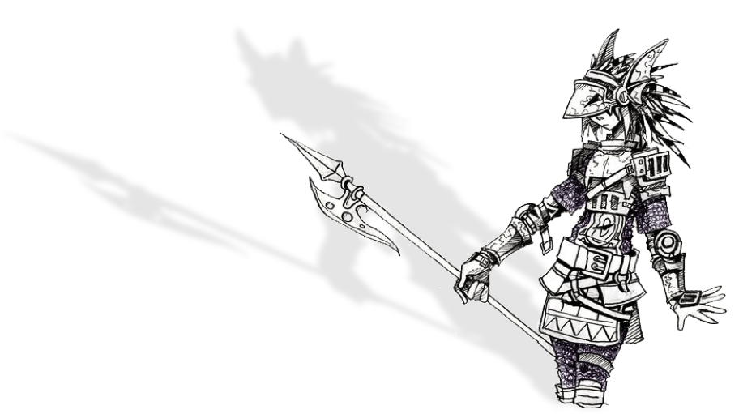{width="6.320078740157481in"
height="3.4070866141732283in"}**Abilities**

*Master of Arms:* Core Ability acquired at level 1. You can equip heavy
armor and the following weapons: Light Sword/ Knives; Claws / Gloves;
Heavy Weapon & Shield; Heavy Weapon; Katana; and Polearms. Your HP bonus
is 5 times your level, the multiplier increasing by 1 at levels 15, 30
and 60. Your MP bonus is zero, and increases by 1 times your level at
level 30.

Specialties:

> {width="0.17222222222222222in"
> height="0.275in"}*Arc:* Requires Fire level 3. You gain Quick action
> **!Arc. This** action allows you to launch a wave of Chi energy
> against your target and carry out an attack with your weapon causing
> all the equipment effects normally and to adding *Ranged* to the
> attack.
>
> {width="0.1840277777777778in"
> height="0.2833333333333333in"}*Pommel Strike:* Requires Earth level 3.
> You gain the Quick action **!Pommel Strike**. You attack your opponent
> with your weapon's hilt at a time and place where he doesn't expect.
> Do an attack roll with your weapon, causing half of your weapon's
> physical damage. If the target is preparing a **Slow** action, he
> loses it.
>
> {width="0.17222222222222222in"
> height="0.275in"}*Dirty Fighting:* Requires Air level 3. You gain
> Quick action **!Dirty Fighting**. You throw sand in the eyes of the
> opponent, attack their genitals or distract them in any way. Do an
> attack roll with your weapon, causing normal physical damage. Unlike
> other attacks, do not add the 1's digit to damage. If the target
> suffers at least 1 damage, he cannot do Reactions this phase.

*Power Attack:* Core Ability acquired at level 1. You earn one of the
three Power Attack actions below:

**!Jump** is a Quick action. Using it, you jump an incredible height and
gain the **Flight** status. In your next action, you dive on a target,
discarding the initiative die and attacking with your weapon. If you
hit, inflict twice weapon damage. After the attack, you lose the
**Flight** status.

**!Mighty Strike** is a Quick action. Attacking with all your might,
without preparation or any worry about accuracy, you deliver a
devastating attack. Perform an attack with your weapon but increasing
the difficulty by 30. Your attack does twice weapon damage, plus all the
equipment effects as usual.

**!Lunge** is also a Quick action. You unleash an attack with your
weapon, ignoring your defense to cause as much damage as possible. You
inflict twice weapon damage, but over the next 10 phases, lower by 30
points the difficulty of any attack aimed at you. You can't use this
action again until this effect ends.

Regardless of the chosen *Power Attack*, the Specialty Abilities are:

> {width="0.17222222222222222in"
> height="0.275in"}{width="0.1840277777777778in"
> height="0.2833333333333333in"}*Dragon Horn:* Requires Earth and Air
> level 12. After using a *Power Attack*, you can discard any number of
> initiative dice, regardless of their value, to immediately repeat the
> attack, once per discarded die, against the same target. With
> **!Jump,** the attacks happen before the character lose the **Flight**
> status. With **!Lunge**, add the number of phases with decreased
> difficulty. For example, if Dragon Horn is used to **!Lunge** three
> times, you suffer its effects for the next 30 phases.
>
> {width="0.17222222222222222in"
> height="0.275in"}{width="0.1840277777777778in"
> height="0.2833333333333333in"}*Quadra Slam:* Requires Earth level 10
> and Water level 8. You gain the Slow (4) action **!Quadra Slam**. When
> using it, you move with incredible speed, striking four consecutive
> attacks with your weapon with just one action. These attacks target
> random enemies and cause half weapon damage each, ignoring the
> target's Armor.
>
> {width="0.17222222222222222in"
> height="0.275in"}{width="0.1840277777777778in"
> height="0.2833333333333333in"}*Adroit:* Requires Earth and Air level
> 7. Whenever you use a Warrior ability other than a weapon attack, you
> can choose to use either Earth or Air as Offensive Stat.

*Feign Weakness:* Core Ability acquired at level 15. You gain the
Slow(1) physical action **!Life Break.** When using it, focus your chi
energy to perform an Earth vs Earth attack, difficulty 40, against a
target**.** If successful, this action causes Cut-elemental damage equal
to (your max HP - your current HP). Don't add the singles digit to
damage. This action ignores the **Strengthen (Physical)** status and may
not deal over 999 damage. The Specialties are:

> {width="0.1840277777777778in"
> height="0.2833333333333333in"}{width="0.17222222222222222in"
> height="0.275in"}*Power Break:* Requires Earth level 8 and Air level
> 10. You gain the Quick physical action **!Power Break,** which is an
> attack that weakens the muscle power of the target. Perform an Earth
> vs Air attack, difficulty 70. If successful, the target receives the
> **Weaken (Physical)** status until the end of the next round.
>
> {width="0.17222222222222222in"
> height="0.275in"}{width="0.17222222222222222in"
> height="0.275in"}{width="0.1840277777777778in"
> height="0.2833333333333333in"}*Magic Break:* Requires Earth level 8
> and Water level 10. You gain the Quick physical action **!Magic
> Break,** which is an attack that weakens the magical power of the
> target. Perform an Air vs Fire attack, difficulty 70. If successful,
> the target receives the **Weaken (Magic)** status until the end of the
> next round.
>
> {width="0.1840277777777778in"
> height="0.2833333333333333in"}*Armor Break:* Requires Earth level 10
> and Air level 8. You gain the Quick physical action **!Armor Break,**
> which is an attack that weakens the resistance of the target. Perform
> an Air vs Earth attack, difficulty 70. If successful, the target
> receives the **Weaken (Armor)** status until the end of the next
> round.
>
> {width="0.1840277777777778in"
> height="0.2833333333333333in"}{width="0.17222222222222222in"
> height="0.275in"}*Mental Break:* Requires Earth level 8 and Fire level
> 10. You gain the Quick physical action **!Mental Break,** which is an
> attack that weakens the magic resistance of the target. Perform an
> Earth vs Water attack, difficulty 70. If successful, the target
> receives the **Weaken (Mental)** status until the end of the next
> round.

*Cleave:* Core Ability acquired at level 24. You gain a cleaving action,
which can be one of the two below:

**!Slash-All** is a Slow (2) action. Moving with speed, you can unleash
an attack with your weapon against up to three targets. Each target
takes damage equal to 75% of your weapon damage, plus all the equipment
effects.

**!Blade Beam** is also a Slow (2) action. You shoot a wave of chi
energy at a target, performing an attack with your weapon that causes
normal damage. If it succeeds, you can repeat the attack against two
other targets, but these secondary attacks ignore the target's Armor and
cause 50% of the damage dealt to the first target, after reducing by the
first target's Armor. All these attacks are *Ranged*, regardless of the
equipped weapon.

Regardless of the cleaving action chosen, the Specialty Abilities are:

> {width="0.17222222222222222in"
> height="0.275in"}{width="0.17222222222222222in"
> height="0.275in"}{width="0.17222222222222222in"
> height="0.275in"}{width="0.17222222222222222in"
> height="0.275in"}*Powerful Cleave:* Requires Air and Water level 10.
> Your cleaving action deal 100% weapon damage to all targets instead of
> the reduced damage.
>
> *Wide Cleave:* Requires Air and Fire level 10. **!Slash-All** can
> target any number of enemies instead of three. The secondary attacks
> of the **!Blade Beam** action can target any number of enemies besides
> the first target.
>
> {width="0.17222222222222222in"
> height="0.275in"}{width="0.17222222222222222in"
> height="0.275in"}*Mastery of Destruction:* Requires Fire and Water
> level 10. Your **!Power Break, !Magic Break, !Armor Break** and
> **!Mental Break** actions may target up to three enemies instead of
> only one. This Specialty does not give access to any extra actions,
> only modifies the actions that you own.

*Dragon Breath:* Core Ability acquired at level 42. You gain the Slow
(3) physical action **!Dragon Breath.** This action allows you to use
the weakness of your enemy against itself. If you have success in an Air
vs Air attack, difficulty 40, the target is dealt Crush- elemental
damage equal to (target's max HP -- target's current HP). Don't add the
singles digit to damage. This action ignores the **Strengthen
(Physical)** status and may not deal over 999 damage. The Specialties
are:

> {width="0.1840277777777778in"
> height="0.2833333333333333in"}*Lethal Blow:* Requires Earth level 16.
> When using **!Dragon Breath**, reduce the target\'s Armor before
> applying 999 damage limit, instead of after.
>
> {width="0.17222222222222222in"
> height="0.275in"}{width="0.17222222222222222in"
> height="0.275in"}*Double Cut:* Requires Air and Water level 12. You
> gain the Slow (2) action **!Double Cut.** With it, do two attacks with
> your weapon in quick succession at the target, dealing weapon damage
> and effects. This ability may achieve critical hits, causing double
> damage.
>
> {width="0.17222222222222222in"
> height="0.275in"}{width="0.17222222222222222in"
> height="0.275in"}{width="0.17222222222222222in"
> height="0.275in"}{width="0.1840277777777778in"
> height="0.2833333333333333in"}*Martial Versatility:* Requires Earth
> level 11 and Air, Fire and Water level 9. You gain one of the
> following Specialties: *Power Break, Magic Break, Armor Break* or
> *Mental Break,* even if you haven't met the requirements and even if
> you already chose another Specialty to the *Feign Weakness* ability*.*

*Unwavering Courage:* Core Ability acquired at level 60. You become
immune to **Weaken (Physical), Weaken (Magic), Weaken (Armor), Weaken
(Mental)** and **Weaken (Speed).** The Specialties are:

> {width="0.17222222222222222in"
> height="0.275in"}*Finishing Touch:* Requires Air level 20. You gain
> the Slow (5) action **!Finishing Touch**. Make two weapon attacks,
> difficulty 70, against the target. If both attacks are successful,
> inflict the **Stone** status. If the target is immune to **Stone** or
> if only one attack is successful, you deal double weapon damage. If
> the enemy is not immune to **Fatal**-type statuses and one or both
> blows land a critical hit, reduce your opponent to 0 HP. Treat this
> last effect as a **Fatal** type status**.**
>
> {width="0.17222222222222222in"
> height="0.275in"}*Shock:* Requires Fire level 20. You gain the
> *Ranged* Slow (5) physical action **!Shock.** This action releases a
> burst of Chi that affects all your enemies. Perform an Earth vs Fire
> attack, difficulty 40. Each affected opponent suffers twice your
> weapon damage.
>
> 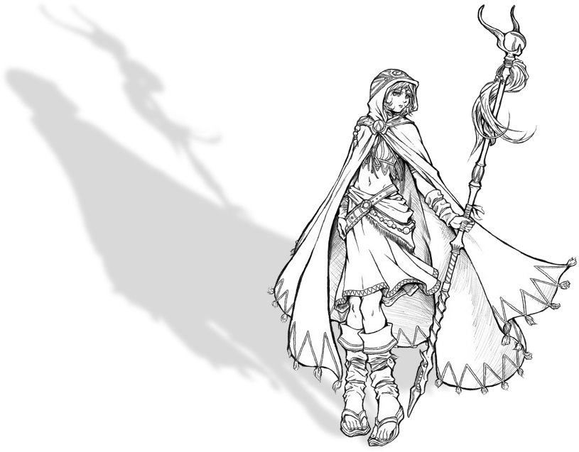{width="5.433464566929134in"
> height="4.246456692913386in"}{width="0.17222222222222222in"
> height="0.275in"}*Iaijutsu:* Requires Water level 20. You gain the
> Slow (4) physical action **!Cleave.** You go through your opponents
> with a sharp blow. Make an Air vs Earth attack, difficulty 70, against
> all your enemies. Instantly reduce to 0 HP all affected opponents.
> This effect counts as a **Fatal** type status**.**

#### White Mage

A magician skilled in healing and protection magic, master of the
beneficial magical energies. Its main stats are Water and Fire, with
Earth as tertiary stat. Your Spells are primarily defensive in nature,
giving you few tools to deal directly with your enemies. The list of
Spells and their description is in the Spells section, starting at page
67.

**Representatives:** Porom (FFIV), Rosa Farrell (FFIV), White Mage Job
(FFI, FFIII, FFV, FFX-2, FFXI, FFT, FFTA)

**Abilities**

*Arcane Devotion*: Core Ability acquired at level 1. You can equip light
armor and the following weapons: Claws / Gloves; Staffs; Wands. You gain
the **Healing** Spell group. Your HP bonus is 3 times your level, the
multiplier increasing by 1 at levels 15, 30 and 60. Your MP bonus is 3
times your level, the multiplier increasing by 1 at level 30.
Specialties:

> {width="0.17222222222222222in"
> height="0.275in"}*Arcane
> M*{width="0.17283464566929133in"
> height="0.2755905511811024in"}*ystery: Holy*: Requires Fire level 20
> and character level 64. You gain the Holy Spell.
>
> {width="0.17222222222222222in"
> height="0.275in"}*Arcane
> M*{width="0.17283464566929133in"
> height="0.2755905511811024in"}*ystery: Rebirth:* Requires Fire level
> 20 and character level 64. You gain the Rebirth Spell.
>
> {width="0.17222222222222222in"
> height="0.275in"}*Arcan*{width="0.17283464566929133in"
> height="0.2755905511811024in"}*e Mystery: Shield*: Requires Fire level
> 20 and character level 64. You gain the Shield Spell.

*Heavenly Magic:* Core Ability acquired at level 1. You gain one
Heavenly Spell group: **Light, Air** or **Purify**. Specialties:

> {width="0.17222222222222222in"
> height="0.275in"}*Heavenly Mastery*: Requires Air level 3. You gain
> one Heavenly Spell group.
>
> {width="0.17222222222222222in"
> height="0.275in"}{width="0.17222222222222222in"
> height="0.275in"}{width="0.1840277777777778in"
> height="0.2833333333333333in"}*Heavenly Blessing*: Requires Fire level
> 3 and Water level 5. You may target two characters with a single
> target Heavenly or Protective Spell if you spend twice the MP cost.
>
> {width="0.1840277777777778in"
> height="0.2833333333333333in"}*Heavenly Warrior*: Requires Earth level
> 3. You can equip medium armor and the weapon Heavy Weapons & Shield.
> Your HP bonus increases to 4x your level, if it is not already higher.

*Protective Magic:* Core Ability acquired at level 15. You gain one
Protective Spell group: **Elemental, Life, Armor, Shield** or
**Images**. Specialties:

> *Protective Mastery*: Requires Earth level 7. You gain one Protective
> Spell group.
>
> {width="0.17222222222222222in"
> height="0.275in"}{width="0.17222222222222222in"
> height="0.275in"}*Magic Shield*: Requires Air level 8 and Fire level
> 5. You can use Protective spells on yourself as a Reaction when an
> enemy targets you with an action. Spells cast as Reaction end its
> effects at the end of the round and can\'t target other characters.
>
> {width="0.1840277777777778in"
> height="0.2833333333333333in"}{width="0.17222222222222222in"
> height="0.275in"}*Mana Armor*: Requires Earth and Water level 8. As a
> free action at the beginning of each round, you can erect a magical
> shield on yourself that lasts one round. Whenever you take damage with
> this shield on, you lose MP instead of HP. If your MP is zero, you
> lose HP as normal.

*Versatile Protection:* Core Ability acquired at level 15. You gain
another Protective Spell group. Specialties:

> {width="0.17222222222222222in"
> height="0.275in"}*Deep Studies:* Requires Fire level 15. Choose a
> Heavenly, Protective or Psychic Spell group. You gain that Spell
> group.
>
> {width="0.1840277777777778in"
> height="0.2833333333333333in"}{width="0.17222222222222222in"
> height="0.275in"}*Martial Dabbler.* Requires Earth and Air level 8.
> Choose a weapon type other than Instruments and Twin Weapons. You may
> equip weapons of that type.
>
> {width="0.17222222222222222in"
> height="0.275in"}{width="0.17222222222222222in"
> height="0.275in"}*Offensive Barriers:* Requires Air level 10 and Fire
> level 9. Whenever you cast an **Elemental**, **Armor**, **Shield** or
> **Images** spell, you may do it offensively. If you do, increase the
> Spell\'s difficulty to 70. Instead of granting a status effect, an
> offensively cast spell removes the status effect from the target. An
> offensive Shell Spell, for example, removes the Shell status from the
> target. This Ability can\'t remove conditions granted by Auto --
> *Status* or *SOS -- Status*.

{width="0.17222222222222222in"
height="0.275in"}{width="0.17222222222222222in"
height="0.275in"} *Psychic Magic*: Core Ability acquired at level 30.
You gain one Psychic Spell group: **Madness, Enchantment** or
**Vulnerability**. Specialties:

> *Psychic* : Requires Fire and Water level 11. You gain one Psychic
> Spell group.
>
> {width="0.1840277777777778in"
> height="0.2833333333333333in"}{width="0.17222222222222222in"
> height="0.275in"}*Asceticism*: Requires Earth level 8 and Air level
> 10. Even if you have the **Stone, Berserk** and/or **Stop** statuses,
> you can act normally if your action removes the status.
>
> {width="0.1840277777777778in"
> height="0.2833333333333333in"}{width="0.17222222222222222in"
> height="0.275in"}*Elemental Blessing*: Requires level 8 in Earth and
> 12 in Fire. Choose an element. You gain the **Resist** status for that
> element permanently.

### 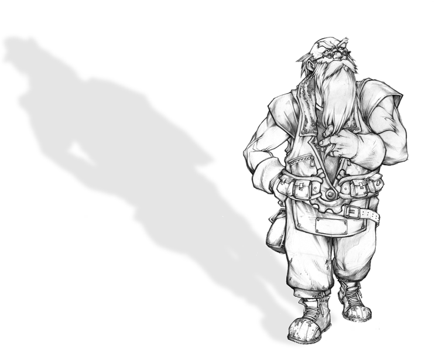{width="5.263385826771653in" height="4.208267716535433in"}Secondary Jobs

#### Alchemist

> Items and potions specialist, able to use consumables with their full
> potential. Its main Stat is Water. Be an Alchemist if you want your
> character to be more durable, capable of staying alive longer and use
> items offensively better.
>
> **Representatives:** Rikku (FFX), Chemist Job (FFV, FFT, FFTA)

**Abilities**

> *Quick Hands*: Core Ability acquired at level 1. **!Draw** is a free
> action for you. You still need to spend initiative dice normally to
> use items or replace equipment. Specialties:
>
> {width="0.17222222222222222in"
> height="0.275in"}*Combat Medic*: Requires Fire level 3. You may equip
> medium armor and the following weapons: Rifles / Crossbows.
>
> {width="0.17222222222222222in"
> height="0.275in"}*Impromptu Mage*: Requires Water level 3. Whenever
> you use an item that casts a Spell, you may use your Water Stat,
> rather than the Fire Stat, as Offensive Stat, to hit and deal damage.
>
> {width="0.1840277777777778in"
> height="0.2833333333333333in"}*Treatment:* Requires Earth level 5. You
> gain access to the Quick action **!Treatment**. With it, you suppress
> bad conditions on a target, helping him to overcome his discomfort.
> Suppress all negative status effects on the target until the end of
> the round. This does not extend the status' duration.

*Pharmacology*: Core Ability acquired at level 19. Whenever you use an
item to recover HP or MP, double its effects. You may add your Air level
to your Armor and your Water level to your Magic Armor. Specialties:

> {width="0.17222222222222222in"
> height="0.275in"}*Alchemical Fire*: Requires Air level 12. Whenever
> you use a consumable that deals damage, the item does 10% extra damage
> at the end of the round, ignoring Armor or Magic Armor.
>
> {width="0.17222222222222222in"
> height="0.275in"}*Vaccination*: Requires Water level 12. When using an
> item to cure status, the target becomes immune to the cured status
> effect for 2 rounds.
>
> {width="0.17222222222222222in"
> height="0.275in"}*Poison Distilling*: Requires Fire level 12. When
> using a consumable that inflicts negative status effects, the
> inflicted status lasts one extra round.

*Distribute*: Core Ability acquired at level 35. Whenever you heal
someone, the amount that exceeds its maximum HP is divided evenly
between you and all allies except the character that was initially
cured. Distribute does not affect healing effects that target more than
one target. Specialties:

> {width="0.17222222222222222in"
> height="0.275in"}*Mix*: Requires Fire level 16. You gain the Slow (1)
> action **!Mix**. You can mix two items and use them in a single
> action. If mixing two identical healing items, you generate the effect
> of the next higher-level item (for example, two Potions turn into a
> Hi-Potion). If you mix two different healing items, you generate the
> effect of the cheapest item in the whole Group (Mixing a Soft and
> Tonic creates the effect of Tonic in the Group). If you mix two
> identical battle items, you cast the next strongest Spell of the same
> group (two Bomb Fragment cast the Spell Fira). If you mix two
> different battle items, you cast the Spell from the cheapest item
> against a Group (using the single target damage if the spell deals
> reduced damage to groups). Special cases may be examined individually
> by the GM and cause unique effects.
>
> {width="0.17222222222222222in"
> height="0.275in"}{width="0.1840277777777778in"
> height="0.2833333333333333in"}*Alchemical Tenacity*: Requires Earth
> and Water level 14. Increase your HP bonus by 1x your level and your
> MP bonus by 1x your level.

*Unstable Potion:* Core Ability acquired at level 50. At the beginning
of each day, you can choose to sample an unstable potion, using yourself
as a guinea pig. If you do, choose one of the **Transformation** type
negative statuses. You become vulnerable to it and resistant to all
other **Transformation** type statuses. Any other effects that give you
resistance or immunity to the chosen status automatically fail, even
from equipment. This effect lasts the entire day. Specialties:

> {width="0.17222222222222222in"
> height="0.275in"}*Double Item*: Requires Air level 18. You gain the
> Quick action **!W-Item**. With it, you may use two drawn items with
> only one action.
>
> {width="0.1840277777777778in"
> height="0.2833333333333333in"}*Auto-Potion*: Requires Earth level 18.
> You gain the reaction **!Auto-Potion**. You can use it when you suffer
> an attack. You draw an item from your inventory and use it on
> yourself. The item's effects happen after the effects of the attack
> you suffered.

#### Berserker 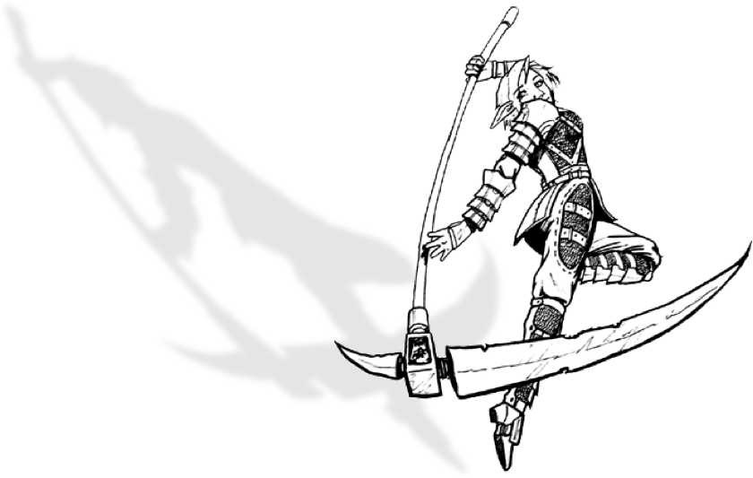{width="5.566535433070866in" height="3.6964566929133857in"}

> Through offensive maneuvers, a Berserker believes that the best
> defense is a good offense and try to cause as much damage as quickly
> as possible. Water is an important Stat to this class. Be a Berserker
> if you want to increase your ability to cause physical damage as soon
> as possible; after all, dead enemies don't fight.
>
> **Representatives:** Monk Job (FFV, FFT), Cyan Garamonde (FFVI),
> Berserker Job (FFV), Viking Job (FFIII)

**Abilities**

*Counter Attack*: Core Ability acquired at level 1. After suffering the
damage of a physical attack, you can discard any initiative die to
perform the **!Attack** action against the character who attacked you.
**!Attack** actions made with *Counter Attack* have 0 difficulty.
Specialties:

> {width="0.17222222222222222in"
> height="0.275in"}{width="0.17222222222222222in"
> height="0.275in"}*Hamedo*: Requires Air level 6 and Fire level 5. You
> gain access to the reaction **!Hamedo**. Use after being targeted by
> an attack. Perform the **!Attack** action against the character
> targeting you. If the target drops to 0 HP or for any reason cannot
> attack you after suffering your attack, his action is spent without
> causing any effect.
>
> {width="0.17222222222222222in"
> height="0.275in"}{width="0.1840277777777778in"
> height="0.2833333333333333in"}{width="0.17222222222222222in"
> height="0.275in"}{width="0.1840277777777778in"
> height="0.2833333333333333in"}*Riposte:* Requires Earth level 6 and
> Water level 4. After receiving a physical attack, you may use your
> *Counter Attack* even if the attack fails for any reason.
>
> *Kharmic Strike*: Requires Earth and Air level 5. During your *Counter
> Attack*, you ignore the target's **Flight** status. Increase the
> difficulty of reactions to your *Counter Attack* by 30.

*Provoke*: Core Ability acquired at level 19. You gain the Quick magical
action **!Provoke**. Insult your opponent, causing him to attack you or
lose focus. Make a Water vs Fire attack, difficulty 20. If successful,
until the end of the next round, if the targeted enemy doesn't include
you as a target in any of his attacks, you may perform the **!Attack**
action against him as a free action after the enemy's action. You may
add your Air level to your Armor and your Water level to your Magic
Armor. Specialties:

> {width="0.1840277777777778in"
> height="0.2833333333333333in"}*Ignore the Pain*: Requires Earth level
> 16. Increase your Armor by 50% against attacks made by enemies under
> the effect of the **!Provoke** action**.**
>
> {width="0.17222222222222222in"
> height="0.275in"}*Howl*: Requires Fire level 10. You gain the *Ranged*
> Quick magical action **!Howl**. Roaring to intimidate your opponents,
> you make them more vulnerable to magical effects. Perform a Water vs
> Water attack, difficulty 40. This action causes the **Weaken
> (Mental)** status on a target until the end of the next round.
>
> {width="0.17222222222222222in"
> height="0.275in"}{width="0.1840277777777778in"
> height="0.2833333333333333in"}*Sovereign Mind*: Requires Earth level 9
> and Fire level 7. When performing a *Counter Attack* or **!Hamedo**,
> instead of the **!Attack** action, you may use any of your actions
> that that can target the opponent, provided the action is not Slow.

*Fury*: Core Ability acquired at level 35. While your current HP is 25%
of your max HP or less, you gain the **Strengthen (Physical)**
status**.** You lose this status if your current HP is more than 25% of
your max HP for any reason. In addition, you gain the Dispel Spell at
level 40. Specialties:

> {width="0.17222222222222222in"
> height="0.275in"}*Bloodlust*: Requires Water level 12. While your
> current HP is 25% of your max HP or less, your allies gain the
> **Strengthen (Physical)** status**.** Your allies lose this status if
> your current HP is more than 25% of your max HP for any reason.
>
> {width="0.17222222222222222in"
> height="0.275in"}{width="0.17222222222222222in"
> height="0.275in"}*Critical Comeback*: Requires Air level 14 and Water
> level 12. Whenever you suffer a critical hit, gain an extra initiative
> dice with the value 10.

*Unwavering Fury*: Core Ability acquired at level 50. Once per round,
when you suffer a physical attack, you can increase or decrease by one
the d100 result. Also, once per round, you may use your Counter Attack
as a free action. Specialties:

> {width="0.1840277777777778in"
> height="0.2833333333333333in"}*Furious Madness*: Requires Earth level
> 18. You may, as an action, inflict the **Berserk** status on yourself
> until the end of the round. Also, whenever you are under the
> **Berserk** status**,** you also gain the **Strengthen (Physical)**
> status for the same duration. Finally, while you are under the
> **Berserk** status, you may *Counter Attack* and use the **!Attack,
> !Hamedo**, **!Howl** and **!Provoke** actions, if you have them,
> instead of only the **!Attack** action.
>
> 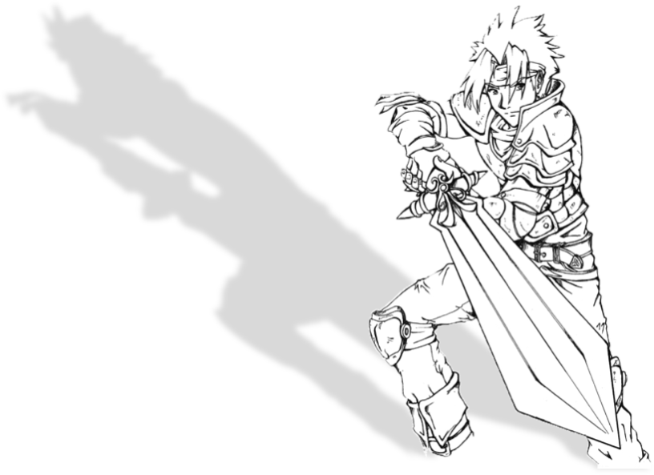{width="4.784212598425197in"
> height="3.278807961504812in"}{width="0.17222222222222222in"
> height="0.275in"}*Rage Magic*: Requires Fire level 18. You can use
> your *Counter Attack* when hit by Spells and magical attacks. Also,
> whenever you use a Spell that deals damage, you may spend 25% extra MP
> after rolling the spell attack. If you do, the Spell may have critical
> hits, dealing twice damage.

#### Defender

> With cover and protective maneuvers, a Defender seeks to protect its
> allies against attacks, often placing himself in danger. Its main Stat
> is Earth. Be a Defender if you want to protect your allies, shielding
> them from damage or negative status effects.
>
> **Representatives**: Cecil Harvey (FFIV), Paladin Job (FFXI, FFTA)

**Abilities**

> *Cover:* Core Ability acquired at level 1. You gain the reaction
> **!Cover**. Use it when an ally is hit by a physical attack. You
> suffer the effects of the attack, rather than the ally. As a free
> action, you can use another reaction against the attack, if able.
> Specialties:
>
> {width="0.1840277777777778in"
> height="0.2833333333333333in"}*Sentinel*: Requires Earth level 5. As a
> free action, when an ally with current HP equal to or less than 25% or
> his max HP undergoes a physical attack, you may suffer the attack
> instead of the original target.
>
> {width="0.17222222222222222in"
> height="0.275in"}*Arcane Defense*: Requires Water level 4. You may use
> **!Cover** to react when an ally suffers a magical attack or Spell.
>
> {width="0.1840277777777778in"
> height="0.2833333333333333in"}*Armor Training*: Requires Earth level
> 3. Choose light, medium or heavy armor. You may equip the chosen
> armor.

*Share the Pain*: Core Ability acquired at level 19. You gain the
reaction **!Shared Pain**. Use when hit by a Melee physical attack. Do
an Earth vs Earth attack, difficulty 70. If successful, after reducing
the damage by your Armor, split the damage evenly between you and the
opponent who attacked you, bypassing the opponent\'s Armor. You may add
your Air level to your Armor and your Fire level to your Magic Armor.
Specialties:

> {width="0.17222222222222222in"
> height="0.275in"}{width="0.17222222222222222in"
> height="0.275in"}*Healing Wind:* Requires Fire and Water level 5.
> Increase your MP bonus multiplier by one. In addition, you gain the
> **Healing** Spell group. Your **Healing** group Spells cost double MP
> and target you and all your allies rather than a single target (using
> single-target healing value for you and each ally).
>
> {width="0.17222222222222222in"
> height="0.275in"}{width="0.17222222222222222in"
> height="0.275in"}{width="0.1840277777777778in"
> height="0.2833333333333333in"}*Defensive Mastery:* Requires Earth, Air
> and Fire level 8. Reduce by 20 the difficulty of any reaction you
> perform.
>
> {width="0.1840277777777778in"
> height="0.2833333333333333in"}*Noble Sacrifice*: Requires Earth level
> 9. As a free action, when an ally suffers an attack that inflicts a
> **Fatal** type status, you may suffer its effects instead. When using
> *Noble Sacrifice,* ignore your immunities.

{width="0.1840277777777778in"
height="0.2833333333333333in"}{width="0.17222222222222222in"
height="0.275in"} *Astra:* Core Ability acquired Base at level 35. You
gain the Astra Spell. Specialties:

> *Astraga*: Requires Earth and Fire level 13. You gain the Astraga
> Spell.
>
> {width="0.17222222222222222in"
> height="0.275in"}{width="0.17222222222222222in"
> height="0.275in"}*Perseus' Mirror*: Requires Air and Water level 13.
> Whenever a status effect caused by an opponent is blocked by the Astra
> Spell, you may spend one initiative die to immediately repeat the
> blocked attack using that opponent as target.

*Immortal Body:* Core Ability acquired at level 50. At the start of each
combat, you gain the **Reraise** status. Specialties:

> {width="0.17222222222222222in"
> height="0.275in"}*Immortal Soul*: Requires Water level 18. You gain
> the Great Gospel Spell.
>
> 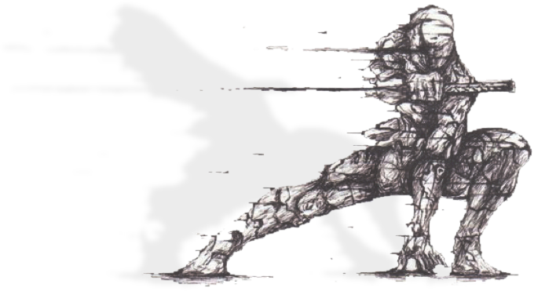{width="5.275in"
> height="2.652083333333333in"}{width="0.17222222222222222in"
> height="0.275in"}*Immortal Technique*: Requires Air level 18. Choose a
> reaction from of any Job. You gain that reaction.

#### Dervish

> Offensive Job focused on fighting with two weapons to strike fast and
> often. Its main Stat is Air. Be a Dervish if you want to increase the
> amount and speed of your actions and be a great physical damage
> dealer.
>
> **Representatives:** Edward Geraldine "Edge" Eblan (FFIV), Clyde
> "Shadow" Arrowny (FFVI), Ninja Job (FFI, FFIII, FFV, FFXI, FFT, FFTA

**Abilities**

*Ambidexterity*: Core Ability acquired at level 1. You may equip Twin
Weapons. Specialties:

> {width="0.17222222222222222in"
> height="0.275in"}*Quick Draw:* Requires level Air 3. Once per round as
> a free action, you can draw and switch weapons.
>
> *Killer's Garments:*
> R{width="0.17283464566929133in"
> height="0.2755905511811024in"}equires level 1. You may equip medium
> armor, Bows and Throwing Weapons.
>
> {width="0.17222222222222222in"
> height="0.275in"}{width="0.17222222222222222in"
> height="0.275in"}*Deadly Dance:* Requires Air level 5 and Fire level
> 4. Whenever you hit the **!Attack** action, you may lower the value of
> one of your initiative dice by 1, to a minimum of the current phase.

*Critical Speed*: Core Ability acquired at level 19. You may add your
Air level to your Armor and your Fire level to your Magic Armor. While
your current HP is 25% of your max HP or less, you gain the **Haste**
status**.** You lose this status if your current HP is more than 25% of
your max HP for any reason. Specialties:

> {width="0.17222222222222222in"
> height="0.275in"}{width="0.1840277777777778in"
> height="0.2833333333333333in"}*Blade Barrier*: Requires Earth and
> Water level 6. The best defense is a good offense. Add your Earth
> level to your Armor and your Water level to your Magic Armor.
>
> {width="0.17222222222222222in"
> height="0.275in"}{width="0.17222222222222222in"
> height="0.275in"}*Danger Zone*: Requires Air and Fire level 6. At the
> beginning of each round, you may spend HP equal to 25% of your max HP
> to receive the **Haste** status during this round.
>
> {width="0.17222222222222222in"
> height="0.275in"}{width="0.17222222222222222in"
> height="0.275in"}*Two-Weapon Defense:* Requires Fire level 9 and Water
> level 5. You gain the reaction **!Double Parry**. Use when hit by a
> Melee physical attack. Do an (the greater of Air or Earth) vs Earth
> attack, difficulty 40. If successful, you ignore the attack's effects.

*Deadly Accuracy*: Core Ability acquired at level 35. After rolling an
attack, you may reduce or increase by 1 the d100 result. Specialties:

> {width="0.17222222222222222in"
> height="0.275in"}*Deep Cut:* Requires Air level 16. When you attain a
> critical hit with an action that deals damage, ignore the target's
> Armor and Magical Armor.
>
> {width="0.1840277777777778in"
> height="0.2833333333333333in"}{width="0.17222222222222222in"
> height="0.275in"}{width="0.17222222222222222in"
> height="0.275in"}{width="0.17222222222222222in"
> height="0.275in"}*Zen Focus*: Requires Earth, Air, Fire and Water
> level 8. At the beginning of each round, you may choose one of your
> initiative die's value instead of rolling it.

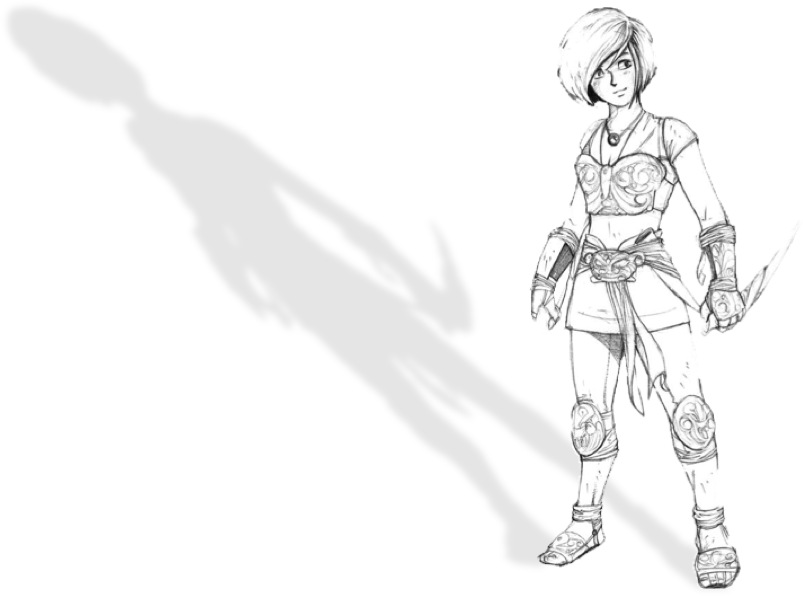{width="5.128937007874016in"
height="3.797136920384952in"} *Fierce Assault:* Core Ability acquired at
level 50. If, on the same phase, you can act more than once, you can
perform these actions together. If you do and deal damage, you may add
all damage dealt before reducing it by the target's Armor or Magic
Armor. Regardless of how many attacks you do, reduce the Armor or Magic
Armor only once. Specialties:

> {width="0.1840277777777778in"
> height="0.2833333333333333in"}*Rain of Blows:* Requires level 18 in
> Earth. Once per round, after being successful with the **!Attack**
> action, you may repeat the action as a free action.
>
> {width="0.17222222222222222in"
> height="0.275in"}*Precise Hits*: Requires Fire level 18. Once per
> round, you may re-roll an attack when using a physical or magical
> action.

#### Fencer

> Defensive job that believes that the best way of not dying is being
> out of the way of attacks. Its main Stat is Air. Be a Duelist if you
> want to dodge the attacks of your opponents, especially their
> missiles, thus increasing your and your allies' survival.
>
> **Representatives**: Fencer Job (FFTA)

**Abilities**

*Block Projectiles:* Core Ability acquired at level 1. You may equip
medium armor and gain the reaction **!Arrow Guard**. When you are hit by
a *Ranged* attack, make an Air vs Air attack, difficulty 30. If
successful, you don't attack's effects. This does not affect Spells.
Specialties:

> {width="0.17222222222222222in"
> height="0.275in"}*Lightning Strike:* Requires Fire level 4. Opponents
> cannot use interrupt actions to react to your attacks.
>
> {width="0.17222222222222222in"
> height="0.275in"}*Slim Target:* Requires Air level 4. Once per round,
> you can use a reaction by spending your lower initiative dice, rather
> than a current phase dice. In addition, choose one: Bows or Light
> Sword / Knives. You may equip the chosen.
>
> {width="0.17222222222222222in"
> height="0.275in"}{width="0.1840277777777778in"
> height="0.2833333333333333in"}*Swarm Attack:* Requires Earth and Water
> level 3. You gain the Quick physical action **!Swarmstrike**. Make an
> Air vs Earth attack, difficulty 40. If successful, inflict the
> **Poison** status in the target in this and the next two rounds.

*Preemptive Attack:* Core Ability acquired at level 19. After rolling
initiative, you may change one of your dice's value to 1. You may add
your Air level to your Armor and your Water level to your Magic Armor.
Specialties:

> {width="0.17222222222222222in"
> height="0.275in"}*Return Fire:* Requires Fire level 12. Whenever you
> have success with the **!Arrow Guard** reaction, you may discard one
> initiative dice to immediately perform the **!Attack** action against
> the enemy that attacked you.
>
> {width="0.17222222222222222in"
> height="0.275in"}*Coverage:* Requires Water level 12. Your **!Arrow
> Guard** reaction may be used when an ally suffer a *Ranged*
> attack**.** If you succeed, your ally doesn't suffer the attack's
> effect.
>
> {width="0.1840277777777778in"
> height="0.2833333333333333in"}*False Weakness:* Requires Earth level
> 12. When your **!Arrow Guard** reaction succeeds, you may force the
> opponent to discard one initiative die and immediately repeat the
> attack against you.

*Slippery*: Core Ability acquired at level 35. Whenever you are targeted
by a Spell, you may increase by 20 the difficulty of that Spell.
Specialties:

> {width="0.17222222222222222in"
> height="0.275in"}*Divert Attention*: Requires Air level 16. You
> receive the **Vanish** status during the first 3 phases of each round.
>
> {width="0.1840277777777778in"
> height="0.2833333333333333in"}{width="0.17222222222222222in"
> height="0.275in"}*Just a Scratch*: Requires Earth level 12 and Fire
> level 14. The first time in each round you suffer a critical hit,
> ignore the effects of critical hit (if any). The attack does its
> normal effects. You may still count as if it had been a critical hit
> for the purposes of other Abilities.

*Total Defense*: Core Ability acquired at level 50. You may postpone any
number of actions, instead of only one. Specialties:

> {width="0.17222222222222222in"
> height="0.275in"}*Water Dancer*: Requires Water level 18. Every time
> in a round you suffer an attack after the first, reduce by 10,
> cumulatively, the difficulty for your reactions. It is irrelevant
> whether the attack hit or missed, and if you used a reaction or not.
> The minimum difficulty for your reactions is zero. In the start of the
> next round, the difficulty of your reactions reverts to normal.
>
> {width="6.393700787401575in"
> height="3.0826771653543306in"}{width="0.17222222222222222in"
> height="0.275in"}*Lethal Precision*: Requires Air level 18. If you
> discard an initiative dice after rolling an attack that may not have
> critical hits, you deal double damage in case of a critical hit. This
> ability may not be used with Spells.

#### 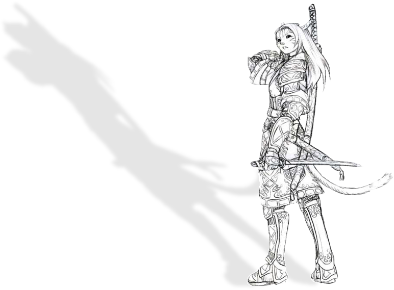{width="5.3570866141732285in" height="4.177165354330708in"}Phalanx

> Defensive Job specialized on protecting themselves and reducing
> physical damage. His main Stat is Earth. Be a Phalanx if you want to
> protect yourself from physical harm, increasing your capacity to face
> opponents focused on this type of damage.
>
> Representatives: Auron (FFX), Samurai Job (FFV, FFX-2, FFXI, FFT)

**Abilities**

> *Impenetrable:* Core Ability acquired Base at level 1. You may equip
> heavy armor and gain the reaction **!Third Eye**. When you are hit by
> a Melee attack, perform an Earth vs Air attack, difficulty 40. If you
> are successful, the attack fails. This does not affect Spells.
> Specialties:
>
> {width="0.1840277777777778in"
> height="0.2833333333333333in"}*Martial Training:* Requires Earth level
> 3. Choose two types of weapons: Heavy Weapon, Polearm, Heavy Weapon &
> Shield, Katana or Throwing Weapons. You may equip the selected
> weapons.
>
> {width="0.17222222222222222in"
> height="0.275in"}*Excessive Force:* Requires Air level 5. Whenever you
> deal a critical hit against an opponent preparing a Slow action,
> cancel the Slow action.
>
> {width="0.17222222222222222in"
> height="0.275in"}*Willpower:* Requires Fire level 5. If your HP bonus
> multiplier is lower than 5, increase it by one. Use the greater
> between Earth and Fire Values to calculate your HP.

*Tireless*: Core Ability acquired at level 19. You may add your Air
level to your Armor and your Fire level to your Magic Armor. While your
current HP is 25% of your max HP or less, you gain the **Protect**
status**.** You lose this status if your current HP is more than 25% of
your max HP for any reason. Specialties:

> {width="0.1840277777777778in"
> height="0.2833333333333333in"}*Inspiring Courage:* Requires Earth
> level 12. While your current HP is 25% of your max HP or less, your
> allies gain the **Protect** status**.** Your allies lose this status
> if your current HP is more than 25% of your max HP for any reason.
>
> {width="0.17222222222222222in"
> height="0.275in"}*Preventive Defense:* Requires Water level 15. Your
> *Tireless* ability activate when your current HP is 50% of maximum,
> instead of 25%.
>
> {width="0.17222222222222222in"
> height="0.275in"}*Bonebreaker:* Requires Fire level 10. Once per
> phase, if your current HP is 25% of your max HP or less when you use
> the **!Attack** action against an opponent that dealt you physical
> damage this phase, you deal 150% weapon damage if it is not a critical
> hit.

*Unshakable*: Core Ability acquired at level 35. You gain the reaction
**!Shield Wall**. When you and at least one ally is hit by an attack
that deals physical damage, perform an Earth vs Fire attack, difficulty
70. Your allies don't suffer the attack's effects regardless of the die
result. If you fail, for each of the attack's targets, you suffer the
attack's effects once. If you are successful, for each of the attack's
targets, you suffer the 50% of attack's damage. If you have a critical
hit, you suffer the attack's effects only once.

> {width="0.17222222222222222in"
> height="0.275in"}{width="0.17222222222222222in"
> height="0.275in"}*Runic Shield*: Requires Fire and Water level 12. You
> may use your **!Shield Wall** reaction against magical damage attacks.
>
> {width="0.17222222222222222in"
> height="0.275in"}{width="0.1840277777777778in"
> height="0.2833333333333333in"}*Reinforced Shield:* Requires Earth and
> Air level 13. Whenever you are successful with the **!Shield Wall**
> reaction, you gain the **Strengthen (Armor)** status until the end of
> the round.

*Indestructible*: Core Ability acquired at level 50. Whenever any effect
gives you **Barrier-**type positive status, increase by a round its
duration. Specialties:

> {width="0.1840277777777778in"
> height="0.2833333333333333in"}*Scream*: Requires Earth level 18. You
> gain the reaction **!Scream**. Use it when you suffer an attack that
> inflicts a negative status effect. Perform a Water vs (the greater
> between Air or Fire) attack, difficulty 70. If successful, the attack
> doesn't inflict any negative status and, if the attack did damage, you
> recover HP equal to twice the damage dealt.
>
> {width="0.17222222222222222in"
> height="0.275in"}*Uncontrollable:* Requires Water level 18. You gain
> the Slow (3) physical action **!Meatbone Slash**. Putting all your
> weight behind the strike, you perform a
> w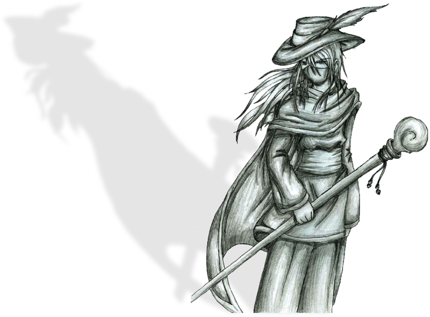{width="5.0279527559055115in"
> height="3.6535433070866143in"}eapon attack. If successful, the target
> takes damage equal to your maximum HP, or 999, whichever is less.

#### Rune Knight

> This Job is focused on neutralizing mages, able to prevent the casting
> of spells and avoiding its effects. Its main Stat is Fire. Be a Rune
> Knight if you want to protect yourself from harmful magic effects and
> have the tools to overcome enemies whose power comes from magical
> abilities.
>
> **Representatives**: Celes Chere (FFVI) Dycedarg Beoulve (FFT),
> Zalbaag Beoulve (FFT)

**Abilities**

> *Defensive Runes*: Ability acquired Base at level 1. You may equip
> light armor and gain the reaction **!Runic**. Use it when hit by a
> Spell or a magical attack. Perform a Fire vs Fire attack, difficulty
> 40. If successful, the attack or Spell has no effect.
>
> {width="0.17222222222222222in"
> height="0.275in"}*Magic Drain*: Requires Water level 4. If you succeed
> with **!Runic**, recover the same amount of MP spent by the opponent.
>
> {width="0.17222222222222222in"
> height="0.275in"}*Runic Area*: Requires Fire level 5. Your **!Runic**
> reaction may also be used when a Spell or magical attack hits an ally.
>
> {width="0.1840277777777778in"
> height="0.2833333333333333in"}{width="0.17222222222222222in"
> height="0.275in"}*Offensive Runes*: Requires Air level 4. Your
> **!Runic** reaction may also be used when a Spell or magical attack
> hits an opponent.
>
> *Exotic Runes*: Requires Earth level 3. When using your **!Runic**
> reaction, you may swap the Offensive Stat to Air or Water. If you do,
> reduce the reaction\'s difficulty by 10.

*Spell Protection*: Core Ability acquired at level 19. You may add your
Air level to your Armor and your Fire level to your Magic Armor. While
your current HP is 25% of your max HP or less, you gain the **Shell**
status**.** You lose this status if your current HP is more than 25% of
your max HP for any reason. Specialties:

> {width="0.18464566929133858in"
> height="0.28346456692913385in"}*Protection Circle:* Requires Earth
> level 12. While your current HP is 25% of your max HP or less, your
> allies gain the **Shell** status**.** Your allies lose this status if
> your current HP is more than 25% of your max HP for any reason.
>
> {width="0.17283464566929133in"
> height="0.2755905511811024in"}*Enhanced Protection*: Requires Water
> level 12. Your *Spell Protection* ability activate when your current
> HP is 50% of maximum, instead of 25%.
>
> {width="0.17283464566929133in"
> height="0.2755905511811024in"}*Desperate Blow*: Requires Fire level
> 12. You gain the *Ranged* Quick physical action **!Magic Ruin.** You
> may only use it if your current HP is 25% of your max HP or less and
> if you have the **Shell** status. To use it, you lose the **Shell**
> status and launch a wave of energy. If you succeed in a weapon attack,
> the target loses MP equal to (your Max HP - your current HP), ignoring
> the target\'s Armor. Regardless of success, your *Spell Protection*
> will not activate during the rest of the combat.

*Dispel Magic*: Core Ability acquired at level 35. You gain the Slow (1)
magical action **!Dispel Strike**. Perform a weapon attack. If
successful, in addition to damage, you use your runes to absorb the
target's magic, ending all the target's positive status effects. If he
has Auto-status or SOS-status, these effects are suppressed until the
end of the round.

> {width="0.17222222222222222in"
> height="0.275in"}*Selective Dispel*: Requires Air level 16. Your
> **!Dispel Strike** ends all the target's statuses, positive and
> negative, but you can choose which status effects you want to end, and
> which will continue.
>
> {width="0.17222222222222222in"
> height="0.275in"}{width="0.17222222222222222in"
> height="0.275in"}*Anti-Magic Zone*: Requires Fire level 14 and Water
> level 12. When you use your **!Dispel Strike** action, you may target
> all other combatants, allies or enemies, but if you do, the action
> does not deal damage.

*Return Magic*: Core Ability acquired at level 50. When you successfully
use **!Runic** to block a Spell, you may discard an initiative dice to
cast the Spell you just blocked. You spend MP as usual, but you don't
need to have the Spell. Specialties:

> {width="0.17222222222222222in"
> height="0.275in"}*Triple Magic*: Requires Water level 18. You gain the
> reaction **!Triple Magic**. Use when suffering the effects of a Spell
> cast by an enemy. If, after suffering its effects, you may still cast
> Spells, spend MP equal to three times the Spell's cost. If you do, you
> cast the Spell three times, each time against a random enemy target.
> Each target may be hit more than once. Even if the Spell originally
> targeted a group, when used with this reaction, it will affect a
> single target in each cast.
>
> {width="0.1840277777777778in"
> height="0.2833333333333333in"}*Spell Ruin*: Requires Earth level 18.
> You gain the Quick physical action **!Spell Ruin**. Spend 10% of your
> max MP and perform a weapon attack. If successful, deal 150% weapon
> damage, and then the target loses a MP amount equal to the HP lost.

#### Squire

While many believe that a squire is just a knight in training, some
Squires never leave this status. Forgoing formal training, they never
progress beyond the basic training of another Job, relying on their
innate talents and intuition to progress. Be a Squire if you want to
control the battlefield using offensive actions instead of reacting.

> **Representatives**: Squire Job (FFT)

**Abilities**

*Basic Skill:* Core Ability acquired at level 1. Choose another
Secondary Job. You earn that job's first level Core Ability. Regardless
of the chosen Job, the Specialties for *Basic Skill* are:

> {width="0.1840277777777778in"
> height="0.2833333333333333in"}{width="0.17222222222222222in"
> height="0.275in"}*Throw Stone:* Requires Earth and Air level 2. You
> gain the *Ranged* Quick physical action **!Throw Stone.** You gather a
> rock and throw at your opponent, making an Air vs Air, difficulty 40
> attack. If you hit, you deal Crush-elemental damage equal to the
> level-appropriate Throwing Weapon's damage.
>
> {width="0.17283464566929133in"
> height="0.2755905511811024in"}*Equip Axe:* Requires character level
> 1*.* You may equip Heavy Weapons and Heavy Weapons & Shield.
>
> {width="0.1840277777777778in"
> height="0.2833333333333333in"}{width="0.17222222222222222in"
> height="0.275in"}*Artful Dodger:* Requires Earth and Air level 5.
> Reduce your **!Dodge** action's difficulty to 40.
>
> {width="0.17222222222222222in"
> height="0.275in"}*Draw Out:* Requires Water level 4. After using a
> *Spell Weave (Spell),* you may choose to not lose the weapon. If you
> do, you cannot use its *Spell Weave (Spell)* again this combat.

*Accumulate:* Core Ability acquired at level 19. You gain the Slow(4)
Physical action **!Focus**. Using it, you accumulate strength for your
next blows. You gain the **Strengthen (Physical)** status until the end
of the next round. You may add your Air level to your Armor and your
Fire level to your Magic Armor. Specialties:

> {width="0.17222222222222222in"
> height="0.275in"}*Mana Well:* Requires Water level 10. Your **!Focus**
> action grants the **Strengthen (Magic)** status effect in addition to
> **Strengthen(Physical)**.
>
> {width="0.17222222222222222in"
> height="0.275in"}*Counter Tackle:* Requires Air level 8. Whenever an
> enemy tries to use the **!Escape** action against you, increase his
> difficulty by 20.
>
> *Spell Evasion:* Requires Fire level 10.
> {width="0.17222222222222222in"
> height="0.275in"}You may use your **!Dodge** reaction to avoid Spells
> (but not magical attacks). If you do, increase the **!Dodge**
> difficulty by 20.
>
> {width="0.17222222222222222in"
> height="0.275in"}*Weaponcaster*: Requires Fire level 6. Whenever you
> cast a Spell due to a weapon ability, you may use the weapon's
> Offensive Stat, rather than the Fire Stat, to hit (but not deal
> damage).

*Overwhelm Defenses:* Core Ability acquired at level 35. Once per phase,
when you miss a non-spell attack roll or reaction, you may increase the
difficulty by 20, to a maximum of 99, to re-roll it.

> {width="0.17222222222222222in"
> height="0.275in"}*Awareness:* Requires Fire level 16. You gain the
> *Ranged* magical action **!Awareness**. Do a Fire vs Air, dif 0,
> attack against all enemies. Your acute senses detect traces of enemy
> presence. All enemies hit lose the **Vanish** status effect.
>
> {width="0.1840277777777778in"
> height="0.2833333333333333in"}{width="0.1840277777777778in"
> height="0.2833333333333333in"}{width="0.17222222222222222in"
> height="0.275in"}*Faith and Bravery:* Requires Earth and Water level
> 13. Whenever you are under the effects a **Weaken** status effect,
> gain a **Strengthen** status effect. **Weaken (Armor)** gives you
> **Strengthen (Physical)**. **Weaken (Mental)** gives you **Strengthen
> (Magical)**. **Weaken (Physical)** gives you **Strengthen (Armor)**.
> **Weaken (Magical)** gives you **Strengthen (Mental)**.
>
> {width="0.17222222222222222in"
> height="0.275in"}*Mighty Dodge:* Requires Air and Earth level 13. You
> may use the **!Attack** action as a free action after you succeed with
> the **!Dodge** action.

*Tailwind:* Core Ability acquired at level 50. You gain the *Ranged*
Quick action **!Yell**. Use it on an ally. The target gains one extra
initiative dice with value equal to the current phase.

> {width="0.17222222222222222in"
> height="0.275in"}{width="0.17222222222222222in"
> height="0.275in"}*Ordered Retreat:* Requires Air and Water level 16.
> When you succeed with the **!Escape** action, treat as if all allies
> succeeded with a **!Escape** action this phase.
>
> 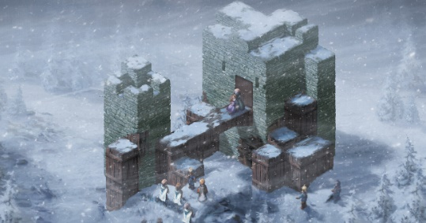{width="2.4541666666666666in"
> height="1.288888888888889in"}{width="0.17222222222222222in"
> height="0.275in"}{width="0.17222222222222222in"
> height="0.275in"}{width="0.17222222222222222in"
> height="0.275in"}{width="0.1840277777777778in"
> height="0.2833333333333333in"}*Graduation:* Requires Earth, Air, Fire
> and Water level 12. Choose an action of any other Secondary Job. You
> gain that action. This ability cannot grant reactions.

This version of the Freelancer supersedes the version presented in the
Final Fantasy Tactics Worldbook and contains all errata up to September
2018. All original specialties designed for Map Combat rules are still
valid if that optional rule is used (also from FFT Worldbook).

#### 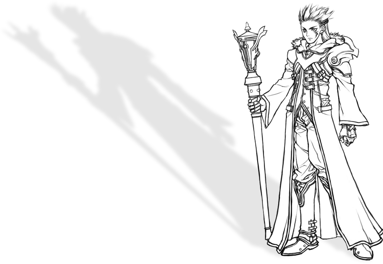{width="5.2779527559055115in" height="3.6070866141732285in"}Wizard

> This arcane Job gives Spells to characters that usually do not possess
> magical abilities or strengthens the magicians granting them more
> options. Fire is the most important Stat. Be a Wizard if you want more
> versatility to choose various Spell effects.
>
> **Representatives**: Garnet \'Dagger\' Alexandros XVII (FFIX), Eiko
> Carol (FFIX), FuSoYa (FFIV), Sage Job (FFIII), Tellah (FFIV), Red Mage
> Job (FFI, FFIII, FFV, FFXI, FFTA)

**Abilities**

> *Arcane Adept*: Core Ability acquired at level 1. Your MP bonus
> becomes equal to your level (if not already greater). Additionally,
> you gain one of the following a Spell groups: **Lightning, Ice,
> Fire**, **Death, Transform, Poison, Light, Air, Purify, Healing,
> Cosmic, Teleport, Gravity**, **Slow, Weaken, Strengthen** or
> **Flight.** Specialties:
>
> {width="0.1840277777777778in"
> height="0.2833333333333333in"}*Armored Mage*: Requires Earth level 3.
> You may equip heavy armor and Polearms.
>
> {width="0.17222222222222222in"
> height="0.275in"}*Residual Energies*: Requires Water level 6. Whenever
> you use a spell, residual energies permeate the environment for a
> round. You may consume them when casting a Spell to reduce its cost by
> 25%. Spells that consumed residual energies do not release residual
> energies.
>
> {width="0.17222222222222222in"
> height="0.275in"}{width="0.17222222222222222in"
> height="0.275in"}*Vital Sacrifice*: Requires Air level 6 and Water
> level 4. Once per round, when casting a Spell, you can spend HP equal
> to its MP cost to cast it. If you do that, and the Spell\'s effect
> heals the target, it deals Puncture-elemental damage instead of
> healing. This ability can\'t be used with the *Renew* Spell. If the
> Spell's cost is greater than your current MP, you can use this ability
> again in the same round.

*Counter Magic:* Core Ability acquired at level 19. You may add your Air
level to your Armor and your Fire level to your Magic Armor. After
suffering the effects of a Spell or magical attack done by an enemy, you
can discard any initiative die to perform the **!Attack** action against
the enemy who hit you.

> {width="0.1840277777777778in"
> height="0.2833333333333333in"}*Arcane Warrior*: Requires Earth level
> 12. Once per round, after casting a Spell, you may perform the
> **!Attack** action against one of the Spell's targets as a free
> action.
>
> {width="0.17222222222222222in"
> height="0.275in"}*Dispel Barriers:* Requires Water level 12. You gain
> the *Ranged* Slow (2) magical action **!Shieldbreak**. Firing pure
> magical energy waves, you destroy the defenses of allies and enemies.
> Make a Fire vs Water attack, difficulty 60. All affected combatants,
> allies and enemies, lose the **Shell** and **Reflect** statuses.
>
> {width="0.17222222222222222in"
> height="0.275in"}*Persistent Curses:* Requires Air level 12. When a
> status effect you inflicted with a Spell effect ends at the end of a
> round, you may repeat the Spell\'s attack roll. If you hit, extend its
> duration by one round. This ability may not extend Spell effects
> already extended by this ability.

*Silent Spell*: Core Ability acquired at level 35. Once per round, even
if suffering the **Mute** status, you may cast Spells normally.

> {width="0.17222222222222222in"
> height="0.275in"}{width="0.17222222222222222in"
> height="0.275in"}{width="0.17222222222222222in"
> height="0.275in"}{width="0.1840277777777778in"
> height="0.2833333333333333in"}*Shape Elements:* Requires Earth and Air
> level 14. When casting a Spell that deals damage, you may pay 25%
> extra MP to change its element to any other of your choice.
>
> *Force of Thought:* Requires Fire and Water level 14. Choose and gain
> a Spell group.

*Arcane Master*: Core Ability acquired Base at level 50. Choose and gain
a Spell group. Specialties:

> {width="0.17222222222222222in"
> height="0.275in"}*Twincast:* Requires Air level 18. You gain the Slow
> (1) action **!W-Magic**. Using it, you cast two Spells with one
> action. **!W-Magic** may not be used to cast spells whose MP costs,
> added, exceed 150.
>
> {width="0.17222222222222222in"
> height="0.275in"}{width="0.17222222222222222in"
> height="0.275in"}*Forbidden Arcana:* Requires Water level 18 and
> character level 64. Choose an *Arcane Mysteries* Specialty of any Mage
> Job. You gain this Ability, even if you do not meet the requirements.

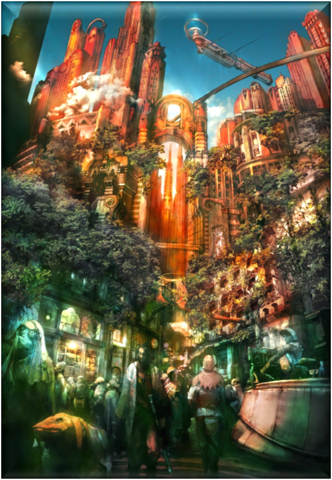{width="5.346456692913386in"
height="7.767716535433071in"}

Spells
------

The Spells are listed below, separated by group. Most of them asks for a
Fire vs Water roll to be successful, but you may automatically succeed
if the Spell's target voluntarily want it. The caster may roll anyway,
if he wishes to add the singles dice to the damage dealt or value
healed. Whenever a Spell targets a group, the caster chooses whether it
will target all enemies or himself and all allies.

### Black Magic

**Fire Group**: Elemental Spells whose main purpose is to deal
Fire-elemental damage. There are four Fire spells:

*Fire,* acquired at level 1, costs 8 MP. Roll Fire vs Water, difficulty
0. If you hit, deal 5 x Fire level Fire-elemental magical damage to a
target.

*Fira,* acquired at level 19, costs 24 MP. Roll Fire vs Water,
difficulty 0. If successful, deal 11 x Fire level magical damage level
to a target, or 7 x Fire level magical damage level to a group. This
damage is Fire-elemental.

*Firaga,* acquired at level 37, costs 58 MP. Roll Fire vs Water,
difficulty 0. If successful, deal 17 x Fire level magical damage level
to a target, or 10 x Fire level magical damage level to a group. This
damage is Fire-elemental.

*Meltdown*, acquired at level 55, costs 110 MP. Roll Fire vs Water,
difficulty 0. If successful, deal 23 x Fire level Fire-elemental magical
damage level to a target. Also, if your roll overcomes difficulty 70,
inflict the **Meltdown** status on the target until the end of the
round.

**Ice Group**: Elemental Spells whose main purpose is to deal
Ice-elemental damage. There are four Ice spells:

*Blizzard*, acquired at level 1, costs 8 MP. Roll Fire vs Water,
difficulty 0. If successful, deal 5 x Fire level Ice-elemental magical
damage to a target.

*Blizzara*, acquired at level 19, costs 24 MP. Roll Fire vs Water,
difficulty 0. If successful, deal 11 x Fire level magical damage level
to a target, or 7 x Fire level magical damage level to a group. This
damage is Ice-elemental.

*Blizzaga*, acquired at level 37, costs 58 MP. Roll Fire vs Water,
difficulty 0. If successful, deal 17 x Fire level magical damage level
to a target, or 10 x Fire level magical damage level to a group. This
damage is Ice-elemental.

*Freeze*, acquired at level 55, costs 110 MP. Roll Fire vs Water,
difficulty 0. If successful, deal 23 x Fire level Ice-elemental magical
damage level to a target. Also, if your roll overcomes difficulty 70,
inflict the **Stop** status on the target until the end of the round.

**Lightning Group**: Elemental Spells whose main purpose is to deal
Lightning-elemental damage. There are four Lightning spells:

*Thunder*, gained at level 1, costs 8 MP. Roll Fire vs Water, difficulty
0. If successful, deal 5 x Fire level Lightning-elemental magical damage
to a target.

*Thundara*, acquired at level 19, costs 24 MP. Roll Fire vs Water,
difficulty 0. If successful, deal 11 x Fire level magical damage level
to a target, or 7 x Fire level magical damage level to a group. This
damage is Lightning-elemental.

*Thundaga*, acquired at level 37, costs 58 MP. Roll Fire vs Water,
difficulty 0. If successful, deal 17 x Fire level magical damage level
to a target, or 10 x Fire level magical damage level to a group. This
damage is Lightning-elemental.

*Overcharge*, acquired at level 55, costs 110 MP. Roll Fire vs Water,
difficulty 0. If successful, deal 23 x Fire level Lightning-elemental
magical damage level to a target. Also, if your roll overcomes
difficulty 70, inflict the **Berserk** status on the target until the
end of the round.

**Death Group**: Transmutation Spells whose primary purpose is to remove
combat opponents as quickly as possible, or interfere with the target\'s
ability to recover HP. There are four Death Spells:

*Sleep*, acquired at level 1, costs 7 MP. Roll Fire vs Water, difficulty
70. If successful, inflict the **Sleep** status on the target until the
end of the next round.

*Zombie*, acquired at level 19, costs 20 MP. Roll Fire vs Water,
difficulty 70. If successful, inflict the **Zombie** status on the
target until the end of the next round.

*Condemn*, acquired at level 37, costs 60 MP. Roll Fire vs Water,
difficulty 70. If successful, inflict the **Condemn** status on the
target until the end of the next round.

*Death*, acquired at level 55, costs 122 MP. Roll Fire vs Water,
difficulty 70. If successful, the target is reduced to 0 HP. Treat this
as a **Fatal**--type status**.**

**Transform Group**: Transmutation Spells whose primary purpose is to
change the opponent's form, to weaken it and reduce its combat power.
There are four Transform Spells:

*Blind*, acquired at level 1, costs 6 MP. Roll Fire vs Water, difficulty
70. If successful, inflict the **Blind** status on the target until the
end of the next round.

*Petrify*, acquired at level 19, costs 23 MP. Roll Fire vs Water,
difficulty 70. If successful, inflict the **Stone** status on the target
at end of the next round.

*Toad*, acquired at level 37, costs 54 MP. Roll Fire vs Water,
difficulty 70. If successful, inflict the **Toad** status on the target
until the end of the next round. This spell may also be used to remove
the **Toad** status from a target, instead.

*Stone*, acquired at level 55, costs 106 MP. Roll Fire vs Water,
difficulty 70. If successful, inflict the **Stone** status on the
target.

**Poison Group**: Transmutation Spells whose primary purpose is to deal
Bio damage. The more HP your enemy have, the more effective these Spells
are. There are four Poison Spells:

*Poison,* acquired at level 1, costs 10 MP. Roll Fire vs Water,
difficulty 40. If successful, deal 5 x Fire level Bio-elemental magical
damage to a target, and inflict the **Poison** status on the target
until the end of the next round.

*Bio*, acquired at level 19, costs 25 MP. Roll Fire vs Water, difficulty
40. If successful, deal 11 x Fire level Bio-elemental magical damage to
a target, and inflict the **Poison** status on the target until the end
of the next round.

*Venom*, acquired at level 37, costs 62 MP. Roll Fire vs Water,
difficulty 40. If successful, deal 17 x Fire level Bio-elemental magical
damage to a target, and inflict the **Poison** status on the target
until the end of the next round.

*Virus*, acquired at level 55, costs 100 MP. Roll Fire vs Water,
difficulty 70. If successful, inflict the **Poison** and **Virus**
statuses on the target.

**Water Group**: Worldly Spells whose main purpose is to deal
Water-elemental damage. There are three Water spells:

*Water*, acquired at level 10, costs 15 MP. Roll Fire vs Water,
difficulty 0. If successful, deal 8 x Fire level Water-elemental magical
damage to a target.

*Waterga*, acquired at level 28, costs 40 MP. Roll Fire vs Water,
difficulty 0. If successful, deal 14 x Fire level magical damage level
to a target, or 8 x Fire level magical damage level to a group. This
damage is Water-elemental.

*Storm*, acquired at level 46, costs 80 MP. Roll Fire vs Water,
difficulty 0. If successful, deal 20 x Fire level magical damage level
to a target, or 12 x Fire level magical damage level to a group. This
damage is Water-elemental. Also, if your roll overcomes difficulty 70,
inflict the **Sleep** status on the targets during this and the next two
rounds.

**Earth Group**: Worldly Spells whose main purpose is to deal
Earth-elemental damage. There are three Earth spells:

*Magnitude*, acquired at level 10, costs 14 MP. Roll Fire vs Water,
difficulty 0. If successful, deal 8 x Fire level Earth-elemental magical
damage to all combatants who do not have the **Float** or **Flight**
statuses. This Spell ignores **Reflect**.

*Quake*, acquired at level 28, costs 43 MP. Roll Fire vs Water,
difficulty 0. If successful, deal 14 x Fire level Earth-elemental
magical damage to all combatants who do not have the **Float** or
**Flight** statuses. This Spell ignores **Reflect**.

*Break*, acquired at level 46, costs 84 MP. Roll Fire vs Water,
difficulty 0. If successful, deal 20 x Fire level Earth-elemental
magical damage level to a target. Also, if your roll overcomes
difficulty 70, inflict the **Stone** status on the target until the end
of the next round.

**Shadow Group**: Worldly Spells whose main purpose is to deal
Shadow-elemental damage. There are three Shadow spells:

*Dark*, acquired at level 10, costs 15 MP. Roll Fire vs Water,
difficulty 0. If successful, deal 8 x Fire level Shadow-elemental
magical damage to a target.

*Scourge*, acquired at level 28, costs 39 MP. Roll Fire vs Water,
difficulty 0. If successful, deal 14 x Fire level magical damage level
to a target, or 8 x Fire level magical damage level to a group. This
damage is Shadow-elemental.

*Scathe*, acquired at level 46, costs 85 MP. Roll Fire vs Water,
difficulty 0. If successful, deal 20 x Fire level magical damage level
to a target, or 12 x Fire level magical damage level to a group. This
damage is Shadow-elemental. Also, if your roll overcomes difficulty 70,
inflict the Blind status on the targets during this and the next two
rounds.

**Mage Bane Group**: Expert Spells whose main purpose is to manipulate
MP, weakening enemy magicians, and to restore the user\'s MP. There are
two Mage Bane Spells:

*Rasp*, acquired at level 30, costs 42 MP. Roll Fire vs Water,
difficulty 0. If successful, deal 14 x Fire level non-elemental magical
damage to a target. This Spell damages MP instead of HP.

*Osmosis*, acquired at level 50, costs 45 MP. Roll Fire vs Water,
difficulty 50. If successful, deal 16 x Fire level non-elemental magical
damage to a target. This Spell damages MP instead of HP. The caster
recovers MP equal to the damage dealt.

**Drain Group**: Expert Spells whose main purpose is to recover the
user\'s HP, through the ability to steal the target's life. There are
two Drain Spells:

*Drain*, acquired at level 30, costs 42 MP. Roll Fire vs Water,
difficulty 0. If successful, deal 14 x Fire level Puncture-elemental
magical damage to a target. 50% of damage dealt is recovered in HP by
the user.

Syphon, acquired at level 50, costs 90 MP. Roll Fire vs Water,
difficulty 0. If successful, deal 20 x Fire level Puncture-elemental
magical damage to a target. 50% of damage dealt is recovered in HP by
the user.

**Hex Group**: Expert Spells whose main purpose is to weaken the target,
causing several negative statuses at the same time. There are two Hex
Spells:

*Pain*, acquired at level 30, costs 40 MP. Roll Fire vs Water,
difficulty 70. If successful, inflict the **Blind**, **Poison** and
**Slow** statuses on the target until the end of next round.

*Curse*, acquired at level 50, costs 96 MP. Roll Fire vs Water,
difficulty 70. If successful, inflict the **Mute**, **Immobilize** and
**Disable** statuses on the target until the end of next round.

**Black Mysteries**: Black magic arcane mysteries are the most
destructive. All of them deal damage, being the most damaging spells
available to any mage. Mysteries are not a Spell group and cannot be
chosen as such.

*Doomsday*, acquired at level 64, cost 160 MP. Roll Fire vs Water,
difficulty 0. If successful, deal 28 x Fire level Shadow-elemental
magical damage to a group. Also, if your roll overcomes difficulty 70,
the targets are reduced to 0 HP. Treat this as a **Fatal** type status.
This spell ignores **Reflect.**

*Flare*, acquired at level 64, costs 150 MP. Roll Fire vs Water,
difficulty 0. If successful, deal 35 x Fire level non-elemental magical
damage to a target. This spell ignores **Reflect, Shell** and the
target's Magic Armor.

{width="2.5511811023622046in"
height="3.9330708661417324in"} *Ultima*, acquired the 64 level, cost 170
MP. Roll Fire vs Water, difficulty 0. If successful, deal 30 x Fire
level non-elemental magical damage to a group. This spell ignores
**Reflect** and **Shell**

### White Magic

**Healing Group**: These spells restore lost HP. They are the hallmark
of White Mages. These Spells have no effect on targets with exactly zero
HP. There are four Healing Spells:

*Cure*, acquired at level 1, costs 9 MP. Roll Fire vs Water, difficulty
0. On success, restore 5 x Fire level HP on a target.

*Cura*, acquired at level 19, costs 28 MP. Roll Fire vs Water,
difficulty 0. On success, restore 11 x Fire level HP on a target or 7x
Fire level HP on a group.

*Curaga*, acquired at level 37, costs 65 MP. Roll Fire vs Water,
difficulty 0. On success, restore 17 x Fire level HP on a target or 10x
Fire level HP on a group.

*Renew*, acquired at level 55, costs 115 MP. Roll Fire vs Water,
difficulty 0. If successful, the target is healed an amount of HP equal
to its maximum HP. If the target is under the **Zombie** status effect,
the difficulty is increased to 50 and this spell reduce the target's
current HP to 1.

**Purify Group**: Heavenly Spells that remove negative statuses. They
are an important aid to keep the group's fighting condition. There are
four Purify Spells:

*Poisona*, acquired at level 1, costs 6 MP. Roll Fire vs Water,
difficulty 0. If successful, the target loses the **Poison** and
**Virus** statuses**.**

*Basuna*, acquired at level 19, costs 20 MP. Roll Fire vs Water,
difficulty 0. If successful, the target loses the **Stone**, **Blind**,
**Mute**, **Disable** and **Immobilize** statuses.

*Esuna*, acquired at level 37, costs 65 MP. Roll Fire vs Water,
difficulty 0. If successful, the target loses all negative statuses.

*Vaccine*, acquired at level 55, costs 130 MP. Roll Fire vs Water,
difficulty 0. If successful, the group loses all negative statuses.

**Air Group:** Heavenly Spells whose main purpose is to deal
Air-elemental damage. There are four Air spells:

*Aero,* acquired at level 1, costs 8 MP. Roll Fire vs Water, difficulty
0. If successful, deal 5 x Fire level Air-elemental magical damage to a
target.

*Aera*, acquired at level 19, costs 24 MP. Roll Fire vs Water,
difficulty 0. If successful, deal 11 x Fire level magical damage level
to a target, or 7 x Fire level magical damage level to a group. This
damage is Air-elemental.

*Aeraga*, acquired at level 37, costs 58 MP. Roll Fire vs Water,
difficulty 0. If successful, deal 17 x Fire level magical damage level
to a target, or 10 x Fire level magical damage level to a group. This
damage is Air-elemental.

*Whirlwind*, acquired at level 55, costs 120 MP. Roll Fire vs Water,
difficulty 0. If successful, deal 20 x Fire level Air-elemental magical
damage to a group.

**Light Group:** Heavenly Spells whose main purpose is to deal
Light-elemental damage. There are four Light spells:

*Banish*, acquired at level 1, costs 8 MP. Roll Fire vs Water,
difficulty 0. If successful, deal 5 x Fire level Light-elemental magical
damage to a target.

*Banishra*, acquired at level 19, costs 24 MP. Roll Fire vs Water,
difficulty 0. If successful, deal 11 x Fire level magical damage level
to a target, or 7 x Fire level magical damage level to a group. This
damage is Light-elemental.

*Banishga*, acquired at level 37, costs 58 MP. Roll Fire vs Water,
difficulty 0. If successful, deal 17 x Fire level magical damage level
to a target, or 10 x Fire level magical damage level to a group. This
damage is Light-elemental.

*Fade*, acquired at level 55, costs 110 MP. If successful, deal 23 x
Fire level Light-elemental magical damage level to a target. Also, if
your roll overcomes difficulty 70, inflict the **Mute** status on the
target until the end of the next round.

**Elemental Group:** Protective Spells whose main purpose is to protect
the mage and his allies from elemental damage. Whenever you cast these
Spells, choose an element: Fire, Ice, Lightning, Water, Earth, Shadow,
Bio, Air or Light. There are four Elemental spells:

*Resist*, acquired at level 10, costs 14 MP. Roll Fire vs Water,
difficulty 0. On success, grant the **Resist** (chosen element) status
to a target until the end of the next round.

*Immune,* acquired at level 28, costs 35 MP. Roll Fire vs Water,
difficulty 0. On success, grant the **Immune** (chosen element) status
to a target until the end of the next round.

*Absorb*, acquired at level 46, costs 75 MP. Roll Fire vs Water,
difficulty 0. On success, grant the **Absorb** (chosen element) status
to a target until the end of the next round.

**Life Group:** Protective Spells whose main purpose is to keep the mage
and his allies alive, rendering them able to fight after falling to 0
HP. There are three Life Spells:

*Raise*, acquired at level 10, costs 19 MP. Roll Fire vs Water,
difficulty 0. If successful, the zero HP target is healed to 10% of its
maximum HP. If used on a target with the **Zombie** status, the
difficulty is 90 instead of 0, and, if successful, the target is reduced
to zero HP instead of healed.

*Reraise*, acquired at level 28, costs 50 MP. Roll Fire vs Water,
difficulty 0. If successful, grant the **Reraise** status to target
during this and the next two rounds.

*Arise*, acquired at level 46, costs 100 MP. Roll Fire vs Water,
difficulty 0. If successful, the zero HP target is healed to 100% of its
maximum HP. If used on a target with the **Zombie** status, the
difficulty is 60 instead of 0, and, if successful, the target is reduced
to zero HP instead of healed.

**Armor Group:** Protective Spells whose main purpose is to defend the
mage and his allies from physical damage. There are three Armor Spells:

*Protect,* acquired at level 10, costs 14 MP. Roll Fire vs Water,
difficulty 0. If successful, grant the **Protect** status to a target
until the end of next round.

*Protectga*, acquired at level 28, costs 40 MP. Roll Fire vs Water,
difficulty 0. If successful, grant the **Protect** status to a group
until the end of next round.

*Wall*, acquired at level 46, costs 92 MP. Roll Fire vs Water,
difficulty 0. If successful, grant the **Wall** status to a target until
the end of next round.

**Shield Group:** Protective Spells whose main purpose is to defend the
mage and his allies from magical damage. There are three Shield Spells:

*Shell*, acquired at level 10, costs 14 MP. Roll Fire vs Water,
difficulty 0. If successful, grant the **Shell** status to a target
until the end of next round.

*Shellga*, acquired at level 28, costs 40 MP. Roll Fire vs Water,
difficulty 0. If successful, grant the **Shell** status to a group until
the end of next round.

*Reflect*, acquired at level 46, costs 92 MP. Roll Fire vs Water,
difficulty 0. If successful, grant the **Reflect** status on a target
until the end of next round.

**Images Group:** Protective Spells whose main purpose is to defend the
mage and his allies, making them harder to hit. It is more effective in
stopping high difficulty attacks. There are three Images Spells:

*Blink*, acquired at level 10, costs 14 MP. Roll Fire vs Water,
difficulty 0. If successful, grant the Blink status to a target until
the end of next round.

*Ruse*, acquired at level 28, costs 40 MP. Roll Fire vs Water,
difficulty 0. If successful, grant the **Blink** status to a group until
the end of next round.

*Vanish*, acquired at level 46, costs 82 MP. Roll Fire vs Water,
difficulty 0. If successful, grant the **Vanish** status to a target
until the end of next round.

**Enchantment Group:** Psychic Spells whose main purpose is to prevent
your opponents from using spells or special actions. It is an effective
tool to facilitate the fighting by removing enemies' options. There are
two Enchantment Spells:

*Silence*, acquired at level 30, costs 30 MP. Roll Fire vs Water,
difficulty 70. If successful, inflict the **Mute** status on the target
until the end of the next round.

*Berserk*, acquired at level 50, costs 84 MP. Roll Fire vs Water,
difficulty 70. If successful, inflict the **Berserk** status on the
target until the end of the next round.

**Madness Group:** Psychic Spells whose main purpose is to confuse
opponents, causing them to fight in favor of the caster. Although
powerful, they are easily undone. There are two Madness Spells:

*Confuse*, acquired at level 30, costs 38 MP. Roll Fire vs Water,
difficulty 70. If successful, inflict the **Confuse** status on the
target until the end of the next round.

*Charm,* acquired at level 50, costs 89 MP. Roll Fire vs Water,
difficulty 70. If successful, inflict the **Charm** status on the target
until the end of the next round.

**Vulnerability Group:** Psychic Spells whose main purpose is to find or
create elemental weaknesses. They aren't powerful offensive Spells by
themselves but can greatly increase the damage of other attacks. There
are two Vulnerability Spells:

*Scan*, acquired at level 30, costs 30 MP. Roll Fire vs Water,
difficulty 40. If successful, you discover the maximum and current HP
and MP of the target as well as their Stat levels, their status effects
Vulnerabilities, Resistances and Immunities and their elemental
Vulnerabilities, Resistances and Immunities and Absorptions.

*Weaken*, acquired at level 50, costs 82 MP. Roll Fire vs Water,
difficulty 70. If successful, choose an element: Fire, Ice, Lightning,
Water, Earth, Shadow, Bio, Air or Light. The target receives the status
**Vulnerability** to the chosen element to the end of the next round.

**White Mysteries**: White magic arcane mysteries protect and attack,
and can complete the White Mage\'s arsenal, either going specialist or
generalist. Mysteries are not a Spell group and cannot be chosen as
such.

*Holy*, acquired at level 64, cost 155 MP. Roll Fire vs Water,
difficulty 0. If successful, deal 30 x Fire level Light-elemental
magical damage to a target.

*Rebirth*, acquired at level 64, cost 160 MP. Choose a group. Roll Fire
vs Water, difficulty 0. All characters hit in that group who have zero
HP are healed to 100% of their maximum HP. For each character in that
group with the **Zombie** status, the difficulty is 60 instead of 0,
and, if successful, the target is reduced to zero HP instead of healed.

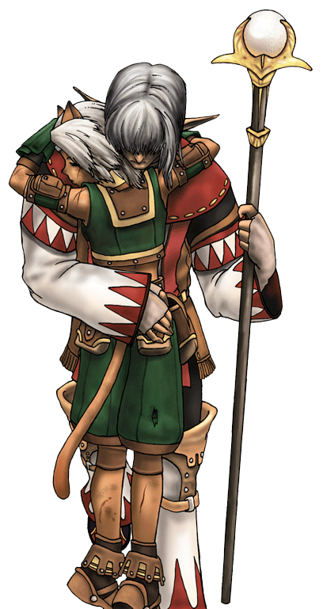{width="2.0196850393700787in"
height="3.8307086614173227in"} *Shield*, acquired at level 64, cost 150
MP. Roll Fire vs Water, difficulty 0. If successful, the target becomes
immune to all damage until the end of next round.

### Time Magic

**Cosmic Group**: Astral Spells whose main purpose is to deal
Cut-elemental damage. It is the only reliable Spell a Time Mage may use
to deal group-target damage. There are four Astral spells:

*Burn Ray*, acquired at level 1, costs 8 MP. Roll Fire vs Water,
difficulty 0. If successful, deal 5 x Fire level Cut-elemental magical
damage to a target.

*Ray Bomb*, acquired at level 19, costs 24 MP. Roll Fire vs Water,
difficulty 0. If successful, deal 11 x Fire level magical damage level
to a target, or 7 x Fire level magical damage level to a group. This
damage is Cut-elemental.

*Quasar*, acquired at level 37, costs 58 MP. Roll Fire vs Water,
difficulty 0. If successful, deal 17 x Fire level magical damage level
to a target, or 10 x Fire level magical damage level to a group. This
damage is Cut-elemental.

*Shockwave Pulsar*, acquired at level 55, costs 112 MP. Roll Fire vs
Water, difficulty 0. If successful, deal 23 x Fire level magical damage
level to a target, or 17 x Fire level magical damage level to a group.
This damage is Cut-elemental.

**Teleport Group**: Astral Spells whose main purpose is to avoid combat.
It may be used either to escape fights or to teleport away the
opponents. There are four Teleport Spells:

*Escape*, acquired at level 1, costs 7 MP. Teleports you to a location
that can see at a maximum distance of 2 x Fire level meters. If used in
combat, you can flee if succeed in a Fire vs Air roll, difficulty 0.
Treat this as using the **!Flee** action.

*Teleport*, acquired at level 19, costs 21 MP. Your group teleports to a
location that you can see at a maximum distance of 5 x Fire level
meters. If used in combat, your group can flee if you succeed in a Fire
vs Air roll, difficulty 0. Treat this as using the **!Flee** action.

*Remove,* acquired at level 37, costs 50 MP. Roll Fire vs Water,
difficulty 70. If successful, the target is teleported to an unknown
location away from the combat. This counts as if it had fled the battle.
Treat this effect a **Time**-type negative status effect**.**

*X-Zone*, acquired at level 55, costs 103 MP. Roll Fire vs Water,
difficulty 70. If successful, the enemy group is teleported to an
unknown location away from the combat. This counts as if they had fled
the battle. Treat this effect a **Time**- type negative status
effect**.**

**Gravity Group**: Astral Spells whose main purpose is to deal damage.
Damage is based on the target's current HP, being more efficient the
less damage the target has suffered. As it counts as status effects
rather than as damage, it can be easily canceled by immunities or
resistances. There are four Gravity Spells:

*Gravity*, acquired at level 1, costs 9 MP. Roll Fire vs Water,
difficulty 25. If successful, the target loses 25% of its current HP.
This is a **Gravity** status effect**.**

*Demi*, acquired at level 19, costs 27 MP. Roll Fire vs Water,
difficulty 50. If successful, the target loses 50% of its current HP.
This is a **Gravity** status effect.

*Quarter*, acquired at level 37, costs 63 MP. Roll Fire vs Water,
difficulty 75. If successful, the target loses 75% of its current HP.
This is a **Gravity** status effect**.**

*Black Hole*, acquired at level 55, costs 123 MP. Roll Fire vs Water,
difficulty 99. If successful, the target is reduced to exactly 1 HP.
This is a **Gravity** status effect.

**Slow Group**: Subtle Spells whose main purpose is to prevent the
target' actions. Unable to act, the target becomes easy prey. There are
four Slow Spells:

*Yawn*, acquired at level 1, costs 6 MP. Roll Fire vs Water, difficulty
70. If successful, inflict the **Weaken (Speed)** status on the target
over the next two rounds. When casting, you may reduce the spell\'s
duration by 1 round to increase all target\'s current initiative dice\'s
values by 1, to a maximum of 10.

*Slow*, acquired at level 19, costs 22 MP. Roll Fire vs Water,
difficulty 70. If successful, inflict the **Slow** status on the target
over the next two rounds.

*Slowga*, acquired at level 37, costs 54 MP. Roll Fire vs Water,
difficulty 70. If successful, inflict the **Slow** status on the group
over the next two rounds.

*Stop*, acquired at level 55, costs 101 MP. Roll Fire vs Water,
difficulty 70. If successful, inflict the **Stop** status on the target
until the end of next round.

**Weaken Group**: Subtle Spells whose main purpose is to decrease the
damage dealt or endured by the target. Thus, it is a versatile group,
possessing a blend of offensive and defensive spells. There are four
Weaken Spells:

*Mental Down*, acquired at level 1, costs 20 MP. Roll Fire vs Water,
difficulty 70. If successful, inflict the **Weaken (Mental)** status on
the target until the end of next round.

*Armor Down*, acquired at level 19, costs 20 MP. Roll Fire vs Water,
difficulty 70. If successful, inflict the **Weaken (Armor)** status on
the target until the end of next round.

*Power Down*, acquired at level 37, costs 50 MP. Roll Fire vs Water,
difficulty 70. If successful, inflict the **Weaken (Physical)** status
on the target until the end of next round.

*Magic Down*, acquired at level 55, costs 50 MP. Roll Fire vs Water,
difficulty 70. If successful, inflict the **Weaken (Magic)** status on
the target until the end of next round.

**Strengthen Group**: Subtle Spells whose main purpose is to increase
the damage dealt or endured by the target. Thus, it is a versatile
group, possessing a blend of offensive and defensive spells. There are
four Strengthen Spells:

*Mental Up*, acquired at level 1, costs 20 MP. Roll Fire vs Water,
difficulty 0. If successful, grant the **Strengthen (Mental)** status to
the target until the end of next round.

*Armor Up*, acquired at level 19, costs 20 MP. Roll Fire vs Water,
difficulty 0. If successful, grant the **Strengthen (Armor)** status to
the target until the end of next round.

*Power Up*, acquired at level 37, costs 50 MP. Roll Fire vs Water,
difficulty 0. If successful, grant the **Strengthen (Physical)** status
to the target until the end of next round.

*Magic Up*, acquired at level 55, costs 50 MP. Roll Fire vs Water,
difficulty 0. If successful, grant the **Strengthen (Magic)** status to
the target until the end of next round.

**Flight Group**: Subtle Spells whose main purpose is to deal with
winged opponents. With these spells, you can stick a flying opponent to
the ground or have an ally fly out of reach of its opponents. There are
four Flight Spells:

*Speed Up*, acquired at level 1, costs 6 MP. Roll Fire vs Water,
difficulty 0. If successful, grant the **Strengthen (Speed)** status to
the target until the end of next round. When casting, you may reduce the
spell\'s duration by 1 round to reduce all target\'s current initiative
dice\'s values by 1, to a minimum of the current phase.

*Float*, acquired at level 19, costs 23 MP. Roll Fire vs Water,
difficulty 0. If successful, grant the **Float** status to the group
until the end of next round.

*Tractor*, acquired at level 37, costs 50 MP. Roll Fire vs Water,
difficulty 40. If successful, the target loses the **Float** and
**Flight** statuses and may not gain them until the end of the next
round.

*Flight*, acquired at level 55, costs 95 MP. Roll Fire vs Water,
difficulty 0. If successful, grant the **Flight** status to the target
until the end of next round.

**Meteor Group**: Void Spells whose main purpose is to deal
Crush-elemental damage. It is especially powerful against enemies with
high magical defense, as they ignore the target's Magic Armor. There are
three Meteor Spells:

*Meteorite*, acquired at level 10, costs 15 MP. Roll Fire vs Water two
times, difficulty 0. For each success, deal 4 x Fire level
Crush-elemental magical damage to a random enemy. This spell ignores
Reflect and the target's Magic Armor

*Comet*, acquired at level 28, costs 41 MP. Roll Fire vs Water three
times, difficulty 0. For each success, deal 4 x Fire level
Crush-elemental magical damage to a random enemy. This spell ignores
**Reflect** and the target's Magic Armor.

*Meteo*, acquired at level 46, costs 79 MP. Roll Fire vs Water five
times, difficulty 0. For each success, deal 4 x Fire level
Crush-elemental magical damage to a random enemy. This spell ignores
**Reflect** and the target's Magic Armor.

**Speed Group**: Void Spells whose main purpose is to allow more actions
to your allies. Increasing the amount of target's initiative dice, you
can multiply your effectiveness in combat. There are three Speed Spells:

*Haste*, acquired at level 10, costs 17 MP. Roll Fire vs Water,
difficulty 0. If successful, grant the **Haste** status to the target
over the next two rounds.

Hastega, acquired at level 28, costs 42 MP. Roll Fire vs Water,
difficulty 0. If successful, grant the Haste status to the group over
the next two rounds.

Quicken, acquired at level 46, costs 91 MP. You gain two extra
initiative dice, with value equal to the current phase.

**Regeneration Group**: Inspiration Spells whose main purpose is to heal
and protect. It is a balanced group who may be used both offensively and
defensively. There are two Regeneration Spells:

*Regen*, acquired at level 30, costs 30 MP. Roll Fire vs Water,
difficulty 0. If successful, grant the **Regen** status to the target on
this and the next two rounds.

*Temporal Shift*, acquired at level 50, costs 80 MP. Roll Fire vs Water,
difficulty 0. On success, all combatants, enemies and allies, lose their
**Time** type status effects, whether positive or negative.

**Paralysis Group**: Inspiration Spells whose main purpose is to prevent
the opponent to attack or react. It is a highly defensive group,
reducing the target's ability to fight. There are two Paralysis spells:

*Immobilize*, acquired at level 30, costs 33 MP. Roll Fire vs Water,
difficulty 70. If successful, inflict the **Immobilize** status on the
target until the end of next round.

*Disable,* acquired at level 50, costs 76 MP. Roll Fire vs Water,
difficulty 70. If successful, inflict the **Disable** status on the
target until the end of next round.

**Divination Group**: Inspiration Spells whose main purpose is to
increase the success of the target's actions. It is a primarily
offensive group, lessening the failure chance of your allies' actions.
There are two Divination Spells:

*Reset*, acquired at level 30, costs 31 MP. Roll Fire vs Water,
difficulty 0. If successful, grant the **Premonition** status to the
target until the end of next round.

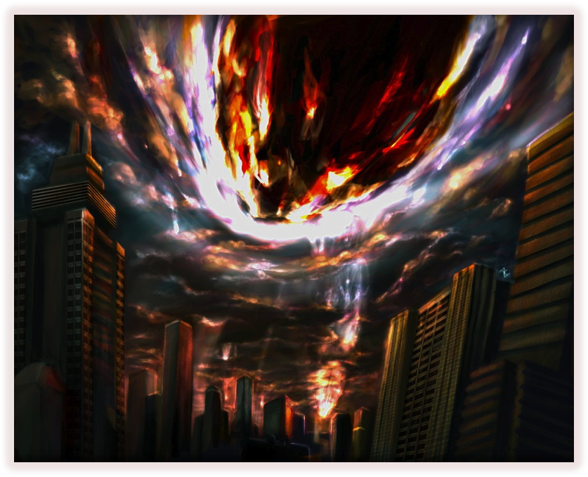{width="2.8346456692913384in"
height="2.2716535433070866in"} *Return*, acquired at level 50, costs 75
MP. Roll Fire vs Water, difficulty 0. If successful, grant the
**Premonition** status to the group until the end of next round.

**Time Mysteries**: Time magic arcane mysteries are mostly offensive,
although only one of them deal damage. The Time Wizard should choose the
mystery that better complements its function to support his teammates,
which varies depending on the group's composition and personality.
Mysteries are not a Spell group of and may not be chosen as such.

*Meteor*, acquired the 64 level, cost 155 MP. Roll Fire vs Water eight
times, difficulty 0. For each success, deal 4 x Fire level
Crush-elemental magical damage to a random enemy. This spell ignores
**Reflect** and the target's Magic Armor.

*Old*, acquired the 64 level, cost 150 MP. Roll Fire vs Water,
difficulty 70. If successful, the target takes the statuses **Weaken
(Speed)**, **Weaken (Armor)**, **Weaken (Mental)**, **Weaken (Magic)**
and **Weaken (Physical)** during this and the next two rounds.

*Time Stop*, acquired the 64 level, cost 160 MP. Roll Fire vs Water,
difficulty 70. If successful, inflict the **Stop** status on the group
until the end of next round.

### Blue Magic

Blue Magic is classified in four main types, from the weakest to the
strongest: Initiate, Acolyte, Master and Ancient. Unlike other Spells,
they do not have minimum levels and may be cast as soon as the character
learn the Spell, provided they have the required Core Ability. They also
may not be cast by *Arcane Focus*, *Spell Weave* or *Critical Spell*.

#### Initiate Spells

When creating a Druid character that casts Blue Magic, your starting
spells must come from this category. They are appropriate for 1st to
15th levels.

*Choco Ball* costs 7 MP. Roll Fire vs Water, difficulty 0. If
successful, deal 5 x Fire level Crush-elemental magical damage to a
target.

*Death Force* costs 12 MP. Roll Fire vs Water, difficulty 0. If
successful, the target becomes resistant to all Fatal-type status
effects until the end of next round.

*Flash* costs 14 MP. Roll Fire vs Water, difficulty 0. If successful,
deal 5 x Fire level Light-elemental magical damage to a target. Also, if
your roll overcomes difficulty 70, inflict the **Blind** status on the
target until the end the round.

*Goblin Punch* costs 1 MP. Perform a weapon attack, difficulty 50. If
successful, deal weapon damage to a target. If you have the same
character level as the target, deal extra damage equal to three times
weapon damage. This Spell does physical damage, can't hit targets under
the **Flight** status unless you have the same status and ignores the
**Reflect** status.

*Hastebreak* costs 8 MP. Roll Fire vs Water, difficulty 40. If the
target has the **Strengthen (Speed)** status, it loses this status and
receives the **Weaken (Speed)** status over the next two rounds. If the
target has the **Haste** status, he loses this status and receives the
**Slow** status over the next two rounds. This spell has no effect on
targets that doesn't have the two above mentioned status effects.

*Nightsong* costs 20 MP. Roll Fire vs Water, difficulty 70. If
successful, inflict the **Sleep** status on a group until the end of the
next round.

*Poison Gas* costs 16 MP. Roll Fire vs Water, difficulty 70. If
successful, inflict the **Poison** status on a group until the end of
the next round.

*Red Feast* costs 10 MP. Make a weapon attack, difficulty 0. If
successful, deal 5x Fire level Puncture-elemental damage. You recover HP
equal to half damage dealt. This Spell can't hit targets under the
**Flight** status unless you have the same status and ignores the
**Reflect** status.

*Self-Destruct* costs 1 MP. Roll Fire vs Water, difficulty 0. If
successful, deal non-elemental magic damage equal to your current HP to
the target. After using this Spell, you lose the **Reraise** status and
are reduced to 0 HP. No immunities can prevent you from being reduced to
0 HP in this way. Do not add the singles digit to the damage dealt.

*Transfusion* costs 1 MP. Roll Fire vs Water, difficulty 0. If
successful, restore a HP amount equal to your current HP to the target.
After using this Spell, you lose the **Reraise** status and are reduced
to 0 HP. No immunities can prevent you from being reduced to 0 HP in
this way. Do not add the singles digit to the HP healed.

#### Acolyte Spells

These more powerful spells begin to reveal the true power of Blue Mage.
They are appropriate for 16th to 30th levels.

*1000 Needles* costs 35 MP. Roll Fire vs Water, difficulty 0. If
successful, the target suffers 100 damage. This Spell ignores the
target's magic armor, **Shell** and **Reflect**.

*Acid* costs 63 MP. Roll Fire vs Water, difficulty 0. If successful,
deal 18 x Fire level Bio-elemental magical damage on a target. Also, if
your roll overcomes difficulty 70, inflict the **Weaken (Mental)** and
**Weaken (Armor)** on the target until the end of the next round.

*Degenerator* costs 32 MP. Roll Fire vs Water, difficulty 70. If
successful, until the end of the next round, every time the target
performs a physical attack it loses HP equal to 10% of his current HP
and each time the target performs a magical attack or Spell it loses MP
equal to 10% of his current MP. Ignore armor, magic armor and any of the
target's status when it suffers this damage. This counts as a
**Toxic**-type status.

*Dragon Force* costs 45 MP. Roll Fire vs Water, difficulty 0. If
successful, grant the **Resist (Fire**, **Ice** and **Lightning)**
status to a group until the end of next round.

*Flame Thrower* costs 24 MP. Roll Fire vs Water, difficulty 0. If
successful, deal 12 x Fire level Fire-elemental damage to a target.

*Force Field* costs 35 MP. Roll Fire vs Water, difficulty 0, against a
group. Roll 1d10: 1: Fire; 2: Ice; 3: Lightning; 4: Earth; 5: Air; 6:
Water; 7: Bio; 8: Light; 9: Shadow; 0: None. Grant the **(Element)
Immune** status for each character hit based on the d10 roll, until the
end of the next round.

*Magic Hammer* costs 30 MP. Roll Fire vs Water, difficulty 50. If
successful, deal magical damage to the target equal to half of its
current MP. The target loses MP instead of HP when suffering this Spell.
This spell ignores the target's Magic Armor.

*Matra Magic* cost 55 MP. Roll Fire vs Water, difficulty 0. If
successful, deal 17 x Fire level damage to a target, or 10x Fire level
damage to a group. This Spell does Fire-elemental magical damage.

*Seed Cannon* costs 22 MP. Roll Fire vs Water, difficulty 0. If
successful, deal 11 x Fire level damage to a target, or 7x Fire level
damage to a group. This Spell does Puncture-elemental physical damage
and ignores the **Reflect** status.

*Stare* costs 60 MP. Roll Fire vs Water, difficulty 70. If successful,
inflict the **Confuse** status to a group until the end of the next
round.

#### Master Spells

At this level there are some of the most powerful Blue Magic Spells,
showcasing all the power of nature. They are appropriate to 31st to 50th
levels.

*Aqua Rake* costs 85 MP. Roll Fire vs Water, difficulty 0. If
successful, deal 13 x Fire level Water-elemental magical damage level to
a group. This Spell ignores the **Reflect** status.

*Death Claw* costs 110 MP. Roll Fire vs Water, difficulty 80. If
successful, the target\'s HP is reduced to the d100's singles digit,
considering 0 as 10. Treat this as a **Gravity** status effect.

*Earth Shake* costs 67 MP. Roll Fire vs Water, difficulty 0. Roll Fire
vs Water, difficulty 0. If successful, deal 13 x Fire level
Earth-elemental magical damage level to a group. This Spell ignores the
**Reflect** status and automatically fails against targets under the
**Float** or **Flight** status effects.

*Electrocute* costs 85 MP. Roll Fire vs Water, difficulty 0. If
successful, deal 13 x Fire level Lightning-elemental magical damage
level to a group. This Spell ignores the **Reflect** status.

*Frog Song* costs 100 MP. Roll Fire vs Water, difficulty 70, twice,
against a group. Heal from or inflict the **Toad** status until the end
of the next round on each target hit by the first roll. Inflict the
**Sleep** status until the end of the next round on each target hit by
the second roll.

*Level 3 Confuse* costs 65 MP. Roll Fire vs Water, difficulty 30.
Inflict the **Confuse** status until the end of the next round on all
enemies hit whose level is a multiple of three. This Spell ignores the
**Reflect** status.

*Rippler* costs 74 MP. Roll Fire vs Water, difficulty 40. If successful,
you and the target exchange any status effects, keeping their respective
durations. For example, a **Blind** Druid use this spell on a **Haste**
and **Immobilize** target becomes **Haste** and **Immobilize**, while
the target becomes **Blind**. This spell does not affect status effects
that are caused by permanent effects, such as equipment with Auto-Status
or SoS-Status or permanent Abilities.

*Roulette* costs 70 MP. Pick a random combatant (ally, enemy or the
caster). Roll Fire vs Water, difficulty 40. If successful, it is reduced
to 0 HP. Treat this as a **Fatal** type status. This Spell ignores the
**Reflect** status.

*Wall Change* costs 72 MP. Roll Fire vs Water, difficulty 70. If
successful, grant the target the **(Element) Resist** to all elements,
except one random element. To find the random element, roll 1d10: 1:
Fire; 2: Ice; 3: Lightning; 4: Earth; 5: Air; 6: Water; 7: Bio; 8:
Light; 9: Shadow; 0: Cut, Crush and Puncture. He also receives the
**(Element) Vulnerable** to all elements it does not have resistance,
immunity or absorption. The element to which the target is vulnerable
randomly changes every five phases. This effect lasts this and the next
two rounds.

*White Wind* costs 99 MP. Roll Fire vs Water, difficulty 0. On success,
all allies recover a HP amount equal to your current HP. You do not
recover HP with this Spell.

####  Ancient Spells

These spells are usually found only at very high levels, representing
the maximum power of Blue Magic. They are appropriate from 51st level
onward.

*Bad Breath* costs 130 MP. Roll Fire vs Water, difficulty 70 against the
enemy group. For each enemy hit, roll 1d10. Inflict all status listed
below to each enemy until the end of next round according to its d10
roll.

1-2: **Immobilize, Mute, Poison, Meltdown.**

3-4: **Blind, Disable, Poison, Slow.**

5-6: **Confuse, Slow, Virus, Toad.**

7-8: **Confuse, Condemn, Slow, Poison,**

9-0: **Berserk, Blind, Poison, Zombie.**

*Grand Train* costs 160 MP. Roll Fire vs Water, difficulty 0. If
successful, deal 30 x Fire level non-elemental magical damage to a
group. This Spell ignores the **Reflect** status.

*Level 2 Old* cost 155 MP. Roll Fire vs Water, difficulty 70. If
successful, inflict the **Weaken (Armor)**, **Weaken (Mental)**,
**Weaken (Magic)** and **Weaken (Physical)** status effects on all even
level enemies until the end of the next round. This Spell ignores the
**Reflect** status.

*Level 4 Flare* costs 145 MP. Roll Fire vs Water, difficulty 0. If
successful, deal 33 x Fire level non-elemental magical damage to all
enemies whose level is a multiple of four. This Spell ignores the
**Shell** and **Reflect** status effects.

*Level 5 Death* costs 130 MP. Roll Fire vs Water, difficulty 30. All
enemies hit whose level is a multiple of five are reduced to 0 HP. Treat
this as a **Fatal** type status. This Spell ignores the **Reflect**
status.

*Magic Breath* costs 120 MP. Roll Fire vs Water, difficulty 0, three
times, against a group. Deal 8 x Fire level Fire-elemental magical
damage on each target hit by the first roll. Deal 8 x Fire level
Ice-elemental magical damage on each target hit by the second roll. Deal
8 x Fire level Lightning-elemental magical damage on each target hit by
the third roll. This Spell ignores the target's Magic Armor.

M*ighty Guard* costs 140 MP. You and all your allies gain the **Haste**,
**Protect,** and **Shell** status effects during this and the next two
rounds.

*Shadow Flare* costs 161 MP. Roll Fire vs Water, difficulty 0. If
successful, deal 33 x Fire level Shadow-elemental magical damage to a
target.

*Stone Breath* costs 115 MP. Roll Fire vs Water, difficulty 70, against
a group. Inflict the **Stone** status until the end of the next round on
each target hit.

*Supernova* costs 175 MP. Roll Fire vs Water, difficulty 0. If
successful, deal 8 x character level non-elemental magical damage to a
group. This Spell ignores the **Reflect** status.

### Other Spells

**Other Spells**: These spells give some specific Secondary Jobs some
capabilities that complement their skills. The Berserker learn one of
these Spells at advanced level, and the Defender may eventually learn
one, two or even three of these Spells. These Spells are not a Spell
group of and may not be chosen as such.

*Astra*, acquired at level 30, costs 35 MP. Roll Fire vs Water,
difficulty 0. If successful, the target becomes immune to all negative
status effects until the end of the round.

*Dispel*, acquired at level 40, costs 60 MP. Roll Fire vs Water,
difficulty 40. If successful, the target loses all the positive status
effects. If he has Auto-**Status** or SOS-**Status**, these effects are
disabled until the end of the round. This spell ignores **Reflect**.

*Astraga*, acquired at level 50, costs 85 MP. Roll Fire vs Water,
difficulty 0. If successful, the group becomes immune to all negative
status effects until the end of the round.

*Great Gospel*, acquired at level 64, costs 99 MP. You gain the
**Absorb** status to all elements, except Cut, Puncture and Crush, until
the end of the round.

Summoned Monsters
-----------------

*Calls* are Spells and follow the same rules as other Spells, with two
exceptions: First, all *Calls* ignore the **Reflect** status. Second,
*Calls* can never be cast by *Arcane Focus*, *Spell Weave* or *Critical
Spell*. When casting a *Call*, the Druid gets help from a *Summoned
Monster,* who arises, performs the *Call's* effects and disappear from
of the battlefield. Nevertheless, the Druid uses his own Stats, not the
beast's, to cause effects, including damage and rolls to hit. When using
the **!Summon** action, the Druid gains the **Wall** status, casts the
creature's *Call* effect (*Basic* or *Greater*) and gain additional
effects based on the creature.

A Summoner may only have the support of the *Summoned Monster* if the
creature itself accepted this agreement. The GM must, according to the
setting, decide which *Summoned Monsters* exist, what the Summoner must
do to bond himself with a creature, what are its effects and what are
the deeds the creature will require to lend its power to a Summoner. In
the following pages there will be a brief description of some of the
recurring *Summoned Monsters* in the series.

***Asura*** is a humanoid creature that has three faces and six arms.
Her body is female, but she has male and female faces. She uses
Indian-themed clothes.

*Basic Call:* Minimum level: 14th. MP Cost: 22. Roll 1d10. On a result
1, 2 or 3, grant the **Strengthen (Mental)** status. On a result 4, 5 or
6, grant the **Strengthen (Armor)** status. On a result 7, 8, 9 or 10,
grant the **Float** status. All status targets a group and last until
the end of the next round.

*Greater Call:* Minimum level: 34th. MP Cost: 45. Roll 1d10. On a result
1, 2 or 3, grant the **Shell** status. On a result 4, 5 or 6, grant the
**Protect** status. On a result 7 or 8, grant the **Strengthen
(Physical)** status. On a result 9 or 10, grant the **Strengthen
(Magic)** status. All status targets a group and last until the end of
the next round.

*Summon:* Gain the **Float** status until the end of the round.

***Chocobo*** is a recurring two-legged bird in the series that is often
used as mounts. When summoned, it attacks with its beak. Rarely, the
Summoner may summon a huge version of the creature, known as *Fat
Chocobo.*

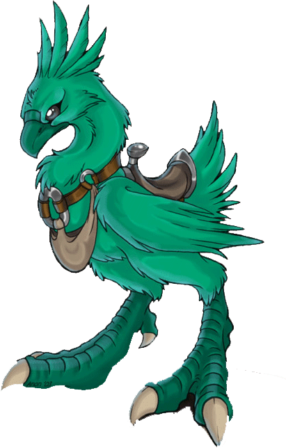{width="1.956299212598425in"
height="3.0661417322834645in"} *Basic Call:* Minimum Level: 14th . MP
Cost: 15. Roll Fire vs Water, difficulty 0. If successful, deal 8 x Fire
level Puncture-elemental magical damage to a target. In case of critical
hit, you summon the *Fat Chocobo,* dealing 8 x Fire level
Crush-elemental damage to a group.

*Greater Call:* Minimum level: 34th. MP Cost: 45. Roll Fire vs Water,
difficulty 0. If successful, deal 14 x Fire level Puncture-elemental
magical damage to a target. In case of critical hit, you summon the *Fat
Chocobo,* dealing 12 x Fire level Crush-elemental damage to a group.

*Summon:* It has no extra effect with **!Summon**.

***Fenrir*** is a gigantic wolf, usually associated with the moon.

*Basic Call:* Minimum Level: 14th. MP Cost: 24. You and your allies gain
the **Strengthen (Speed)** status over the next two rounds.

*Greater Call:* Minimum Level: 34th. MP Cost: 40. You and your allies
gain the **Blink** status until the end of next round.

*Summon:* Gain the **Strengthen (Mental)** status until the end of the
round.

***Ifrit*** is a humanoid demon with human and goat traits, including
hooves and horns. It has dominion over fire and uses it in his attacks.

*Basic Call:* Minimum Level: 14th. MP Cost: 20. Roll Fire vs Water,
difficulty 0. If successful, deal 7 x Fire level Fire-elemental magical
damage to a group.

*Greater Call:* Minimum Level: 34th. MP Cost: 50. Roll Fire vs Water,
difficulty 0. If successful, deal 10 x Fire level Fire-elemental magical
damage to a group.

*Summon:* Gain the **Fire Immune**, **Shadow Resist** and **Ice
Vulnerable** status effects until the end of the round.

***Lakshmi*** is a young woman with dark skin and blue robes, crowned
with sun rays made by the purest gold, with the grace and dignity of a
queen.

*Basic Call:* Minimum Level: 14th. MP Cost: 25. Roll Fire vs Water,
difficulty 0. On success, heal 7 x Fire level HP to a group.

*Greater Call:* Minimum Level: 34th. MP Cost: 56. Roll Fire vs Water,
difficulty 0. On success, heal 10 x Fire level HP to a group

*Summon:* Gain the **Light Resist** status until the end of the round.

***Ramuh*** is a giant with a long beard and long white hair, wearing
robes. He brandishes a staff and controls lightning.

*Basic Call:* Minimum Level: 14th. MP Cost: 20. Roll Fire vs Water,
difficulty 0. If successful, deal 7 x Fire level Lightning-elemental
magical damage to a group.

*Greater Call:* Minimum Level: 34th. MP Cost: 50. Roll Fire vs Water,
difficulty 0. If successful, deal 10 x Fire level Lightning-elemental
magical damage to a group.

*Summon:* Gain the **Lightning Immune**, **Light Resist** and **Water
Vulnerable** status effects until the end of the round.

***Shiva*** is a humanoid fairy, with blue skin and elf features. She
has dominion over ice.

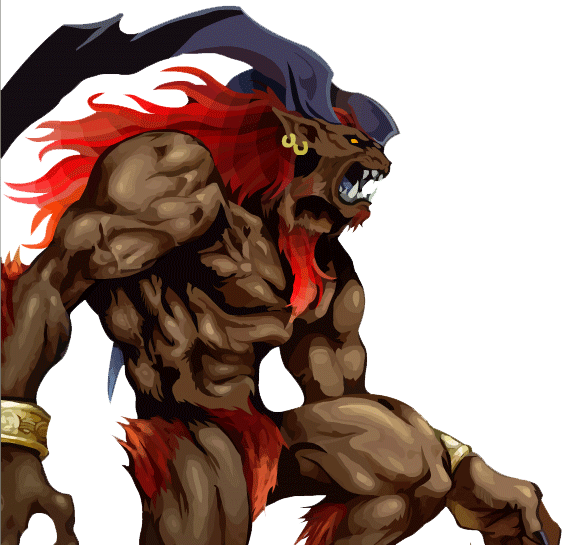{width="1.9602362204724408in"
height="1.8492115048118984in"} *Basic Call:* Minimum Level: 14th. MP
Cost: 20. Roll Fire vs Water, difficulty 0. If successful, deal 7 x Fire
level Ice-elemental magical damage to a group.

*Greater Call:* Minimum Level: 34th. MP Cost: 50. Roll Fire vs Water,
difficulty 0. If successful, deal 10 x Fire level Ice-elemental magical
damage to a group.

*Summon:* Gain the **Ice Immune**, **Water Resist** and **Fire
Vulnerable** status effects until the end of the round.

***Siren*** is a mermaid who uses her magical songs to muddle your
opponents.

*Basic Call:* Minimum Level: 14th. MP Cost: 35. Roll Fire vs Water,
difficulty 70. If successful, inflict the **Confuse** status on a target
until the end of the next round.

*Greater Call:* Minimum Level: 34th MP Cost: 60. Roll Fire vs Water,
difficulty 70. If successful, inflict the **Confuse** status on each
character in a group until the end of the next round.

*Summon:* Until the end of the round, you are immune to all
**Mental**-type negative status.

***Valefor*** is a huge bird with rainbow-colored feathers.

*Basic Call:* Minimum Level: 14th. MP Cost: 20. Roll Fire vs Water,
difficulty 0. If successful, deal 7 x Fire level Air-elemental magical
damage to a group.

*Greater Call:* Minimum Level: 34th. MP Cost: 60. You and up to three
allies gain the **Flight** status. At each affected character's next
action, the character descends on a target, discards the initiative die
and unleashes a weapon attack dealing twice weapon physical damage.
After this attack, the character loses the **Flight** status.

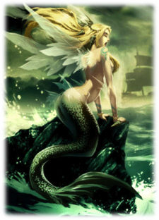{width="1.4993055555555554in"
height="2.0805555555555557in"} *Summon:* Gain the conditions **Flight**
and **Earth Vulnerable** until the end of the round.

***Atomos*** is a huge creature that looks like a giant mouth made of
pink, pulsating flesh. Inside the mouth, a terrifying darkness seems to
suck all the light around, as an insane vacuum or a portal to horrors
beyond imagination.

*Basic Call:* Minimum level: 24th. MP Cost: 33. Roll Fire vs Water,
difficulty 40. If successful, each character in a group loses 25% of its
current HP. This counts as a **Gravity** type-status.

*Greater Call:* Minimum level: 54th. MP Cost: 100. Roll Fire vs Water,
difficulty 70. If successful, each character in a group loses 75% of its
current HP. This counts as a **Gravity** type-status.

*Summon:* Until the end of the round, you are immune to all
**Fatal**-type negative status.

***Carbuncle*** is a small and shiny mouse-like creature, with a skin
green and blue, long ears and a large polished ruby nestled on his
forehead.

*Basic Call:* Minimum Level: 24th. MP Cost: 40. You and your allies gain
the **Shell** status until the end of next round.

*Greater*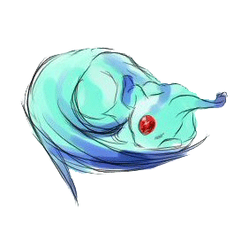{width="1.8984241032370954in"
height="1.713779527559055in"} *Call:* Minimum Level: 54th. MP Cost: 112.
You and your allies gain the **Reflect** status until the end of next
round.

*Summon:* It has no extra effect with **!Summon**.

***Catoblepas*** is a strange one-eyed creature with the body of a bull,
three pairs of legs, a snake-like long neck, and a pig\'s head.

*Basic Call:* Minimum Level: 24th. MP Cost: 25. Roll Fire vs Water,
difficulty 70. If successful, inflict the **Stone** status on a target
at the end of the next round.

*Greater Call:* Minimum level: 54th. MP Cost: 105. Roll Fire vs Water,
difficulty 70. If successful, inflict the **Stone** status on each
character in a group at the end of the next round.

*Summon:* Until the end of the round, you are immune to all
**Transform**-type negative status.

***Golem*** is a huge construct, made of polished stones, who protects
the group.

*Basic Call:* Minimum Level: 24th. MP Cost: 40. You and your allies gain
the **Protect** status until the end of next round.

*Greater Call:* Minimum Level: 54th. MP Cost: 121. You and your allies
gain the **Wall** status until the end of next round.

*Summon:* Gain the **Resist (Cut, Crush** and **Puncture)** status until
the end of the round.

***Kirin*** has the body of a horse, the tail of a bull, the horns of a
moose and the head of a dragon. His body is white, but it has a green
emerald mane in his neck, shoulders and legs.

*Basic Call:* Minimum level: 24th. MP Cost: 25. Grant the **Regen**
status to a target until the end of the next round.

*Greater Call:* Minimum Level: 54th. MP Cost: 80 You and your allies
gain the **Regen** status during this and the next two next rounds.

*Summon:* Until the end of the round, you are immune to all
**Seal**-type negative status.

***Madeen*** is a great lion humanoid with dragon wings, who shoots
light rays.

*Basic Call:* Minimum Level: 24th. MP Cost: 35. Roll Fire vs Water,
difficulty 0. If successful, deal 8 x Fire level Light-elemental magical
damage to a group.

*Greater Call:* Minimum Level: 54th. MP Cost: 110. Roll Fire vs Water,
difficulty 0. If successful, deal 17 x Fire level Light-elemental
magical damage to a group.

*Summon:* Gain the **Light Immune**, **Fire Resist** and **Shadow
Vulnerable** status effects until the end of the round.

***Sylph*** is a small group of six fairies with dragonfly wings who
attack together.

*Basic Call:* Minimum Level: 24th. MP Cost: 40. Roll Fire vs Water,
difficulty 0. If successful, deal 12 x Fire level Puncture-elemental
magical damage to a target. You and your allies heal HP equal to the
damage dealt, split evenly to all hurt characters in your group.

*Greater Call:* Minimum level: 54th. MP Cost: 120. Roll Fire vs Water,
difficulty 0. If successful, deal 22 x Fire level Puncture-elemental
magical damage to a target. You and your allies heal HP equal to the
damage dealt, split evenly to all hurt characters in your group.

*Summon:* Gain the **Float** status until the end of the round.

***Titan*** is a giant, very muscular, dressed in Greek tunics, who
controls the Earth element.

*Basic Call:* Minimum Level: 24 MP Cost: 35 Roll Fire vs Water,
difficulty 0. If successful, deal 8 x Fire level Earth-elemental magical
damage to a group.

*Greater Call:* Minimum Level: 54th. MP Cost: 110. Roll Fire vs Water,
difficulty 0. If successful, deal 17 x Fire level Earth-elemental
magical damage to a group.

*Summon:* Gain the **Earth Immune**, **Lightning Resist** and **Air
Vulnerable** status effects until the end of the round.

***Unicorn*** is a majestic creature with the body of a horse and a
large horn on its head.

*Basic Call:* Minimum level: 24th. MP Cost: 60. Roll Fire vs Water,
difficulty 0. If successful, remove all negative status effects from a
target.

*Greater Call:* Minimum level: 54th. MP Cost: 133. Roll Fire vs Water,
difficulty 0. If successful, remove all negative status effects from
each character in a group.

*Summon:* Until the end of the round, you are immune to all
**Toxic**-type negative status.

***Alexander*** is a gigantic mechanical creature, vaguely humanoid,
although it does not have legs. His arms are towers that touch the
ground, but don't have hands. In place of his head, a palace sits on his
broad shoulders with large lights in its highest towers.

*Basic Call:* Minimum Level: 44th. MP Cost: 85. Roll Fire vs Water,
difficulty 0. If successful, deal 14 x Fire level Light-elemental
magical damage to a group.

*Greater Call:* Minimum Level: 64th. MP Cost: 140. Roll Fire vs Water,
difficulty 0. If successful, deal 26 x Fire level Light-elemental
magical damage to a group.

*Summon:* Gain the **Light Absorb** and **Shadow Vulnerable** status
effects until the end of the round.

***Bahamut*** is the king of dragons, a huge platinum dragon.

*Basic Call:* Minimum level: 44th. MP Cost: 80. Roll Fire vs Water,
difficulty 0. If successful, deal 20 x Fire level non-elemental magical
damage to a target.

*Greater Call:* Minimum level: 64 MP Cost: 170. Roll Fire vs Water,
difficulty 0. If successful, deal 28 x Fire level non-elemental magical
damage to a group.

*Summon:* Gain the **Flight** status until the end of the round.

***Cerberus*** is a three-headed dog, big and majestic, loyal and
attentive.

*Basic Call:* Minimum Level: 44th. MP Cost: 90. You gain two extra
initiative die, with value equal to the current phase.

*Greater Call:* Minimum level: 64th. MP Cost: 130. You and up to three
allies each gain one extra initiative dice with a value equal to the
current phase.

*Summon:* Gain the **Strengthen (Magic)** status until the end of the
round.

***Diabolos*** is a demon black as the night, with bat wings, using a
boiling cauldron with evil vapors.

*Basic Call:* Minimum Level: 44th. MP Cost: 90. Roll Fire vs Water,
difficulty 70. If successful, roll 1d10 for each target hit. Inflict
status listed below to the target until the end of next round according
to its d10 roll.

1-2: **Immobilize, Mute, Poison, Meltdown.**

3-4: **Blind, Disable, Poison, Slow.**

5-6: **Confuse, Slow, Virus, Toad.**

7-8: **Confuse, Condemn, Slow, Poison,**

9-0: **Berserk, Blind, Poison, Zombie.**

*Greater Call:* Minimum level: 64th. MP Cost: 120. Roll Fire vs Water,
difficulty 70 against all enemies. On success, for each enemy hit, treat
as if he had suffered the effects of Diabolos' Basic Call. Roll the d10
for each enemy hit.

*Summon:* Gain the **Shadow Absorb** and **Light Vulnerable** status
effects until the end of the round.

***Kujata*** is a colossal boar. Under his fur, he hides countless eyes,
countless noses, countless mouths and countless tongues. It has mastery
over every element.

*Basic Call:* Minimum level: 44th. MP Cost: 90. Roll Fire vs Water,
difficulty 20, three times, against a group. Deal 4 x Fire level
Fire-elemental magical damage on each target hit by the first roll. Deal
4 x Fire level Ice-elemental magical damage on each target hit by the
second roll. Deal 4 x Fire level Lightning-elemental magical damage on
each target hit by the third roll. This Spell ignores the target's Magic
Armor.

*Greater Call:* Minimum level: 64th. MP Cost: 133. Roll Fire vs Water,
difficulty 20, three times, against a group. Deal 8 x Fire level
Fire-elemental magical damage on each target hit by the first roll. Deal
8 x Fire level Ice-elemental magical damage on each target hit by the
second roll. Deal 8 x Fire level Lightning-elemental magical damage on
each target hit by the third roll. This Spell ignores the target's Magic
Armor.

*Summon:* Gain the **Immune (Fire, Ice** and **Lightning)** status until
the end of the round.

***Leviathan*** is a gigantic sea serpent, who rules the seas. His
appearance brings the smell of the sea, although he can walk on dry land
if desired.

*Basic Call:* Minimum Level: 44th. MP Cost: 85. Roll Fire vs Water,
difficulty 0. If successful, deal 14 x Fire level Water-elemental
magical damage to a group.

*Greater Call:* Minimum Level: 64th. MP Cost: 140. Roll Fire vs Water,
difficulty 0. If successful, deal 26 x Fire level Water-elemental
magical damage to a group.

*Summon:* Gain the **Water Absorb** and **Lightning Vulnerable** status
effects until the end of the round.

***Odin*** is a legendary brave warrior mounted on a six-legged horse
and armed with a spear and a sword tempered by the gods.

*Basic Call:* Minimum Level: 44th. MP Cost: 80. Roll Fire vs Water,
difficulty 0. If successful, deal 20 x Fire level Puncture-elemental
physical damage to a target.

*Greater Call:* Minimum Level: 64th. MP Cost: 125. Roll Fire vs Water,
difficulty 0, against a group. If successful, reduce the HP of each
character hit to 0. Treat this effect as a **Fatal** type status.

*Summon:* Gain the **Strenghten (Physical)** status until the end of the
round.

***Phoenix*** is a bird made of flame that has power over life and
death.

*Basic Call:* Minimum Level: 44th. MP Cost: 95. Choose an ally with 0
HP. This ally is healed to 100% of his maximum HP.

*Greater Call:* Minimum Level: 64th. MP Cost: 150. Roll Fire vs Water,
difficulty 0. If successful, deal 20 x Fire level Fire-elemental magical
damage to a group. Additionally, you may choose an ally with 0 HP. This
ally is healed to 100% of his maximum HP.

*Summon:* Gain the **Reraise** and **Fire Immune** status effects until
the end of the round.

***Sraphim*** is a humanoid with six feathered wings, dressed in
heavenly robes.

*Basic Call:* Minimum Level: 44th. MP Cost: 89. Roll Fire vs Water,
difficulty 0. On success, heal 14 x Fire level HP to a group.

*Greater Call:* Minimum level: 64th. MP Cost: 165. Roll Fire vs Water,
difficulty 0. On success, heal 26 x Fire level HP to a group.

*Summon:* Gain the **Regen** status until the end of the round.

***Zodiac*** is a huge serpent with four pairs of wings, ranging from
feathered, draconian and bat wings.

*Basic Call:* Minimum Level: 44th. MP Cost: 85. Roll Fire vs Water,
difficulty 0. If successful, deal 14 x Fire level Shadow-elemental
magical damage to a group.

*Greater Call:* Minimum Level: 64 MP Cost: 180. Roll Fire vs Water,
trouble 0. If successful, deal 31 x Fire level Shadow-elemental magical
damage to a group.

*Summon:* Until the end of the round, you are immune to all negative
status effects.

{width="0.4937007874015748in"
height="0.4964555993000875in"}

Summoned Monsters are major plot points in most Final Fantasy games.
Even in games where no character could actually summon them, like the
original Final Fantasy, Summoned Monsters appeared to guide and help the
party.

As a GM, use these Summoned Monster list as a guideline. Use the ones
that do fit into your campaign setting. And do not be shy about creating
your own Summoned Monsters! You don\'t even need to create its Call
effects if there is no Summoner in the party. And if there is one, use
these ones as inspiration to create yours!

Geomancy
--------

To use Geomancy, roll 1d100 and add your level. A result smaller than 60
casts a Minor effect; a result between 60 and 119 cast a Minor or a
Major effect; and a result higher than 119 casts any effect. You must
choose which effect you\'ll cast after rolling the dice. In addition to
the Geomancy's normal effects, a Druid of 10th level or higher may
choose to spend MP to activate one of the action's extra effects, if
they have the effect's required level or greater. Geomancies are magical
actions, and not Spells, but this MP expenditure is affected by
equipment and abilities that reduce Spells' MP cost.

### Plains

Open areas relatively flat and dry. They can be savannas, steppes,
pampas, grasslands or other areas of sparse tree coverage. Temperatures
in the lowlands range from temperate to tropical. Cooler areas usually
count as *Snow* fields, and drier areas (even if not completely desert)
use the *Desert* terrain.

*Minor Effect*: **Gusty Wind.** Perform a Fire vs Earth attack,
difficulty 20. If successful, deal 4x Fire level Air-elemental damage on
a target. 15th level: You may spend 10 MP to increase the damage to 8x
Fire level. 30th level: You may spend 35 MP to increase the damage to
15x Fire level. 45th level: You may spend 70 MP to increase the damage
to 21x Fire level.

*Major Effect*: **Sunbath.** Choose you or an ally. The target is healed
to half his max HP. 20th level: If you spend 25 MP, this effect affects
you and all your allies. 55th level: If you spend 100 MP, this effect
heals the target to 100% of his max HP.

*Superior Effect*: **Pitfall.** Perform a Fire vs Air attack, difficulty
40 against all enemies. You deal 8x Fire level Earth-elemental damage to
enemies hit. Also, if your roll overcomes difficulty 80, inflict the
**Immobilize** status until the end of the next round. This effect
automatically fails against targets under the **Float** or **Flight**
status effects. 35th level: You may spend 52 MP to increase the damage
to 15x Fire level. 50th level: You may spend 95 MP to increase the
damage to 24 x Fire level. 65th level: You may spend 140 MP to increase
the damage to 28 x Fire level.

### Forest

Land marked by the strong growth of trees. This terrain covers various
climates, although the coldest forests may be considered as *Snow*
terrain while high humidity jungles may be considered as a *Swamp*,
depending on specific local conditions.

*Minor Effect*: **Leaf Swirl**. Perform a Fire vs Water attack,
difficulty 40. If successful, deal 3x Fire level Cut-elemental damage to
all enemies. 20th level: You may spend 20 MP to increase the damage to
8x Fire level. 35th level: You may spend 50 MP to increase the damage to
12x Fire level.

*Major Effect*: **Wild Bear.** Choose yourself or an ally. Remove all
negative status effects from the target. 50th level: You may spend 95 MP
to target you and all your allies.

*Superior Effect*: **Branch Spears**. Perform two Fire vs Air attacks,
difficulty 0, against random enemies. You deal 5x Fire level
Puncture-elemental damage, ignoring Magic Armor, for each hit. 35th
level: You may spend 45 MP to carry out three attacks, instead of two.
50th level: You may spend 100 MP to do four attacks instead of two. 65th
level: You may spend 150 MP to perform six attacks instead of two.
Martial *Channeling* does not increase the damage of this action.

### Mountain

Mountains are high grounds with colder temperatures and little, if any,
vegetation. At the highest peaks, the temperature may fall to freezing
levels, and count as *Snow* terrain.

*Minor Effect*: **Gust**. Choose yourself or an ally. Grant the
**Float** status to the target until the end of the next round. 25th
level: You may spend 25 MP to target you and all your allies. 40th
level: You may spend 85 MP to grant the **Flight** status instead of
**Float**.

*Major Effect*: **Landslide**. Perform a Fire vs Earth attack,
difficulty 40. If successful, deal 5x Fire level Earth-elemental damage
to all enemies. 30th level: You may spend 35 MP to increase the damage
to 10x Fire level. 45th level: You may spend 69 MP to increase the
damage to 15x Fire level.

*Superior Effect*: **Sonic Boom**. Make a Fire vs Water attack,
difficulty 70, against all enemies. Enemies hit lose 50% of their
current HP. This counts as a **Gravity** type status. 35th level: You
may spend 40 MP to decrease the difficulty to 60. 50th level: You may
spend 90 MP to decrease the difficulty to 50. 65th level: You may spend
140 MP to decrease difficulty to 30.

### Snow

Extreme cold areas, usually below zero degrees Celsius. Tundra,
icebergs, glaciers and areas with lots of snow usually mark this
terrain.

*Minor Effect*: **Icicle**. Perform a Fire vs Air attack, difficulty 20.
If successful, deal 4x Fire level Ice-elemental damage on a target. 15th
level: You may spend 10 MP to increase the damage to 8x Fire level. 30th
level: You may spend 35 MP to increase the damage to 15x Fire level.
45th level: You may spend 70 MP to increase the damage to 21x Fire
level.

*Major Effect*: **Avalanche.** Perform a Fire vs Water attack,
difficulty 40. If successful, deal 5x Fire level Ice-elemental damage to
all enemies. 30th level: You may spend 35 MP to increase the damage to
10x Fire level. 45th level: You may spend 90 MP to increase the damage
to 15x Fire level.

*Superior Effect*: **Ice Armor.** Choose yourself or an ally. The target
receives the **Wall** status until the end of the round. 45th level: You
may spend 73 MP to increase the status' duration to until end of the
next round.

### Sea

Despite its name, this terrain is defined by large volumes of water,
either fresh or salt, such as lakes, great rivers or the ocean.
Typically used by characters on boats or in the coast, or even fighting
in the water. Small streams or ponds usually do not count as this land,
unless they are prominent in the battle.

*Minor Effect*: **Waterfall**. Perform a Fire vs Water attack,
difficulty 20. If successful, deal 4x Fire level Water-elemental damage
on a target. 15th level: You may spend 10 MP to increase the damage to
8x Fire level. 30th level: You may spend 35 MP to increase the damage to
15x Fire level. 45th level: You may spend 70 MP to increase the damage
to 21x Fire level.

*Major Effect*: **El Niño.** Perform a Fire vs Water attack, difficulty
0. On success, deal 3x Fire level Water-elemental damage to all enemies.
Also, if your roll overcomes difficulty 70, inflict the **Toad** status
until the end of the next round. 30th level: You may spend 40 MP to
increase the damage to 8x Fire level. 45th level: You may spend 75 MP to
increase the damage to 13x Fire level.

*Superior Effect*: **Plasma.** Perform a Fire vs Water attack,
difficulty 0, against all enemies. You deal 8x Fire level
Lightning-elemental damage to enemies hit. 35th level: You may spend 45
MP to increase the damage to 14x Fire level. 50th level: You may spend
85 MP to increase the damage to 22 x Fire level. 65th level: You may
spend 140 MP to increase the damage to 28 x Fire level.

### Swamp

Flooded areas with relatively little firm ground, such as mangroves,
wetlands, and other muddy terrain. Usually have a rich vegetation.
Jungles with high humidity and lowlands near water bodies can be
classified as *Swamp*.

*Minor Effect*: **Bottomless Pit**. Perform a Fire vs Air attack,
difficulty 70, against a target. If successful, inflict the **Condemn**
status on the target during this and the next three rounds. This effect
automatically fails against targets under the effect of the **Float** or
**Flight** status effects. 20th level: You may spend 20 MP to reduce the
status duration to this and the next two rounds. 35th level: You may
spend 55 MP to reduce the status duration to until the end of the next
round.

*Major Effect*: **Poison Mists.** Perform a Fire vs Earth attack,
difficulty 40. If successful, deal 4x Fire level Bio damage to all
enemies. Inflict the **Poison** status until the end of the next round
to all enemies hit. 30th level: You may spend 35 MP to increase the
damage to 9x Fire level. 45th level: You may spend 68 MP to increase the
damage to 13x Fire level.

*Superior Effect*: **Ghost.** Unlike other geomancy effects, this attack
is *Melee*. Perform two Fire vs Water attacks, difficulty 70, against
all enemies*.* Inflict the **Zombie** status until the end of the next
round to enemies hit by the first attack. Inflict the **Confuse** status
until the end of the next round to enemies hit by the second attack.
35th level: You may spend 50 MP to decrease the difficulty to 60. 50th
level: You may spend 102 MP to decrease the difficulty to 50. 65th
level: You may spend 145 MP to decrease the difficulty to 40.

### Urban

All types of buildings and housing built by intelligent life, from elder
temples to metropolitan areas. A building does not need to be active and
inhabited to be classified as Urban or even be part of an urban area,
but should still be in reasonable condition, or it may degenerate into
an *Underground*.

*Minor Effect*: **Crowd Cheer**. Roll 1d10. If the result is 1 or 2,
grant the **Strengthen (Armor)** status to a target until the end of the
round. If the result is 3 or 4, grant the **Strengthen (Mental)** status
to a target until the end of the round. If the result is 5 or 6, grant
the **Strengthen (Physical)** status to a target until the end of the
round. If the result is 7 or 8, grant the **Strengthen (Magic)** status
to a target until the end of the round. If the result is 9 or 10, grant
the **Strengthen (Speed)** status to a target until the end of the next
round. 20th level: You may spend 25 MP to increase the status duration
by one round. 35th level: You may spend 60 MP to target you and all your
allies.

*Major Effect*: **Corrupt Water.** Perform a Fire vs Air attack,
difficulty 40. If successful, deal 4x Fire level Water-elemental damage
to all enemies. Inflict the **Poison** status until the end of the next
round to all enemies hit. 30th level: You may spend 35 MP to increase
the damage to 9x Fire level. 45th level: You may spend 68 MP to increase
the damage to 13x Fire level.

*Superior Effect*: **Back Alley**. Perform a Fire vs Water attack,
difficulty 70, against a target. If successful, inflict the **Meltdown**
status on the target until the end of the round. 35th level: You may
spend 45 MP to decrease the difficulty to 60. 50th level: You may spend
95 MP to decrease the difficulty to 50. 65th level: You may spend 130 MP
to decrease difficulty to 40.

### Underground

Underground areas may be both natural and artificial, including, among
others, caves, tunnels, dungeons, ruins and mines. These environments
tend to have very little sunshine and are usually cool and moist.

*Minor Effect*: **Phantom**. Perform a Fire vs Water attack, difficulty
40. If successful, deal 4x Fire level Shadow-elemental damage to a
target. Also, if your roll overcomes the difficulty 70, inflict the
**Blind** status until the end of the next round. 15th level: You may
spend 10 MP to increase the damage to 8x Fire level. 30th level: You may
spend 35 MP to increase the damage to 15x Fire level. 45th level: You
may spend 70 MP to increase the damage to 20x Fire level.

*Major Effect*: **Cave In.** Perform a Fire vs Air attack, difficulty
40. If successful, deal 5x Fire level Crush-elemental damage to all
enemies. 30th level: You may spend 35 MP to increase the damage to 10x
Fire level. 45th level: You may spend 70 MP to increase the damage to
15x Fire level.

*Superior Effect*: **Earth Shield**. Choose a target. Reduce the next
damage dealt until the end of the round to the target to zero. 45th
level: You may spend 130 MP to target you and all your allies.

### Lava

Areas of extreme heat. Although typically applied to volcanic terrain,
burned forests, industrial or magical furnaces can qualify as this
terrain.

*Minor Effect*: **Flame Blast**. Perform a Fire vs Water attack,
difficulty 20. If successful, deal 4x Fire level Fire-elemental damage
to a target. 15th level: You may spend 10 MP to increase the damage to
8x Fire level. 30th level: You may spend 35 MP to increase the damage to
15x Fire level. 45th level: You may spend 70 MP to increase the damage
to 21x Fire level.

*Major Effect*: **Shining Air.** Choose a target. Grant the **Blink**
status to target until the end of the round. 20th level: You may spend
10 MP to increase the status duration to until the end of next round.
30th level: You may spend 35 MP to target you and all allies and
increase the status duration to until the end of next round.

*Superior Effect*: **Magma.** Perform a Fire vs Water attack, difficulty
0, against all enemies. Deal 9x Fire level Fire-elemental damage to
enemies hit. 35th level: You may spend 50 MP to increase the damage to
15x Fire. 50th level: You may spend 80 MP to increase the damage to 24 x
Fire level. 65th level: You may spend 145 MP to increase the damage to
29 x Fire level.

### Desert

Areas with low humidity and relatively little vegetation. They can be
hot, cold or both. Sand and dust are very common in this type of
terrain, although some are rocky deserts.

*Minor Effect*: **Sandstorm.** Perform a Fire vs Earth attack,
difficulty 80, against all enemies. Inflict the **Blind** status until
the end of the next round on the enemies hit. 25th level: You may spend
30 MP to decrease the difficulty to 70. 40th level: You may spend 60 MP
to decrease the difficulty to 60. 55th level: You may spend 90 MP to
decrease the difficulty to 40.

*Major Effect*: **Antlion.** Perform a Fire vs Water attack, difficulty
90 against a target. If successful, reduce the target to 0 HP. Treat
this as a **Fatal** type status effect. 35th level: You may spend 50 MP
to decrease the difficulty to 80. 55th level: You may spend 100 MP to
decrease the difficulty to 70.

*Superior Effect:* **Desert Storm.** Perform a Fire vs Water attack,
difficulty 0, against a target. If successful, deal 10x Fire level
Air-elemental damage. 35th level: You may spend 48 MP to increase the
damage to 17x Fire level. 50th level: You may spend 95 MP to increase
the damage to 24 x Fire level. 65th level: You may spend 150 MP to
increase the damage to 32 x Fire level.

### Cosmic

This terrain should be used when the battle site can't be categorized
into any of the above terrains. For example, aboard a spaceship, in
another dimension, or on the moon.

*Minor Effect*: **Cosmic Flare**. Perform a Fire vs Water attack,
difficulty 20. If successful, deal 4x Fire level Light-elemental damage
on a target. 15th level: You may spend 10 MP to increase the damage to
8x Fire level. 30th level: You may spend 35 MP to increase the damage to
15x Fire level. 45th level: You may spend 70 MP to increase the damage
to 21x Fire level.

*Major Effect:* **Cosmic Embrace**. Choose you or an ally. Grant the
**Regen** status to the target until the end of the next round. 40th
level: You may spend 55 MP to target you and an ally. 55th level: You
may spend 90 MP to target you and all allies.

*Superior Effect:* **Great Convergence.** Choose yourself or an ally. If
the next target's attack is successful, it is a critical hit, regardless
of the dice roll. 40th level: You may spend 54 MP to target you and an
ally. 55th level: You may spend 99 MP to target you and all allies.

### Geotrance

High level Geomancers can use their powers to conjure effects even when
not in the correct terrain. To do this, use the terrain wheel: Plains
\<\> Forest \<\> Mountain \<\> Snow \<\> Sea \<\> Swamp \<\> Urban \<\>
Underground \<\> Lava \<\> Desert \<\> Plains. When using Geotrance, you
choose which terrain you will conjure and, for each \"step\" away in the
terrain wheel, apply a cumulative 1 phase channeling the effect, in
addition to the normal Slow (2) of the regular Geomancy. For example, a
character in a Swamp wants to use a Lava effect. His **!Geotrance** is
Slow (5) (Swamp (2) \> Urban(3) \> Underground:(4) \> Lava:(5) ) .
Similarly, if the character is in a Forest and wants a Desert effect,
**!Geotrance** will be Slow(4) (Forest(2)\> Plain(3)\> Desert(4) ).
Cosmic is out of the terrain wheel and can't be used with Geotrance. If
the Geomancer is in a Cosmic terrain, it may use Geotrance to any other
terrain as a Slow (4) action.

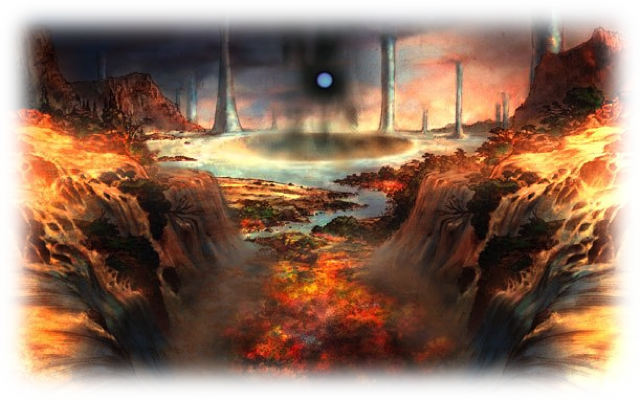{width="3.0519685039370077in"
height="1.9074803149606299in"}

Performances
------------

### Dance

Dances are always Quick physical actions. They are focused on your
opponents, causing injury, reducing their fighting skills and helping
you to get rid of your enemies.

*Witch Hunt* is a level 1 dance. Perform a Water vs Air attack,
difficulty 40. If successful, you deal weapon physical damage on a
target. Instead of losing HP, the target loses MP equal to the damage
dealt.

*Toxic Dance* is a level 1 dance. Perform a Water vs Earth attack,
difficulty 70. If successful, inflict the **Poison** status on a target
during this and the next three rounds.

*Darkness Dance* is a level 1 dance. Perform a Water vs Fire attack,
difficulty 70. If successful, inflict the **Blind** status on a target
until the end of next round.

*Temptation Tango* is a level 2 dance. Perform a Water vs Fire attack,
difficulty 70. If successful, inflict the **Confuse** status on a target
until the end of next round.

*Jitterbug* is a level 2 dance. Perform a Water vs Earth attack,
difficulty 50. If successful, you deal weapon physical damage on a
target. You recover HP equal to half damage dealt.

*Wicked Waltz* is a level 2 dance. Perform a Water vs Water attack,
difficulty 70. If successful, the target loses a third of its current
HP. This is a **Gravity** status effect**.**

*Sword Dance* is a level 3 dance. Perform a Water vs Fire attack,
difficulty 70. If successful, you deal 200% weapon physical damage on a
target.

*Slow Dance* is a level 3 dance. Perform a Water vs Water attack,
difficulty 70. If successful, inflict the **Slow** status on a target
during the next three rounds.

*Break Dance* is a level 3 dance. Perform a Water vs Earth attack,
difficulty 70. If successful, inflict the **Stone** status on a target
until the end of next round.

*Virulent Flourish* is a level 4 dance. Perform a Water vs Earth attack,
difficulty 70. If successful, inflict the **Virus** status on a target
until the end of next round.

*Deadly Duet* is a level 4 dance. Perform a Water vs Water attack,
difficulty 70. If successful, you deal weapon physical damage on a
target. You recover HP and MP equal to half damage dealt.

*Dance of the Dead* is a level 4 dance. Perform a Water vs Air attack,
difficulty 70. If successful, the target is reduced to 0 HP. Treat this
as a **Fatal** type status**.**

*Fatal Flamenco* is a level 5 dance. Perform four Water vs Earth
attacks, difficulty 50, against random enemies. For each success, you
deal weapon physical damage. This action may target the same enemy more
than once.

*Dirty Dancing* is a level 5 dance. Perform a Water vs Fire attack,
difficulty 70. If successful, inflict the **Meltdown** status on a
target until the end of next round.

*Forbidden Dance* is a level 5 dance. Perform a Water vs Water attack,
difficulty 70. If successful, roll 1d10 for each enemy in the opposing
group. Inflict a status to each enemy hit until the end of the next
round, according to the die roll: 1 - **Blind;** 2 - **Condemn;** 3 -
**Confuse;** 4 - **Disable;** 5 - **Poison**; 6 - **Berserk**; 7 --
**Immobilize;** 8 - **Stop;** 9 - **Toad** ;10 - **Zombie.**

### Song

Songs are always *Ranged* Quick magical actions. They are focused on
your allies, increasing their fighting skills and turning you into a
powerful support to your teammates.

*Lullaby* is a level 1 song. Perform a Water vs Fire attack, difficulty
70. If successful, inflict the **Sleep** status on a target until the
end of next round.

*Mambo* is a level 1 song. Choose an ally. Grant the **Strengthen
(Speed)** status to that ally over the next two rounds. You may reduce
the effect\'s duration by 1 round to reduce all target\'s current
initiative dice\'s values by 1, to a minimum of the current phase.

*Elegy is* a level 1 song. Perform a Water vs Water attack, difficulty
70. If successful, inflict the **Weaken (Speed)** status on a target
over the next two rounds. You may reduce the effect\'s duration by 1
round to increase all target\'s current initiative dice\'s values by 1,
to a maximum of 10.

*Water Rondo* is a level 2 song. Perform a Water vs Fire attack,
difficulty 70. If successful, inflict the **Mute** status on a target
until the end of next round.

*Battle Cry* is a level 2 song. Choose an ally. Grant the **Strengthen
(Physical)** status to that ally until the end of the round.

*Etude* is a level 2 song. Choose an ally. Grant the **Strengthen
(Magic)** status to that ally until the end of the round.

*Requiem* is a level 3 song. Perform a Water vs Air attack, difficulty
50. If successful, inflict magical damage to all combatants, allies or
enemies, who possess the **Zombie** status, equal to twice your weapon
damage.

*Element Carol* is a level 3 song. Choose an ally and an element: Fire,
Ice, Lightning, Bio, Light, Shadow, Air, Water or Earth. Grant the
**Resist** (chosen element) status to that ally until the end of the
round. Moreover, while it is under this effect, its weapon gains the
*Elemental Damage* property, dealing damage of the chosen element.

*Seraph Song* is a level 3 song. Perform a Water vs Earth attack,
difficulty 20, targeting your group. You should roll this even if the
targets want to be hit. You and all your allies who are affected by this
performance lose their **Poison** and **Virus** status effects**.** In
addition, affected targets become **Resistant** to **Toxic**--type
status effects until the end of the round.

*Earth Blues* is a level 4 song. Perform a Water vs Earth attack,
difficulty 50, targeting your enemies. If successful, deal
Earth-elemental weapon magical damage to all your enemies.

*Last Song* is a level 4 song. Choose an ally. Grant the **Haste**
status to that ally over the next two rounds.

*Toad Song* is a level 4 song. Take a water attack vs Fire, difficulty
70. If successful, inflict the **Toad** status on a target until the end
of next round.

*Round Warding* is a level 5 song. Choose an ally. Grant the **Shell**
and **Protect** status effects to that ally until the end of the round.

*Hero\'s Rhyme* is a level 5 song. Until the end of the round, when you
use a song to grant or inflict status effects, it will last one extra
round. This song has no effect on *Nameless Song*.

*Nameless Song* is a level 5 song. Perform a Water vs Earth attack,
difficulty 20, targeting your group. You should roll this even if the
targets want to be hit. Roll 1d10 for you and each ally affected by this
performance. Grant a status effect for each target hit, for the next two
rounds, according to the die result: 1 - **Haste;** 2 - **Shell;** 3 --
**Protect** 4 - **Blink;** 5 - **Reraise**; 6 - **Vanish**; 7 -
**Float;** 8 - **Premonition;** 9 - **Regen**; 10 - **Flight.**

### Mimicry

Unlike the other performances, a mimicry can be Quick or Slow, Ranged or
Melee, physical or magical actions. When using a mimicry to repeat an
action of another character, the performance repeats all the action's
characteristics. In addition, you should spend all the necessary
resources to use the action, be it an item, HP or MP. Furthermore,
depending on the performance, it may even be a reaction or even not an
action at all, simply modifying the effects of other actions. If the
mimicked action was a weapon attack, you attack with your own weapon.

*Mimic* is a level 1 mimicry. This action may only be used if the action
performed this round immediately before your turn was carried out by an
ally. You repeat the ally's action, with the same target.

*Mirror Mimic* is a level 1 mimicry. This action may only be used if the
action performed this round immediately before your turn was conducted
by an enemy. You repeat the enemy's action, with the same target. You
may target the enemy who performed the action, instead of the original
target.

*Memory Mimic* is a level 2 mimicry. You repeat an ally's action, with
the same target. You may only repeat actions that were carried out in
this round.

*Reflex Mimic* is a level 2 mimicry. This reaction can only be used when
you and at least one ally are targeted by the same attack. If the ally
conducts a reaction, be it successful or not, you perform the same
reaction.

*Color Splash* is a level 3 mimicry. When you use any mimicry to create
an effect that deals Fire, Ice, Lightning, Bio, Light, Shadow, Air,
Water or Earth-elemental damage, you may swap the action's element for
another element of this list.

*Sketch* is a level 3 mimicry. You repeat an enemy's action, with the
same target. You may target the enemy who performed the action, instead
of the original target. This may repeat any actions that were taken in
this combat.

*Target Mimic* is a level 4 mimicry. When you use any level 3 or lower
mimicry, you can freely choose the action's targets.

*Final Mimic* is a level 4 mimicry. When you are reduced to 0 HP for any
reason, you may, before falling unconscious, discard an initiative die
to repeat the action that befell you, targeting the ally or enemy that
performed the action. The discarded initiative die may have any value.

*Command Mimic* is a level 5 mimicry. Once per combat, before the start
of first round, as a free action, you may choose an Ability of any ally.
You gain the chosen Ability until the combat's end. The chosen Ability
does not have any effect on your maximum HP and MP, neither on the
weapons and armor you may equip.

*Take Over* is a level 5 mimicry. Perform a Water vs Water attack,
difficulty 70. If successful, inflict the **Stop** status on a target
until the end of next round. While it remains under the **Stop** status,
you may use your actions to force it to use one of its actions,
targeting characters of your choice. If you perform any actions before
the end of the next round, the target loses the **Stop** status**.**

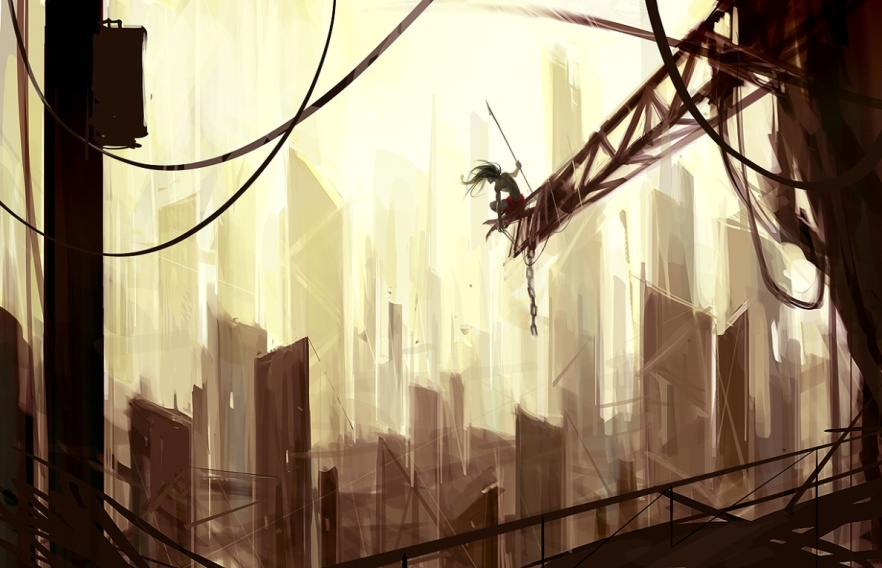{width="3.4118055555555555in" height="2.2in"}

Wealth and Items
----------------

Gil is the currency present in most Final Fantasy games. Depending on
how technologically advanced the world is, it can take many forms: gold
coins, paper money, checks, planetary credit\... Regardless of Gil's
actual format, it will be an abstraction for monetary values.

Gil is a character reward as important as experience. Many Jobs take
into account not only the Stat levels, but also the character's
equipment and items to measure their power. Depriving an Archer, for
example, of a suitable weapon can make the character feel extremely weak
in comparison to a Mage. Imagine an Alchemist who don't even have an
item to use? Gil is such an important reward that there is a Job
dedicated to it: The Rogue.

### Mundane Items

And how much does a mundane item cost? How many feet of rope, how many
torches, how many sleeping bags a character has or may possess? The
answer has to do directly with the economy of a Final Fantasy world:
**mundane items are free**.

Everything that costs Gil refers to combat. All other items should be
designed according to the context and the Challenges and Destiny system,
present in pages 12. Mundane items are a tool for the Game Master to use
in drama; never, in any game in the series, they were important, unless
the situation said so. If you sense that your character should have a
torch, he will. If it is important that your character does not have a
torch, he will not. If you are unsure, use a Challenge. Maybe the
Bottomless Pockets Quirk may help.

This does not mean that the characters have access to everything. For
example, an aircraft, although not combat-related, and therefore a
\"mundane item\", is not available to the characters, unless the Game
Master decides so. Players can't simply demand to own something simply
because the item is mundane, and therefore \"free\", as our example
aircraft. Use that desire to create an adventure -- or a small campaign
arc, perhaps - and then give them the aircraft. Use the acquisition of
the aircraft to support the history, and not as an accounting exercise.

That\'s the spirit of mundane items: something that helps you tell a
story, not an exercise to prepare the best shopping list. Nothing
prevents, however, NPCs to pay big bucks for a mundane item. In fact,
some wealthy patrons might be willing to pay good sums of Gil for a
frame, or a jewel, or a miniaturized reactor that have no value for
player characters. Go figure!

### Acquiring Gil

You can earn Gil in many ways. As a mission's reward; as spoils after
the defeat of enemies; in chests or otherwise scattered in dungeons; by
selling items; among other possibilities. During character creation,
each player can spend 200 Gil in equipment and items. After this, it is
recommended that for each experience point gained by the character, he
should gain 8 Gil. This amount of Gil is enough to keep up with the
proper equipment to their level and to buy enough healing and battle
items. However, the Game Master may adjust this amount, increasing or
decreasing it, to the reality of the gameplay.

Use spoils as a way randomize a bit the Gil rewards. In every combat
encounter, assign one or more items as enemy's booty. At the end of
combat, after winning it, the group will roll a d100 against a set
difficulty. If the die result is greater than the difficulty, they get
the item(s) marked as spoils. When including spoils, multiply its value
and the chance to earn it: the result is the spoils' real value, which
should be deducted from the encounter total. For example, if the Game
Master decide that an encounter shall give two thousand and five hundred
Gil as reward and include a Desert Ring (worth 1,000 Gil) as spoils,
with difficulty 40 (and hence 60% chance of being obtained), it must
deduct the value of six hundred Gil (60% of 1,000). Thus, the group will
receive 1,900 Gil and may earn a Desert Ring (or not).

Game Master, do not be afraid to include spoils in your game and use its
randomness. In the above example, regardless of whether they got the
Desert Ring or not, consider they received the 2,500 Gil. In the long
run, the characters' power will be the same. However, items with 100%
chance of being obtained count as normal reward, not as spoils. In the
previous example, the Game Master could decide that, besides the chance
to gain the Desert Ring, the fight would grant two Hi-Potion (150 Gil
each). Thus, the combat reward would be 1,600 Gil, two Hi-Potion and the
spoils (Desert Ring, difficulty 40). Finally, remember that items' sales
price is half their purchase cost.

### Gil and the Rogue

Early in the game, the Rogue earns an Ability that directly influences
the acquisition of Gil. *Gilionaire, Steal* and *Treasure Hunter* are
ways in which the Rogue increases the amount of Gil available for the
group. This translates into better and stronger items more quickly than
compared with a rogueless group. However, the three skills work
differently and require a different preparation from the Game Master.

{width="3.1506944444444445in"
height="2.4243055555555557in"} *Gilionaire* is the simplest of them.
Whenever the group receives a Gil reward, for any reason, increase by
25% the Rogue's share. For example, a group of four players defeat a
monster and the Game Master says the monster's horns are valuable and
can be sold for a total of 4,000 Gil. But if there is a Rogue with this
Ability in the group, his share (1,000 Gil) increased by 25% - to 1,250
Gil. Thus, when selling the horns, the group collects 4,250 Gil, not
4,000. Similarly, people are willing to pay more for the same service,
and the chests are inexplicably bigger. *Gilionaire* is always active,
and it is the least risky way to increase Gil received.

*Treasure Hunter* is the second way the Rogue can increase the group's
wealth. At the end of combat, when the group trying to gain spoils, the
Rogue can roll the die again, increasing the chance or even giving him
the opportunity to gain double spoils. Compared to *Gilionaire, Treasure
Hunter* is active in fewer moments because it only allows the Rogue to
improve the spoils received and does not affect other Gil gains, but can
provide more significant bonuses when it works, by handing items that
may be crucial when the group simply does not have the time to find a
merchant in a safe place.

*Steal* is the last way the Rogue has to increase the group's wealth. It
also demands a special preparation by the Game Master. When creating a
combat encounter, the GM must decide which are the Common item and the
Rare item that every enemy will have. This is only required if there is
a Rogue with *Steal* in the group. It is not mandatory that each enemy
must have both items; it may have only the Common item, only the Rare
item, or even neither. Regardless, each enemy can only be stolen once.
If the character tries to steal again an enemy who already suffered the
effects of **!Steal**, it automatically fails.

The definition of which item(s) the enemy will have does not depend on
the enemy\'s ability to use, equip or even physically carry the item;
often, characters in Final Fantasy steal swords or even full armor suits
from unsuspecting enemies like dragons or chocobos. Compared to
*Gilionaire* or *Treasure Hunter*, *Steal* is the most expensive and
riskiest action -- it costs actions in combat and is more likely to fail
- but it must be the most rewarding, especially if the Rogue obtain the
Rare item. In addition, the stolen items go to the inventory and are
available for immediate use, even within the combat.

Regardless of how the Rogue earn this extra Gil, the group shall not be
punished for having a Rogue. Rogues with *Gilionaire* should earn on
average 10 Gil per experience point, and Rogues with the other Abilities
could earn even more, depending on their rolls. The Game Master must
resist the temptation to give smaller rewards to its players because
\"The Rogue will steal a difference.\"

Equipment
---------

Equipment is the main use for Gil. Each character can equip exactly one
weapon and armor, plus two accessories. In the case of weapons and
armor, they are divided into categories. Light, Medium and Heavy are the
Armor categories. Weapons can be classified as Light Swords / Knives,
Heavy Weapons & Shield, Heavy Weapons, Polearms, Claws / Gloves, Twin
Weapons, Bows, Throwing Weapons, Rifle / Crossbows, Staffs, Wands and
Instruments.

The character's Abilities indicate which weapons and armor they may
equip. If a character wishes to equip a weapon that he may not, it
doesn't add his Offensive Stat to any roll or attack; If a character
wishes to equip an armor that he may not, he doesn't consider his
Defensive Stat in opponents' rolls or attacks.

All equipment has a minimum level to be used, and most have a Gil cost.
The items that do not have Gil costs are so rare that there are only a
few copies of each in the world or artifacts so
h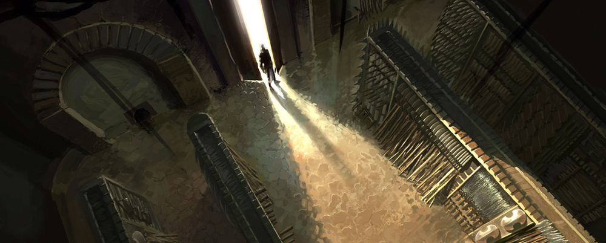{width="6.514566929133858in"
height="2.616535433070866in"}ard to be found that have at most one,
maybe two copies worldwide. Rare and artifact items should be given at
the GM's discretion.

### Armor

Armors are the main defensive equipment. Although some specific armor
can empower attacks, their main function is to reduce the damage
suffered. All armor pieces have two characteristics: Armor (ARM) and
Magic Armor (MARM). Every time you suffer physical damage, decrease the
damage by an amount equal to your ARM. Every time you suffer magical
damage, decrease the damage by an amount equal to your MARM.

{width="0.4937007874015748in"
height="0.43818897637795273in"} For example, a character with MARM 21
suffers a magical attack dealing 46 damage. He loses 25 HP due to his
magical protection. Regardless of ARM and MARM values and the damage
dealt, every successful attack that deals damage causes a minimal loss
of 1 HP. As it takes some time to don an armor suit, it is impossible to
equip or change armor in combat.

#### Light Armor

This armor is commonly used by Mages and Rune Knights. Its main purpose
is to protect against magical damage, being ineffective against physical
damage.

+-----------+-----------+-----------+-----------+-----------+-----------+
| **Name**  | **Minimum | **Cost    | **ARM**   | **MARM**  | **Effect* |
|           | Level**   | (Gil)**   |           |           | *         |
+-----------+-----------+-----------+-----------+-----------+-----------+
| Cotton    | 01        | 100       | 0         | 3         | \-\--     |
| Robe      |           |           |           |           |           |
+-----------+-----------+-----------+-----------+-----------+-----------+
| Snow Cape | 01        | 142       | 0         | 3         | Auto --   |
|           |           |           |           |           | **Resist  |
|           |           |           |           |           | (Ice)**   |
+-----------+-----------+-----------+-----------+-----------+-----------+
| Mistle    | 01        | 143       | 0         | 3         | **Sleep** |
| Robe      |           |           |           |           | Immunity  |
+-----------+-----------+-----------+-----------+-----------+-----------+
| Leather   | 10        | 585       | 2         | 10        | \-\--     |
| Robe      |           |           |           |           |           |
+-----------+-----------+-----------+-----------+-----------+-----------+
| Temple    | 10        | 866       | 2         | 10        | Auto --   |
| Cloth     |           |           |           |           | **Resist  |
|           |           |           |           |           | (Shadow)* |
|           |           |           |           |           | *         |
+-----------+-----------+-----------+-----------+-----------+-----------+
| Thunder   | 10        | 867       | 2         | 10        | **Mute**  |
| Robe      |           |           |           |           | Immunity  |
+-----------+-----------+-----------+-----------+-----------+-----------+
| Linen     | 19        | 1552      | 3         | 15        | \-\--     |
| Robe      |           |           |           |           |           |
+-----------+-----------+-----------+-----------+-----------+-----------+
| Mist Silk | 19        | 2046      | 3         | 15        | Auto --   |
| Robe      |           |           |           |           | **Immune  |
|           |           |           |           |           | (Light)** |
+-----------+-----------+-----------+-----------+-----------+-----------+
| Red Robe  | 19        | 2046      | 7         | 26        | SOS-      |
|           |           |           |           |           | **Mute**  |
+-----------+-----------+-----------+-----------+-----------+-----------+
| Silk Robe | 28        | 2678      | 13        | 36        | \-\--     |
+-----------+-----------+-----------+-----------+-----------+-----------+
| Magician  | 28        | 3797      | 13        | 36        | Add Fire  |
| Robe      |           |           |           |           | level to  |
|           |           |           |           |           | Spells'   |
|           |           |           |           |           | damage    |
+-----------+-----------+-----------+-----------+-----------+-----------+
| Silver    | 28        | 3787      | 13        | 36        | Auto --   |
| Coat      |           |           |           |           | **Resist  |
|           |           |           |           |           | (Crush)** |
+-----------+-----------+-----------+-----------+-----------+-----------+
| Poet Robe | 37        | 5547      | 28        | 65        | \-\--     |
+-----------+-----------+-----------+-----------+-----------+-----------+
| Karate    | 37        | 8391      | 28        | 65        | Decrease  |
| Robe      |           |           |           |           | by 10     |
|           |           |           |           |           | reactions |
|           |           |           |           |           | '         |
|           |           |           |           |           | difficult |
|           |           |           |           |           | y         |
+-----------+-----------+-----------+-----------+-----------+-----------+
| Peace     | 37        | 8368      | 28        | 65        | Auto --   |
| Cape      |           |           |           |           | **Protect |
|           |           |           |           |           | **        |
|           |           |           |           |           |           |
|           |           |           |           |           | Auto **-- |
|           |           |           |           |           | Weaken    |
|           |           |           |           |           | (Physical |
|           |           |           |           |           | )**       |
+-----------+-----------+-----------+-----------+-----------+-----------+
| Scholar   | 46        | 11220     | 41        | 90        | \-\--     |
| Coat      |           |           |           |           |           |
+-----------+-----------+-----------+-----------+-----------+-----------+
| Aqua Robe | 46        | 15422     | 41        | 90        | **Fatal** |
|           |           |           |           |           | Immune    |
+-----------+-----------+-----------+-----------+-----------+-----------+
| Priest\'s | 46        | 15424     | 23        | 90        | SOS-      |
| Robe      |           |           |           |           | **Wall**  |
+-----------+-----------+-----------+-----------+-----------+-----------+
| Tao Robe  | 55        | Rare      | 59        | 127       | Auto--**S |
|           |           |           |           |           | trengthen |
|           |           |           |           |           | (Mental)* |
|           |           |           |           |           | *         |
|           |           |           |           |           | Auto--**S |
|           |           |           |           |           | trengthen |
|           |           |           |           |           | (Magic)** |
+-----------+-----------+-----------+-----------+-----------+-----------+
| Glutton\' | 55        | Rare      | 59        | 127       | Auto --   |
| s         |           |           |           |           | **Absorb  |
| Coat      |           |           |           |           | (Bio)**   |
|           |           |           |           |           |           |
|           |           |           |           |           | **Toxic** |
|           |           |           |           |           | Immune    |
+-----------+-----------+-----------+-----------+-----------+-----------+
| Angel     | 55        | Rare      | 59        | 127       | Auto --   |
| Robe      |           |           |           |           | **Reraise |
|           |           |           |           |           | **        |
|           |           |           |           |           |           |
|           |           |           |           |           | **Gravity |
|           |           |           |           |           | **        |
|           |           |           |           |           | Immune    |
+-----------+-----------+-----------+-----------+-----------+-----------+
| Element   | 64        | Artifact  | 87        | 179       | Auto --   |
| Robe      |           |           |           |           | **Immune  |
|           |           |           |           |           | (Fire,    |
|           |           |           |           |           | Ice, Air, |
|           |           |           |           |           | Lightning |
|           |           |           |           |           | ,         |
|           |           |           |           |           | Earth**   |
|           |           |           |           |           | and       |
|           |           |           |           |           | **Water)* |
|           |           |           |           |           | *         |
+-----------+-----------+-----------+-----------+-----------+-----------+
| Protect   | 64        | Artifact  | 107       | 189       | **Transfo |
| Cape      |           |           |           |           | rmation** |
|           |           |           |           |           | Immune    |
+-----------+-----------+-----------+-----------+-----------+-----------+
| Robe of   | 64        | Artifact  | 87        | 179       | Add twice |
| Lords     |           |           |           |           | Fire      |
|           |           |           |           |           | level to  |
|           |           |           |           |           | Spells'   |
|           |           |           |           |           | damage;   |
|           |           |           |           |           | Maximum   |
|           |           |           |           |           | MP + 20%  |
+-----------+-----------+-----------+-----------+-----------+-----------+

#### Medium Armor

This equipment type is common between different Jobs. Its balanced
physical and magic defenses led them to having no easily exploitable
weakness.

+-----------+-----------+-----------+-----------+-----------+-----------+
| **Name**  | **Minimum | **Cost    | **ARM**   | **MARM**  | **Effect* |
|           | Level**   | (Gil)**   |           |           | *         |
+-----------+-----------+-----------+-----------+-----------+-----------+
| Leather   | 01        | 84        | 1         | 1         | \-\--     |
| Outfit    |           |           |           |           |           |
+-----------+-----------+-----------+-----------+-----------+-----------+
| Storm     | 01        | 121       | 1         | 1         | Auto --   |
| Jerkin    |           |           |           |           | **Resist  |
|           |           |           |           |           | (Lightnin |
|           |           |           |           |           | g)**      |
+-----------+-----------+-----------+-----------+-----------+-----------+
| Training  | 01        | 121       | 1         | 1         | **Blind** |
| Suit      |           |           |           |           | Immunity  |
+-----------+-----------+-----------+-----------+-----------+-----------+
| Bronze    | 10        | 500       | 5         | 5         | \-\--     |
| Vest      |           |           |           |           |           |
+-----------+-----------+-----------+-----------+-----------+-----------+
| Nomad\'s  | 10        | 730       | 5         | 5         | Auto --   |
| Tunic     |           |           |           |           | **Resist  |
|           |           |           |           |           | (Earth)** |
+-----------+-----------+-----------+-----------+-----------+-----------+
| Red       | 10        | 732       | 5         | 5         | **Slow**  |
| Jacket    |           |           |           |           | Immunity  |
+-----------+-----------+-----------+-----------+-----------+-----------+
| Chain     | 19        | 1316      | 7         | 7         | \-\--     |
| Vest      |           |           |           |           |           |
+-----------+-----------+-----------+-----------+-----------+-----------+
| Power     | 19        | 1752      | 7         | 7         | **Weaken  |
| Sash      |           |           |           |           | (Physical |
|           |           |           |           |           | )**       |
|           |           |           |           |           | Immunity  |
+-----------+-----------+-----------+-----------+-----------+-----------+
| Survival  | 19        | 1742      | 7         | 7         | **Weaken  |
| Vest      |           |           |           |           | (Magic)** |
|           |           |           |           |           | Immunity  |
+-----------+-----------+-----------+-----------+-----------+-----------+
| Ring Mail | 28        | 2269      | 21        | 21        | \-\--     |
+-----------+-----------+-----------+-----------+-----------+-----------+
| Chocobo   | 28        | 3201      | 21        | 21        | Add Air   |
| Costume   |           |           |           |           | level     |
|           |           |           |           |           | your      |
|           |           |           |           |           | actions'  |
|           |           |           |           |           | damage,   |
|           |           |           |           |           | except    |
|           |           |           |           |           | Spells    |
|           |           |           |           |           | and       |
|           |           |           |           |           | **!Attack |
|           |           |           |           |           | **        |
+-----------+-----------+-----------+-----------+-----------+-----------+
| Padded    | 28        | 3224      | 21        | 21        | Auto -    |
| Shirt     |           |           |           |           | **Resist  |
|           |           |           |           |           | (Cut)**   |
+-----------+-----------+-----------+-----------+-----------+-----------+
| Mythril   | 37        | 4675      | 42        | 42        | \-\--     |
| Vest      |           |           |           |           |           |
+-----------+-----------+-----------+-----------+-----------+-----------+
| Scorpion  | 37        | 7082      | 42        | 42        | Decrease  |
| Harness   |           |           |           |           | by 10     |
|           |           |           |           |           | physical  |
|           |           |           |           |           | actions'  |
|           |           |           |           |           | difficult |
|           |           |           |           |           | y         |
+-----------+-----------+-----------+-----------+-----------+-----------+
| Mirage    | 37        | 7147      | 42        | 42        | Auto --   |
| Vest      |           |           |           |           | **Blink** |
+-----------+-----------+-----------+-----------+-----------+-----------+
| Brigandin | 46        | 9563      | 60        | 60        | \-\--     |
| e         |           |           |           |           |           |
+-----------+-----------+-----------+-----------+-----------+-----------+
| Judge     | 46        | 13098     | 60        | 60        | **Time**  |
| Coat      |           |           |           |           | Immune    |
+-----------+-----------+-----------+-----------+-----------+-----------+
| Ninja     | 46        | 13055     | 55        | 55        | SOS --    |
| Gear      |           |           |           |           | **Vanish* |
|           |           |           |           |           | *         |
+-----------+-----------+-----------+-----------+-----------+-----------+
| Platinum  | 55        | Rare      | 87        | 87        | **Meltdow |
| Vest      |           |           |           |           | n**       |
|           |           |           |           |           | Immune    |
|           |           |           |           |           |           |
|           |           |           |           |           | Auto --   |
|           |           |           |           |           | **Immune  |
|           |           |           |           |           | (Earth)** |
+-----------+-----------+-----------+-----------+-----------+-----------+
| Behemoth  | 55        | Rare      | 87        | 87        | Auto --   |
| Suit      |           |           |           |           | **Immune  |
|           |           |           |           |           | (Light**  |
|           |           |           |           |           | and       |
|           |           |           |           |           | **Shadow) |
|           |           |           |           |           | **        |
+-----------+-----------+-----------+-----------+-----------+-----------+
| Reaper    | 55        | Rare      | 97        | 97        | **Fatal** |
| Cloak     |           |           |           |           | Immune    |
+-----------+-----------+-----------+-----------+-----------+-----------+
| Braver    | 64        | Artifact  | 119       | 119       | **Weaknes |
| Vest      |           |           |           |           | s**       |
|           |           |           |           |           | Immune    |
|           |           |           |           |           |           |
|           |           |           |           |           | Auto --   |
|           |           |           |           |           | **Strengt |
|           |           |           |           |           | hen       |
|           |           |           |           |           | (Speed)** |
+-----------+-----------+-----------+-----------+-----------+-----------+
| Snow      | 64        | Artifact  | 119       | 119       | Auto -    |
| Muffler   |           |           |           |           | **Absorb  |
|           |           |           |           |           | (Fire,    |
|           |           |           |           |           | Ice** and |
|           |           |           |           |           | **Lightni |
|           |           |           |           |           | ng)**     |
+-----------+-----------+-----------+-----------+-----------+-----------+
| Wygar     | 64        | Artifact  | 129       | 129       | Maximum   |
|           |           |           |           |           | HP + 20%  |
+-----------+-----------+-----------+-----------+-----------+-----------+

#### Heavy Armor

Favoring defense against physical damage, this type of armor is popular
among Warriors and Adepts. However, its vulnerability to magical damage
may be troublesome.

+-----------+-----------+-----------+-----------+-----------+-----------+
| **Name**  | **Minimum | **Cost    | **ARM**   | **MARM**  | **Effect* |
|           | Level**   | (Gil)**   |           |           | *         |
+-----------+-----------+-----------+-----------+-----------+-----------+
| Leather   | 01        | 99        | 3         | 0         | \-\--     |
| Plate     |           |           |           |           |           |
+-----------+-----------+-----------+-----------+-----------+-----------+
| Fire      | 01        | 141       | 3         | 0         | Auto --   |
| Armor     |           |           |           |           | **Resist  |
|           |           |           |           |           | (Fire)**  |
+-----------+-----------+-----------+-----------+-----------+-----------+
| Cobra     | 01        | 141       | 3         | 0         | **Poison* |
| Cuirass   |           |           |           |           | *         |
|           |           |           |           |           | Immunity  |
+-----------+-----------+-----------+-----------+-----------+-----------+
| Bronze    | 10        | 583       | 10        | 2         | \-\--     |
| Armor     |           |           |           |           |           |
+-----------+-----------+-----------+-----------+-----------+-----------+
| Blue      | 10        | 860       | 10        | 2         | Auto -    |
| Plate     |           |           |           |           | **Resist  |
|           |           |           |           |           | (Water)** |
+-----------+-----------+-----------+-----------+-----------+-----------+
| Bone      | 10        | 865       | 10        | 2         | **Disable |
| Plate     |           |           |           |           | d**       |
|           |           |           |           |           | Immunity  |
+-----------+-----------+-----------+-----------+-----------+-----------+
| Plate     | 19        | 1555      | 15        | 3         | \-\--     |
| Mail      |           |           |           |           |           |
+-----------+-----------+-----------+-----------+-----------+-----------+
| Storm     | 19        | 2047      | 15        | 3         | Auto -    |
| Plate     |           |           |           |           | **Immune  |
|           |           |           |           |           | (Air)**   |
+-----------+-----------+-----------+-----------+-----------+-----------+
| Viking    | 19        | 2060      | 26        | 7         | SOS --    |
| Armor     |           |           |           |           | **Berserk |
|           |           |           |           |           | **        |
+-----------+-----------+-----------+-----------+-----------+-----------+
| Silver    | 28        | 2667      | 36        | 13        | \-\--     |
| Mail      |           |           |           |           |           |
+-----------+-----------+-----------+-----------+-----------+-----------+
| Soldier\' | 28        | 3801      | 36        | 13        | Add Earth |
| s         |           |           |           |           | level to  |
| Armor     |           |           |           |           | **!Attack |
|           |           |           |           |           | **        |
|           |           |           |           |           | action's  |
|           |           |           |           |           | damage    |
+-----------+-----------+-----------+-----------+-----------+-----------+
| Carapace  | 28        | 3777      | 36        | 13        | Auto -    |
| Mail      |           |           |           |           | **Resist  |
|           |           |           |           |           | (Puncture |
|           |           |           |           |           | )**       |
+-----------+-----------+-----------+-----------+-----------+-----------+
| Mythril   | 37        | 5549      | 65        | 28        | \-\--     |
| Armor     |           |           |           |           |           |
+-----------+-----------+-----------+-----------+-----------+-----------+
| Force     | 37        | 8382      | 65        | 28        | Decrease  |
| Armor     |           |           |           |           | by 10     |
|           |           |           |           |           | magical   |
|           |           |           |           |           | actions   |
|           |           |           |           |           | and       |
|           |           |           |           |           | Spell's   |
|           |           |           |           |           | difficult |
|           |           |           |           |           | y         |
+-----------+-----------+-----------+-----------+-----------+-----------+
| Shell     | 37        | 8334      | 65        | 28        | Auto --   |
| Mail      |           |           |           |           | **Shell** |
+-----------+-----------+-----------+-----------+-----------+-----------+
| Gold      | 46        | 11261     | 90        | 41        | \-\--     |
| Armor     |           |           |           |           |           |
+-----------+-----------+-----------+-----------+-----------+-----------+
| Aurora    | 46        | 15418     | 90        | 41        | **Seal**  |
| Mail      |           |           |           |           | Immune    |
+-----------+-----------+-----------+-----------+-----------+-----------+
| Reflect   | 46        | 15459     | 90        | 23        | SOS --    |
| Plate     |           |           |           |           | **Reflect |
|           |           |           |           |           | **        |
+-----------+-----------+-----------+-----------+-----------+-----------+
| Platinum  | 55        | Rare      | 127       | 59        | Auto -    |
| Armor     |           |           |           |           | **Strengt |
|           |           |           |           |           | hen       |
|           |           |           |           |           | (Armor)** |
|           |           |           |           |           | Auto -    |
|           |           |           |           |           | **Strengt |
|           |           |           |           |           | hen       |
|           |           |           |           |           | (Physical |
|           |           |           |           |           | )**       |
+-----------+-----------+-----------+-----------+-----------+-----------+
| Carabini  | 55        | Rare      | 127       | 59        | At the    |
| Mail      |           |           |           |           | beginning |
|           |           |           |           |           | of each   |
|           |           |           |           |           | round,    |
|           |           |           |           |           | choose    |
|           |           |           |           |           | one:      |
|           |           |           |           |           | Immune    |
|           |           |           |           |           | (**Cut,   |
|           |           |           |           |           | Crush**   |
|           |           |           |           |           | or        |
|           |           |           |           |           | **Punctur |
|           |           |           |           |           | e)**      |
+-----------+-----------+-----------+-----------+-----------+-----------+
| Dragon    | 55        | Rare      | 127       | 59        | Maximum   |
| Mail      |           |           |           |           | HP + 10%  |
|           |           |           |           |           |           |
|           |           |           |           |           | Add Earth |
|           |           |           |           |           | level to  |
|           |           |           |           |           | **!Attack |
|           |           |           |           |           | **        |
|           |           |           |           |           | action's  |
|           |           |           |           |           | damage    |
+-----------+-----------+-----------+-----------+-----------+-----------+
| Aegis     | 64        | Artifact  | 179       | 87        | Auto -    |
| Armor     |           |           |           |           | **Float;  |
|           |           |           |           |           | Mental**  |
|           |           |           |           |           | Immune    |
+-----------+-----------+-----------+-----------+-----------+-----------+
| Genji     | 64        | Artifact  | 189       | 107       | All       |
| Armor     |           |           |           |           | Negative  |
|           |           |           |           |           | Status    |
|           |           |           |           |           | Resist    |
+-----------+-----------+-----------+-----------+-----------+-----------+
| Maximilia | 64        | Artifact  | 179       | 87        | Special,  |
| n         |           |           |           |           | see below |
|           |           |           |           |           | \*        |
+-----------+-----------+-----------+-----------+-----------+-----------+

\*Maximilian grants **Immune (Light, Shadow** and **Bio)** and **Resist
(Cut, Crush** and **Puncture)**

### Weapons

Weapons are the main offensive equipment. Unlike armor, which are very
similar, weapons are quite different from each other. Each weapon has an
Offensive Stat and a Defensive Stat. When you use the **!Attack** or any
other action who needs a "weapon attack", you attack using the equipped
weapon's Offensive and Defensive Stats, and deal damage based on its
Offensive Stat, unless the action says otherwise. For example,
Flamberge's (a Light Sword / Knife) damage is equal to 10 x. As its
Offensive Stat is Air, the damage will be equal to ten times your Air
level.

In addition, the attack and damage type (physical or magical), the
element (usually Cut, Puncture or Crush), and if the attack is *Ranged*
or Melee, all depends on the equipped weapon.

Every action that needs a weapon attack to hit and does not state the
action's range (*Ranged* or Melee), and/or the action's element uses the
weapon's range and element. Actions that do state their range and/or
element override the weapon's characteristics.

Many weapons also have special effects. All effects that modify the
weapon's attack or damage only work with the **!Attack** action, unless
the action says otherwise. The exceptions to this rule are all effects
that increase damage by some Stat level, like the Colichemarde, and the
*Soul Eater* weapon ability. Actions that key off weapon damage use the
damage increased by the special effect, and *Soul Eater* applies to all
actions made with that weapon that requires a weapon attack.

{width="5.863385826771654in"
height="4.360236220472441in"}

#### Light Swords / Knives

Fast weapons that deal Puncture-elemental physical damage. Its Offensive
and Defensive Stats are Air. Due to its weak damage, they are a
defensive option. While you are equipped with these weapons, you can use
the reaction **!Parry**. Use it when you suffer a physical attack. Roll
Air vs Air, difficulty 40. If successful, you don't suffer the attack\'s
effects. These weapons are always Melee.

+-------------+-------------+-------------+-------------+-------------+
| **Name**    | **Min       | **Cost      | **Damage**  | **Effect**  |
|             | level**     | (Gil)**     |             |             |
+-------------+-------------+-------------+-------------+-------------+
| Epee        | 01          | 55          | 2 x         | \-\--       |
+-------------+-------------+-------------+-------------+-------------+
| Stinger     | 01          | 78          | 2 x         | **Poison**  |
|             |             |             |             | Touch       |
+-------------+-------------+-------------+-------------+-------------+
| Dream       | 01          | 90          | 2 x         | **Sleep**   |
| Rapier      |             |             |             | Touch       |
+-------------+-------------+-------------+-------------+-------------+
| Silver      | 10          | 330         | 3 x         | \-\--       |
| Rapier      |             |             |             |             |
+-------------+-------------+-------------+-------------+-------------+
| Scarlette   | 10          | 495         | 3 x         | **Fire-**el |
|             |             |             |             | emental     |
|             |             |             |             | damage      |
+-------------+-------------+-------------+-------------+-------------+
| Magic       | 10          | 482         | 3 x         | SOS --      |
| Needle      |             |             |             | **Strenghte |
|             |             |             |             | n           |
|             |             |             |             | (Magic)**   |
+-------------+-------------+-------------+-------------+-------------+
| Estoc       | 19          | 750         | 5 x         | \-\--       |
+-------------+-------------+-------------+-------------+-------------+
| Fleuret     | 19          | 1150        | 6 x         | \-\--       |
+-------------+-------------+-------------+-------------+-------------+
| Djinn       | 19          | 1070        | 5 x         | **Air-**ele |
| Flyssa      |             |             |             | mental      |
|             |             |             |             | damage      |
+-------------+-------------+-------------+-------------+-------------+
| Mythril     | 28          | 1500        | 8 x         | \-\--       |
| Rapier      |             |             |             |             |
+-------------+-------------+-------------+-------------+-------------+
| Mail        | 28          | 2250        | 8 x         | Piercing    |
| Breaker     |             |             |             |             |
+-------------+-------------+-------------+-------------+-------------+
| Blood       | 28          | 2440        | 8 x         | HP Drain    |
| Rapier      |             |             |             |             |
+-------------+-------------+-------------+-------------+-------------+
| Flamberge   | 37          | 3480        | 10 x        | \-\--       |
+-------------+-------------+-------------+-------------+-------------+
| Colichemard | 37          | 5460        | 10 x        | Add twice   |
| e           |             |             |             | Fire level  |
|             |             |             |             | to damage   |
+-------------+-------------+-------------+-------------+-------------+
| Joyeuse     | 37          | 5130        | 10 x        | **Blind**   |
|             |             |             |             | Strike      |
+-------------+-------------+-------------+-------------+-------------+
| Main Gauche | 46          | 6160        | 13 x        | \-\--       |
+-------------+-------------+-------------+-------------+-------------+
| Holy Degen  | 46          | 9000        | 13 x        | **Light-**e |
|             |             |             |             | lemental    |
|             |             |             |             | damage      |
+-------------+-------------+-------------+-------------+-------------+
| Guespire    | 46          | 9520        | 13 x        | **Mute**    |
|             |             |             |             | Touch       |
+-------------+-------------+-------------+-------------+-------------+
| Epeprism    | 55          | Rare        | 14 x        | Auto-**Refl |
|             |             |             |             | ect**       |
+-------------+-------------+-------------+-------------+-------------+
| Dragon Fang | 55          | Rare        | 14 x        | **Dragon**  |
|             |             |             |             | Killer;     |
|             |             |             |             | SOS-**Haste |
|             |             |             |             | **          |
+-------------+-------------+-------------+-------------+-------------+
| Last Letter | 55          | Rare        | 14 x        | **Immobiliz |
|             |             |             |             | e**         |
|             |             |             |             | Touch       |
+-------------+-------------+-------------+-------------+-------------+
| Femme       | 64          | Artifact    | 16 x        | **Shadow-** |
| Fatale      |             |             |             | elemental   |
|             |             |             |             | damage      |
|             |             |             |             |             |
|             |             |             |             | **Death**   |
|             |             |             |             | Touch       |
+-------------+-------------+-------------+-------------+-------------+
| Gustavian   | 64          | Artifact    | 16 x        | **Disable** |
|             |             |             |             | Touch       |
|             |             |             |             |             |
|             |             |             |             | Decrease by |
|             |             |             |             | 10          |
|             |             |             |             | **!Parry**  |
|             |             |             |             | difficulty  |
+-------------+-------------+-------------+-------------+-------------+
| Diabolique  | 64          | Artifact    | 16 x        | Auto-**Hast |
|             |             |             |             | e**         |
|             |             |             |             |             |
|             |             |             |             | Decrease by |
|             |             |             |             | 10          |
|             |             |             |             | **!Attack** |
|             |             |             |             | difficulty  |
+-------------+-------------+-------------+-------------+-------------+

#### Heavy Weapons & Shield

One-handed swords, axes, hammers, maces and flails, used in conjunction
with a reliable shield. Swords and axes deal Cut-elemental damage, while
hammers, maces and flails deal Crush-elemental damage. It is considered
a primarily defensive option as it doesn't have high damage. Their
Offensive and Defensive Stats are Earth. While you are equipped with
these weapons, you can use the reaction **!Block**. Use when you are hit
by a physical attack. Roll Earth vs Earth, difficulty 40. If successful
you do not suffer the effects of the attack.

+-------------+-------------+-------------+-------------+-------------+
| **Name**\*  | **Min       | **Cost      | **Damage**  | **Effect**  |
|             | level**     | (Gil)**     |             |             |
+-------------+-------------+-------------+-------------+-------------+
| Short Sword | 1           | 55          | 2 x         | \-\--       |
| / Bronze    |             |             |             |             |
| Mace        |             |             |             |             |
+-------------+-------------+-------------+-------------+-------------+
| Twilight    | 1           | 79          | 2 x         | **Blind**   |
| Steel       |             |             |             | Touch       |
+-------------+-------------+-------------+-------------+-------------+
| Hammer of   | 1           | 90          | 2 x         | **Weaken    |
| Fear        |             |             |             | (Mental)**  |
|             |             |             |             | Touch       |
+-------------+-------------+-------------+-------------+-------------+
| Long Sword  | 10          | 332         | 3 x         | \-\--       |
| / Iron Mace |             |             |             |             |
+-------------+-------------+-------------+-------------+-------------+
| Ice Saber   | 10          | 498         | 3 x         | **Ice-**ele |
|             |             |             |             | mental      |
|             |             |             |             | damage      |
+-------------+-------------+-------------+-------------+-------------+
| Blue Flail  | 10          | 484         | 3 x         | Add your    |
|             |             |             |             | Water level |
|             |             |             |             | to damage   |
+-------------+-------------+-------------+-------------+-------------+
| Bastard     | 19          | 753         | 5 x         | \-\--       |
| Sword /     |             |             |             |             |
| Morningstar |             |             |             |             |
+-------------+-------------+-------------+-------------+-------------+
| Mind Flail  | 19          | 1157        | 5 x         | MP Drain    |
+-------------+-------------+-------------+-------------+-------------+
| Ancient     | 19          | 1077        | 5 x         | **Earth-**e |
| Sword       |             |             |             | lemental    |
|             |             |             |             | Damage      |
+-------------+-------------+-------------+-------------+-------------+
| Mythril     | 28          | 1503        | 8 x         | \-\--       |
| Sword /     |             |             |             |             |
| Mythril     |             |             |             |             |
| Mace        |             |             |             |             |
+-------------+-------------+-------------+-------------+-------------+
| Watchful    | 28          | 2268        | 8 x         | **Beast**   |
|             |             |             |             | Killer      |
+-------------+-------------+-------------+-------------+-------------+
| Regal       | 28          | 2446        | 9 x         | \-\--       |
| Cutlass     |             |             |             |             |
+-------------+-------------+-------------+-------------+-------------+
| Falchion /  | 37          | 3483        | 10 x        | \-\--       |
| Triple      |             |             |             |             |
| Flail       |             |             |             |             |
+-------------+-------------+-------------+-------------+-------------+
| Blood       | 37          | 5484        | 10 x        | Improved    |
| Hammer      |             |             |             | Critical    |
+-------------+-------------+-------------+-------------+-------------+
| Demon       | 37          | 5170        | 10 x        | **Demon**   |
| Slicer      |             |             |             | Killer      |
+-------------+-------------+-------------+-------------+-------------+
| Scimitar /  | 46          | 6203        | 13 x        | \-\--       |
| War Hammer  |             |             |             |             |
+-------------+-------------+-------------+-------------+-------------+
| Cold Steel  | 46          | 9022        | 13 x        | **Slow**    |
|             |             |             |             | Touch       |
+-------------+-------------+-------------+-------------+-------------+
| Soul Saber  | 46          | 9587        | 13 x        | Piercing    |
+-------------+-------------+-------------+-------------+-------------+
| Enhancer    | 55          | Rare        | 14 x        | Auto -      |
|             |             |             |             | **Strengthe |
|             |             |             |             | n           |
|             |             |             |             | (Magic)**   |
|             |             |             |             |             |
|             |             |             |             | Auto -      |
|             |             |             |             | **Strengthe |
|             |             |             |             | n           |
|             |             |             |             | (Physical)* |
|             |             |             |             | *           |
+-------------+-------------+-------------+-------------+-------------+
| Mage Killer | 55          | Rare        | 14 x        | Auto --     |
|             |             |             |             | **Shell;**  |
|             |             |             |             | Arcane      |
|             |             |             |             | damage      |
+-------------+-------------+-------------+-------------+-------------+
| Dancing     | 55          | Rare        | 14 x        | **Confuse** |
| Saber       |             |             |             | Touch       |
|             |             |             |             |             |
|             |             |             |             | Add your    |
|             |             |             |             | Air level   |
|             |             |             |             | to damage   |
+-------------+-------------+-------------+-------------+-------------+
| Ragnarok    | 64          | Artifact    | 16 x        | **Light-**e |
|             |             |             |             | lemental    |
|             |             |             |             | Damage      |
|             |             |             |             |             |
|             |             |             |             | **Stop**    |
|             |             |             |             | Touch       |
+-------------+-------------+-------------+-------------+-------------+
| Excalibur   | 64          | Artifact    | 16 x        | Auto -      |
|             |             |             |             | **Haste**   |
|             |             |             |             |             |
|             |             |             |             | Add your    |
|             |             |             |             | Fire level  |
|             |             |             |             | to damage   |
+-------------+-------------+-------------+-------------+-------------+
| Plague      | 64          | Artifact    | 16 x        | **Virus**   |
| Bearer      |             |             |             | Strike      |
|             |             |             |             |             |
|             |             |             |             | Critical    |
|             |             |             |             | Spell       |
|             |             |             |             | (**Venom**) |
|             |             |             |             |             |
|             |             |             |             | **Bio-**ele |
|             |             |             |             | mental      |
|             |             |             |             | damage      |
+-------------+-------------+-------------+-------------+-------------+

> *\* The suggested names exist for ease of reference. If, for example,
> you want to buy a mace that deals Crush-elemental damage equal to 13 x
> Earth level and is Piercing, nothing prevents you from renaming the
> Soul Saber as Soul Mace.*

#### Heavy Weapons

Two-handed swords, axes, sledgehammers, pickaxes, scythes and flails
that deal physical damage. Swords, axes and scythes deal Cut-elemental
damage, hammers and flails deal Crush-elemental damage, while pickaxes
deal Puncture-elemental damage. These weapons are the Earth - based
choice with the highest damage potential. Its Offensive and Defensive
Stats are Earth. This weapon type is widely used by characters who favor
offense over defense.

+-------------+-------------+-------------+-------------+-------------+
| **Name\***  | **Min       | **Cost      | **Damage**  | **Effect**  |
|             | level**     | (Gil)**     |             |             |
+-------------+-------------+-------------+-------------+-------------+
| Bronze Axe  | 1           | 70          | 3 x         | \-\--       |
| /           |             |             |             |             |
|             |             |             |             |             |
| Bronze Maul |             |             |             |             |
+-------------+-------------+-------------+-------------+-------------+
| Coral Sword | 1           | 92          | 3 x         | **Lightning |
|             |             |             |             | -**elementa |
|             |             |             |             | l           |
|             |             |             |             | damage      |
+-------------+-------------+-------------+-------------+-------------+
| Poison      | 1           | 108         | 3 x         | **Poison**  |
| Steel       |             |             |             | Touch       |
+-------------+-------------+-------------+-------------+-------------+
| Iron Axe /  | 10          | 412         | 5 x         | \-\--       |
|             |             |             |             |             |
| Iron Maul   |             |             |             |             |
+-------------+-------------+-------------+-------------+-------------+
| Gishdancer  | 10          | 620         | 5 x         | Add your    |
|             |             |             |             | Fire level  |
|             |             |             |             | to damage   |
+-------------+-------------+-------------+-------------+-------------+
| Cosmic Axe  | 10          | 595         | 5 x         | Critical    |
|             |             |             |             | Spell       |
|             |             |             |             | (**Meteorit |
|             |             |             |             | e**)        |
+-------------+-------------+-------------+-------------+-------------+
| Steel Axe / | 19          | 1090        | 7 x         | \-\--       |
| Steel Maul  |             |             |             |             |
+-------------+-------------+-------------+-------------+-------------+
| Air Pick    | 19          | 1380        | 6 x         | Auto --     |
|             |             |             |             | **Flight**  |
+-------------+-------------+-------------+-------------+-------------+
| Demon Blade | 19          | 1510        | 9 x         | Soul Eater  |
+-------------+-------------+-------------+-------------+-------------+
| Mythril Axe | 28          | 1880        | 10 x        | \-\--       |
| / Mythril   |             |             |             |             |
| Pick        |             |             |             |             |
+-------------+-------------+-------------+-------------+-------------+
| Old Axe     | 28          | 2620        | 10 x        | **Slow**    |
|             |             |             |             | Touch       |
+-------------+-------------+-------------+-------------+-------------+
| Arcane      | 28          | 2710        | 10 x        | Arcane      |
| Buster      |             |             |             | damage      |
+-------------+-------------+-------------+-------------+-------------+
| War Scythe  | 37          | 3890        | 12 x        | \-\--       |
+-------------+-------------+-------------+-------------+-------------+
| Viking Axe  | 37          | 5770        | 12 x        | **Berserk** |
|             |             |             |             | Touch       |
+-------------+-------------+-------------+-------------+-------------+
| Greatsword  | 37          | 6020        | 13 x        | \-\--       |
+-------------+-------------+-------------+-------------+-------------+
| War Axe /   | 46          | 7902        | 15 x        | \-\--       |
|             |             |             |             |             |
| War Maul    |             |             |             |             |
+-------------+-------------+-------------+-------------+-------------+
| Blood Axe   | 46          | 11810       | 15 x        | HP Drain    |
+-------------+-------------+-------------+-------------+-------------+
| Golem       | 46          | 9890        | 15 x        | **Construct |
| Buster      |             |             |             | **          |
|             |             |             |             | Destroyer   |
+-------------+-------------+-------------+-------------+-------------+
| Save the    | 55          | Rare        | 17 x        | Add twice   |
| Queen       |             |             |             | Fire level  |
|             |             |             |             | to damage   |
+-------------+-------------+-------------+-------------+-------------+
| Hexenjäger  | 55          | Rare        | 17 x        | Arcane      |
|             |             |             |             | destruction |
|             |             |             |             |             |
|             |             |             |             | Critical    |
|             |             |             |             | Spell       |
|             |             |             |             | (**Dispel)* |
|             |             |             |             | *           |
+-------------+-------------+-------------+-------------+-------------+
| Lionheart   | 55          | Rare        | 17 x        | Auto        |
|             |             |             |             | **Protect;* |
|             |             |             |             | *           |
|             |             |             |             | SOS-        |
|             |             |             |             | **Blink**   |
+-------------+-------------+-------------+-------------+-------------+
| Juggernaut  | 64          | Artifact    | 21 x        | SOS --      |
|             |             |             |             | **Regen**   |
|             |             |             |             |             |
|             |             |             |             | Auto --     |
|             |             |             |             | **Strengthe |
|             |             |             |             | n           |
|             |             |             |             | (Mental)**  |
+-------------+-------------+-------------+-------------+-------------+
| Executioner | 64          | Artifact    | 20 x        | Auto --     |
|             |             |             |             | **Premoniti |
|             |             |             |             | on**        |
|             |             |             |             |             |
|             |             |             |             | **Shadow-** |
|             |             |             |             | elemental   |
|             |             |             |             | damage      |
+-------------+-------------+-------------+-------------+-------------+
| Apocalypse  | 64          | Artifact    | 20 x        | Ignores the |
|             |             |             |             | target\'s   |
|             |             |             |             | Armor       |
|             |             |             |             |             |
|             |             |             |             | **Fire-**el |
|             |             |             |             | emental     |
|             |             |             |             | damage      |
+-------------+-------------+-------------+-------------+-------------+

> *\* The suggested names exist for ease of reference. If, for example,
> you want to buy a pickax that deals Puncture-elemental damage equal to
> 10 x Earth level, with Slow Touch, nothing prevents you from renaming
> the Old Axe as Old Pick.*

#### Polearms

Spears, glaives and other two-handed weapons that deal
Puncture-elemental physical damage. Its Offensive Stat may be Earth or
Air, and its Defensive Stat is Earth. Due to its versatility, you must
choose whether to use Earth or Air as the Offensive Stat for each attack
with this weapon type. They are a good option for characters that want
to deal a good physical damage and need high levels in both Air and
Earth, as the Warrior.

+-------------+-------------+-------------+-------------+-------------+
| **Name**    | **Min       | **Cost      | **Damage**  | **Effect**  |
|             | level**     | (Gil)**     |             |             |
+-------------+-------------+-------------+-------------+-------------+
| Iron Spear  | 1           | 63          | 3 x         | \-\--       |
+-------------+-------------+-------------+-------------+-------------+
| Harpoon     | 1           | 85          | 3 x         | **Aquan**   |
|             |             |             |             | Killer      |
+-------------+-------------+-------------+-------------+-------------+
| Hunter\'s   | 1           | 99          | 3 x         | Sensor      |
| Spear       |             |             |             |             |
+-------------+-------------+-------------+-------------+-------------+
| Steel Lance | 10          | 371         | 4 x         | \-\--       |
+-------------+-------------+-------------+-------------+-------------+
| Zephyr Pike | 10          | 558         | 4 x         | **Air-**ele |
|             |             |             |             | mental      |
|             |             |             |             | damage      |
+-------------+-------------+-------------+-------------+-------------+
| Shaman\'s   | 10          | 539         | 4 x         | Add Fire    |
| Lance       |             |             |             | level to    |
|             |             |             |             | damage      |
+-------------+-------------+-------------+-------------+-------------+
| Mythril     | 19          | 920         | 6 x         | \-\--       |
| Pike        |             |             |             |             |
+-------------+-------------+-------------+-------------+-------------+
| Halberd     | 19          | 1265        | 6 x         | SOS-        |
|             |             |             |             | **Haste**   |
+-------------+-------------+-------------+-------------+-------------+
| Web Lance   | 19          | 1290        | 6 x         | **Slow**    |
|             |             |             |             | Touch       |
+-------------+-------------+-------------+-------------+-------------+
| Gold Lance  | 28          | 1690        | 9 x         | \-\--       |
+-------------+-------------+-------------+-------------+-------------+
| Manhunter   | 28          | 2435        | 9 x         | **Humanoid* |
|             |             |             |             | *           |
|             |             |             |             | Killer      |
+-------------+-------------+-------------+-------------+-------------+
| Stout Spear | 28          | 2575        | 9 x         | **Mute**    |
|             |             |             |             | Touch       |
+-------------+-------------+-------------+-------------+-------------+
| Partisan    | 37          | 3685        | 11 x        | \-\--       |
+-------------+-------------+-------------+-------------+-------------+
| Grey Lance  | 37          | 5615        | 11 x        | Auto --     |
|             |             |             |             | **Strengthe |
|             |             |             |             | n           |
|             |             |             |             | (Magic)**   |
+-------------+-------------+-------------+-------------+-------------+
| Viper       | 37          | 5575        | 11 x        | Piercing    |
| Halberd     |             |             |             |             |
+-------------+-------------+-------------+-------------+-------------+
| Glaive      | 46          | 7031        | 14 x        | \-\--       |
+-------------+-------------+-------------+-------------+-------------+
| Guisarme    | 46          | 10405       | 15 x        | \-\--       |
+-------------+-------------+-------------+-------------+-------------+
| Stoic Lance | 46          | 9705        | 14 x        | **Disable** |
|             |             |             |             | Touch       |
+-------------+-------------+-------------+-------------+-------------+
| Berserker   | 55          | Rare        | 16 x        | Add twice   |
| Spear       |             |             |             | Water level |
|             |             |             |             | to damage   |
+-------------+-------------+-------------+-------------+-------------+
| Imp Halberd | 55          | Rare        | 16 x        | **Toad**    |
|             |             |             |             | Touch       |
|             |             |             |             |             |
|             |             |             |             | **Water-**e |
|             |             |             |             | lemental    |
|             |             |             |             | damage      |
+-------------+-------------+-------------+-------------+-------------+
| Kain\'s     | 55          | Rare        | 16 x        | Auto --     |
| Lance       |             |             |             | **Blink**   |
|             |             |             |             |             |
|             |             |             |             | Auto --     |
|             |             |             |             | **Strengthe |
|             |             |             |             | n           |
|             |             |             |             | (Armor)**   |
+-------------+-------------+-------------+-------------+-------------+
| Highwind    | 64          | Artifact    | 18 x        | Improved    |
|             |             |             |             | Critical    |
|             |             |             |             |             |
|             |             |             |             | MP Drain    |
+-------------+-------------+-------------+-------------+-------------+
| Thanatos    | 64          | Artifact    | 18 x        | **Death**   |
| Lance       |             |             |             | Touch       |
|             |             |             |             |             |
|             |             |             |             | **Bio-**ele |
|             |             |             |             | mental      |
|             |             |             |             | damage      |
+-------------+-------------+-------------+-------------+-------------+
| Gungnir     | 64          | Artifact    | 20 x        | **Sleep**   |
|             |             |             |             | Strike      |
|             |             |             |             |             |
|             |             |             |             | Soul Eater  |
+-------------+-------------+-------------+-------------+-------------+

#### Claws / Gloves

Claws and gloves are Monks' signature weapon, but almost any character
can fight well with them. They deal physical damage, with Gloves dealing
Crush-elemental and Claws dealing Cut-elemental damage. Its Offensive
Stat is Earth, and its Defensive Stat is Air. Its low cost and ease of
use make this weapon a good option for characters that don't want to
worry too much about weapons, and its broad spectrum of effects mean
that any character can benefit if you choose the right Claw or Glove.

+-------------+-------------+-------------+-------------+-------------+
| **Name\***  | **Min       | **Cost      | **Damage**  | **Effect**  |
|             | level**     | (Gil)**     |             |             |
+-------------+-------------+-------------+-------------+-------------+
| Leather     | 1           | 55          | 2 x         | \-\--       |
| Glove /     |             |             |             |             |
|             |             |             |             |             |
| Bronze      |             |             |             |             |
| Claws       |             |             |             |             |
+-------------+-------------+-------------+-------------+-------------+
| Storm Claws | 1           | 78          | 2 x         | **Lightning |
|             |             |             |             | -**elementa |
|             |             |             |             | l           |
|             |             |             |             | damage      |
+-------------+-------------+-------------+-------------+-------------+
| Sonar       | 1           | 90          | 2 x         | Sensor      |
+-------------+-------------+-------------+-------------+-------------+
| Metal       | 10          | 331         | 3 x         | \-\--       |
| Knuckle /   |             |             |             |             |
|             |             |             |             |             |
| Iron Claws  |             |             |             |             |
+-------------+-------------+-------------+-------------+-------------+
| Dusk        | 10          | 497         | 3 x         | **Poison**  |
| Knuckle     |             |             |             | Touch       |
+-------------+-------------+-------------+-------------+-------------+
| Mirage      | 10          | 483         | 3 x         | **Earth-**e |
| Claws       |             |             |             | lemental    |
|             |             |             |             | damage      |
+-------------+-------------+-------------+-------------+-------------+
| Mythril     | 19          | 749         | 5 x         | \-\--       |
| Glove /     |             |             |             |             |
|             |             |             |             |             |
| Mythril     |             |             |             |             |
| Claw        |             |             |             |             |
+-------------+-------------+-------------+-------------+-------------+
| Scissor     | 19          | 1144        | 5 x         | HP Drain    |
| Fangs       |             |             |             |             |
+-------------+-------------+-------------+-------------+-------------+
| Magic Glove | 19          | 1070        | 5 x         | **Sleep**   |
|             |             |             |             | Touch       |
+-------------+-------------+-------------+-------------+-------------+
| Gold Glove  | 28          | 1497        | 8 x         | \-\--       |
| /           |             |             |             |             |
|             |             |             |             |             |
| Hell Claws  |             |             |             |             |
+-------------+-------------+-------------+-------------+-------------+
| Meteo       | 28          | 2239        | 8 x         | Critical    |
| Knuckle     |             |             |             | Spell       |
|             |             |             |             | (**Meteorit |
|             |             |             |             | e**)        |
+-------------+-------------+-------------+-------------+-------------+
| Avenger     | 28          | 2447        | 8 x         | **Slow**    |
|             |             |             |             | Touch       |
+-------------+-------------+-------------+-------------+-------------+
| Tiger Fangs | 37          | 3479        | 10 x        | \-\--       |
| /Power      |             |             |             |             |
| Knuckle     |             |             |             |             |
+-------------+-------------+-------------+-------------+-------------+
| Prism Claws | 37          | 5485        | 10 x        | Add Air     |
|             |             |             |             | level to    |
|             |             |             |             | damage      |
+-------------+-------------+-------------+-------------+-------------+
| The Reaper  | 37          | 5136        | 10 x        | **Shadow-** |
|             |             |             |             | elemental   |
|             |             |             |             | damage      |
|             |             |             |             | **Condemn** |
|             |             |             |             | Touch       |
+-------------+-------------+-------------+-------------+-------------+
| Kaiser      | 46          | 6174        | 13 x        | \-\--       |
| Claws       |             |             |             |             |
| /Kaiser     |             |             |             |             |
| Knuckle     |             |             |             |             |
+-------------+-------------+-------------+-------------+-------------+
| Ironside    | 46          | 9001        | 13 x        | Auto --     |
|             |             |             |             | **Strengthe |
|             |             |             |             | n           |
|             |             |             |             | (Mental)**  |
+-------------+-------------+-------------+-------------+-------------+
| War Monger  | 46          | 9525        | 13 x        | **Disable** |
|             |             |             |             | Touch       |
+-------------+-------------+-------------+-------------+-------------+
| Overload    | 55          | Rare        | 14 x        | Arcane      |
|             |             |             |             | Focus       |
|             |             |             |             | (**Pain**)  |
|             |             |             |             |             |
|             |             |             |             | **Bio-**ele |
|             |             |             |             | mental      |
|             |             |             |             | damage      |
+-------------+-------------+-------------+-------------+-------------+
| Devastator  | 55          | Rare        | 14 x        | **Meltdown* |
|             |             |             |             | *           |
|             |             |             |             | Touch       |
|             |             |             |             |             |
|             |             |             |             | **Fire-**el |
|             |             |             |             | emental     |
|             |             |             |             | damage      |
+-------------+-------------+-------------+-------------+-------------+
| Colossus    | 55          | Rare        | 14 x        | **Stone**   |
|             |             |             |             | Touch       |
|             |             |             |             |             |
|             |             |             |             | **Earth-**e |
|             |             |             |             | lemental    |
|             |             |             |             | damage      |
+-------------+-------------+-------------+-------------+-------------+
| Godhand     | 64          | Artifact    | 16 x        | Arcane      |
|             |             |             |             | Focus       |
|             |             |             |             | (**Curse**) |
|             |             |             |             |             |
|             |             |             |             | **Demon**   |
|             |             |             |             | Killer      |
+-------------+-------------+-------------+-------------+-------------+
| Tempest     | 64          | Artifact    | 16 x        | Auto --     |
| Claws       |             |             |             | **Haste**   |
|             |             |             |             |             |
|             |             |             |             | Piercing    |
+-------------+-------------+-------------+-------------+-------------+
| Infinity    | 64          | Artifact    | 16 x        | Improved    |
|             |             |             |             | Critical    |
|             |             |             |             |             |
|             |             |             |             | Triple      |
|             |             |             |             | Critical    |
+-------------+-------------+-------------+-------------+-------------+

> *\* The suggested names exist for ease of reference. If, for example,
> you want to buy claws that deal Cut-elemental damage equal to 5 x
> Earth level, with Sleep Touch, nothing prevents you from renaming the
> Magic Glove as Magic Claw.*

#### Katanas

Katanas are a special kind of swords. Unlike normal swords, they are
wielded with more finesse, like light swords, and the spirits they
contain within can be released for magical effects. Its Offensive stat
is Air and its Defensive stat is Earth. Their damage is physical and
Cut-elemental.

  ---------------- --------------- ---------------- ------------ ----------------------------------------------------------------------------------------
  **Name**         **Min level**   **Cost (Gil)**   **Damage**   **Effect**
  Ashura           1               70               3x           ---
  Oborotsuki       1               101              3x           Spell Weave (**Thunder**); **Lightning**-elemental damage
  Kotetsu          1               101              3x           Spell Weave (**Banish**); **Light**-elemental damage
  Moutsurugi       10              401              4x           ---
  Namakura         10              615              4x           Spell Weave (**Blind**); **Blind** Touch
  Mukademeru       10              601              4x           Spell Weave (**Magnitude**); **Earth**-elemental damage
  Kagemitsu        19              1000             6x           ---
  Raikoumaru       19              1393             6x           Spell Weave (**Zombie**);**Shadow**-elemental damage
  Bizen's Pride    19              1406             6x           Spell Weave (**Slow**);**Weaken (Speed)** Touch
  Onikiri          28              1913             9x           ---
  Hibari           28              2597             9x           Spell Weave (**Comet**);Arcane Focus (**Meteorite**)
  Ikuzatachi       28              2610             10x          ---
  Kiyomori         37              4008             11x          ---
  Jyurokusakura    37              5970             11x          **Piercing**
  Muketsu          37              6042             11x          Spell Weave (**Condemn**);Critical Spell (**Condemn**)
  Kororito         46              7992             14x          ---
  Heaven's Cloud   46              10030            15x          Spell Weave (**Arise**);Soul Eater
  Kageshibari      46              9940             14x          Spell Weave (**Break**);Elemental Killer
  Shiranui         55              Rare             16x          Arcane Focus (**Armor Down**); Arcane Focus (**Power Down**)
  Chaos Blade      55              Rare             15x          **Confuse** Strike; Spell Focus (**Pain**)
  Murasame         55              Rare             16x          Arcane Focus (**Scan**); Add twice Fire level to damage
  Sasuke           64              Artifact         17x          Arcane Focus (**Armor Up**); Arcane Focus (**Power Up**); Arcane Focus (**Mental Up**)
  Masamune         64              Artifact         18x          Auto-**Haste**; Add twice Water level to damage
  Genji Blade      64              Artifact         18x          Arcane Focus (**Regen**);**Special**
  ---------------- --------------- ---------------- ------------ ----------------------------------------------------------------------------------------

> When using the Genji Blade, your first *Slow* action each turn is
> *Quick* instead of *Slow*.

*\
*

#### Bows

Archery is one of the main *Ranged* combat styles. They deal
Puncture-elemental physical damage. Its Offensive and Defensive Stats
are Air. Since its attacks are *Ranged*, it can be used to hit flying
enemies. It is one of the weapons most commonly used by Archers due to
its good damage and variety of effects.

+-------------+-------------+-------------+-------------+-------------+
| **Name**    | **Min       | **Cost      | **Damage**  | **Effect**  |
|             | level**     | (Gil)**     |             |             |
+-------------+-------------+-------------+-------------+-------------+
| Short Bow   | 1           | 70          | 3 x         | \-\--       |
+-------------+-------------+-------------+-------------+-------------+
| Dusk Bow    | 1           | 110         | 3 x         | **Blind**   |
|             |             |             |             | Touch       |
+-------------+-------------+-------------+-------------+-------------+
| Earth       | 1           | 91          | 3 x         | **Earth-**e |
| Shooter     |             |             |             | lemental    |
|             |             |             |             | damage      |
+-------------+-------------+-------------+-------------+-------------+
| Longbow     | 10          | 413         | 5 x         | \-\--       |
+-------------+-------------+-------------+-------------+-------------+
| Holy Bow    | 10          | 618         | 5 x         | **Undead**  |
|             |             |             |             | Killer      |
+-------------+-------------+-------------+-------------+-------------+
| Light Bow   | 10          | 597         | 5 x         | **Light-**e |
|             |             |             |             | lemental    |
|             |             |             |             | damage      |
+-------------+-------------+-------------+-------------+-------------+
| Silver Bow  | 19          | 1087        | 7 x         | \-\--       |
+-------------+-------------+-------------+-------------+-------------+
| Daydreamer  | 19          | 1511        | 7 x         | **Sleep**   |
|             |             |             |             | Touch       |
+-------------+-------------+-------------+-------------+-------------+
| Fire Bow    | 19          | 1385        | 7 x         | **Fire-**el |
|             |             |             |             | emental     |
|             |             |             |             | damage      |
+-------------+-------------+-------------+-------------+-------------+
| Thorn Bow   | 28          | 1882        | 10 x        | \-\--       |
+-------------+-------------+-------------+-------------+-------------+
| Banisher    | 28          | 2608        | 10 x        | **Mute**    |
|             |             |             |             | Touch       |
+-------------+-------------+-------------+-------------+-------------+
| Headhunter  | 28          | 2697        | 10 x        | Piercing    |
+-------------+-------------+-------------+-------------+-------------+
| Nail Bow    | 37          | 3902        | 12 x        | \-\--       |
+-------------+-------------+-------------+-------------+-------------+
| Composite   | 37          | 6052        | 12 x        | Add twice   |
| Bow         |             |             |             | Earth level |
|             |             |             |             | to damage   |
+-------------+-------------+-------------+-------------+-------------+
| Ice Stinger | 37          | 5766        | 12 x        | **Ice-**ele |
|             |             |             |             | mental      |
|             |             |             |             | damage      |
+-------------+-------------+-------------+-------------+-------------+
| Power Bow   | 46          | 7911        | 15 x        | \-\--       |
+-------------+-------------+-------------+-------------+-------------+
| Medusa Bow  | 46          | 11847       | 15 x        | **Stone**   |
|             |             |             |             | Touch       |
+-------------+-------------+-------------+-------------+-------------+
| Heartseeker | 46          | 9847        | 15 x        | Decrease by |
|             |             |             |             | 10 the      |
|             |             |             |             | **!Attack** |
|             |             |             |             | action's    |
|             |             |             |             | difficulty  |
+-------------+-------------+-------------+-------------+-------------+
| Fey Bow     | 55          | Rare        | 17 x        | **Confuse** |
|             |             |             |             | Strike      |
+-------------+-------------+-------------+-------------+-------------+
| Dark Bow    | 55          | Rare        | 18 x        | **Weaken    |
|             |             |             |             | (Physical)* |
|             |             |             |             | *           |
|             |             |             |             | Touch       |
+-------------+-------------+-------------+-------------+-------------+
| Yoichi Bow  | 55          | Rare        | 18 x        | **Weaken    |
|             |             |             |             | (Magic)**   |
|             |             |             |             | Touch       |
+-------------+-------------+-------------+-------------+-------------+
| Killer Bow  | 64          | Artifact    | 20 x        | Piercing    |
|             |             |             |             |             |
|             |             |             |             | Triple      |
|             |             |             |             | Critical    |
+-------------+-------------+-------------+-------------+-------------+
| Artemis Bow | 64          | Artifact    | 20 x        | Decrease by |
|             |             |             |             | 30 Spells'  |
|             |             |             |             | difficulty  |
+-------------+-------------+-------------+-------------+-------------+
| Glacier Bow | 64          | Artifact    | 20 x        | Improved    |
|             |             |             |             | Critical    |
|             |             |             |             |             |
|             |             |             |             | Critical    |
|             |             |             |             | Spell       |
|             |             |             |             | **(Freeze)* |
|             |             |             |             | *           |
+-------------+-------------+-------------+-------------+-------------+

#### Throwing Weapons

Darts, bombs, chakrams, shuriken and javelins that deal
Puncture-elemental physical damage. Its Offensive Stat is Earth and its
Defensive Stat is Air. Since its attacks are *Ranged*, it can be used to
hit flying enemies. It has its fans especially because of the high power
of its effects and the ease of use, allowing it to be the only *Ranged*
attack option for various Jobs.

+-------------+-------------+-------------+-------------+-------------+
| **Name**    | **Min       | **Cost      | **Damage**  | **Effect**  |
|             | level**     | (Gil)**     |             |             |
+-------------+-------------+-------------+-------------+-------------+
| Darts       | 1           | 55          | 2 x         | \-\--       |
+-------------+-------------+-------------+-------------+-------------+
| Snowmelt    | 1           | 78          | 2 x         | **Ice-**ele |
| Bomb        |             |             |             | mental      |
|             |             |             |             | damage      |
+-------------+-------------+-------------+-------------+-------------+
| Poison      | 1           | 90          | 2 x         | **Poison**  |
| Darts       |             |             |             | Touch       |
+-------------+-------------+-------------+-------------+-------------+
| Explosive   | 10          | 331         | 3 x         | \-\--       |
| Bomb        |             |             |             |             |
+-------------+-------------+-------------+-------------+-------------+
| Dream Darts | 10          | 497         | 3 x         | **Sleep**   |
|             |             |             |             | Touch       |
+-------------+-------------+-------------+-------------+-------------+
| Lightning   | 10          | 483         | 3 x         | **Lightning |
| Scroll      |             |             |             | -**elementa |
|             |             |             |             | l           |
|             |             |             |             | damage      |
+-------------+-------------+-------------+-------------+-------------+
| Shuriken    | 19          | 749         | 5 x         | \-\--       |
+-------------+-------------+-------------+-------------+-------------+
| Stun Darts  | 19          | 1144        | 5 x         | **Mute**    |
|             |             |             |             | Touch       |
+-------------+-------------+-------------+-------------+-------------+
| Water Bomb  | 19          | 1070        | 5 x         | **Water-**e |
|             |             |             |             | lemental    |
|             |             |             |             | damage      |
+-------------+-------------+-------------+-------------+-------------+
| Chakram     | 28          | 1497        | 8 x         | \-\--       |
+-------------+-------------+-------------+-------------+-------------+
| Aero Bomb   | 28          | 2239        | 8 x         | **Air-**ele |
|             |             |             |             | mental      |
|             |             |             |             | damage      |
+-------------+-------------+-------------+-------------+-------------+
| Doom Darts  | 28          | 2447        | 8 x         | Critical    |
|             |             |             |             | Spell       |
|             |             |             |             | (**Condemn* |
|             |             |             |             | *)          |
+-------------+-------------+-------------+-------------+-------------+
| Juji        | 37          | 3479        | 10 x        | \-\--       |
| Shuriken    |             |             |             |             |
+-------------+-------------+-------------+-------------+-------------+
| Shadow      | 37          | 5485        | 10 x        | **Shadow-** |
| Scroll      |             |             |             | elemental   |
|             |             |             |             | damage      |
+-------------+-------------+-------------+-------------+-------------+
| Mind Scroll | 37          | 5136        | 10 x        | SOS-        |
|             |             |             |             | **Premoniti |
|             |             |             |             | on**        |
+-------------+-------------+-------------+-------------+-------------+
| Manji       | 46          | 6174        | 13 x        | \-\--       |
| Shuriken    |             |             |             |             |
+-------------+-------------+-------------+-------------+-------------+
| Burst Bomb  | 46          | 9001        | 13 x        | **Light-**e |
|             |             |             |             | lemental    |
|             |             |             |             | damage      |
+-------------+-------------+-------------+-------------+-------------+
| Stun Scroll | 46          | 9525        | 13 x        | **Stop**    |
|             |             |             |             | Touch       |
+-------------+-------------+-------------+-------------+-------------+
| Koga        | 55          | Rare        | 14 x        | Piercing    |
| Shuriken    |             |             |             |             |
|             |             |             |             | Critical    |
|             |             |             |             | Spell       |
|             |             |             |             | **(Curse)** |
+-------------+-------------+-------------+-------------+-------------+
| Flaming     | 55          | Rare        | 14 x        | MP Drain    |
| Bomb        |             |             |             |             |
|             |             |             |             | **Fire-**el |
|             |             |             |             | emental     |
|             |             |             |             | damage      |
+-------------+-------------+-------------+-------------+-------------+
| Venom Darts | 55          | Rare        | 14 x        | **Bio-**ele |
|             |             |             |             | mental      |
|             |             |             |             | damage      |
|             |             |             |             |             |
|             |             |             |             | **Virus**   |
|             |             |             |             | Strike      |
+-------------+-------------+-------------+-------------+-------------+
| Yagyu       | 64          | Artifact    | 16 x        | **Humanoid* |
| Shuriken    |             |             |             | *           |
|             |             |             |             | Destroyer   |
|             |             |             |             |             |
|             |             |             |             | **Earth-**e |
|             |             |             |             | lemental    |
|             |             |             |             | damage      |
+-------------+-------------+-------------+-------------+-------------+
| Black       | 64          | Artifact    | 16 x        | Triple      |
| Scroll      |             |             |             | Critical    |
|             |             |             |             |             |
|             |             |             |             | **Meltdown* |
|             |             |             |             | *           |
|             |             |             |             | Touch       |
+-------------+-------------+-------------+-------------+-------------+
| Super Ball  | 64          | Artifact    | 16 x        | Improved    |
|             |             |             |             | Critical    |
|             |             |             |             |             |
|             |             |             |             | Critical    |
|             |             |             |             | Spell       |
|             |             |             |             | (**Black    |
|             |             |             |             | Hole**) \*  |
+-------------+-------------+-------------+-------------+-------------+

> \* When cast by Super Ball\'s Critical Spell effect, **Black Hole**\'s
> difficulty is 70.

#### Rifles / Crossbows

This weapon type can represent rifles, muskets, crossbows or a
combination of both, depending on the world's technology. They deal
Puncture-elemental physical damage. Its Offensive Stat is Fire and its
Defensive Stat is Air. Since its attacks are *Ranged*, it can be used to
hit flying enemies. Archers, Rogues and Alchemists use this weapon type
a lot due to its good damage and use of the Fire Stat to attack.

+-------------+-------------+-------------+-------------+-------------+
| **Name**    | **Min       | **Cost      | **Damage**  | **Effect**  |
|             | level**     | (Gil)**     |             |             |
+-------------+-------------+-------------+-------------+-------------+
| Crossbow    | 1           | 70          | 3x          | \-\--       |
+-------------+-------------+-------------+-------------+-------------+
| Dark Rifle  | 1           | 111         | 3x          | **Blind**   |
|             |             |             |             | Touch       |
+-------------+-------------+-------------+-------------+-------------+
| Flamethrowe | 1           | 91          | 3x          | **Fire**-el |
| r           |             |             |             | emental     |
|             |             |             |             | damage      |
+-------------+-------------+-------------+-------------+-------------+
| Power       | 10          | 413         | 5x          | \-\--       |
| Crossbow    |             |             |             |             |
+-------------+-------------+-------------+-------------+-------------+
| Silver      | 10          | 623         | 6x          | \-\--       |
| Rifle       |             |             |             |             |
+-------------+-------------+-------------+-------------+-------------+
| Night       | 10          | 599         | 5x          | **Shadow**- |
| Killer      |             |             |             | elemental   |
|             |             |             |             | damage      |
+-------------+-------------+-------------+-------------+-------------+
| Hunting Bow | 19          | 1091        | 7x          | \-\--       |
+-------------+-------------+-------------+-------------+-------------+
| Stone Gun   | 19          | 1521        | 7x          | Critical    |
|             |             |             |             | Spell       |
|             |             |             |             | (**Petrify* |
|             |             |             |             | *)          |
+-------------+-------------+-------------+-------------+-------------+
| Riot Gun    | 19          | 1390        | 7x          | **Immobiliz |
|             |             |             |             | e**         |
|             |             |             |             | Touch       |
+-------------+-------------+-------------+-------------+-------------+
| Cranequin   | 28          | 1890        | 10x         | \-\--       |
+-------------+-------------+-------------+-------------+-------------+
| Bow Gun     | 28          | 2629        | 10x         | **Disable** |
|             |             |             |             | Touch       |
+-------------+-------------+-------------+-------------+-------------+
| Gale Bow    | 28          | 2719        | 10x         | Add Air     |
|             |             |             |             | level to    |
|             |             |             |             | damage      |
+-------------+-------------+-------------+-------------+-------------+
| Zamburak    | 37          | 3905        | 12x         | \-\--       |
+-------------+-------------+-------------+-------------+-------------+
| Hydra       | 37          | 6109        | 12x         | Critical    |
|             |             |             |             | Spell       |
|             |             |             |             | (**Pain**)  |
+-------------+-------------+-------------+-------------+-------------+
| Hellfire    | 37          | 5819        | 15x         | Soul Eater  |
+-------------+-------------+-------------+-------------+-------------+
| Marduk Bow  | 46          | 7944        | 15x         | \-\--       |
+-------------+-------------+-------------+-------------+-------------+
| Shotgun     | 46          | 12855       | 13x         | Your        |
|             |             |             |             | **!Attack** |
|             |             |             |             | action      |
|             |             |             |             | targets a   |
|             |             |             |             | group       |
+-------------+-------------+-------------+-------------+-------------+
| Arbalest    | 46          | 9878        | 15x         | Piercing    |
+-------------+-------------+-------------+-------------+-------------+
| Bolt Gun    | 55          | Rare        | 17x         | **Beast**   |
|             |             |             |             | Destroyer   |
|             |             |             |             |             |
|             |             |             |             | **Earth**-e |
|             |             |             |             | lemental    |
|             |             |             |             | damage      |
+-------------+-------------+-------------+-------------+-------------+
| Coffinmaker | 55          | Rare        | 17x         | Add twice   |
|             |             |             |             | Water level |
|             |             |             |             | to damage   |
+-------------+-------------+-------------+-------------+-------------+
| Elementbane | 55          | Rare        | 17x         | Piercing    |
|             |             |             |             |             |
|             |             |             |             | **Elemental |
|             |             |             |             | **          |
|             |             |             |             | Destroyer   |
+-------------+-------------+-------------+-------------+-------------+
| Gastraphete | 64          | Artifact    | 19x         | Sensor;     |
| s           |             |             |             | Auto-**Blin |
|             |             |             |             | k**         |
|             |             |             |             |             |
|             |             |             |             | Auto-**Prem |
|             |             |             |             | onition**   |
+-------------+-------------+-------------+-------------+-------------+
| Death       | 64          | Artifact    | 20x         | Improved    |
| Penalty     |             |             |             | Critical    |
|             |             |             |             |             |
|             |             |             |             | Critical    |
|             |             |             |             | Spell       |
|             |             |             |             | (**Meltdown |
|             |             |             |             | **)         |
+-------------+-------------+-------------+-------------+-------------+
| Demon Gun   | 64          | Artifact    | 22x         | Auto -      |
|             |             |             |             | **Weaken    |
|             |             |             |             | (Armor)**   |
|             |             |             |             |             |
|             |             |             |             | Auto -      |
|             |             |             |             | **Weaken    |
|             |             |             |             | (Mental)**  |
+-------------+-------------+-------------+-------------+-------------+

#### Wands

Weapons that attack using your magical energy. They deal Crush-elemental
magical damage. Its Offensive and Defensive Stats are Fire. Since its
attacks are *Ranged*, it can be used to hit flying enemies. They are
quite popular among Black Mages. A striking wand feature is its ability
to cast spells, granting the wielder more versatility and power.

+-------------+-------------+-------------+-------------+-------------+
| **Name**    | **Min       | **Cost      | **Damage**  | **Effect**  |
|             | level**     | (Gil)**     |             |             |
+-------------+-------------+-------------+-------------+-------------+
| Cypress Rod | 1           | 62          | 2 x         | \-\--       |
+-------------+-------------+-------------+-------------+-------------+
| Rod of      | 1           | 102         | 2 x         | Spell Weave |
| Winds       |             |             |             | (**Aero**)  |
|             |             |             |             |             |
|             |             |             |             | **Air**-ele |
|             |             |             |             | mental      |
|             |             |             |             | damage      |
+-------------+-------------+-------------+-------------+-------------+
| Snake Wand  | 1           | 107         | 2 x         | Spell Weave |
|             |             |             |             | (           |
|             |             |             |             | **Poison**  |
|             |             |             |             | )           |
|             |             |             |             |             |
|             |             |             |             | **Bio**-ele |
|             |             |             |             | mental      |
|             |             |             |             | damage      |
+-------------+-------------+-------------+-------------+-------------+
| Oak Wand    | 10          | 391         | 3 x         | \-\--       |
+-------------+-------------+-------------+-------------+-------------+
| Rune Rod    | 10          | 589         | 3 x         | Spell Weave |
|             |             |             |             | (           |
|             |             |             |             | **Resist**  |
|             |             |             |             | )           |
+-------------+-------------+-------------+-------------+-------------+
| Ghost Rod   | 10          | 567         | 3 x         | Spell Weave |
|             |             |             |             | ( **Blink** |
|             |             |             |             | )           |
+-------------+-------------+-------------+-------------+-------------+
| Mythril Rod | 19          | 1031        | 5 x         | \-\--       |
+-------------+-------------+-------------+-------------+-------------+
| Light Wand  | 19          | 1342        | 5 x         | Arcane      |
|             |             |             |             | Focus (     |
|             |             |             |             | **Banish**  |
|             |             |             |             | )           |
|             |             |             |             |             |
|             |             |             |             | Spell Weave |
|             |             |             |             | (           |
|             |             |             |             | **Banishra* |
|             |             |             |             | *           |
|             |             |             |             | )           |
+-------------+-------------+-------------+-------------+-------------+
| Cosmic Rod  | 19          | 1313        | 5 x         | Arcane      |
|             |             |             |             | Focus (     |
|             |             |             |             | **Gravity** |
|             |             |             |             | )           |
|             |             |             |             |             |
|             |             |             |             | Spell Weave |
|             |             |             |             | ( **Demi**  |
|             |             |             |             | )           |
+-------------+-------------+-------------+-------------+-------------+
| Strike Rod  | 28          | 1785        | 8 x         | \-\--       |
+-------------+-------------+-------------+-------------+-------------+
| Arcane Wand | 28          | 2483        | 8 x         | Arcane      |
|             |             |             |             | Focus (     |
|             |             |             |             | **Shell** ) |
|             |             |             |             |             |
|             |             |             |             | Spell Weave |
|             |             |             |             | (           |
|             |             |             |             | **Shellga** |
|             |             |             |             | )           |
+-------------+-------------+-------------+-------------+-------------+
| Warrior Rod | 28          | 2474        | 8 x         | Arcane      |
|             |             |             |             | Focus (     |
|             |             |             |             | **Protect** |
|             |             |             |             | )           |
|             |             |             |             |             |
|             |             |             |             | Spell Weave |
|             |             |             |             | (           |
|             |             |             |             | **Protectga |
|             |             |             |             | **          |
|             |             |             |             | )           |
+-------------+-------------+-------------+-------------+-------------+
| Musk Wand   | 37          | 3687        | 10 x        | \-\--       |
+-------------+-------------+-------------+-------------+-------------+
| Swamp Rod   | 37          | 5768        | 11 x        | Spell Weave |
|             |             |             |             | ( **Toad**  |
|             |             |             |             | )           |
+-------------+-------------+-------------+-------------+-------------+
| Warp Rod    | 37          | 5778        | 10 x        | Add Water   |
|             |             |             |             | level to    |
|             |             |             |             | damage      |
|             |             |             |             |             |
|             |             |             |             | Spell Weave |
|             |             |             |             | (           |
|             |             |             |             | **Remove**  |
|             |             |             |             | )           |
+-------------+-------------+-------------+-------------+-------------+
| Aurora Rod  | 46          | 7501        | 13 x        | \-\--       |
+-------------+-------------+-------------+-------------+-------------+
| Blood Wand  | 46          | 9469        | 13 x        | Spell Weave |
|             |             |             |             | (           |
|             |             |             |             | **Syphon**  |
|             |             |             |             | )           |
|             |             |             |             |             |
|             |             |             |             | Critical    |
|             |             |             |             | Spell(      |
|             |             |             |             | **Syphon**  |
|             |             |             |             | )           |
+-------------+-------------+-------------+-------------+-------------+
| Archmage    | 46          | 9326        | 13 x        | Reduce by   |
| Rod         |             |             |             | 10 Spells'  |
|             |             |             |             | difficulty  |
+-------------+-------------+-------------+-------------+-------------+
| Cobra Wand  | 55          | Rare        | 14 x        | Critical    |
|             |             |             |             | Spell (     |
|             |             |             |             | **Venom** ) |
|             |             |             |             |             |
|             |             |             |             | **Bio**-ele |
|             |             |             |             | mental      |
|             |             |             |             | damage      |
+-------------+-------------+-------------+-------------+-------------+
| Faith Rod   | 55          | Rare        | 14 x        | **Undead**  |
|             |             |             |             | Destroyer   |
|             |             |             |             |             |
|             |             |             |             | **Fire**-el |
|             |             |             |             | emental     |
|             |             |             |             | damage      |
+-------------+-------------+-------------+-------------+-------------+
| Power Rod   | 55          | Rare        | 14 x        | Auto-       |
|             |             |             |             | **Strengthe |
|             |             |             |             | n           |
|             |             |             |             | (Magic)**   |
|             |             |             |             | Piercing    |
+-------------+-------------+-------------+-------------+-------------+
| Rod of      | 64          | Artifact    | 16 x        | **Shadow**- |
| Roses       |             |             |             | elemental   |
|             |             |             |             | damage      |
|             |             |             |             | **Virus**   |
|             |             |             |             | Touch       |
+-------------+-------------+-------------+-------------+-------------+
| Mace of     | 64          | Artifact    | 16 x        | Increase by |
| Zeus        |             |             |             | 20 the      |
|             |             |             |             | difficulty  |
|             |             |             |             | of all      |
|             |             |             |             | Spells that |
|             |             |             |             | target you  |
+-------------+-------------+-------------+-------------+-------------+
| Arc Arcana  | 64          | Artifact    | 16 x        | Special,    |
|             |             |             |             | see below\* |
+-------------+-------------+-------------+-------------+-------------+

> Each time Arc Arcana hits, inflict the **Vulnerable (element)** status
> to the target until the end of next round. Roll 1d10 to find which
> element it is: 1: Fire; 2: Ice; 3: Lightning; 4: Earth; 5: Air; 6:
> Water; 7: Bio; 8: Light; 9: Shadow; 0: Cut, Crush and Puncture.

**\
**

#### Staves

Two-handed weapons that attack using your magical energy. They deal
Crush-elemental magical damage. Its Offensive Stat is Fire and its
Defensive Stat is Water. They deal good damage and are popular among
various characters who can't use Spells offensively, like White Mages.
Most staves can cast Spells, granting the wielder versatility and power.

+-------------+-------------+-------------+-------------+-------------+
| **Name**    | **Min       | **Cost      | **Damage**  | **Effect**  |
|             | level**     | (Gil)**     |             |             |
+-------------+-------------+-------------+-------------+-------------+
| Oak Staff   | 1           | 70          | 3 x         | \-\--       |
+-------------+-------------+-------------+-------------+-------------+
| Fire Staff  | 1           | 111         | 3 x         | Spell Weave |
|             |             |             |             | ( **Fire**  |
|             |             |             |             | )           |
|             |             |             |             |             |
|             |             |             |             | **Fire-**el |
|             |             |             |             | emental     |
|             |             |             |             | damage      |
+-------------+-------------+-------------+-------------+-------------+
| Ice Staff   | 1           | 111         | 3 x         | Spell Weave |
|             |             |             |             | (           |
|             |             |             |             | **Blizzard* |
|             |             |             |             | *           |
|             |             |             |             | )           |
|             |             |             |             |             |
|             |             |             |             | **Ice-**ele |
|             |             |             |             | mental      |
|             |             |             |             | damage      |
+-------------+-------------+-------------+-------------+-------------+
| Cedar Staff | 10          | 413         | 4 x         | \-\--       |
+-------------+-------------+-------------+-------------+-------------+
| Shadow      | 10          | 623         | 4 x         | Spell Weave |
| Staff       |             |             |             | ( **Dark**  |
|             |             |             |             | )           |
|             |             |             |             |             |
|             |             |             |             | **Shadow-** |
|             |             |             |             | elemental   |
|             |             |             |             | damage      |
+-------------+-------------+-------------+-------------+-------------+
| Aqua Staff  | 10          | 599         | 4 x         | Spell Weave |
|             |             |             |             | ( **Water** |
|             |             |             |             | )           |
|             |             |             |             |             |
|             |             |             |             | **Water-**e |
|             |             |             |             | lemental    |
|             |             |             |             | damage      |
+-------------+-------------+-------------+-------------+-------------+
| Mythril     | 19          | 1091        | 6 x         | \-\--       |
| Staff       |             |             |             |             |
+-------------+-------------+-------------+-------------+-------------+
| Thunder     | 19          | 1421        | 6 x         | Arcane      |
| Staff       |             |             |             | Focus (     |
|             |             |             |             | **Thunder** |
|             |             |             |             | )           |
|             |             |             |             |             |
|             |             |             |             | Spell Weave |
|             |             |             |             | (           |
|             |             |             |             | **Thundara* |
|             |             |             |             | *           |
|             |             |             |             | )           |
+-------------+-------------+-------------+-------------+-------------+
| Storm Staff | 19          | 1390        | 6 x         | Arcane      |
|             |             |             |             | Focus (     |
|             |             |             |             | **Aero** )  |
|             |             |             |             |             |
|             |             |             |             | Spell Weave |
|             |             |             |             | ( **Aera**  |
|             |             |             |             | )           |
+-------------+-------------+-------------+-------------+-------------+
| Gold Staff  | 28          | 1890        | 9 x         | \-\--       |
+-------------+-------------+-------------+-------------+-------------+
| Rock Staff  | 28          | 2629        | 9 x         | Arcane      |
|             |             |             |             | Focus (     |
|             |             |             |             | **Magnitude |
|             |             |             |             | **          |
|             |             |             |             | )           |
|             |             |             |             |             |
|             |             |             |             | Spell Weave |
|             |             |             |             | ( **Quake** |
|             |             |             |             | )           |
+-------------+-------------+-------------+-------------+-------------+
| Cosmic      | 28          | 2619        | 9 x         | Arcane      |
| Staff       |             |             |             | Focus (     |
|             |             |             |             | **Meteorite |
|             |             |             |             | **          |
|             |             |             |             | )           |
|             |             |             |             |             |
|             |             |             |             | Spell Weave |
|             |             |             |             | ( **Comet** |
|             |             |             |             | )           |
+-------------+-------------+-------------+-------------+-------------+
| Power Staff | 37          | 3905        | 11 x        | \-\--       |
+-------------+-------------+-------------+-------------+-------------+
| Stargazer   | 37          | 6109        | 11 x        | Add Earth   |
|             |             |             |             | level to    |
|             |             |             |             | damage      |
|             |             |             |             |             |
|             |             |             |             | Spell Weave |
|             |             |             |             | (           |
|             |             |             |             | **Quasar**  |
|             |             |             |             | )           |
+-------------+-------------+-------------+-------------+-------------+
| Gravity     | 37          | 6119        | 11 x        | Add Air     |
| Staff       |             |             |             | level to    |
|             |             |             |             | damage      |
|             |             |             |             |             |
|             |             |             |             | Spell Weave |
|             |             |             |             | (           |
|             |             |             |             | **Quarter** |
|             |             |             |             | )           |
+-------------+-------------+-------------+-------------+-------------+
| White Staff | 46          | 7944        | 14 x        | \-\--       |
+-------------+-------------+-------------+-------------+-------------+
| Energy      | 46          | 10029       | 14 x        | Spell Weave |
| Staff       |             |             |             | (           |
|             |             |             |             | **Osmose**  |
|             |             |             |             | )           |
|             |             |             |             |             |
|             |             |             |             | Critical    |
|             |             |             |             | Spell (     |
|             |             |             |             | **Osmose**  |
|             |             |             |             | )           |
+-------------+-------------+-------------+-------------+-------------+
| Dream       | 46          | 9878        | 14 x        | Reduce by   |
| Watcher     |             |             |             | 10 the      |
|             |             |             |             | difficulty  |
|             |             |             |             | of all      |
|             |             |             |             | magical     |
|             |             |             |             | attacks,    |
|             |             |             |             | except      |
|             |             |             |             | Spells      |
+-------------+-------------+-------------+-------------+-------------+
| Holy Staff  | 55          | Rare        | 16 x        | Critical    |
|             |             |             |             | Spell       |
|             |             |             |             | **(Banishga |
|             |             |             |             | )           |
|             |             |             |             | Berserk**   |
|             |             |             |             | Touch       |
+-------------+-------------+-------------+-------------+-------------+
| Time Staff  | 55          | Rare        | 16 x        | **Stop**    |
|             |             |             |             | Touch       |
|             |             |             |             |             |
|             |             |             |             | Arcane      |
|             |             |             |             | Focus (     |
|             |             |             |             | **Slow**)   |
+-------------+-------------+-------------+-------------+-------------+
| Prism Staff | 55          | Rare        | 16 x        | Auto -      |
|             |             |             |             | **Strengthe |
|             |             |             |             | n           |
|             |             |             |             | (Magic)**   |
|             |             |             |             |             |
|             |             |             |             | Adds Water  |
|             |             |             |             | level to    |
|             |             |             |             | damage      |
+-------------+-------------+-------------+-------------+-------------+
| Nirvana     | 64          | Artifact    | 18 x        | **Light-**e |
|             |             |             |             | lemental    |
|             |             |             |             | damage      |
|             |             |             |             |             |
|             |             |             |             | Increase by |
|             |             |             |             | 25% all     |
|             |             |             |             | Spells'     |
|             |             |             |             | healing     |
+-------------+-------------+-------------+-------------+-------------+
| Princess    | 64          | Artifact    | 18 x        | Your Spells |
| Guard       |             |             |             | cost 25%    |
|             |             |             |             | less MP     |
+-------------+-------------+-------------+-------------+-------------+
| Punisher    | 64          | Artifact    | 19 x        | Arcane      |
|             |             |             |             | Focus (     |
|             |             |             |             | **Rasp** )  |
|             |             |             |             |             |
|             |             |             |             | SOS         |
|             |             |             |             | --**Reflect |
|             |             |             |             | **          |
+-------------+-------------+-------------+-------------+-------------+

#### Instruments

Artists' exclusive weapon type. They deal Cut-elemental magical damage.
Its Offensive and Defensive Stats are Water. Being the only weapon able
to attack using Water as Offensive Stat, they are highly valued by
Artists, despite its low damage output. They are *Ranged* weapons, and
therefore can hit flying enemies.

+-------------+-------------+-------------+-------------+-------------+
| **Name\***  | **Min       | **Cost      | **Damage**  | **Effect**  |
|             | level**     | (Gil)**     |             |             |
+-------------+-------------+-------------+-------------+-------------+
| Old \[x\]   | 1           | 62          | 2 x         | \-\--       |
+-------------+-------------+-------------+-------------+-------------+
| Aqua \[x\]  | 1           | 102         | 2 x         | **Water-**e |
|             |             |             |             | lemental    |
|             |             |             |             | damage      |
+-------------+-------------+-------------+-------------+-------------+
| Dream \[x\] | 1           | 107         | 2 x         | **Sleep**   |
|             |             |             |             | Touch       |
+-------------+-------------+-------------+-------------+-------------+
| Silver      | 10          | 391         | 3 x         | \-\--       |
| \[x\]       |             |             |             |             |
+-------------+-------------+-------------+-------------+-------------+
| Rune \[x\]  | 10          | 589         | 3 x         | Add Fire    |
|             |             |             |             | level to    |
|             |             |             |             | damage      |
+-------------+-------------+-------------+-------------+-------------+
| Golem\'s    | 10          | 567         | 3 x         | **Earth-**e |
| \[x\]       |             |             |             | lemental    |
|             |             |             |             | damage      |
+-------------+-------------+-------------+-------------+-------------+
| Mythril     | 19          | 1031        | 5 x         | \-\--       |
| \[x\]       |             |             |             |             |
+-------------+-------------+-------------+-------------+-------------+
| Battle      | 19          | 1342        | 5 x         | **Mute**    |
| \[x\]       |             |             |             | Touch       |
+-------------+-------------+-------------+-------------+-------------+
| Blood \[x\] | 19          | 1313        | 5 x         | HP Drain    |
+-------------+-------------+-------------+-------------+-------------+
| Gold \[x\]  | 28          | 1785        | 8 x         | \-\--       |
+-------------+-------------+-------------+-------------+-------------+
| Fairy \[x\] | 28          | 2483        | 8 x         | **Confuse** |
|             |             |             |             | Touch       |
+-------------+-------------+-------------+-------------+-------------+
| Lamia\'s    | 28          | 2474        | 8 x         | **Charm**   |
| \[x\]       |             |             |             | Immunity    |
+-------------+-------------+-------------+-------------+-------------+
| Diamond     | 37          | 3687        | 10 x        | \-\--       |
| \[x\]       |             |             |             |             |
+-------------+-------------+-------------+-------------+-------------+
| Death \[x\] | 37          | 5768        | 10 x        | **Death**   |
|             |             |             |             | Touch       |
+-------------+-------------+-------------+-------------+-------------+
| Mage\'s     | 37          | 5778        | 10 x        | **Shadow-** |
| \[x\]       |             |             |             | elemental   |
|             |             |             |             | damage      |
|             |             |             |             | Immune to   |
|             |             |             |             | **Mute**    |
+-------------+-------------+-------------+-------------+-------------+
| Platinum    | 46          | 7501        | 13 x        | \-\--       |
| \[x\]       |             |             |             |             |
+-------------+-------------+-------------+-------------+-------------+
| Succubus    | 46          | 9469        | 13 x        | **Charm**   |
| \[x\]       |             |             |             | Touch       |
+-------------+-------------+-------------+-------------+-------------+
| Holy \[x\]  | 46          | 9326        | 13 x        | **Light-**e |
|             |             |             |             | lemental    |
|             |             |             |             | damage      |
|             |             |             |             |             |
|             |             |             |             | **Undead**  |
|             |             |             |             | Killer      |
+-------------+-------------+-------------+-------------+-------------+
| Storm \[x\] | 55          | Rare        | 15 x        | Soul Eater; |
|             |             |             |             | Ignores     |
|             |             |             |             | Magic Armor |
|             |             |             |             | **Lightning |
|             |             |             |             | -**elementa |
|             |             |             |             | l           |
|             |             |             |             | damage      |
+-------------+-------------+-------------+-------------+-------------+
| Nightmare   | 55          | Rare        | 14 x        | Arcane      |
| \[x\]       |             |             |             | Focus       |
|             |             |             |             | **(Sleep)** |
|             |             |             |             |             |
|             |             |             |             | Critical    |
|             |             |             |             | Spell       |
|             |             |             |             | **(Demi)**  |
+-------------+-------------+-------------+-------------+-------------+
| Warrior\'s  | 55          | Rare        | 14 x        | Auto --     |
| \[x\]       |             |             |             | **Strengthe |
|             |             |             |             | n           |
|             |             |             |             | (Armor)**   |
|             |             |             |             |             |
|             |             |             |             | Add Fire    |
|             |             |             |             | level to    |
|             |             |             |             | damage      |
+-------------+-------------+-------------+-------------+-------------+
| Apollo\'s   | 64          | Artifact    | 16 x        | Auto --     |
| \[x\]       |             |             |             | **Haste**   |
|             |             |             |             |             |
|             |             |             |             | SOS --      |
|             |             |             |             | **Strengthe |
|             |             |             |             | n           |
|             |             |             |             | (Mental)**  |
+-------------+-------------+-------------+-------------+-------------+
| Crystal     | 64          | Artifact    | 16 x        | Decrease by |
| \[x\]       |             |             |             | 10 the      |
|             |             |             |             | difficulty  |
|             |             |             |             | your        |
|             |             |             |             | Abilities   |
|             |             |             |             | and Spells  |
+-------------+-------------+-------------+-------------+-------------+
| Loki\'s     | 64          | Artifact    | 16 x        | Arcane      |
| \[x\]       |             |             |             | Focus (     |
|             |             |             |             | **Charm** ) |
|             |             |             |             |             |
|             |             |             |             | Arcane      |
|             |             |             |             | Focus (     |
|             |             |             |             | **Toad** )  |
+-------------+-------------+-------------+-------------+-------------+

> *\* The instruments can take many forms, by artist's choice, like
> violins, flutes, drums, guitars, trumpets, among others. Replace \[x\]
> with the name of your instrument when buying this weapon. For example,
> you may have a Blood Flute; a Gold Harp; Dream Drums or even a Holy
> Violin.*

#### Twin Weapons

> Dervish's exclusive weapon type, the ability to fight with two
> one-handed blades at the same time involves much more than just
> training. When attacking with them, you deal Cut-elemental physical
> damage. These weapons are the Air - based choice with the highest
> damage potential. Its Offensive and Defensive Stats are Air. It is
> very difficult to defend against such weapons, and once per round, the
> attacker may re-roll a weapon attack.

+-------------+-------------+-------------+-------------+-------------+
| **Name**    | **Min       | **Cost      | **Damage**  | **Effect**  |
|             | level**     | (Gil)**     |             |             |
+-------------+-------------+-------------+-------------+-------------+
| Case of     | 1           | 70          | 3 x         | \-\--       |
| Rapiers     |             |             |             |             |
+-------------+-------------+-------------+-------------+-------------+
| Light       | 1           | 92          | 3 x         | **Light-**e |
| Knives      |             |             |             | lemental    |
|             |             |             |             | damage      |
+-------------+-------------+-------------+-------------+-------------+
| Baselard    | 1           | 108         | 3 x         | **Weaken    |
|             |             |             |             | (Armor)**   |
|             |             |             |             | Touch       |
+-------------+-------------+-------------+-------------+-------------+
| Dual        | 10          | 412         | 5 x         | \-\--       |
| Scimitars   |             |             |             |             |
+-------------+-------------+-------------+-------------+-------------+
| Kunais      | 10          | 620         | 5 x         | Add your    |
|             |             |             |             | Earth level |
|             |             |             |             | to damage   |
+-------------+-------------+-------------+-------------+-------------+
| Storm       | 10          | 595         | 5 x         | Auto --     |
| Rapiers     |             |             |             | **Float**   |
+-------------+-------------+-------------+-------------+-------------+
| Mythril     | 19          | 1090        | 7 x         | \-\--       |
| Swords      |             |             |             |             |
+-------------+-------------+-------------+-------------+-------------+
| Sai Blades  | 19          | 1380        | 7 x         | Decrease by |
|             |             |             |             | 10          |
|             |             |             |             | reactions'  |
|             |             |             |             | difficulty  |
+-------------+-------------+-------------+-------------+-------------+
| Undeath     | 19          | 1510        | 7 x         | **Zombie**  |
| Gaze        |             |             |             | Touch       |
+-------------+-------------+-------------+-------------+-------------+
| Rondell     | 28          | 1880        | 10 x        | \-\--       |
+-------------+-------------+-------------+-------------+-------------+
| Cold Steel  | 28          | 2620        | 10 x        | **Ice-**ele |
| Blades      |             |             |             | mental      |
|             |             |             |             | damage      |
+-------------+-------------+-------------+-------------+-------------+
| Kodachi     | 28          | 2710        | 10 x        | **Disabled* |
|             |             |             |             | *           |
|             |             |             |             | Touch       |
+-------------+-------------+-------------+-------------+-------------+
| Aspir       | 37          | 3890        | 12 x        | \-\--       |
| Knives      |             |             |             |             |
+-------------+-------------+-------------+-------------+-------------+
| Mage Masher | 37          | 5770        | 12 x        | MP Drain    |
+-------------+-------------+-------------+-------------+-------------+
| Gladius     | 37          | 6320        | 12 x        | Add twice   |
|             |             |             |             | Earth level |
|             |             |             |             | to damage   |
+-------------+-------------+-------------+-------------+-------------+
| Daisho      | 46          | 7902        | 15 x        | \-\--       |
+-------------+-------------+-------------+-------------+-------------+
| Man Eater   | 46          | 11810       | 15 x        | **Humanoid* |
|             |             |             |             | *           |
|             |             |             |             | Killer      |
|             |             |             |             |             |
|             |             |             |             | **Shadow-** |
|             |             |             |             | elemental   |
|             |             |             |             | damage      |
+-------------+-------------+-------------+-------------+-------------+
| Mokuto      | 46          | 9890        | 15 x        | Sensor;     |
|             |             |             |             | Critical    |
|             |             |             |             | Spell (     |
|             |             |             |             | **Quasar**  |
|             |             |             |             | )           |
+-------------+-------------+-------------+-------------+-------------+
| Dancing     | 55          | Rare        | 17 x        | Auto --     |
| Blades      |             |             |             | **Blink**   |
|             |             |             |             |             |
|             |             |             |             | SOS --      |
|             |             |             |             | **Protect** |
+-------------+-------------+-------------+-------------+-------------+
| Blind       | 55          | Rare        | 17 x        | Add your    |
| Rapiers     |             |             |             | Earth level |
|             |             |             |             | to damage   |
|             |             |             |             | **Blind**   |
|             |             |             |             | Touch       |
+-------------+-------------+-------------+-------------+-------------+
| Desert      | 55          | Rare        | 17 x        | Critical    |
| Scimitars   |             |             |             | Spell (     |
|             |             |             |             | **Quarter** |
|             |             |             |             | )           |
|             |             |             |             |             |
|             |             |             |             | **Air-**ele |
|             |             |             |             | mental      |
|             |             |             |             | damage      |
+-------------+-------------+-------------+-------------+-------------+
| Assassin    | 64          | Artifact    | 20 x        | **Poison**  |
| Knives      |             |             |             | Touch       |
|             |             |             |             |             |
|             |             |             |             | **Virus**   |
|             |             |             |             | Touch       |
+-------------+-------------+-------------+-------------+-------------+
| Volcano     | 64          | Artifact    | 20 x        | Improved    |
| Blades      |             |             |             | Critical    |
|             |             |             |             |             |
|             |             |             |             | Critical    |
|             |             |             |             | Spell       |
|             |             |             |             | **(Overchar |
|             |             |             |             | ge)**       |
+-------------+-------------+-------------+-------------+-------------+
| Valiant     | 64          | Artifact    | 20 x        | Soul Eater  |
| Knives      |             |             |             |             |
|             |             |             |             | Add your    |
|             |             |             |             | level to    |
|             |             |             |             | damage      |
+-------------+-------------+-------------+-------------+-------------+

### Accessories

Each character can equip up to two accessories at the same time.
However, the equipment's magic interferes with each other. Thus, if two
accessories, or an accessory and another piece of equipment or even a
weapon and armor have the same effect, they won't stack, and only the
most powerful item will affect you. Similarly, if a character equips
three or more accessories, its effects will cancel each other, and the
character will not receive the benefits of any of them. If, for example,
a character equips the Wyglar armor (+ 20% Max HP) and the Orrachea
Armlet (+ 10% Max HP), the HP increases will be 20%, instead of 30%.

Moreover, two distinct equipment impart opposite effects, the negative
effect will prevail. For example, if a character is equipped with an
accessory granting **Mute** immunity and an armor with SOS-**Mute**, the
character will be immune to the **Mute** status while his current HP is
over 25% of his max HP, but while his current HP is equal or less than
25% of its max HP, he will suffer the **Mute** status and lose his
immunity.

Although it may seem simple, equipping an accessory requires the
character to spend at least a few minutes focusing on its magic. Thus,
it is impossible to equip or change accessories in the middle of a
combat.

+-----------------+-----------------+-----------------+-----------------+
| **Name**        | **Min level**   | **Cost (Gil)**  | **Effect**      |
+-----------------+-----------------+-----------------+-----------------+
| Nishijin Belt   | 1               | 500             | **Sleep**       |
|                 |                 |                 | Immunity        |
+-----------------+-----------------+-----------------+-----------------+
| Silver          | 1               | 450             | **Blind**       |
| Spectacles      |                 |                 | Immunity        |
+-----------------+-----------------+-----------------+-----------------+
| Star Pendant    | 1               | 600             | **Poison**      |
|                 |                 |                 | Immunity        |
+-----------------+-----------------+-----------------+-----------------+
| Aqua Ring       | 10              | 1000            | Auto --         |
|                 |                 |                 | **Resist        |
|                 |                 |                 | (Water)**       |
+-----------------+-----------------+-----------------+-----------------+
| Barrier Ring    | 10              | 800             | SOS- **Shell**  |
+-----------------+-----------------+-----------------+-----------------+
| Desert Ring     | 10              | 1000            | Auto --         |
|                 |                 |                 | **Resist        |
|                 |                 |                 | (Earth)**       |
+-----------------+-----------------+-----------------+-----------------+
| Guard Ring      | 10              | 800             | SOS-            |
|                 |                 |                 | **Protect**     |
+-----------------+-----------------+-----------------+-----------------+
| Jackboots       | 10              | 600             | **Immobilize**  |
|                 |                 |                 | Immunity        |
+-----------------+-----------------+-----------------+-----------------+
| Sash            | 10              | 600             | **Slow**        |
|                 |                 |                 | Immunity        |
+-----------------+-----------------+-----------------+-----------------+
| Angel Wings     | 18              | 1800            | Auto --         |
|                 |                 |                 | **Float**       |
+-----------------+-----------------+-----------------+-----------------+
| Defense Ring    | 18              | 1500            | **Sleep** and   |
|                 |                 |                 | **Condemn**     |
|                 |                 |                 | Immunity        |
+-----------------+-----------------+-----------------+-----------------+
| Fairy Ring      | 18              | 1250            | **Blind** and   |
|                 |                 |                 | **Poison**      |
|                 |                 |                 | Immunity        |
+-----------------+-----------------+-----------------+-----------------+
| Gold Choker     | 18              | 1250            | Auto --         |
|                 |                 |                 | **Resist        |
|                 |                 |                 | (Air)**         |
+-----------------+-----------------+-----------------+-----------------+
| Leather Gorget  | 18              | 1400            | SOS --          |
|                 |                 |                 | **Strengthen    |
|                 |                 |                 | (Magic)**       |
+-----------------+-----------------+-----------------+-----------------+
| Princess Ring   | 18              | 1600            | SOS --          |
|                 |                 |                 | **Shell** and   |
|                 |                 |                 | **Protect**     |
+-----------------+-----------------+-----------------+-----------------+
| Star Bangle     | 18              | 1800            | SOS --          |
|                 |                 |                 | **Regen**       |
+-----------------+-----------------+-----------------+-----------------+
| Steel Gorget    | 18              | 1400            | SOS --          |
|                 |                 |                 | **Strengthen    |
|                 |                 |                 | (Physical)**    |
+-----------------+-----------------+-----------------+-----------------+
| Bead Brooch     | 25              | 3250            | **Blind** and   |
|                 |                 |                 | **Mute**        |
|                 |                 |                 | Immunity        |
+-----------------+-----------------+-----------------+-----------------+
| Black Belt      | 25              | 1600            | **Disable**     |
|                 |                 |                 | Immunity        |
+-----------------+-----------------+-----------------+-----------------+
| Bowline Sash    | 25              | 2000            | **Confuse**     |
|                 |                 |                 | Immunity        |
+-----------------+-----------------+-----------------+-----------------+
| Coral Ring      | 25              | 2500            | Auto --         |
|                 |                 |                 | **Immune        |
|                 |                 |                 | (Lightning)**   |
+-----------------+-----------------+-----------------+-----------------+
| Crystal Ball    | 25              | 3400            | Auto --         |
|                 |                 |                 | **Premonition** |
+-----------------+-----------------+-----------------+-----------------+
| Echo Bangle     | 25              | 1600            | **Mute**        |
|                 |                 |                 | Immunity        |
+-----------------+-----------------+-----------------+-----------------+
| Holy Mirror     | 25              | 3400            | Auto --         |
|                 |                 |                 | **Blink**       |
+-----------------+-----------------+-----------------+-----------------+
| Magic Bangle    | 25              | 2700            | \+ 10% max MP   |
+-----------------+-----------------+-----------------+-----------------+
| Orrachea Armlet | 25              | 2700            | \+ 10% max HP   |
+-----------------+-----------------+-----------------+-----------------+
| Protect Ring    | 25              | 3250            | Auto --         |
|                 |                 |                 | **Protect**     |
+-----------------+-----------------+-----------------+-----------------+
| Reflect Ring    | 25              | 3500            | Auto --         |
|                 |                 |                 | **Reflect**     |
+-----------------+-----------------+-----------------+-----------------+
| Ring Shell      | 25              | 3250            | Auto --         |
|                 |                 |                 | **Shell**       |
+-----------------+-----------------+-----------------+-----------------+
| Water Ring      | 25              | 2500            | Auto --         |
|                 |                 |                 | **Immune        |
|                 |                 |                 | (Water)**       |
+-----------------+-----------------+-----------------+-----------------+
| Amulet          | 32              | 4400            | **Blind,        |
|                 |                 |                 | Poisoned** and  |
|                 |                 |                 | **Zombie**      |
|                 |                 |                 | Immunity        |
+-----------------+-----------------+-----------------+-----------------+
| Blizzard Ring   | 32              | 3300            | Auto --         |
|                 |                 |                 | **Immune        |
|                 |                 |                 | (Ice)**         |
+-----------------+-----------------+-----------------+-----------------+
| Fire Ring       | 32              | 3300            | Auto --         |
|                 |                 |                 | **Immune        |
|                 |                 |                 | (Fire)**        |
+-----------------+-----------------+-----------------+-----------------+
| Gravity Ring    | 32              | 3600            | **Gravity**     |
|                 |                 |                 | Immunity        |
+-----------------+-----------------+-----------------+-----------------+
| Magic Ring      | 32              | 4400            | **Mute** and    |
|                 |                 |                 | **Berserk**     |
|                 |                 |                 | Immunity        |
+-----------------+-----------------+-----------------+-----------------+
| Phantom Ring    | 32              | 5200            | **Weaken**      |
|                 |                 |                 | Immunity        |
+-----------------+-----------------+-----------------+-----------------+
| Rebirth Ring    | 32              | 5500            | Auto --         |
|                 |                 |                 | **Reraise**     |
+-----------------+-----------------+-----------------+-----------------+
| Wing Boots      | 32              | 4700            | Auto --         |
|                 |                 |                 | **Flight**      |
+-----------------+-----------------+-----------------+-----------------+
| Cerulean Ring   | 39              | 5400            | Auto --         |
|                 |                 |                 | **Absorb        |
|                 |                 |                 | (Water)**       |
+-----------------+-----------------+-----------------+-----------------+
| Flame Ring      | 39              | 8000            | Auto --         |
|                 |                 |                 | **Absorb        |
|                 |                 |                 | (Fire)**        |
+-----------------+-----------------+-----------------+-----------------+
| Ice Ring        | 39              | 8000            | Auto --         |
|                 |                 |                 | **Absorb        |
|                 |                 |                 | (Ice)**         |
+-----------------+-----------------+-----------------+-----------------+
| Jade Armlet     | 39              | 7600            | **Slow** and    |
|                 |                 |                 | **Stone**       |
|                 |                 |                 | Immunity        |
+-----------------+-----------------+-----------------+-----------------+
| Ochre Ring      | 39              | 8000            | Auto --         |
|                 |                 |                 | **Absorb        |
|                 |                 |                 | (Lightning)**   |
+-----------------+-----------------+-----------------+-----------------+
| Force Belt      | 46              | 10400           | \+ 10% max HP   |
|                 |                 |                 | and MP          |
+-----------------+-----------------+-----------------+-----------------+
| Gauss Buckle    | 46              | 12000           | **Virus** and   |
|                 |                 |                 | **Poison**      |
|                 |                 |                 | Immunity        |
|                 |                 |                 |                 |
|                 |                 |                 | Auto --         |
|                 |                 |                 | **Immune        |
|                 |                 |                 | (Bio)**         |
+-----------------+-----------------+-----------------+-----------------+
| Guard Bracelet  | 46              | 12000           | Auto --         |
|                 |                 |                 | **Shell** and   |
|                 |                 |                 | **Protect**     |
+-----------------+-----------------+-----------------+-----------------+
| Jeweled Ring    | 46              | 10000           | **Blind, Stone  |
|                 |                 |                 | and Sleep**     |
|                 |                 |                 | Immunity        |
+-----------------+-----------------+-----------------+-----------------+
| Rosetta Ring    | 46              | 12000           | **Condemn**     |
|                 |                 |                 | Immunity **;**  |
|                 |                 |                 | Auto --         |
|                 |                 |                 | **Immune        |
|                 |                 |                 | (Fire)**        |
+-----------------+-----------------+-----------------+-----------------+
| Rubber Boots    | 46              | 10000           | **Stop**        |
|                 |                 |                 | Immunity**;**   |
|                 |                 |                 | Auto --         |
|                 |                 |                 | **Immune        |
|                 |                 |                 | (Lightning)**   |
+-----------------+-----------------+-----------------+-----------------+
| Scarab          | 46              | 9600            | **Disable,      |
|                 |                 |                 | Immobilize**    |
|                 |                 |                 | and **Toad**    |
|                 |                 |                 | Immunity        |
+-----------------+-----------------+-----------------+-----------------+
| Snow Ring       | 46              | 12000           | **Berserk**     |
|                 |                 |                 | Immunity**;**   |
|                 |                 |                 | Auto --         |
|                 |                 |                 | **Immune        |
|                 |                 |                 | (Ice)**         |
+-----------------+-----------------+-----------------+-----------------+
| Star Armlet     | 46              | 9600            | **Slow** and    |
|                 |                 |                 | **Stop**        |
|                 |                 |                 | Immunity        |
+-----------------+-----------------+-----------------+-----------------+
| Gold Hairpin    | 53              | 15000           | Your Spells     |
|                 |                 |                 | cost 25% less   |
|                 |                 |                 | MP              |
+-----------------+-----------------+-----------------+-----------------+
| Japa Mala       | 53              | 13000           | **Virus,        |
|                 |                 |                 | Zombie** and    |
|                 |                 |                 | **Poison**      |
|                 |                 |                 |                 |
|                 |                 |                 | Immunity Auto   |
|                 |                 |                 | -- **Immune     |
|                 |                 |                 | (Bio)**         |
+-----------------+-----------------+-----------------+-----------------+
| Nu Khai Armlet  | 53              | 13000           | Auto - **Resist |
|                 |                 |                 | (Dark)**        |
|                 |                 |                 |                 |
|                 |                 |                 | **Charm** and   |
|                 |                 |                 | **Confuse**     |
|                 |                 |                 | Immunity        |
+-----------------+-----------------+-----------------+-----------------+
| Peach Ring      | 53              | 15000           | **Berserk,      |
|                 |                 |                 | Confuse** and   |
|                 |                 |                 | **Charm**       |
|                 |                 |                 | Immunity        |
+-----------------+-----------------+-----------------+-----------------+
| Poison Ring     | 53              | 13000           | **Virus** and   |
|                 |                 |                 | **Poison**      |
|                 |                 |                 | Immunity        |
|                 |                 |                 |                 |
|                 |                 |                 | Auto --         |
|                 |                 |                 | **Absorb        |
|                 |                 |                 | (Bio)**         |
+-----------------+-----------------+-----------------+-----------------+
| Safety Bit      | 53              | 20000           | **Fatal**       |
|                 |                 |                 | Immunity        |
+-----------------+-----------------+-----------------+-----------------+
| White Cape      | 53              | 13500           | **Transformatio |
|                 |                 |                 | n**             |
|                 |                 |                 | Immunity        |
+-----------------+-----------------+-----------------+-----------------+
| Aegis Ring      | 60              | Rare            | Auto -          |
|                 |                 |                 | **Resist** (all |
|                 |                 |                 | elements except |
|                 |                 |                 | **Cut,          |
|                 |                 |                 | Puncture** and  |
|                 |                 |                 | **Crush**)      |
+-----------------+-----------------+-----------------+-----------------+
| Angel Ring      | 60              | Rare            | Auto --         |
|                 |                 |                 | **Immune        |
|                 |                 |                 | (Shadow);**     |
|                 |                 |                 | Auto            |
|                 |                 |                 | **--Reraise     |
|                 |                 |                 | Fatal**         |
|                 |                 |                 | Immunity        |
+-----------------+-----------------+-----------------+-----------------+
| Berserker Ring  | 60              | Rare            | Auto --         |
|                 |                 |                 | **Absorb        |
|                 |                 |                 | (Fire);** Auto  |
|                 |                 |                 | -- **Immune     |
|                 |                 |                 | (Light)** Auto  |
|                 |                 |                 | -- **Berserk**  |
+-----------------+-----------------+-----------------+-----------------+
| Hermes Sandals  | 60              | Rare            | Auto --         |
|                 |                 |                 | **Haste**       |
+-----------------+-----------------+-----------------+-----------------+
| Mindu Jewel     | 60              | Rare            | **Blind, Toad,  |
|                 |                 |                 | Poison** and    |
|                 |                 |                 | **Mute**        |
|                 |                 |                 | Immunity        |
|                 |                 |                 | **Confuse** and |
|                 |                 |                 | **Stone**       |
|                 |                 |                 | Immunity; Auto  |
|                 |                 |                 | **-- Blink**    |
+-----------------+-----------------+-----------------+-----------------+
| Power Belt      | 60              | Rare            | \+ 25% max HP   |
+-----------------+-----------------+-----------------+-----------------+
| Sorcery Bangle  | 60              | Rare            | \+ 25% max MP   |
+-----------------+-----------------+-----------------+-----------------+
| Crystal Orb     | 67              | Artifact        | \+ 50% max MP   |
+-----------------+-----------------+-----------------+-----------------+
| Economizer      | 67              | Artifact        | Your Spells     |
|                 |                 |                 | cost 50% less   |
|                 |                 |                 | MP              |
+-----------------+-----------------+-----------------+-----------------+
| Invisibility    | 67              | Artifact        | Auto --         |
| Cloak           |                 |                 | **Vanish**      |
+-----------------+-----------------+-----------------+-----------------+
| Muscle Belt     | 67              | Artifact        | \+ 50% max HP   |
+-----------------+-----------------+-----------------+-----------------+
| Ribbon          | 67              | Artifact        | Immunity to all |
|                 |                 |                 | negative status |
|                 |                 |                 | effects         |
+-----------------+-----------------+-----------------+-----------------+
| Tetra Elemental | 67              | Artifact        | Auto --         |
|                 |                 |                 | **Immune (Fire, |
|                 |                 |                 | Earth, Air**    |
|                 |                 |                 | and **Water)**  |
+-----------------+-----------------+-----------------+-----------------+

### Inventory

All items the group possess who are not equipped on a character are part
of the Inventory. In addition to spare equipment, the Inventory contain
consumables, such as potions, elixirs and battle items. The Inventory is
a group shared resource, such as Destiny points. Thus, if the group has
a potion in the Inventory, any character in the group may use the
**!Draw** action to retrieve it. Consumables are spent after one use.

Every group should devote a part of the obtained Gil to purchase
consumables for the Inventory. Even for groups capable of emulating all
consumable effects through Spells and Abilities, you never know when the
White Mage will drop to 0 HP and the Monk will need to use a *Phoenix
Down.*

Not having an Inventory suitable to the challenges ahead is a sure way
to shorten the group\'s lifespan. Having the right items to use when the
occasion requires it can dramatically increase the group's combat
ability. Another advantage in favor of consumables is that they do not
have minimum levels to be used, allowing a group to gain powers beyond
the usual in dire circumstances.

{width="3.0818897637795275in"
height="1.8881889763779527in"}

{width="0.4937007874015748in"
height="0.43818897637795273in"}

Optional Rule: **Individual Inventory**

Some groups do not like the shared Inventory rule. In that case, you may
play with each character having its own individual items. If you use
this rule, any character may use **!Draw** to draw an item from his own
inventory and give to another player with a single action, but the
player who received the item still must use the **!Item** action to use
the consumable or equip the weapon.

Optional Rule: **Carrying Capacity**

By default, there is no limit about how many items a character or a
group may carry. This mimics the videogames and allows for quicker play.
However, if you do want to enforce carrying limits when using the
aforementioned Individual Inventory rule, treat the maximum number of
consumables a character may carry as two times his Earth level.
Alchemists use their highest Stat level instead of Earth to calculate
how many items they can carry.

If you want to enforce the Carrying Capacity rule with the default
Shared Inventory option, consider the group\'s total carrying limit as
the sum of each character\'s individual carrying capacity.

Characters carrying more items than their carrying capacity suffer
increased difficulty in all their attacks, reactions and physical
Challenges.

#### 

#### Potions and Healing Items

  ---------------- ---------------- ----------------------------------------------------------------------
  **Name**         **Cost (Gil)**   **Effect**
  Tonic            25               Heals a target 25 HP
  Potion           50               Heals a target 50 HP
  Antidote         50               Removes all **Toxic** negative status effects from a target
  Eye Drops        50               Removes the **Blind** status effect from a target
  Tincture         75               Heals a target 30 MP
  Echo Screen      100              Removes the **Mute** status effect from a target
  Hi-Potion        150              Heals a target 125 HP
  Ether            150              Heals a target 60 MP
  Tranquilizer     150              Removes the **Berserk** status effect from a target
  Bandage          200              Removes a **Seal** status effect from a target
  Alarm Clock      200              Removes all **Mental** status effects from a target
  Maiden\'s Kiss   250              Removes the **Toad** status effect from a target
  Hyper Potion     300              Heals a target 250 HP
  Hi-Ether         325              Heals a target 150 MP
  Soft             400              Removes the **Stone** status effect from a target
  Mega Potion      500              Heals all characters in a group 100 HP each
  Phoenix Down     500              Restores a 0 HP target to 1 HP
  Holy Water       500              Removes the **Zombie** status effect from a target
  Chronos Tear     600              Removes all negative **Time** status effects from a target
  Hyper Ether      650              Heals a target 300 MP
  X - Potion       750              Heals a target 500 HP
  Ultra Potion     800              Heals all characters in a group 200 HP each
  X-Ether          1400             Heals a target 500 MP
  Remedy           1500             Removes all negative status effects from a target
  Phoenix Pinion   2800             Restores a 0 HP target to his Max HP
  Mega Phoenix     3500             Restore all 0 HP members of a group with to 1 HP
  Elixir           5000             Heals HP and MP equal to the target's maximum values
  Phoenix Spirit   Rare             Restore all 0 HP members of a group to their max HP
  Megalixir        Rare             Each member of a group heals HP and MP equal to their maximum values
  ---------------- ---------------- ----------------------------------------------------------------------

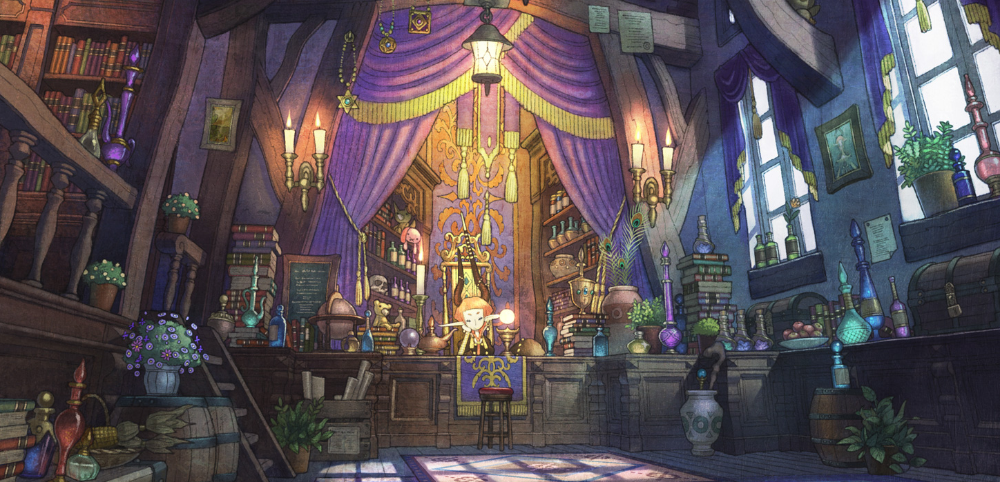{width="6.366535433070866in"
height="2.909055118110236in"}

#### Battle Items

  ------------------ ---------------- ------------------------------------------------------------------------------
  **Name**           **Cost (Gil)**   **Effect**
  Arctic Wind        100              Casts the Spell *Blizzard.*
  Bomb Fragment      100              Casts the Spell *Fire.*
  Electro Marble     100              Casts the Spell *Thunder.*
  Bird Feather       100              Casts the Spell *Aero.*
  Smoke Bomb         250              Casts the Spell *Escape,* but only in battle*.*
  Fish Scale         260              Casts the Spell *Water.*
  Light Curtain      300              Casts the Spell *Protect.*
  Antarctic Wind     300              Casts the Spell *Blizzara*
  Bomb Core          300              Casts the Spell *Fira.*
  Lightning Marble   300              Casts the Spell *Thundara.*
  Shear Feather      300              Casts the Spell *Aera.*
  Graviball          350              Casts the Spell *Gravity.*
  Healing Spring     400              Casts the Spell *Regen.*
  Vampire Fang       480              Casts the Spell *Drain.*
  Lunar Curtain      500              Casts the Spell *Shell.*
  Warp Stone         500              Casts the Spell *Teleport,* but only in battle*.*
  Stardust           620              Casts the Spell *Comet.*
  Deadly Waste       620              Casts the Spell *Bio.*
  Fish Fin           640              Casts the Spell *Waterga.*
  Earth Drum         680              Casts the Spell *Quake.*
  T / S Bomb         700              Casts the Spell *Demi.*
  Zombie Powder      840              Casts the Spell *Zombie.*
  Fire Gem           850              Casts the Spell *Firaga.*
  Ice Gem            850              Casts the Spell *Blizzaga.*
  Lightning Gem      850              Casts the Spell *Thundaga.*
  Windmill           850              Casts the Spell *Aeraga.*
  Light Hammer       1000             Casts the Spell *Banishga.*
  Speed Drink        1000             Casts the Spell *Haste.*
  Light Veil         1200             Casts the Spell *Protectga.*
  Mute Mask          1200             Casts the Spell *Silence.*
  Silver Hourglass   1200             Casts the Spell *Slowga.*
  Malboro Tentacle   1200             Casts the Spell *Venom.*
  Ghost Hand         1300             Casts the Spell *Osmosis.*
  Blue Stone         1320             Casts the Spell *Storm.*
  Brown Stone        1320             Casts the Spell *Break.*
  Black Stone        1320             Casts the Spell *Scathe.*
  Basilisk Claw      1350             Casts the Spell *Stone.*
  Candle of Life     1420             Casts the Spell *Death.*
  Purifying Salt     1450             Casts the Spell *Dispel.*
  Lunar Veil         1500             Casts the Spell *Shellga.*
  Shadow Gem         1500             Casts the Spell *Quarter.*
  War Gong           1500             Casts the Spell *Berserk.*
  Loco Weed          1500             Casts the Spell *Confuse.*
  Impaler            1520             Casts the Spell *Toad.*
  Green Stone        1850             Casts the Spell *Virus.*
  Soul Spring        1860             Casts the Spell *Syphon.*
  Blue Stone         2500             Casts the Spell *Freeze.*
  Red Stone          2250             Casts the Spell *Meltdown.*
  Yellow Stone       2000             Casts the Spell *Overcharge.*
  Star Curtain       3000             Casts the Spell *Reflect.*
  Dark Matter        4000             Casts the Spell *Stop.*
  Adamant Shard      Rare             Casts the Spell *Wall.*
  Hero Drink         Rare             Casts the Spells *Magic Up, Armor Up, Mental Up* and *Power Up* on a target.
  Golden Hourglass   Rare             Casts the Spell *Old.*
  Meteor Stone       Rare             Casts the Spell *Meteor.*
  Supreme Gem        Rare             Casts the Spell *Ultima.*
  ------------------ ---------------- ------------------------------------------------------------------------------

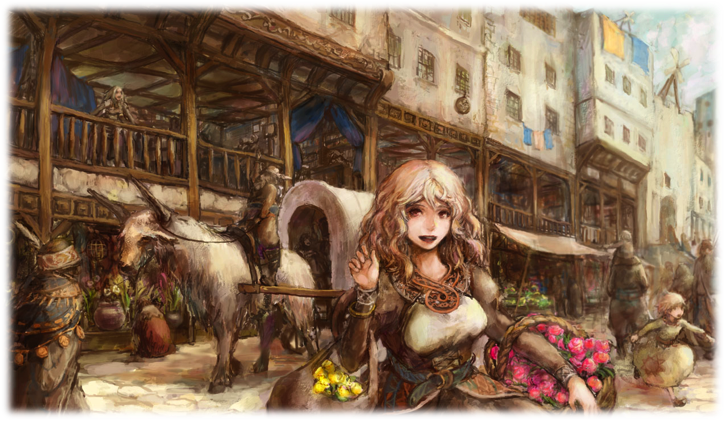{width="6.1874015748031495in"
height="3.5956681977252845in"}

### Equipment Effects

*Arcane Damage* 50% damage is dealt to MP in addition to HP.

*Arcane Destruction* The damage is dealt to MP in addition to HP.

*Arcane Focus (Spell)* You can use this weapon to cast the Spell,
spending MP as usual. You don't need to know the Spell to do this.
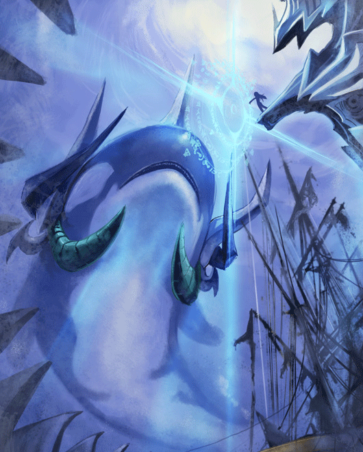{width="2.35in" height="2.9283464566929136in"}

*Auto -- (Status)* Grants the (status) while you\'re equipped with this
item. With **Reraise**, works once per combat.

*Critical Spell (Spell)* When you score a critical hit, instead of
doubling the damage, cast the Spell as a free action without spending
MP. You don't need to know the Spell to do this.

*Elemental Damage* Weapon damage is elemental instead of Cut, Puncture
or Crush.

*Improved Critical* Critical hits happen even if the attack didn't
surpass the difficulty.

*HP Drain* 50% damage dealt is recovered as HP.

*(Monster) Destroyer* Damage dealt to (monster) is doubled.

*(Monster) Killer* Damage dealt to (monster) is increased to 150%.

*MP Drain* 50% damage is dealt to MP instead of HP and is recovered as
MP.

*Piercing* Damage ignores half of the target Armor or Magic Armor.

*Sensor* After attacking with this weapon, you discover the target's
current HP and MP values.

*SOS -- (Status)* When your current HP 25% of your max HP or less, gain
(status). With **Reraise**, works once per combat.

*Spell Weave (Spell)* You can use this weapon to cast the Spell without
spending MP. You don't need to know the Spell to do this. After casting,
the weapon is lost and can only be recovered at the end of combat.

*Soul Eater* Consumes 10% of user's max MP with each attack. If it can't
do it, consumes 10% of user's max HP every attack. This affects all
attacks with this weapon, including Abilities.

*(Status) Immunity* You become immune to (status). You\'re never immune
to status you inflict on yourself.

*(Status) Touch* If your attack overcomes difficulty 70 or if you score
a critical hit and choose to deal normal damage, you inflict the
(status) until the end of the next round.

*(Status ) Resistance* Whenever you suffer an attack that inflicts
(status), you may force the attacker to re-roll it.

*(Status) Strike* Successful weapon attacks inflict the (status) until
the end of the round.

*Triple Critical* Critical hits deal triple instead of double damage.

*(Type) Immunity* You become immune to all (type) status effects.
You\'re never immune to status you inflict on yourself.

*(Type) Resistance* Whenever you suffer an attack that inflicts any
(type) status effects, you may force the attacker to re-roll it.

 Game Master\'s Strategy Guide
==============================

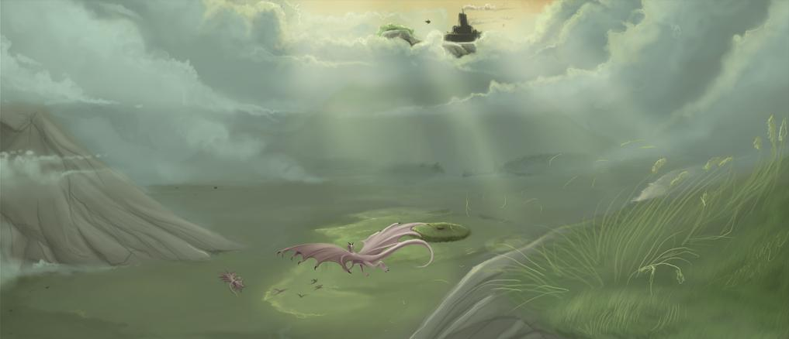{width="6.231102362204725in"
height="2.6834645669291337in"}

Creating Adventures
-------------------

Most adventures are designed around a structure that looks like this:
You start a scene, linearly follow it for over a set number of scenes
that occur in a predetermined sequence, and it comes to an end.
Occasionally you might see someone want to vary playing a pseudo-option,
where characters can go through 2 or 3 alternative scenes before
returning to the main script. But you\'re still looking at an
essentially linear path. Although the exact form of this linear path may
vary depending on the adventure in question, ultimately, this form of
design is the linear approach: A happens, then B does, and then C
happens.

The main advantage of the linear approach is its simplicity. It is easy
to understand and easy to control. When you are preparing the adventure,
it feels like assembling a task list or telling the plot of a short
story. While you are running the adventure, you always know exactly
where you are and exactly where you should be going. But this approach
has two major drawbacks:

Firstly, lack flexibility. Each arrow in the designed flow chart is a
bottleneck: If the players do not follow that arrow (because they do not
want to or because they do not realize what they should do), then the
adventure will grind to a halt. The risk of this painful derailment (or
the need to railroad your players) can be mitigated, but if the players
realize you are guiding the actions of their characters, they can feel
like you\'re playing in their place. (This, ironically, can cause them
to rebel against your best plans.) Second, because it lacks flexibility,
linear approach is the enemy of players' agency. In order to finish the
adventure, the characters must follow the arrows. Choices that do not
follow the arrows will break the game. And for a game that values player
empowerment since character creation, to create linear adventures goes
against the rest of the system.

Of course, it is easier said than done, as one of the reasons that
people prefer the linear approach is that it provides a significant
structure of prepared situations: It says exactly where to go and how to
do to get there. Without this kind of structure, it is very easy for a
game session to derail. Certainly, it is not impossible to simply let
the players loose, improvising everything and end up somewhere
interesting. Similarly, it is quite possible to get in a car, driving
aimlessly for a few hours, and have a nice exciting trip to tell. But is
often helpful to have a territory map.

This line of thought, however, often leads a dilemma. The logic is like
this: (1) I want my players to have meaningful choices. (2) I need to
have a framework for my adventure. (3) Therefore, I need to prepare for
each choice players can do. The result is an exponential expansion
adventure path. The choice of \"A\" leads to two paths, A1 and A2, which
have the choice \"B\" which takes four paths, A1B1, A1B2, A2B1, A2B2,
which have the \"C\" choice that takes eight paths, and so on. The
problem with this project should be evident: You are preparing several
times more material to provide the same amount of playing time. And most
of the material you are preparing will never be seen by the players.

In a way, of course, this is an extreme example. You can simplify your
task by collapsing of some of these options, like having A2B1 and A1B2
choices lead to the same place. But, yet, you are designing several
scenes in order to provide only three real game scenes. You're still
specifically designing a material you know that will never be used. And,
if you think about it, in fact this example is not as extreme as well:
The initial example assumes that there are only two possible choices at
a given moment. In fact, it is quite possible that there are three or
four or even more choices. And each additional option adds a whole new
series of contingencies you need to account for.

Ultimately, this kind of adventure \"Choose your own path\" is a dead
alley: No matter how much you try to predict ahead of time, your players
will still find options you never considered - forcing you back to the
position of artificially limiting the choices to keep intact your
preparation or leaving you with just the same problem you were trying to
solve in the first place: to avoid excessive improvisation. And even
though this is not true, you\'re still burdening yourself with a
preparation process filled with unnecessary work.

The solution to this problem is node-based design. And the root of this
solution lies in reversing the Three Clues Rule. This rule states:
\"**For any conclusion you want players to have, include at least three
clues**.\" The theory underlying this rule is: if you present three
different options, it provides enough redundancy to create a robust
scenario. Even though the characters lose the first clue and
misinterpret the second, the third clue provides an ultimate safety net
to keep the scenario working. This logic, however, also leads to the
reversal of the Three Clues Rule: \"**If the characters have access to
three clues, they will get at least to a conclusion.\"**

In other words, if you need it players reach three conclusions (A, B,
and C) and the characters have access to three clues (each of which
theoretically allow them to achieve these conclusions), then it is very
likely that they will in fact achieve at least one of these conclusions.
Understanding this reversal of the Three Clues Rule allows us to embrace
all the flexibility of node-based design.

Imagine an adventure that begins in a node (or scene), containing three
clues- one pointing to the node A, one for node B, and one for the node
C. Using the inverse of the Three Clues Rule, you know that players will
be able to conclude that they need to go to at least one of these nodes.
Suppose they go to the node A. There, there contains two additional
clues - one pointing to the node B and another that points to the node
C. At this point, the characters have access to five different tracks.
One of them led them successfully to the node A and can now be
discarded. But that leaves them with four clues (two pointing to node B
and two pointing to node C), and, because the inverse of the Three Clues
Rule, once again we see that they have more than enough information to
proceed further.

Let\'s assume now go to the node C. Here they find clues to nodes A and
B. They now have access to a total of seven clues. Four of these clues
now point to nodes that have been visited, but the three last clues
point to the Node B. The Three Clues Rule shows that they now have
access to enough information to complete the adventure.

Although there was no change between linear adventure and the node-based
adventure apart from the event order, the simple fact that the players
are sitting in the driver\'s seat is important. Even if the choice has
no lasting impact on the final conclusion of \"good guys win, bad guys
lose,\" the fact that the players were the ones who decided how the good
guys did win is important.

And this becomes even more relevant when Traits come into play. Traits
should be placed as key points when creating nodes, as they are exactly
the characters' main objectives, and, most importantly, point the
stories that your players chose to play! Thus, the clues that lead from
one node to another should talk to the characters through their goals.

Character Development and Rewards
---------------------------------

### Experience

{width="2.6777777777777776in"
height="8.122222222222222in"}

The game speed depends on the will of the group about the campaign's
duration. FFRPG characters start the game with 200 experience and can
reach a maximum of 25,120 experience points, starting the game between
levels 4th and 8th and reaching the 100th level with around 25,000 XP.
However, it is recommended that the game ends around level 65, or about
11,000 XP for each character. At this level, the characters are already
powerful and experienced enough to overcome most of the possible
challenges without too many problems.

With these numbers in mind, the GM can plan the campaign's progress
according to the time available to play it. A campaign that lasts one
year, playing once per week, for example, in \"normal speed\" may give,
on average, about 200 XP per session (assuming two things: first, 200 XP
times 52 weeks equals 10,400 XP at the end of one year, and second, the
sessions of the campaign's start will give less than 200 XP and the
campaign's final sessions will give more than 200 XP). This speed can
and should be adjusted for the campaign's estimated time, the size of
the story being told and frequency of play.

At each node on your adventure, identify which Traits are covered by
that node. A node that involves a mother's desperate pleas to save her
son from the clutches of a ferocious monster can, for example, involve
the Traits Reputation, People's Hero and Monster Hunter. Let\'s say that
the GM has stipulated a total of 160 XP for that node; it may give 80 XP
if the characters save the child, reducing to only 40 if it is wounded
in the process; give a bonus 0-20 XP based on characters' actions and
their ability to become famous with the situation in the eyes of the
other villagers; and give also 20 XP if the characters manage to kill
the beast, rising to 60 XP if they deduct, based on the given clues, the
reason for the attack and decide to only scare away the beast in order
to follow her into the villain\'s lair.

Thus, characters can earn between 0 and 160 XP for this node, based on
their actions and their Traits. When deciding their Traits, players pass
a clear message about what kind of situations they want to face. Use
this to your advantage to create exciting adventures for your group.

Between sessions, players can spend experience points to increase their
Stats, gaining levels and Skills. Alternatively, the GM can decide the
experience points may only be spent between adventures or in \"training
periods\" defined by the GM.

{width="0.4937007874015748in"
height="0.43818897637795273in"} Optional Rule: **Group Experience**

Some groups may find it too taxing on the GM to assign individual
experience. Maybe they feel it is hard to do, or maybe they feel that it
is unjust that the characters may earn different experience values.

If you prefer, instead of granting experience based on each character\'s
Traits, you may give them based on the group\'s Traits. This way, all
characters will earn the same experience values at each session, based
on the group\'s actions. Individual Traits should be recorded for
Destiny purposes, but they won\'t give different experience totals for
each character.

### Traits and Quirks

During the course of a campaign, the characters will evolve in a
different way aside from the mere accumulation of experience.
Fundamental changes in a character's goals, personality and
characteristics may imply changes to its Traits and Quirks. For example,
a character may see the problems caused by his Arrogant personality and
decide to become Empathic, or maybe the death of a Protégé when an NPC
stick his sword in her back can turn the story into a tale of revenge
against this new Nemesis.

Anyway, whenever a character has a significant reason to change their
way of being, independent if that reason is internal or external, it
can, between sessions, change his Quirks. To do so, the player declares
this to the Game Master and changes it. In the case of the Traits,
whenever one of the three Traits chosen by the Group change by players
consensus or the imposition of narrative (the heroes may beat a Nemesis,
redirecting their goals to something else, like fetching Relics of the
Past), all players, regardless of their own character's Traits, may
change them, to reflect the change of group goals.

### Creating Experienced Characters

If, for any reason, you wish to create experienced characters, simply
follow the normal character creation model and assign more than 200 XP.
This is useful when a character enters the game after its start, or when
the group decides to start the game with a greater power level than
starting characters. The GM must decide how much XP the character should
have, and the player assign it to its Stats as normal. Also, instead of
having 200 Gil for starting equipment, the character may acquire
equipment suited for its level.
{width="0.4937007874015748in"
height="0.4964555993000875in"}

In some groups, you\'ll find a common kind of player: the powergamer.
These players focus on creating the most optimized character, ready to
tackle any obstacle the GM can provide. Many players frown from them, as
they\'ll search for every loophole and rules exception to try to create
the "unbeatable" character. Most also use minmaxing techniques: they
overspecialize to exploit high-level content while "dumping" or ignoring
other areas of the character.

Most RPGs do have countermeasures to stop minmaxing and powergaming.
This game\... well, it has none. No explicit rule, at least. The game
engine is designed to punish minmaxers. Got a character that
overspecializes in Earth? Throw him an opponent with **!Parry** and high
Air value and he\'ll be a sitting duck. Enormous HP and defenses? Throw
some **Gravity** effects and he\'s toast.

However, the biggest deterrent to overspecialization is the Stats\' XP
cost. You don\'t need to throw curveballs: just let the minmaxer do his
magic\... and soon he\'ll be in a lower level than his balanced friends,
and will be weaker than his allies, except in situations suited for his
specialty.

Antagonists
-----------

An important part of creating interesting challenges for players is to
create interesting antagonists. Just as there are no shadows without
light, is the quality of antagonists that will magnify the story created
for any work of fiction, be it a book, a movie, a video game or an RPG
campaign. Thus, this chapter is intended to help Game Masters to craft
balanced and challenging antagonists for their players. As any crafting,
this process has equal parts art and science. As any crafting, the
creation process should take into consideration the target audience: a
monster that is challenging to a group can be simply deadly to another,
or even a walk in the park for a third group. As any crafting, even when
following established recipes, know that the you can always fine-tune
the details. To create antagonists, use the following script:

1.  **Choose the Types**

<!-- -->

18. **Pick a Class**

19. **Decide Stat Levels**

20. **Set HP, MP, Armor and Magical Armor**

21. **Include actions and finishing
    touches**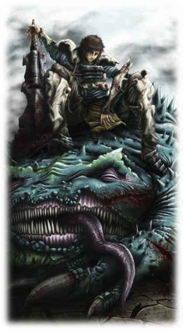{width="1.8429133858267717in"
    height="3.311023622047244in"}

### Type

Each antagonist must have at least one type. This type is important for
Abilities and attacks with effects like *(monster) Killer* and
*(monster) Destroyer*. In addition, they often possess characteristics
and skills in common, although they are not mandatory. A monster may
have more than one type.

**Aberration**: a catch-all type that covers the monsters that can't be
categorized in any of the other types. Due to its breadth, there are no
characteristics and abilities that define this type.

**Aquan:** Creatures that live in water, typically, although many can
act on dry land. Usually have **Lightning Vulnerable** and **Water
Resist** or **Immune**.

**Construct**: Golems and machines, made of stone, wood, metal or other
materials, animated by magic or technology. Usually they have resistance
or immunity to several conditions, such as the **Mental**, **Toxic** and
**Transform** types. Depending on the material, they may have elemental
vulnerabilities and immunities.

**Demon**: Supernatural antagonists serving the cause of evil, usually
with great magical powers. Usually have **Light Vulnerable** and
**Shadow Resist** or **Immune**.

**Dragon**: Monstrous reptiles, ranging from snake- like creatures to
large winged lizards. Drakes range from small power to legendary
creatures of similar power to gods. Due to its breadth, there are no
characteristics and abilities that define this type.

**Elementals**: Creatures with a deep relationship with a specific
element. Usually have immunity or even the absorption to that element.

**Beast**: The \'natural\' world inhabitants, including common animals,
monstrous animals and other wildlife, even those distorted by magic.
Often have **Ice Vulnerable.**

**Humanoid**: Creatures of with biology and proportions similar to
humans. Often have **Shadow Vulnerable** and **Bio Vulnerable**.

**Undead**: Unliving creatures reanimated by supernatural circumstances
or ghosts that haunt the living. Usually they have **Fire Vulnerable**
and **Zombie**.

### Class

Besides the type, you must set the antagonist' Class. Each antagonist
has a class that defines his level of power. **Minions** are the cannon
fodder and represent the low power antagonists that make up most of the
opponents.

**Common** antagonists are a step above the minions, being as powerful
as the player characters, representing a greater threat.

**Elite** antagonists are unique creatures, veterans who can be more
powerful than the player characters, requiring teamwork to be defeated.
Finally, **Boss** antagonists are the most powerful, often representing
the climax of not only adventures, but campaign arcs.

### Antagonist Stats

Antagonists have the same four Stats as player characters: Earth, Air,
Fire and Water. Unlike the player characters, they do not need to use XP
to increase their Stats. When creating your antagonist, decide the Stat
values according to the Group's power and the proposed challenge.

Regardless of the antagonist' class, consider their Stats balanced if
they are between 40 points lower and 40 points higher than the player
characters' Stats. Antagonists have no Traits, Quirks, Equipment, Skills
or Destiny Points. Their character level is the sum of its Stat levels.

### Combat Values

The HP, MP, armor and magic armor values depends on the level and
Category, according to the chart below.

  ----------- ----------- ---------- ----------------
  **Level**   **HP**      **MP**     **ARM / MARM**
  01-09       32-64       10-50      02-12
  10-18       80-148      16-64      04-24
  19-27       216-288     24-148     13-48
  28-36       388-468     62-288     24-84
  37-45       604-704     80-468     37-120
  46-54       892-1000    100-704    62-184
  55-63       1208-1332   150-1000   75-245
  64-74       1984-2260   250-1332   123-368
  75-84       2320-2484   400-2260   144-452
  85-100      2544-2820   500-2484   158-555
  ----------- ----------- ---------- ----------------

**Minions** should have half table's HP and roll two initiative die at
the start of each round. **Common** antagonists have table's HP and roll
three initiative die at the start of each round. **Elites** should have
double or triple HP and up to twice table's MP and roll three or four
initiative die in each round. **Bosses** must have between five and six
times HP and up to five times table's MP and roll four or five
initiative die at the start of each round.

The ARM and MARM values apply to all Classes. When deciding the ARM and
MARM values, avoid creating creatures without weaknesses. Antagonists
with high armor usually have low magic Armor, and vice versa.

### Abilities and Actions

All antagonists should have at least a basic attack, which can be
physical or magical. Choose an Offensive Stat and Defensive Stat for the
attack. The table below shows the adequate damage multiplier for each
antagonist's level.

  ----------- ----------------------- ----------- -----------------------
  **Level**   **Damage Multiplier**   **Level**   **Damage Multiplier**
  01-09       02 - 04                 46-54       13 - 17
  10-18       03 - 07                 55-63       14 - 20
  19-27       05 - 09                 64-74       16 - 24
  28-36       08 - 12                 75-84       18 - 26
  37-45       10 - 14                 85-100      20 - 35
  ----------- ----------------------- ----------- -----------------------

The antagonists should have at least a basic attack, which can be
physical or magical. Choose an Offensive Stat and a Defensive Stat for
the attack and its damage. For example, an attack of an antagonist
between level 10 and level 18 should cause between 3x and 7x Stat level
damage.

**Earth:** Attacks with Earth as Offensive Stat depend on user's
strength and muscular power. They are usually linked to brute force and
physicality. Attacks that can be prevented by the defender's physical
strength, health and muscle power of should use Earth as Defensive Stat.

**Air**: Attacks with Air as Offensive Stat depend on the user's skill
and speed. They are usually linked to the precision and finesse. Attacks
that can be avoided by the defender's agility and the reflexes of should
use Air as Defensive Stat.

**Fire**: Attacks with Fire as Offensive Stat depend on the user's
intelligence and magical ability. They are usually linked to cunning and
the supernatural. Attacks that can be avoided by the defender's insight
should use Fire as Defensive Stat. It is a Stat rarely used defensively.

**Water**: Attacks with Water as Offensive Stat depend on the user's
charisma and willpower. They are usually linked to luck and force of
personality. Attacks that can be prevented by the defender's mental
strength and magical defense of should use Water as Defensive Stat. It
is a Stat rarely used offensively.

Antagonists can use Spells and both Main and Secondary Jobs' Abilities,
causing effects at players' similar levels, although they still must
follow the damage table. For example, the Fire Spell is suitable for
antagonists of 10th to 27th level, as it deals 5x Fire level damage. In
the case of actions that depend on the equipped weapon, like **!Charge**
or **!Black Sky,** simply decide the damage based on level limits.

Finally, **Elite** or **Boss** antagonists may have actions as if they
had up to 9 levels higher than their actual level. These abilities are
considered special attacks and should be used very sparingly. Thus, a
40th level **Boss** could have an attack dealing 17x Stat level damage.

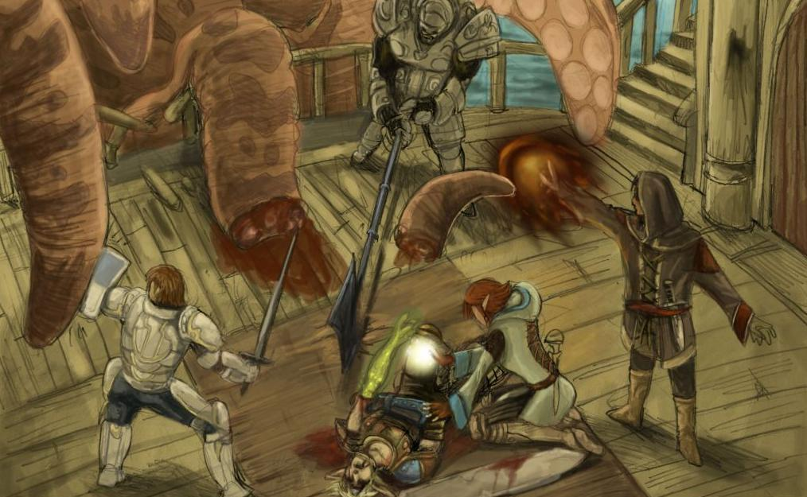{width="6.554166666666666in"
height="4.045138888888889in"} In addition to the actions and reactions
that are appropriate to the antagonist, feel free to grant the
conditions that make sense for the creature, like **Flight**, **Float**,
**Zombie**, **Elemental** or **Status Vulnerable**, **Elemental** or
**Status Resist**, **Elemental** or **Status Immunity**, **Elemental**
**Absorb**, among others.

If you're new to the FFRPG 4^th^ Edition, feel free to experiment with
your antagonists and test the power level of your group. Different
strategies and stat combinations can be either deadly or a push-over,
based on the group's capabilities. When in doubt, put your enemies in
the weaker side and increase their power slowly, until you're
comfortable enough with the system.

### Final Details

With the antagonist's mechanics done, be sure to flesh out the details
that give life to roleplay. These details can be as specific or as
general as necessary; an unimportant **Minion** may simply have a
general description, but an **Elite** who will star an entire adventure
should be detailed enough for your players love to hate their enemy.

What\'s its name? What's its physical description? What's its
personality? Does it have habits, peculiarities, catchphrases? What are
its goals, fears, anxieties? What's its natural habitat? How it relates
to the adventure and the other antagonists? These are only some of the
questions that you, as a GM, may ask to give depth to the antagonist.

### Sample Antagonists

#### Guard Bot

5th level Construct **Common**

Earth 30 Air 0 Fire 15 Water 15

HP 55 MP 10 ARM 08 MARM 00

Initiative -- 3 die

*Ram:* Quick physical action, Earth vs Air, dif 40, 12 damage (Crush)

*Block:* Reaction, Earth vs Earth, dif 40, avoids a physical attack

**Vulnerable (Lightning)**

*These small robots serve as sentries for various laboratories and
industrial facilities. Their reinforced plates make them very strong
against physical blows.*

#### Yellow Chocobo

6th level Beast **Common**

Earth 14 Air 29 Fire 20 Water 18

HP 45 MP 21 ARM 06 MARM 04

Initiative -- 3 die

*Beak:* Quick physical action, Air vs Air, dif 40, 6 damage (Puncture)

*Dodge:* Reaction, Air vs Air, dif 70, avoids a physical attack

*Choco Ball*: Blue Spell, 7 MP, Fire vs Water, dif 0, 10 damage (Crush)

*Bipedal ostrich-like birds, pony-sized, widely used as mounts. They are
kind and friendly, but fierce when provoked.*

#### Imp

7th level Humanoid **Minion**

Earth 18 Air 32 Fire 12 Water 22

HP 20 MP 15 ARM 02 MARM 05

Initiative -- 2 die

*Short Sword*: Quick physical action, Air vs Earth, dif 40, 6 damage
(Cut)

*Goblin Punch*: Blue Spell, 1 MP, Air vs Earth, dif 40, 6 damage (Cut)
or instead deals 24 damage (Cut) against 7th level targets.

*Little green humanoids, usually malignant and territorial, who form
tribes. They use improvised weapons and armor. They don\'t have great
intelligence or physical strength but are very cunning.*

#### Venzuubius, Poison Demon

9th level Demon **Boss**

Earth 30 Air 12 Fire 40 Water 19

HP 200 MP 150 ARM 2 MARM 2

Initiative -- 5 die

*Mind Blast*: Quick magical action, Fire vs Water, dif 40, 12 damage
(Crush)

*Third Eye:* Reaction, Earth vs Earth, dif 40, blocks a melee attack

*Flash*: Blue Spell, 14 MP, Fire vs Water, dif 0, 15 damage (Light), if
greater than dif 70, inflicts the **Blind** status on the target until
the end the round.

*Poison Gas*: Blue Spell, 16 MP, Group, Fire vs Water, dif 70, inflicts
the **Poison** status on target until the end of next round.

**Vulnerable (Light), All Status Resist**

*One of the lesser Demon Lords, Venzuubius is arrogant and proud of
himself. He is very overconfident, treating his lesser brethren with
disdain and his superiors with distrust. In battle, he tends to boast
about his own abilities instead of quickly finishing his foes.*

#### Lesser Zombie

12th level Undead **Minion**

Earth 50 Air 12 Fire 35 Water 31

HP 64 MP 40 ARM 13 MARM 11

Initiative -- 2 die

*Slam*: Quick physical action, Earth vs Earth, dif 40, 20 damage (Crush)

*Poison*: Black Spell, 10 MP, Fire vs Water, dif 40, 15 damage (Bio),
inflicts the **Poison** status on target until the end of next round.

**Zombie, Vulnerable (Fire** and **Light), Ice Immune, Fatal Immune**

*Reanimated carcasses of dead humanoids who blindly follow their dark
masters. They are slow and devoid of free will. *

#### Sahuagin Captain

15th level Humanoid Aquan **Elite**

Earth 42 Air 45 Fire 41 Water 31

HP 270 MP 54 ARM 05 MARM 15

Initiative -- 4 die

*Trident:* Quick physical action, Air vs Air, dif 40, 12 damage
(Puncture)

*Aqua Rage:* Quick *Ranged* magical action, Fire vs Water, dif 40, 24
damage (Water)

*Shell:* White Spell, 14 MP, Grants **Shell** until the end of next
round.

*Cure*: White Spell, 9 MP, Fire vs Water, dif 0, Heals 20 HP.

**Water Resist, Lightning Weakness, Weaken (Speed), Fatal Immune**

*Hybrids of men and fish, Sahuagins are led into battle by dangerous
captains. They are slow on land, but powerful enemies.*

#### Risen Sorcerer

19th level Undead **Minion**

Earth 32 Air 31 Fire 86 Water 55

HP 110 MP 100 ARM 8 MARM 15

Initiative -- 2 die

*Staff*: Quick magical action, Fire vs Water, dif 40, 48 damage (Crush)

*Gravity*: Time Spell, 9 MP, Fire vs Water, dif 25, reduce target\'s HP
by 25% of its current value

*Armor Up:* Time Spell, 20 MP, grants **Strengthen (Armor)** to an ally
until end of next round

*Mental Up:* Time Spell, 20 MP, grants **Strengthen (Mental)** to an
ally until end of next round

**Zombie, Vulnerable (Ice** and **Light), Fire Immune, Fatal Immune**

#### Risen Lancer

19th level Undead **Minion**

Earth 65 Air 60 Fire 39 Water 43

HP 110 MP 80 ARM 15 MARM 8

Initiative -- 2 die

*Lance*: Quick physical action, Earth vs Earth, dif 40, 36 damage
(Puncture)

*Wide Arc*: Slow (4) physical action, Earth vs Earth, dif 40, 36 damage.
Another random enemy suffers 25% of the damage dealt, ignoring ARM

**Zombie, Vulnerable (Ice** and **Light), Fire Immune, Fatal Immune**

*These animated skeletons are a mockery of living beings. Some are
fighters, and some command magical powers. They are devoid of free will
and will return to dust if its dark master dies.*

#### False Priest

20st level Humanoid **Elite**

Earth 30 Air 43 Fire 75 Water 72

HP 500 MP 200 ARM 8 MARM 20

Initiative -- 4 die

*Wand: Ranged* Quick magical action, Fire vs Fire, dif 40, 42 damage
(Crush)

*Blind:* Black Spell, Fire vs Water, dif 70, inflicts the **Blind**
status until the end of next round

*Fire Wave*: Spell, 16 MP, Fire vs Water, dif 0, 49 single damage (Fire)
or 35 group damage (fire)

*Summon Risen*: Spell, 20 MP, Summon two random Risen Minions. This may
be used only if the False Priest have no allies.

**Status Immune (Death, Stone** and **Gravity) Shadow Immune, Vulnerable
(Ice** and **Lightning)**

*This evil priest command Risen skeletons. He may summon them do his
biddings, using nearby corpses. However, his powers can\'t raise undead
armies\... yet.*

**\
**

#### Giant Bat

21st level Beast **Minion**

Earth 60 Air 69 Fire 60 Water 30

HP 116 MP 112 ARM 32 MARM 21

Initiative -- 2 die

*Bite:* Quick physical action, Earth vs Air, dif 40, 36 damage (Cut)

*Arrow Guard:* Reaction, Air vs Air, dif 30, avoids a *Ranged* physical
attack

*Red Feast*: Blue Spell, 10 MP, Earth vs Air, dif 40, 30 damage
(Puncture). The Giant Bat heals itself half of the damage dealt.

**Flight, Air Vulnerable, Blind Immune, Improved Critical**

*Huge blood-sucker bats who live in caverns. They hate sunlight. Usually
they don\'t attack adventurers unless they\'re provoked, or someone
trespasses their lair.*

#### Red Flan

22th level Elemental Aberration **Common**

Earth 51 Air 48 Fire 75 Water 65

HP 255 MP 148 ARM 20 MARM 26

Initiative -- 3 die

*Slam*: Quick physical action, Earth vs Earth, dif 40, 25 damage (Crush)

*Fire*: Black Spell, 8 MP, Fire vs Water, dif 0, 35 damage (Fire)

*Flame:* Spell, 15 MP, Group, Fire vs Water, dif 0, 25 damage (Fire)

**Resist (Cut, Crush and Puncture), Fire Absorb, Vulnerable (Ice and
Water), Weaken Immune**

*Amorphous elemental that looks like goo and have dominion over fire.
Common in volcanic areas. They are hot to the touch and very
aggressive.*

####  Iron Golem

30th level Construct **Common**

Earth 112 Air 34 Fire 82 Water 96

HP 400 MP 255 ARM 70 MARM 30

Initiative -- 3 die

*Axe*: Slow (1) physical action, Earth vs Air, dif 40, 110 damage (Cut)

*Block*: Reaction, Earth vs Earth, dif 40, avoid a physical attack.

*Matra Magic:* Blue Spell, 55 MP, Group, Fire vs Water, dif 0, 80 damage
(Fire)

*Rust Spray:* Quick *Ranged* magical action, Group, Fire vs Water, dif
70, inflicts the **Weaken (Armor)** status until the end of next round.

**Virus, Lightning Vulnerability, Cut Immunity, Immune (Mental, Toxic,
Transform and Death)**

*A huge construct animated by magic, wielding a rusty axe. They have no
free will, limited to comply with its creator's orders.*

#### Kraken

38th level Aquan Beast **Elite**

Earth 99 Air 84 Fire 91 Water 123

HP 1500 MP 555 ARM 43 MARM 95

Initiative -- 4 die

*Tentacle:* Quick physical action, Earth vs Air, dif 40, 90 damage
(Crush)

*Aqua Rake:* Blue Magic, 85 MP, Group, Fire vs Water, if 0, 117 damage
(Water)

*Ink:* Quick magical action, Group, Fire vs Water, dif 70, inflicts the
**Blind** status on this and the next two rounds

*Devour*: Slow (2) physical action, Earth vs Earth, dif 80, Inflicts the
**Condemn** status until the end of next round

**Water Immune, Lightning Vulnerable, Immune (Fatal and Blind), Mental
Vulnerable**

*An octopus and squid hybrid, the Kraken is a colossal beast that
terrorizes the oceans, destroying ships with its powerful tentacles.*

Experience Table 
-----------------

  ------- ------- ---------- ------- ------- ---------- ------- ------- ----------
  Level   Value   Total XP   Level   Value   Total XP   Level   Value   Total XP
  0       0       0          3       33      111        6       66      438
  0       1       1          3       34      118        6       67      451
  0       2       2          3       35      125        6       68      464
  0       3       3          3       36      132        6       69      477
  0       4       4          3       37      139        7       70      490
  0       5       5          3       38      146        7       71      505
  0       6       6          3       39      153        7       72      520
  0       7       7          4       40      160        7       73      535
  0       8       8          4       41      169        7       74      550
  0       9       9          4       42      178        7       75      565
  1       10      10         4       43      187        7       76      580
  1       11      13         4       44      196        7       77      595
  1       12      16         4       45      205        7       78      610
  1       13      19         4       46      214        7       79      625
  1       14      22         4       47      223        8       80      640
  1       15      25         4       48      232        8       81      657
  1       16      28         4       49      241        8       82      674
  1       17      31         5       50      250        8       83      691
  1       18      34         5       51      261        8       84      708
  1       19      37         5       52      272        8       85      725
  2       20      40         5       53      283        8       86      742
  2       21      45         5       54      294        8       87      759
  2       22      50         5       55      305        8       88      776
  2       23      55         5       56      316        8       89      793
  2       24      60         5       57      327        9       90      810
  2       25      65         5       58      338        9       91      829
  2       26      70         5       59      349        9       92      848
  2       27      75         6       60      360        9       93      867
  2       28      80         6       61      373        9       94      886
  2       29      85         6       62      386        9       95      905
  3       30      90         6       63      399        9       96      924
  3       31      97         6       64      412        9       97      943
  3       32      104        6       65      425        9       98      962
  9       99      981        13      135     1,825      17      171     2,925
  10      100     1,000      13      136     1,852      17      172     2,960
  10      101     1,021      13      137     1,879      17      173     2,995
  10      102     1,042      13      138     1,906      17      174     3,030
  10      103     1,063      13      139     1,933      17      175     3,065
  10      104     1,084      14      140     1,960      17      176     3,100
  10      105     1,105      14      141     1,989      17      177     3,135
  10      106     1,126      14      142     2,018      17      178     3,170
  10      107     1,147      14      143     2,047      17      179     3,205
  10      108     1,168      14      144     2,076      18      180     3,240
  10      109     1,189      14      145     2,105      18      181     3,277
  11      110     1,210      14      146     2,134      18      182     3,314
  11      111     1,233      14      147     2,163      18      183     3,351
  11      112     1,256      14      148     2,192      18      184     3,388
  11      113     1,279      14      149     2,221      18      185     3,425
  11      114     1,302      15      150     2,250      18      186     3,462
  11      115     1,325      15      151     2,281      18      187     3,499
  11      116     1,348      15      152     2,312      18      188     3,536
  11      117     1,371      15      153     2,343      18      189     3,573
  11      118     1,394      15      154     2,374      19      190     3,610
  11      119     1,417      15      155     2,405      19      191     3,649
  12      120     1,440      15      156     2,436      19      192     3,688
  12      121     1,465      15      157     2,467      19      193     3,727
  12      122     1,490      15      158     2,498      19      194     3,766
  12      123     1,515      15      159     2,529      19      195     3,805
  12      124     1,540      16      160     2,560      19      196     3,844
  12      125     1,565      16      161     2,593      19      197     3,883
  12      126     1,590      16      162     2,626      19      198     3,922
  12      127     1,615      16      163     2,659      19      199     3,961
  12      128     1,640      16      164     2,692      20      200     4,000
  12      129     1,665      16      165     2,725      20      201     4,041
  13      130     1,690      16      166     2,758      20      202     4,082
  13      131     1,717      16      167     2,791      20      203     4,123
  13      132     1,744      16      168     2,824      20      204     4,164
  13      133     1,771      16      169     2,857      20      205     4,205
  13      134     1,798      17      170     2,890      20      206     4,246
  20      207     4,287      22      223     4,975      23      239     5,713
  20      208     4,328      22      224     5,020      24      240     5,760
  20      209     4,369      22      225     5,065      24      241     5,809
  21      210     4,410      22      226     5,110      24      242     5,858
  21      211     4,453      22      227     5,155      24      243     5,907
  21      212     4,496      22      228     5,200      24      244     5,956
  21      213     4,539      22      229     5,245      24      245     6,005
  21      214     4,582      23      230     5,290      24      246     6,054
  21      215     4,625      23      231     5,337      24      247     6,103
  21      216     4,668      23      232     5,384      24      248     6,152
  21      217     4,711      23      233     5,431      24      249     6,201
  21      218     4,754      23      234     5,478      25      250     6,250
  21      219     4,797      23      235     5,525      25      251     6,301
  22      220     4,840      23      236     5,572      25      252     6,352
  22      221     4,885      23      237     5,619      25      253     6,403
  22      222     4,930      23      238     5,666      25      254     6,454
                                                        25      255     6,505
  ------- ------- ---------- ------- ------- ---------- ------- ------- ----------

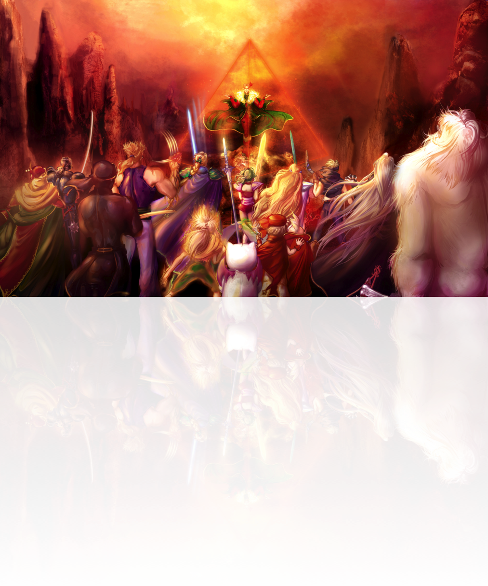{width="6.413385826771654in"
height="3.8744083552055995in"}

Status Effects
--------------

**Status Group Type Effect**

***Berserk*** Negative Mental You may only perform standard actions. You
must\
always perform the **!Attack** action.

***Blind*** Negative Seal Increase the difficulty of your attacks by 25.

***Blink*** Positive Illusion When an enemy's action target you, you may
force it\
to reroll.

***Charm*** Negative Mental You consider your allies as enemies, and
your enemies as allies. If you suffer damage, this condition ends.

***Condemn*** Negative Fatal At the end of this condition, if it wasn't
removed by an effect, instantly reduce you to 0 HP.

***Confuse*** Negative Mental You may only perform standard actions.
Whenever you use a standard action, roll 1d10. With the result 1, you
act normally. With the result 2 or 10, you don't perform any action.
With the result 3 or 9, you attack a random ally. With the result 4 or
8, you attack a\
random enemy. With the result 5 or 6, you heal,\
protect or help a randomly enemy, or, if you can't do it, draw an item.
With the result 7, you heal, protect or\
help a randomly ally, or, if you can't do it, draw an\
item. If you suffer damage, this condition ends.

***Death*** Negative Fatal Reduce your HP to 0.

***Disable*** Negative Seal You may not act, except to cast Spells or
react.

***(Element) Absorb*** Positive Elemental Rather than losing HP,
(element) damage heals you. Your Armor or Magical armor reduces the HP
healed.

***(Element) Immune*** Positive Elemental Reduce to 0 suffered (element)
damage.

***(Element) Resist*** Positive Elemental Reduce by half suffered
(element) damage.

***(Element) Vulnerable*** Negative Elemental Double suffered (element)
damage.

***Flight*** Positive Flight You may only be hit by *Ranged* attacks or
Spells. Your Melee attacks may hit targets under **Flight** status,
unless it explicit can\'t hit enemies with **Float**.

***Float*** Positive Flight You float about two feet above ground.
Effects that depend on the ground do not hit you.

***Haste*** Positive Time At the beginning of each round, roll one
extra\
initiative dice.

***Immobilize*** Negative Seal You may not perform reactions.

***Gravity*** Negative Fatal These effects reduce your HP by a fixed
amount and\
ignore Armor and Magical Armor.

***Meltdown*** Negative Weaken Reduce your ARM and MARM to zero.

***Mute*** Negative Seal You can't cast Spells.

**\
**

**Status Group Type Effect**

***Poison*** Negative Toxic At each round's end, lose HP equal to 10% of
your\
max HP.

***Premonition*** Positive Time Once per round, you may re-roll a d100.

***Protect*** Positive Barrier Reduce physical damage suffered by half,
after\
deducting your ARM.

***Reflect*** Positive Barrier When a Spell targets you, you don't
suffer its effects\
and the caster suffer its effects instead. This status\
doesn't affect Spells already reflected by this status.

***Regen*** Positive Strenghten At each round's end, heal HP equal to
10% of your\
max HP.

***Reraise*** Positive Barrier Just before you fall to 0 HP, you
immediately heal to\
10% of max HP and end this effect.

***Shell*** Positive Barrier Reduce magical damage suffered by half,
after\
deducting your MARM.

***Sleep*** Negative Mental You can't perform actions. If you suffer
damage, this\
condition ends.

***Slow*** Negative Time At the beginning of each round, roll one fewer\
initiative dice.

***Stone*** Negative Transform You may not act or suffer damage.

***Stop*** Negative Time You may not act.

***Strenghten (Armor)*** Positive Strenghten Increase your ARM by half.

***Strenghten (Magic)*** Positive Strenghten You deal 25% extra magical
damage.

***Strenghten (Mental)*** Positive Strenghten Increase your MARM by
half.

***Strenghten (Physical)*** Positive Strenghten You deal 25% extra
physical damage.

***Strenghten (Speed)*** Positive Strenghten After rolling initiative,
decrease each of your initiative\
die's value by 1, to a minimum of 1.

***Toad*** Negative Transform Your attacks ignore the target's ARM and
MARM and\
deal exactly 1 damage. You can't cast Spells, except for\
the *Toad* Spell.

***Vanish*** Positive Illusion Enemies may not target you with
single-target actions.

***Virus*** Negative Toxic You may not be healed.

***Wall*** Positive Barrier Reduce physical damage suffered to 0.

***Weaken (Armor)*** Negative Weaken Reduce your ARM by half.

***Weaken (Magic)*** Negative Weaken You deal 25% less magical damage.

***Weaken (Mental)*** Negative Weaken Reduce your MARM by half.

***Weaken (Physical)*** Negative Weaken You deal 25% less physical
damage.

***Weaken (Speed)*** Negative Weaken After rolling initiative, increase
each of your initiative\
die's value by 1, to a maximum of 10.

***Zombie*** Negative Transform Healing effects remove your HP or MP,
rather than\
curing it. Effects that damage you and heal the user\
instead damage the user and heal you.
